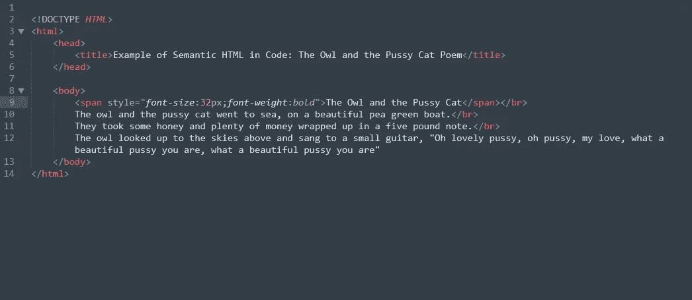
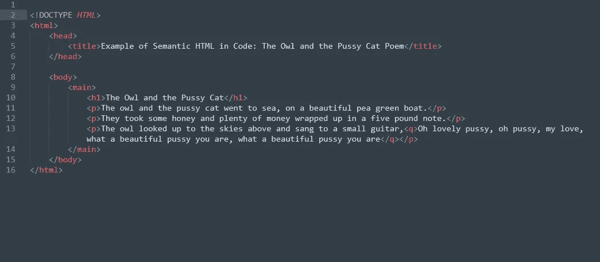
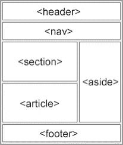

# Web 开发中的可访问性

> 原文：<https://levelup.gitconnected.com/accessibility-in-web-development-bdba807967bd>

web 开发中的可访问性意味着让每个人都容易使用网站。

听起来平淡无奇？这里的关键词是**大家**。重点是身体和/或认知能力有限的人。因为对于残疾人来说，技术让生活必需品成为可能。

> "易接近性允许我们挖掘每个人的潜力."―黛布拉·鲁

# 在 Web 开发中实现可访问性

好吧，这说得通。但是如何在我的代码中实现可访问性呢*？*如果你想知道这些，并且你有 HTML 和 CSS 的基础知识，你就在正确的船上。我们走吧。

# 语义 HTML

语义 HTML 是专注于被标记的内容的含义，而不仅仅是其表现形式的 HTML。让我用一个例子来说明这一点:

非语义标记

语义标记

在上面的例子中，两个代码显示相同的内容。但是第二个实现了语义 HTML。随着本文的深入，你会明白这到底意味着什么，为什么它如此重要。

**语义 HTML 如何帮助可访问性？**

屏幕阅读器帮助视力有障碍的人使用语义 HTML 导航和理解 web 内容。

例如，当一个屏幕阅读器读到一个用标签 *< p >* 正确标记的段落时，它会在阅读其中的文本内容之前通知用户这是一个段落，但如果没有使用正确的标签，它通常不会这样做。

大多数屏幕阅读器也帮助用户使用标题来浏览网站内容，所以增加文本的字体大小来表示标题并没有什么效果。使用合适的标题标签( *< h1 >* ， *< h2 >* ，…)对于可访问性更好。

**编写语义 HTML 的一些指南:**

*   **找到并使用合适的 HTML 标签来做标记:**我们已经讨论过使用标题和段落标签来做标题和段落。所以，现在让我们来了解一些混淆的情况。 *< em >* 和 *< i >* ，这两个文本都以斜体显示，但是屏幕阅读器会通知用户 *< em >* 内的文本很重要。同样的道理也适用于 *< strong >* 和 *< b >* ，前者被宣布为陈述重要的事情，而后者只是使文本加粗而不附加任何语义。其他还有 *< blockquote >* (用来指定一个报价) *<缩写>* (用来嵌套一个缩写。这对有认知障碍的人可能很有帮助)、ul*<>*(用于指定一个项目列表)、Li*<>*(用于标记列表上的一个项目)。
*   用语义 HTML 创建布局:这需要用一些为了语义而引入的 HTML5 标签来创建 web 布局。这些标签包括 *< nav >* (用于保存导航项) *< header >* (用于保存一节或整篇文档的介绍性内容，大多数时候 *< nav >* 放在里面) *< main >* (指定网页的主要内容) *< article >* (指定一个独立的内容块)， *< section >* (主要用于保存 *< article >* 中的部分内容，并在*<>*main*<footer>*中指定一个新的内容块(描述文档的一个页脚)。

*   文本替换:确保网页上的每一个非文本内容都有一个文本替换。对于视频，可以添加抄本，对于图像，可以使用使用 *alt* 属性或 *< caption >* 标签的替代文本。在此可以找到其他为多媒体添加文本选项的选项[。](https://developer.mozilla.org/en-US/docs/Learn/Accessibility/Multimedia)

# 在 Web 开发中使用 CSS 实现可访问性

CSS 应该增强用户体验。

在选择配色方案时，建议使用良好的对比度，并对重要的文本进行良好的样式化，这样即使视力有限，屏幕上的东西也可以看得很清楚。

让可导航的图标变大或者能够放大，对运动技能低的人也有帮助。

保持导航简单对用户体验来说也很重要。

# 使用 JavaScript 实现网络可访问性

对于前端开发，JavaScript 应该只用于为网站添加功能。使用 JavaScript 生成从 HTML 标记到样式的所有内容，可能会带来意想不到的问题，降低用户体验。

此外，用 JavaScript 解决 HTML 问题总是一个坏主意。例如，按钮标签 *<按钮>* 有一些内置的功能，在需要时不使用它，而是使用 CSS 和 JavaScript 来创建按钮，可能会带来用户交互问题，并使您的代码混乱，不推荐使用。

> “关于可访问性的一个论点是，它如何极大地改善了一些人的生活，但这个论点没有得到足够的重视。我们有多少机会仅仅通过把我们的工作做得更好一点来大幅改善人们的生活？”―史蒂夫·克鲁格

# 结论

“网络从根本上来说是为所有人而设计的，不管他们的硬件、软件、语言、文化、位置、身体或精神能力如何。当网络满足这一目标时，具有各种听觉、运动、视觉和认知能力的人都可以访问它。” [(W3C 可访问性)](http://www.w3.org/standards/webdesign/accessibility)

这就是网络的力量所在。

我相信这篇文章将帮助您在开发中实现可访问性，并成为一个更普遍、更包容的 web 的更好倡导者。