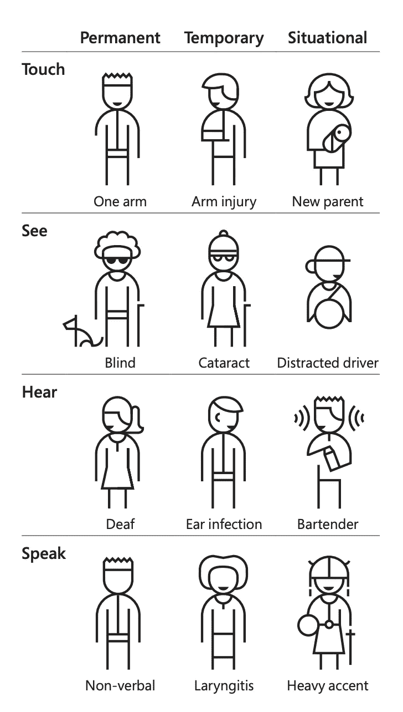
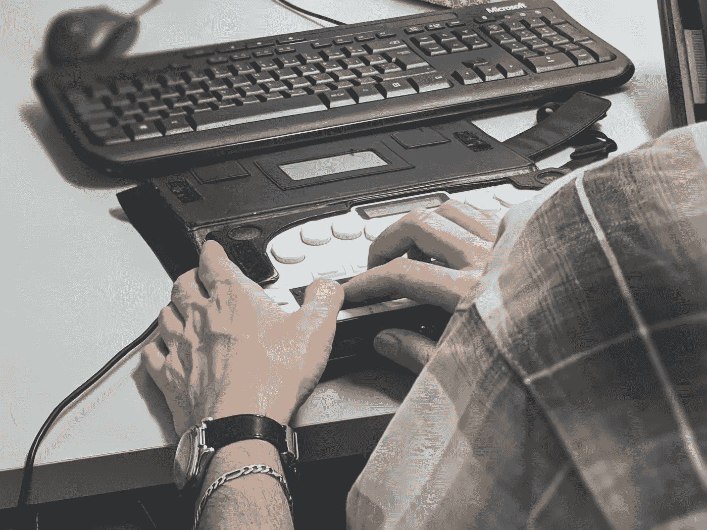
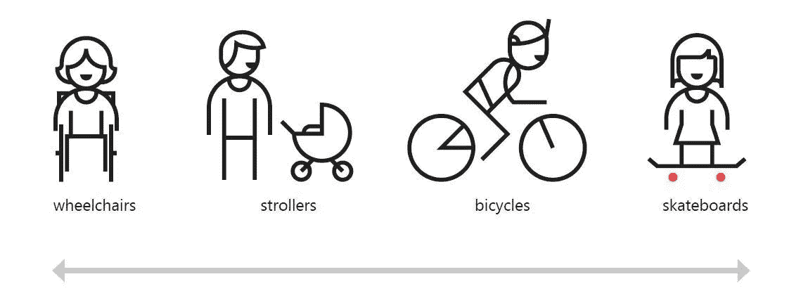

# 网络上的可访问性

> 原文：<https://levelup.gitconnected.com/accessibility-on-the-web-3c7acbb17400>

## **如何为所有人打造用户体验**

由[岩田良治](https://unsplash.com/@ryoji__iwata?utm_source=unsplash&utm_medium=referral&utm_content=creditCopyText)在 [Unsplash](https://unsplash.com/s/photos/people-crossing?utm_source=unsplash&utm_medium=referral&utm_content=creditCopyText) 上拍摄的照片

可访问性对用户体验有重大影响(UX)。创建一个可访问的网站可以让你得到你需要的信息。它允许你的企业与世界其他地方互动。不管任何身体和精神状况。移情和可及性标准对于创造更好的产品至关重要。本文主要关注前端开发人员特有的指导原则。它也让人们意识到让每个人都能访问网络是多么重要。

> 估计有 4060 万人，即 12.6%的非住院平民患有残疾。
> 
> —来源: [2018 美国社区调查](https://data.census.gov/cedsci/table?t=Disability&tid=ACSST1Y2018.S1810&hidePreview=true)

**什么是可访问性？**

可访问性帮助人们理解、使用和享受网络。这些人有许多不同的形状，每个人都有不同的能力。

它的可及性程度区分了一个产品。它确保具有不同能力的人可以毫无障碍地使用该产品。

易访问的用户界面使消费者能够浏览我们的数字产品。

**为什么您应该关心网页可访问性？**

> “《联合国残疾人权利公约》承认获得信息和通信技术，包括网络，是一项基本人权。”
> 
> ***——***[《残疾人权利公约》](https://www.un.org/development/desa/disabilities/convention-on-the-rights-of-persons-with-disabilities/article-9-accessibility.html)

互联网正在成为我们生活中许多方面的重要资源。这些领域包括教育、就业、政府、商业、医疗保健、娱乐等。向残疾人提供平等的机会至关重要。除了防止不必要的法律问题，残疾人可以享受更多的数字参与。他们能以更有意义的方式为社会做贡献。不管残疾是永久性的、暂时性的还是环境性的，这种情况都应该发生。

由[微软设计的角色谱](https://www.microsoft.com/design)

易访问的网站也是与更多受众做生意的最简单方式之一。它将包括那些不能阅读印刷品的人或者那些走进商店或购物中心有困难的人。

与其总是投资于膨胀新功能来保持一流用户的参与和消费，不如想想如何接触更广泛的客户。很简单。人们有相似的需求和欲望。

此外，可访问性是创新和增长的一大动力。谷歌最近开发了两个全新的工具，通过手势控制与手机的互动:相机开关和项目激活。

谷歌——相机开关|通过面部手势导航手机

**W3C 网络无障碍倡议(WAI)**

WAI 创建可访问性标准并提供实现帮助。W3C 万维网联盟建立了这些标准。网页可访问性指南(WCAG)和 WAI-ARIA 是两个公认的标准(可访问的富互联网应用)。

无障碍设计应该是:

*   **可感知—** 用户应该感知数字资源上给出的内容。视力有限的人可以通过屏幕阅读器阅读印刷文字。
*   **可操作—** 键盘导航必须是鼠标和触摸板的一个选项。
*   **可理解—** 网站内容是可理解的，符合用户的期望。
*   **健壮—** 为了跟随最新的支持技术，网站应该是最新的。

[西格蒙德](https://unsplash.com/@sigmund?utm_source=unsplash&utm_medium=referral&utm_content=creditCopyText)在 [Unsplash](https://unsplash.com/?utm_source=unsplash&utm_medium=referral&utm_content=creditCopyText) 上拍照

**网页无障碍指南**

说到网站设计，我们最常考虑的是美学。我们希望通过使用吸引人的字体、图像、按钮和其他视觉组件来使我们的网站吸引访问者。但是，创建一个既吸引人又实用的网站是可行的。

创建网站时，请考虑以下步骤:

*   **键盘导航** 网站必须有键盘导航系统才能访问其所有功能。值得注意的是，有些人使用定制的电脑键盘。因此，网站上的导航顺序必须清晰易懂。这意味着它应该有一个可视化的流程，比如“从右到左”或者“从上到下”您希望让人们能够方便地使用键盘浏览链接、按钮和表单元素。
*   **焦点指示器** 焦点指示器是勾勒出聚焦元素的视觉指示器。这允许键盘用户通过 tab 键浏览网站。没有它，他们将无法控制自己在页面上的位置。
*   **语义 HTML
    这些是将数字文本转换成合成语音的机器。需要注意的是，屏幕阅读器是一个序列一个序列地传递材料的。使用内置的 HTML 元素，如`<button>`、`<a>`、`<h1>`、`
`或`<input>`，不仅是最佳实践之一。它提高了网站的可访问性，减少了你的工作量。浏览你的网页。查找不支持键盘快捷键的元素。用标准的 HTML 替换它们。**
*   **让文字更清晰** 文字信息应该容易阅读。在美国和世界范围内，最普遍的视觉障碍是失明、近视或白内障，以及一般低视力。优先考虑文字清晰。字体的风格和大小也很重要。新罗马，Verdana，Arial 和 Calibri 时代是最好的字体。此外，确保您的[配色方案](https://contrast-ratio.com/)是可访问的。
*   **上的替代文字链接和** [**图片**](https://css-tricks.com/accessible-svgs/)上的文字描述可以让读者区分链接。替代文本描述了链接的独特用途。如果同时维护图像和文本，它会提供更准确的描述。
*   ARIA 是可访问的富互联网应用程序的缩写。当原生 HTML 无法解决可访问性问题时，ARIA 可以帮助弥合差距。ARIA 是一组属性。这些属性提供了关于元素语义的额外信息。这样，诸如屏幕阅读器这样的辅助技术就可以确定地阅读它们。但是，请记住永远不要改变 HTML 的语义。
*   **跳过链接**
    机制允许键盘用户跳过重复的内容块，如页面标题、导航栏或菜单。注意:太多的跳转链接会适得其反。
*   **永远不要忘记遵循无障碍清单** 一个[无障碍清单](https://www.a11yproject.com/checklist/)保证你的网站在各个方面都符合 WCAG。所有图片、颜色、文字、音乐、视频、浏览、网站结构、表格等。

**总体而言，无障碍网页设计如何改善用户体验？**

[“路边切割效应”——微软包容性设计工具包](https://www.microsoft.com/design/inclusive/)

你听说过路边效应吗？人行道上为方便轮椅使用者而引入的小路边石，突然改善了许多人的日常生活，比如骑自行车的人、玩滑板的人、推着婴儿车的父母，或者拄着拐杖或拐杖走路的人。

无障碍网页设计改善了残疾人和非残疾人的用户体验。许多可访问性标准改善了用户体验，尤其是在受限的环境中。

例如，用户可以通过使用高对比度的颜色和独特的字体，从像手机一样的小屏幕上或在黑暗的地方查看网站。文本选项有助于低带宽用户。对于那些无法访问图像和音频的人来说，文本是一个非常棒的工具。

不要为屏幕阅读器进行优化，而是将这种心态融入到你的设计过程中。避免过多的动画，检查按钮是否足够大，文本是否可读性良好。满足残疾人需求的设计将自动改善每个人的生活。

# **结论**

如果我们带着我们的技能和偏见，我们将永远为有限的人群开发产品。假设我们所有的感官都 100%正常工作会产生排斥。因为这种状态根本不能反映现实。

改善的第一步是认识到这些差异。然后我们必须了解为什么以及如何排斥人们。我们的网络开发应该准确地反映这种多样性。

通过我们的工作，我们控制了很大一部分障碍。我们为无障碍产品、服务、环境和体验设定标准。

迎合所有的残疾人是一个挑战，但是你可以通过遵循上面的指导方针，使你的网站对不同的残疾人是实用的和可访问的。

# 进一步阅读

*   [A11y 项目](https://www.a11yproject.com/checklist/) —使用 WCAG 指南的网络无障碍清单
*   [网页内容无障碍指南(WCAG)](https://www.w3.org/WAI/standards-guidelines/wcag/)
*   [可访问性](https://developer.mozilla.org/en-US/docs/Web/Accessibility) — MDN 网络文档
*   [灯塔](https://developers.google.com/web/tools/lighthouse) —谷歌自动化辅助工具
*   [对比度](http://contrast-ratio.com)—Lea Verou 计算对比度的工具
*   [可访问的 SVGs](https://css-tricks.com/accessible-svgs/) —粉碎杂志
*   [包容性设计](https://www.microsoft.com/design/inclusive/) —微软
*   [可访问性](https://blog.google/outreach-initiatives/accessibility/)—Google 关于可访问性的博客
*   [“技术上的错误”](https://www.sarawb.com/books) —萨拉·沃希特-博特彻的科技书籍