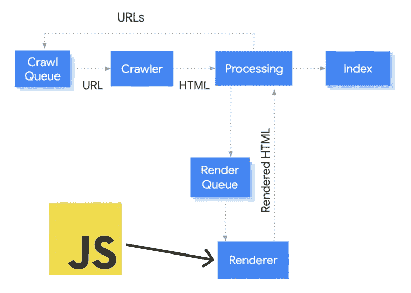

# 可访问性:“屏幕阅读器和谷歌不使用 Javascript”揭穿了网络神话

> 原文：<https://levelup.gitconnected.com/accessibility-screen-readers-and-google-dont-use-javascript-debunked-myths-from-the-web-aff4d8160f74>

## 理解谷歌搜索引擎优化和可访问性的 JS。谷歌爬虫是盲目的，它像其他人一样使用 Javascript。

在网络上，有许多关于网页可访问性和 Javascript 的骗局或旧观念仍在传播，主要有两种形式:

*   **StackOverflow Q & A**
*   **SEO 文章**

# 2008 年的 StackOverflow 答案仍在使用

**问题:**“在满足这些需求的同时，JavaScript 可以使用到什么程度？”

**不好的回答:**“如果易访问性是你最关心的问题，那么一定要使用符合标准的 HTML 来创建网站。如果是 web 应用程序(表单提交等)，确保表单只使用 HTTP GET 和 POST 就能工作。一旦你有了一个完整的网站/应用程序，你就可以添加一些 CSS 和 JavaScript 代码，只要网站还能运行，关闭其中一个或两个都可以。”

这是 2008 年的一个回答，年轻的开发者可能还在用！和其他事物一样，屏幕阅读器自 2008 年以来发生了巨大的变化。

下面是答案的链接:[https://stackoverflow.com/a/266869](https://stackoverflow.com/a/266869)

这里有另一个问题，一个屏幕阅读器的用户用正确的答案回答，确认你可以放心地使用 Javascript:[https://stackoverflow.com/a/3997028](https://stackoverflow.com/a/3997028)

# 谷歌也渲染 Javascript 元素

直到去年，谷歌还被告知不能呈现 Javascript 页面，需要静态 HTML 来索引它们。幸运的是，这种情况已经改变。

最近 Googlebot 内部发生了更新，它从 2019 年 5 月开始每天使用 [**Chromium 浏览器**抓取网页！](https://webmasters.googleblog.com/2019/05/the-new-evergreen-googlebot.html)

当 Googlebot 通过发出 HTTP 请求从爬行队列中获取 URL 时，它首先解析 HTML 响应。这适用于经典网站或服务器端呈现的页面，其中 HTTP 响应中的 HTML 包含所有内容。

一些 JavaScript 站点可能使用[应用外壳模型](https://developers.google.com/web/fundamentals/architecture/app-shell)，其中初始 HTML 不包含实际内容，Googlebot 需要执行 JavaScript 才能看到 JavaScript 生成的实际页面内容。

然后，Googlebot 将所有页面排队等待渲染。一旦 Googlebot 的资源允许，无头 Chromium 就会呈现页面并执行 JavaScript。它使用渲染的 HTML 来索引页面并找到更多的链接。

[https://developers . Google . com/search/docs/guides/JavaScript-SEO-basics](https://developers.google.com/search/docs/guides/javascript-seo-basics)

# 结论

**你可以毫无问题地使用 Javascript！**我们现在是 2019 年，屏幕阅读器不使用 Javascript 或 Google crawlers 不索引 Javascript 内容的旧故事或神话完全是错误的，应该避免！

> 你应该把时间花在改善你的网络体验的其他部分上，利用 Javascript 的所有能力，应用其他技巧或诀窍，在几分钟内消除常见的 [**网页可访问性错误**](http://web accessibility) too 或 [**SEO 错误**](https://medium.com/better-programming/search?q=seo) ！

# 参考资料和资源

*   [https://developers . Google . com/search/docs/guides/JavaScript-SEO-basics](https://developers.google.com/search/docs/guides/javascript-seo-basics)
*   [https://stackoverflow.com/a/266869](https://stackoverflow.com/a/266869)
*   [https://stackoverflow.com/a/3997028](https://stackoverflow.com/a/3997028)
*   [https://web masters . Google blog . com/2019/05/the-new-evergreen-Google bot . html](https://webmasters.googleblog.com/2019/05/the-new-evergreen-googlebot.html)