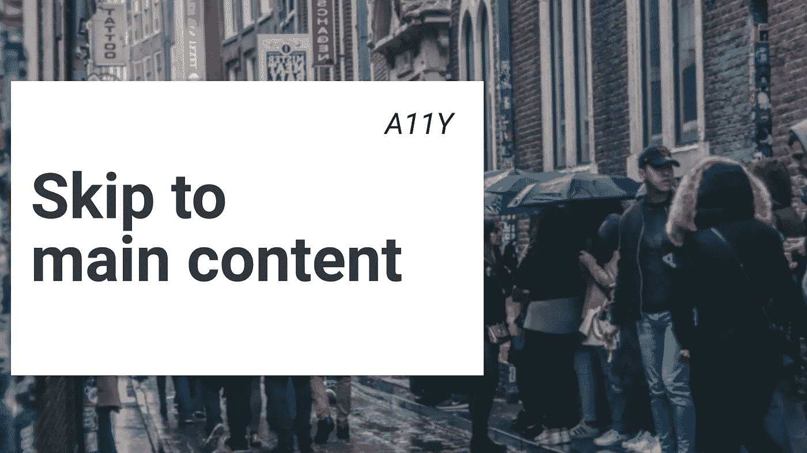

# 可访问性:跳到主要内容

> 原文：<https://levelup.gitconnected.com/accessibility-skip-to-main-content-56cef376c98c>

## 使用 tab 键时，如何跳到网页的主要内容，而不需要循环浏览不相关的链接

# 我们不喜欢重复的动作

我们不喜欢做重复性的事情。我们想在观看网飞的节目时绕过 YouTube 上的附加内容，跳过片头字幕。

当我们在网上冲浪时，我们做完全相同的事情。

我们试图尽可能快地找到页面的主要内容，并跳过所有与我们无关的信息。

一个**不可访问的网站**会在用户和他想要访问的内容之间放置大量的元素。一个有可访问性(a11y)问题的用户不会像其他人一样快，因为他必须浏览每个单独的元素，**在每个页面上挡住他的路！**

我们希望删除这些重复的步骤，让用户决定是否要跳过它们——我们将添加一个**“跳到主要内容”**链接！

# 跳到主要内容的概念

当盲人用户与你的网站交互时，他们使用 TAB 键从每个连续的难处理的元素如按钮、链接或输入中跳转。

提供一个“**跳转到主要内容**”链接，让用户可以通过一个简单的链接轻松跳转到页面的主要内容，而不需要浏览标题、菜单和其他出现在每个页面上的重复元素。

a11y 链接的好处在于，当用户使用 TAB 键选择它们时，它们只对用户可见。

这种技术也被称为**“跳过导航链接”**。

# 你需要多少个跳转链接

网站通常有 3 或 4 个链接，当你在特定网站上按 TAB 键时，这些链接会立即显示出来。

[**谷歌**](https://www.google.com/search?q=a11y) 序列是:

1.  跳到主要内容
2.  无障碍指南
3.  关于可访问性的反馈

其他公司可能有这样的序列:

1.  跳到主要内容
2.  可访问性声明
3.  无障碍指南

[**星巴克**](https://www.starbucks.com/) **例如**是这样的:

1.  跳到主导航
2.  跳到主要内容
3.  跳到页脚

# 如何添加跳过链接

你需要做三件事:

1.  决定你需要多少个跳转链接，对于你希望用户能够跳转到的每个区域，你应该添加一个独特的 HTML `id` 来使内部锚链接跳转到用户点击该链接的区域。

在我的例子中，我将添加 3 个链接:

*   第一个链接**指向**可访问性声明**，这是一个类似于`/statement.html`的新页面。**
*   **第二个**链接到位于所有菜单链接之后的页面的**主内容**。为了导航到这一部分，我将向内容添加一个 ID 标签，如`id="content"`。
*   **第三个**链接指向**页脚**，该页脚包含所有用于浏览网站的特定链接，因此我在这一部分添加了`id="footer"`。

[https://gist . github . com/Giorat/91e 48 f 483553 a50 c 318 CDF 6 C1 ABC 8da 7](https://gist.github.com/Giorat/91e48f483553a50c318cdf6c1abc8da7)

2.您还需要添加一些 CSS 来使其工作。`skip-main`类只有在通过按 TAB 键接收到用户的`focus`时才使这些链接可见，它们会出现在屏幕的左上角。

[https://gist . github . com/Giorat/c8d 26023 ea 179 b 163 a 79706 aa 923 e 773 # file-skip links-CSS](https://gist.github.com/Giorat/c8d26023ea179b163a79706aa923e773#file-skiplinks-css)

3.最后，添加一个动态 Javascript 函数，在运行时插入这些链接。使用这段代码，您不需要手动修改任何页面的基本模型，并且您将能够通过向`skipLinks`变量插入更多元素来轻松添加新的跳转链接。

[https://gist . github . com/Giorat/0f 313 e 98 ef 11e 6b 012 c 499 aa 61428130](https://gist.github.com/Giorat/0f313e98ef11e6b012c499aa61428130)

# 完整示例

你可以在[**CodePen**](https://codepen.io/Giorat/pen/jOObBMe):[https://codepen.io/Giorat/pen/jOObBMe](https://codepen.io/Giorat/pen/jOObBMe)上找到一个完整的例子

# 测试您的网站的可访问性问题！

有许多定制产品可以做到这一点，如 [Husable](http://bit.ly/accessibility_test_blind) 将为您的网站提供[真实的人工测试评估](http://bit.ly/accessibility_test_blind)，以发现自动工具无法发现或发现的真实问题，因为[需要人工](http://bit.ly/accessibility_test_blind)！

# 参考资料和资源

*   [https://accessibility . OIT . ncsu . edu/it-accessibility-at-NC-state/developers/accessibility-handbook/鼠标和键盘事件/skip-to-main-content/](https://accessibility.oit.ncsu.edu/it-accessibility-at-nc-state/developers/accessibility-handbook/mouse-and-keyboard-events/skip-to-main-content/)
*   https://www.w3.org/TR/WCAG20-TECHS/G1.html
*   【https://axesslab.com/skip-links/ 
*   [https://codepen.io/Giorat/pen/jOObBMe](https://codepen.io/Giorat/pen/jOObBMe)