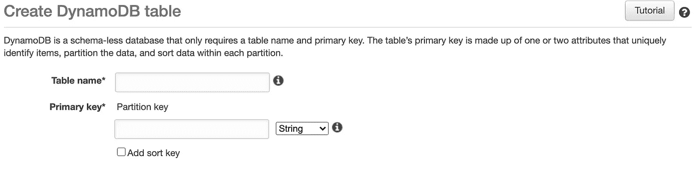
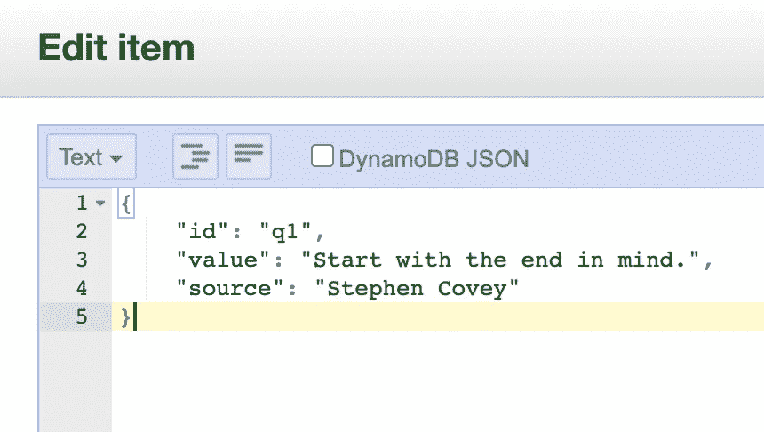

# 通过部署在 AWS Lambda 中的 Apollo GraphQL 服务器访问 AWS DynamoDB

> 原文：<https://levelup.gitconnected.com/accessing-aws-dynamodb-through-apollo-graphql-server-deployed-in-aws-lambda-through-serverless-e2752c84281c>


**目标**:通过 GraphQL lambda 函数获取 DynamoDB 表的所有记录。

```
Query:**query {****quotes {
  id
  value
  source
 }****}**Response:**{
  "data": {
    "quotes": [
      {
        "id": "q2",
        "value": "If you don’t like how things are, change it! You’re not a tree.",
        "source": "Jim Rohn"
      },
      {
        "id": "q1",
        "value": "Start with the end in mind.",
        "source": "Stephen Covey"
      }
    ]
  }
}**
```

使用的技术:AWS DynamoDB，AWS Lambda，AWS IAM， [Serverless](https://www.serverless.com/) ， [Apollo Graphql](https://www.apollographql.com/docs/apollo-server/)

**先决条件**:AWS 基础知识和 JavaScript 中级知识，以及 Apollo 服务器。

**步骤 1 —创建一个 DynamoDB 表**

首先，用主键 *id 在 [DynamoDB](https://console.aws.amazon.com/dynamodb/home) 中创建一个名为 *Quote* 的表。*



创建 DynamoBD 表

通过 C *创建项目向表中添加一些条目。*您可以使用以下示例 JSON 文本(而不是下拉菜单上的*树*选项)



```
**{
    "id": "q1",
    "value": "Start with the end in mind.",
    "source": "Stephen Covey"
}**
```

点击了解更多关于 No SQL 和 DynamoDB [的信息。](https://docs.aws.amazon.com/amazondynamodb/latest/developerguide/Introduction.html)

**步骤 2 —创建 AWS IAM 用户并配置 AWS 配置文件**

要访问任何 AWS 服务，我们需要一个具有适当访问权限的 IAM 用户。

转到 AWS IAM [控制台](https://console.aws.amazon.com/iam/home?region=us-east-1#/users)并添加一个名为*无服务器*的用户(该用户将被[无服务器](https://www.serverless.com/)用来连接到 AWS 服务)。

选择访问类型为*编程访问*

在权限上，转到*直接附加现有策略*并暂时给予*管理员访问权限**。*

> ***AdministratorAccess —授予对所有 AWS 资源的完全访问权限。对于生产应用程序，您应该根据*** 的要求提供细粒度的控制

使用默认值继续其他步骤。在最后一步，您将看到访问和密钥。下载。csv 文件或复制这些值，因为您以后将无法访问它们。

现在您需要在您的机器中配置这个用户。为此，您需要安装 AWS CLI。AWS 命令行界面(CLI)是管理 AWS 服务的统一工具。

[根据你的操作系统安装 CLI](https://aws.amazon.com/cli/) 。

在您的终端上运行`aws configure **--profile serverlessuser**`。注意，配置文件名与我们在上一步中创建的 IAM 用户名不同。你可以给它起任何名字，比如 *serverlessprofile。*

`--profile` —名为配置文件的*是可以应用于 AWS CLI 命令的设置和凭证的集合。当您指定运行命令的配置文件时，将使用设置和凭据来运行该命令。您可以指定一个“默认”的概要文件，并在没有明确引用概要文件时使用。*

阅读[此处](https://docs.aws.amazon.com/cli/latest/userguide/cli-configure-profiles.html)了解更多详情。

在命令提示符下运行`aws configure --profile serverlessuser`，并提供访问权限和密钥以及一些其他细节，如地区(对我来说，我有 *us-east-1*

到现在为止，您的系统中应该有两个概要文件 *default* 和 *serverlessuser* (您可以检查您的[HOMEDIR]/)。aws/)

在将代码部署到 AWS 之前，让我们首先尝试从本地运行的 Apollo 服务器获取该表的数据。

**步骤 3 — Apollo 服务器和 GraphQL 设置**

下面是设置 apollo 服务器、创建模式和从 *Quote* 表中获取数据的最少代码。

如果你是阿波罗服务器的新手，请阅读这个。

简单地说，Apollo Server 是一个 GraphQL 兼容的服务器，既可以独立运行，也可以在无服务器环境中运行。在这一步中，我们将把它作为一个独立的服务器运行，稍后我们将创建一个 lambda 函数在 AWS lambda 环境中运行。

创建一个文件夹，然后粘贴创建一个 package.json 和 server.js 文件，如下所示。

用下面的`package.json`做`npm install`。注意，它有一些额外的节点模块，我们稍后将使用这些模块来创建 lambda 函数。

创建一个文件名`server.js`并运行`node server.js`来启动服务器。

您现在应该能够在`localhost:4000`访问 GraphQL 实例，并且能够查询报价。

```
**query {****quotes {
  id
  value
  source
 }****}**
```

代码非常简单。您为`quotes`定义一个模式，解析器调用`getQuotes`方法，其中实际的代码是获取数据。

让我们看看代码的关键部分。

AWS 为各种语言提供了与 AWS 服务交互的 SDK。为了访问 DynamoDB，我们利用了`@aws-sdk/client-dynamodb`

`const { DynamoDBClient, ScanCommand } = require(“@aws-sdk/client-dynamodb”);`

> 默认情况下，`DynamoDBClient`将利用默认配置文件来访问 AWS 服务

`const client = new DynamoDBClient({ region: “us-east-1” });`

`ScanCommand`用于读取表格中的所有记录。[这里的](https://awscli.amazonaws.com/v2/documentation/api/latest/reference/dynamodb/index.html)是所有命令的完整参考。

```
const results = await client.send(new ScanCommand(params));
```

最后一个关键部分是

```
quotes.push(**unmarshall**(item));
```

`unmarshall`是 DynamoDB util，用于将 DynamoDB JSON 格式转换为普通 JSON。

```
const { unmarshall } = require(“@aws-sdk/util-dynamodb”);
```

因为这篇文章已经很长了，我将在下一篇文章中继续，看看如何通过无服务器将这段代码部署为 AWS lambda 函数。但是在我们结束之前，让我们看看什么是*编组*和*解组*？

DynamoDB 将 Javascript 类型转换为 dynamo db*attribute value*

那是什么意思？所以在步骤 1 中，我们添加了 JSON 文本作为简单的键-值对

```
**{
    "id": "q1",
    "value": "Start with the end in mind.",
    "source": "Stephen Covey"
}** 
```

但是 DynamoDB ***编组*** 这些 JavaScript 对象并引入键来识别数据类型。要查看结果，请在获取结果后执行`console.log(results.Items);`。

```
//output
[{**id: { S: "q1" },
value: { S: "Start with the end in mind." },
source: { S: "Stephen Covey" }**}];
```

你会注意到键名`S`指示*字符串*类型数据**被编组**到 ***属性值*** s，所以为了**解组**并获得普通 JSON，我们使用了 util `unmarshall`。

希望这能解释。这里可以阅读更多[。](https://docs.aws.amazon.com/AWSJavaScriptSDK/latest/AWS/DynamoDB/Converter.html)

**更新:**发布了文章的第 2 部分，以[通过无服务器](/deploying-an-apollo-graphql-application-as-an-aws-lambda-function-through-serverless-77fa33612bae)将该应用程序部署为 AWS lambda 函数

希望我没有错过这里的任何关键步骤，但如果我错过了，请随时留下评论。要在文章的下一部分获得通知，将这段代码部署为 AWS lambda 函数，请在 medium 或 [Twitter](https://twitter.com/cssmiles) 上关注我。

如果你喜欢这个，请点击👏按钮并分享，帮助其他人找到它！