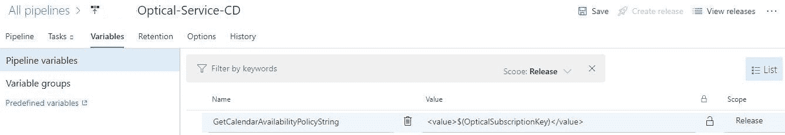

# 在 Azure DevOps 中访问密钥库机密

> 原文：<https://levelup.gitconnected.com/accessing-key-vault-secrets-in-azure-devops-d66f7805f6f0>

[翁贝托](https://unsplash.com/@umby)在 [Unsplash](https://unsplash.com/) 上拍摄的照片

前几天我遇到了一个问题。

我想在环境变量中使用 Azure Key Vault secret，并在 Powershell 脚本中使用它作为发布步骤的一部分:

# Azure Key Vault 步骤

第一步是从密钥库中获取秘密。

这里你可以看到我正在访问一个名为 OpticalSubscriptionKey 的秘密。

# 在环境变量中使用秘密

我试图构建一个可以在 Powershell 中使用的字符串。我试图通过从环境变量中访问这个秘密来做到这一点:

# Azure DevOps 发布步骤

以下是我发布步骤的截图。它最初用于运行 Powershell 脚本来更新 Azure API 管理策略。

但是为了简单起见，我修改了 Powershell 脚本，只输出变量的值。

这是 Powershell 脚本，它简单地访问上述环境变量，并显示值:

# Powershell 脚本步骤输出

以下是脚本的输出:

如您所见，环境变量的值为 null。

# 问题是

**访问环境变量中的 Azure Key Vault secret 会导致变量为空！**

# 解决方案

您不能访问环境变量中的机密，但是可以从 Powershell 中访问该机密。

以下是构建我需要的字符串的一种变通方法:

1.  将密码作为参数传递到脚本中:

2.更新环境变量以包含占位符字符串，而不是密码:

3.更新 Powershell 脚本以接受脚本参数，并用机密值替换占位符值:

# 成功！

可以在 Powershell 中访问 Azure Key Vault 机密。所以字符串必须构建在 Powershell 中，而不是仅仅从环境变量中访问。

这里有一个显示 Powershell 脚本工作的截图。

输出中的 3 颗星是特意设计的。是为了隐藏金库秘密钥匙的价值。然而，这只是在显示中，变量的实际值将包含密钥库秘密值。

