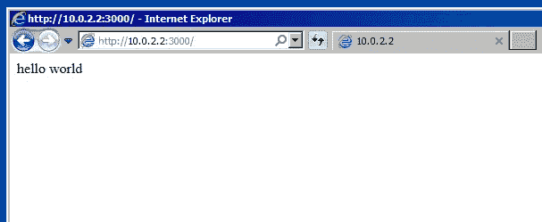

# 从 Windows 虚拟机访问 Mac 中的本地主机

> 原文：<https://levelup.gitconnected.com/accessing-localhost-from-a-windows-virtual-machine-c6ebd00d910f>

在 VirtualBox 的 Windows 虚拟机中测试 web 开发

在 Mac 上进行 web 开发时，我们可能希望看到我们的应用程序在微软 IE/Edge 浏览器上的外观。

太好了，微软提供从 IE8 到 Edge 的免费[虚拟机。您需要下载 VirtualBox 和一个特定的虚拟机(例如，Win7 上的 IE11)。](https://developer.microsoft.com/en-us/microsoft-edge/tools/vms/)

假设您在 Mac 上构建了一个本地开发服务器，监听端口 3000。在 Mac 机器中，我们简单地使用 URL[http://localhost:3000](http://localhost:3000,)打开网站，但是这从 Windows 虚拟机返回一个错误。

从虚拟机访问 localhost:3000 时出错

我如何从 Windows 虚拟机访问这个 *localhost:3000* ？事实证明有两种方法:

*   1.使用虚拟机网关 IP 10.0.2.2
*   2.编辑 ***hosts*** 文件以在虚拟机中使用 ***localhost***

> **注意:**如果虚拟机没有互联网连接，请确保网络适配器设置为 NAT。然后，在 Windows VM 中，您与 google.com 的互联网连接应该工作正常。

## 1.使用虚拟机网关 IP 10.0.2.2

在虚拟机上，网关 IP 通常默认为 10.0.2.2。所以只要去这个 IP***http://10 . 0 . 2 . 2:3000***应该就可以了。

使用虚拟机网关 IP 10.0.2.2

如果 ***10.0.2.2*** 对你不起作用，进入终端并键入 ***ipconfig*** 在你的 Windows 虚拟机中获取你的网关 IP 地址:

通过键入 ipconfig 获取网关 IP

## 2.编辑主机文件以在虚拟机中使用本地主机

在 Windows 虚拟机中，使用选项“**以管理员身份运行**”启动记事本

以管理员身份运行启动记事本

然后点击“**打开**，导航到***C:\ Windows \ System32 \ drivers \ etc***，打开“ ***hosts*** ”文件

导航到***C:\ Windows \ System32 \ drivers \ etc***，打开“ ***hosts*** ”文件

下面加这行:***{ your _ gateway _ IP } localhost***。所以比如:***10 . 0 . 2 . 2 localhost***。然后，点击**保存**

将 10.0.2.2 本地主机添加到主机文件中

之后，你需要重启你的虚拟机。重启后， [http://localhost:3000](http://localhost:3000) 应该在工作:

访问虚拟机中的本地主机:3000