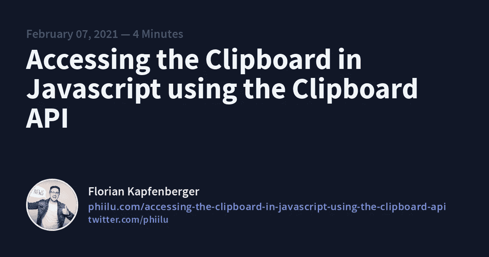

# 使用剪贴板 API 在 Javascript 中访问剪贴板

> 原文：<https://levelup.gitconnected.com/accessing-the-clipboard-in-javascript-using-the-clipboard-api-8b70072c4ee3>

欢迎来到我的新系列，在这里我将写关于内置浏览器 API 的文章，并演示如何使用它们。我将要写的大多数 API 都是高度实验性的，并且仍然处于“草稿”状态。所以不要指望浏览器会被广泛采用，只在现代浏览器上尝试一下。您可以随时查看[caniuse.com](https://caniuse.com/)或 [MDN](https://developer.mozilla.org/en-US/docs/Web/API) 以获取关于浏览器兼容性的最新信息。

我想写的第一个 API 是剪贴板 API。使用剪贴板 API，您可以读取和写入用户的剪贴板。这不是什么新鲜事，因为你已经可以用`document.execCommand()`做到这一点了。

问题是`execCommand()`是同步操作，调用时会阻塞页面。此外，一个浏览器实现`document.execCommand('copy')`功能的方式可能与另一个不同。这可能导致不一致的结果。你可以在这里阅读更多关于老办法[的内容。](https://developer.mozilla.org/en-US/docs/Mozilla/Add-ons/WebExtensions/Interact_with_the_clipboard)

剪贴板 API 试图通过异步来解决这个问题，并提供跨浏览器的更一致的 API。

# 访问剪贴板的权限和安全性

使用新的剪贴板 API，您将需要`clipboard-read`权限来读取用户剪贴板内容。当你想写剪贴板时，你需要有`clipboard-write`的许可。尽管您需要此权限，但当页面位于当前选项卡中时，浏览器会自动授予您该权限。

还不是所有的浏览器都支持[权限 API](https://developer.mozilla.org/en-US/docs/Web/API/Permissions_API) 。例如，Safari 没有实现它，但是，您可以在 Safari 中访问剪贴板 API，而无需请求权限。另一方面，Firefox 支持权限 API，但是还没有实现`clipboard-read`和`clipboard-write`权限。你已经看到，如果你今天开始使用它，可能会有问题。

此外，在访问剪贴板 API 时，您需要有一个[安全上下文](https://developer.mozilla.org/en-US/docs/Web/Security/Secure_Contexts)。这通常意味着只有当你使用有效的 SSL/TLS 证书在`localhost`或网页上时，你才能访问这个 API。

您可以访问`navigator`对象上的剪贴板 API。如果`navigator.clipboard`是`undefined`，那么剪贴板 API 将不能在你的浏览器上使用。

# 监听剪贴板事件

如果您想在用户复制、粘贴或剪切时进行操作，您可以通过在文档中附加一个事件监听器来轻松获得这些事件。这些事件的名称是`copy`、`paste`和`cut`事件。

传递给处理函数的事件将实现`ClipboardEvent`接口。该接口将允许您覆盖传递到剪贴板或从剪贴板传递的内容。如果您想要格式化或删除正在复制的文本的格式，这非常方便。

从剪贴板读取对于实现权限 API 的浏览器，您应该首先检查您是否有从剪贴板读取的权限。

> 我在没有询问许可的情况下试用了一下，效果很好。这在未来显然会改变。

# 文本

如果你只想阅读文本，你可以使用方便的方法`readText()`。这个方法将返回一个带有剪贴板内容的承诺。

# 形象

如果您想从剪贴板中读取图像，您必须使用`read()`方法。该方法将返回一个包含一组 [ClipboardItem](https://developer.mozilla.org/en-US/docs/Web/API/ClipboardItem) 对象的承诺。

以下是如何从剪贴板中读取图像的示例:

基本上，我们在这里做的是迭代每个项目并检查 MIME 类型，如果它是一个 PNG 图像，我们将创建一个对象 URL，它可以传递给图像的`src`属性来显示它。

> ****URL . createobjecturl()****静态方法创建一个*[*DOM string*](https://developer.mozilla.org/en-US/docs/Web/API/DOMString)*，其中包含一个表示参数中给定对象的 URL。URL 生命周期与创建它的窗口中的* [*文档*](https://developer.mozilla.org/en-US/docs/Web/API/Document) *相关联。新对象 URL 代表指定的* [*文件*](https://developer.mozilla.org/en-US/docs/Web/API/File) *对象或*[*Blob*](https://developer.mozilla.org/en-US/docs/Web/API/Blob)*对象。—* [*MDN*](https://developer.mozilla.org/en-US/docs/Web/API/URL/createObjectUR)*

# *写入剪贴板*

*正如我已经说过的，你不需要请求`clipboard-write`权限，因为如果页面在活动标签中，浏览器会自动授予它。*

# *文本*

*如果你只想将文本写入剪贴板，你可以使用方便的`writeText()`方法。只需将您想要放入剪贴板的文本作为第一个参数进行传递，就大功告成了！。*

# *形象*

*如果你想将图像写入剪贴板，你必须使用`write()`方法。此方法将 ClipboardItem 对象的数组作为第一个参数。*

*以下是如何从剪贴板中读取图像的示例:*

*基本上将不得不创建一个[斑点](https://developer.mozilla.org/en-US/docs/Web/API/Blob)出来的图像。我所知道的实现这个的最简单的方法是用`fetch`调用图片的 URL。*

# *将 API 与 React 一起使用*

*我现在主要是用 React 开发，所以我想展示一下我是如何使用它的。这与不使用 React 而使用它没有太大区别，因为我们不需要访问任何 DOM 元素，可以在事件处理程序或`useEffect`钩子中做任何事情。*

*我创建了一个没有持久性的剪贴板管理器的 MVP，但是它很好地演示了大多数剪贴板 API 特性。*

*   *演示:[https://clipboard-api.phiilu.com/](https://clipboard-api.phiilu.com/)*
*   *GitHub:[https://github.com/phiilu/clipboard-browser-api-demo-nextjs](https://github.com/phiilu/clipboard-browser-api-demo-nextjs)*

*它使用的是 Next.js 和 Tailwind CSS。我把所有东西都保存在`index.js`文件里。如果你有任何问题，不要犹豫，在推特上问我。*

# *结论*

*在撰写本文时，对剪贴板 API 的支持仍然有限，我想我现在不会在生产中使用它。*

*我认为重要的是，web 将获得更多在大多数浏览器中支持的一致的 API，并为我们做艰苦的工作。考虑如何将文本复制到剪贴板并不复杂。*

*剪贴板 API 将最终交付一个一致的 API，而不使用黑客方法。如果您想获得这个 API 如何帮助您的更多例子，请查看 [W3C 用例](https://w3c.github.io/clipboard-apis/#Cases)部分。*

***来源:***

*   *https://developer.mozilla.org/en-US/docs/Web/API/Clipboard*
*   *web . dev:[https://web.dev/async-clipboard/](https://web.dev/async-clipboard/)*
*   *https://w3c.github.io/clipboard-apis/*

**原载于 2021 年 2 月 7 日*[*https://phiilu.com*](https://phiilu.com/accessing-the-clipboard-in-javascript-using-the-clipboard-api)*。**