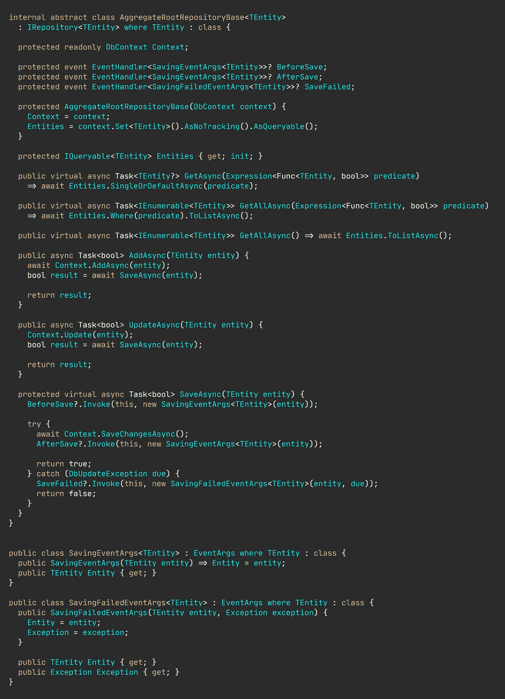

# 初级开发人员的高级存储库模式

> 原文：<https://levelup.gitconnected.com/accessing-your-data-using-advanced-repository-pattern-for-beginner-developers-73609ea86b2c>

## C#中的示例。网络 6

## 如何编写不会让你头疼的合适的存储库类？

图片由[尼克拉斯·米勒德](https://medium.com/u/7c7a43b3d9de?source=post_page-----73609ea86b2c--------------------------------)

存储库模式可能是您在实际生产应用程序中学习或应用的第一批广泛实用的设计模式之一。这绝对是一个值得双击和深入了解的模式，因为它几乎已经成为任何数据访问层的一等公民。

存储库设计模式通常分为两种不同的模式:通用模式和专用模式，这两种模式都有相同的总体目标:从调用者那里抽象出数据具体化。存储库的调用者——或用户——根本不关心*如何获取*实体**。调用者只对处理实体感兴趣，就好像它们是内存中的对象一样。**

**通用存储库为聚合根提供了一组通用的功能，其接口通常类似于无处不在的 create，read，update，delete (CRUD)缩写。**

****

**通用存储库接口。**

**现在让我们坚持使用通用接口。稍后我们将实现完整的、具体的类。在这里，我们可以清楚地看到通用存储库提供的类似 CRUD 的操作。`TEntity`是我们的存储库可以操作的通用类型，存储库将以完全相同的方式操作所有的实体类型。**

**🔔想要更多这样的文章？在这里签名。**

**另一方面，一个特定的存储库拥有关于聚合根及其相关实体如何组成的复杂知识。下面这样看起来可能很荒谬(我在真实的应用程序中见过类似的存储库)。**

****

**用户的特定存储库。**

**现在，特定的存储库往往膨胀得很快，因为开发人员通常想做一些愚蠢的事情，比如为了不必要的微优化而避免过度获取，从而导致令人困惑的界面。**

## **合并特定存储库之间的共性。**

**每当您沿着特定的存储库前进时，您会开始注意到您需要生成多少重复的代码。**

**您通常会看到两个存储库，其中许多成员具有几乎相同的实现，如下图所示。实际上，几乎所有的插入、更新和删除操作都是相同的。**

********

**具有相同实现的特定存储库。**

**通用库对于保持事物*干燥*非常有用，也就是说，你不必重复自己。**

**一旦您试图为如何获取和构造复杂的对象图制作一个模板，事情通常会变糟。这是可以做到的，但是您会发现自己正在竭尽全力使获取数据通用化。**

**我只是通过不沉迷于编写疯狂、复杂、可修改的获取逻辑来避免这种头痛。相反，我提供了一个简单的实现，可以很容易地被继承类覆盖。**

**花几秒钟浏览一下这个通用存储库。之后我会给你一些解释。**

**[📚查看 git 存储库](https://github.com/NMillard/SimpleWebApps/tree/master/src/DesignPatterns/RepositoryPattern)**

****

**带有简单实现的通用存储库。**

**所有方法都是虚拟的—这允许您在需要时覆盖这些方法。**

**我相信你已经注意到这些事件了。因此，通用存储库的一个问题是，它对所有类型的行为方式完全相同。例如，如果我们希望在事情成功或出错时进行自定义日志记录，那么我们要么自己重新实现整个`SaveAsync`方法，要么根本不进行日志记录。**

**但是，当您创作可扩展模块时，创建扩展点或插件点总是一个好的实践，这样其他人就可以提供他们自己的功能。在这种情况下，子类可以订阅诸如保存前、保存后和保存失败等事件。**

**受保护的`Entities`属性有点特殊。在实例化时，它被设置为只获取任何类型参数的实体，而不考虑实体可能是一个具有几个相关实体和值对象的复杂聚合根。**

**如果这个获取逻辑太简单，你需要做的就是覆盖它。**

**考虑一下我们是否有一个复杂的类型，比如一个用户有一堆书。那么通用的获取逻辑肯定是不够的，但是我们可以将通用的和特定的存储库方法混合起来，以获得两全其美。**

**一个完整的用户存储库可以像下面举例说明的那样简单。**

****

**混合方法。**

**现在`Entities`属性实际上包含了完整的对象图，我们不需要修改其他的“获取”方法。此外，我们还订阅了任何“保存前”活动。**

# **不要声张。**

**基础设施问题不应该蔓延到您的领域、应用程序或表示层。将所有具体的存储库保持在内部，并在域级别定义存储库接口。**

**英寸 NET 中，您仍然可以将内部的具体类与公共接口连接起来，并在运行时从依赖容器中请求服务时使用内部类。**

**我在企业应用程序开发中使用的首选方法是在位于基础设施项目中的`IServiceCollection`上创建一个扩展方法，并在`Startup`或`Program`类中调用这个方法。**

****

**因此，扩展方法向公共接口`IUserRepository`注册了内部类`UserRepository`。然后，在包含应用程序入口点的项目中使用扩展方法。**

**通过这种方式，我们没有从基础设施层公开内部类，但是它们仍然在运行时使用。**

# **总之…**

**存储库模式几乎与数据访问同义，广泛应用于个人开发人员和大型企业应用程序中。存在大量建议的实现，通常分为两类:一般的或特定的存储库。**

**在我看来，混合使用通用方法和特定方法通常会更有好处，但是您必须保持警惕，看看您想要提供多少通用功能，以及这些功能有多容易修改或扩展。**

# **让我们保持联系！**

**[点击这里](https://nmillard.medium.com/subscribe)订阅时事通讯，获得类似文章的通知，并查看新的 YouTube 频道[*(@ Nicklas Millard)*](https://www.youtube.com/channel/UCaUy83EAkVdXsZjF3xGSvMw)**

# **好奇者的资源。**

*   **[有效骨料设计第 1 部分:单个骨料建模](https://www.dddcommunity.org/wp-content/uploads/files/pdf_articles/Vernon_2011_1.pdf)沃夫·弗农著**
*   **[Git 知识库](https://github.com/NMillard/SimpleWebApps/tree/master/src/DesignPatterns/RepositoryPattern)作者[尼可拉斯·米勒德](https://medium.com/u/7c7a43b3d9de?source=post_page-----73609ea86b2c--------------------------------)**