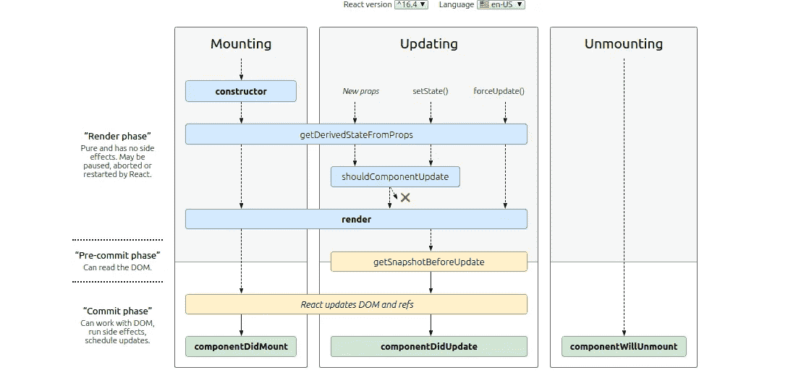

# 赢得下一次 React 面试

> 原文：<https://levelup.gitconnected.com/ace-your-next-react-interview-9227fc8ca105>

你需要知道的 16 个最重要的反应问题


## **1)React 是如何工作的？**

React 的工作原理是使用一个叫做虚拟 DOM 的概念。它不是直接更新/呈现真实的 DOM，而是构造一个虚拟 DOM，它是真实 DOM 的精确表示。如果有任何状态更改、道具更改或其他触发重新渲染的操作，React 将首先更新 VirtualDOM 并进行协调。协调是将虚拟 DOM 与真实 DOM 进行比较的过程。然而，逐个节点地比较整个树的代价是昂贵的。因此，React 使用启发式方法在两棵树之间进行快速比较，最后只更新实际 DOM 中发生变化的节点。这样，React 就不会重新渲染整个 DOM，这是非常昂贵的。

## **2)什么是虚拟世界和影子世界？**

VirtualDOM 是真实 DOM 的精确表示，用于协调以快速高效地呈现。另一方面，ShadowDOM 是 DOM 的另一个副本，用于本地化和隔离。使用 ShadowDOM，每个模块的变量的作用域被声明，这也有助于本地化 CSS 或作用域 CSS，其中 CSS 只应用于一个组件，从而减少 CSS 样式冲突。

## **3)类 vs 功能组件？**

以前，类组件是创建具有状态和组件生命周期特性的组件的唯一方式。2019 年，react 最终发布了 React 挂钩，使这些功能能够用于功能组件中。但是，有一项功能是错误处理程序这一功能组件中不存在的。它只存在于使用`componentDidCatch`和`static getDerivedStateFromError`的类组件中。

## 4)为什么首选挂钩？挂钩的类型？

由于引入了 react 挂钩，React 团队建议使用带有挂钩的功能组件，原因如下:

*   **类对于人类和机器来说都是令人困惑的**

Javascript 基本上不是面向对象的编程语言。ES6 通过利用称为原型继承的概念来模仿类特性。React 团队也意识到了这一点，并表示类组件很难优化，例如，缩小现在工作得很好。此外，类组件也使热重装变得不可靠

*   **类组件中更复杂的代码**

在类组件中的组件生命周期方法中，许多逻辑被组合在一起，因为我们只允许声明一次生命周期方法。然而，在一个功能组件中，我们可以多次调用`useEffect`来解耦和本地化逻辑，因为`useEffect`充当 3 个组件生命周期:`componentDidMount`、`componentDidUpdate`和`componentWillUnmount`

*   **代码更简洁&学习曲线低**

因为我们不需要理解 OOP，比如`this`关键字、方法绑定等等。这使得学习曲线变得更加容易。此外，它还减少了需要编写的代码量。因此，使代码更短、更简洁。

*   **难以重用的逻辑**

在类组件中，不可能在组件之间重用逻辑。做到这一点的唯一方法是特设(高阶组件)，或通过渲染道具。但是，这些方式都不够灵活。在功能组件中，我们可以创建自己的定制钩子来重用许多组件中的逻辑

**挂钩类型**

*   使用状态
*   使用效果
*   使用上下文
*   用户教育
*   使用回调
*   使用备忘录
*   useImperativeHandler
*   useRef
*   使用过渡
*   useDeferredValue

## 5)受控组件与非受控组件？

受控组件意味着所有动态数据值都在 React 状态下处理和存储。因此，如果我们想要更新它，我们需要附加一个直接更新状态的事件处理程序。

相反，一个不受控制的组件不依赖于任何状态。如果我们想获得数据值，我们可以利用`ref`直接检查 DOM 节点值。请注意，不建议使用这种方法

例如:

## **6)组件生命周期的类型和流程？**



**综上:**构造器→渲染→组件 did mount→getDerivedStateFromProps→shouldcomponentdupdate→渲染→getsnapshowbeforupdate→组件 DidUpdate →组件 WillUnmount

在 React 钩子中，`useEffect`只充当 3 个组件生命周期，因为它足以处理大多数情况:`componentDidMount`、`componentDidUpdate`、`componentWillUnmount`

## **7)什么是代码分裂和树抖动？**

代码分割是一种将代码分割成多个块并缓慢加载的方法。这意味着，只有当代码被使用时，我们才获取必要的代码块并加载它。使用这种方法，应用程序的主包大小将会大大减少。但是，请注意，因为 UI 是延迟呈现的，所以加载回退必须向用户表明 UI 没有完成呈现。

同时，树抖动是在捆绑过程中将应用程序分割成单独的多个块的过程。通过使用 React 的`lazy`和`suspense`特性，可以利用代码分割和树抖动。

## **8) Redux vs 语境？context 在取代 Redux 吗？**

Context 和 redux 的目的相同，都是为了使许多组件之间的状态管理更加容易。但是，必须注意，redux 是为大规模应用程序创建的，在这种应用程序中，状态经常被更新。Redux 足够聪明，只在被选择和被使用的状态被更新时才触发渲染。同时，上下文没有这种优化。当上下文的 1 个值被更新时，订阅该上下文的每个组件也将被更新，即使它不使用更新的值。因此，上下文更适合存储静态数据，如应用程序主题、用户数据等。

## **9)如何提高 React 性能？**

*   使用`PureComponent`或`shouldComponentUpdate`或`React.memo`指定组件何时应该重新渲染
*   使用`useCallback`或`useMemo`来记忆函数声明或繁重的计算
*   如果呈现一个巨大的列表，考虑使用虚拟化列表，其中只呈现屏幕上显示的项目
*   当组件(如`setTimeout`或`setInterval`)被卸载时，总是清理任何异步任务，以减少内存消耗
*   对于任何不希望导致任何重新呈现的动态数据，将该数据存储在 ref 中，而不是 state 中
*   启用代码拆分的惰性加载组件
*   依赖性优化，避免直接从根导入，例如:将`import {get} from 'lodash`改为`import get from 'lodash/get'`
*   避免内联函数，因为它总是在每次组件重新呈现时重新声明
*   避免分散道具，因为道具可以随时改变，只使用你需要的道具。
*   根据要求优化和定制 webpack 配置
*   使用`why-did-you-render`库或 React profiler 检查组件重新渲染

## **10)什么是 PureComponent、memo、useMemo、useCallback？**

类组件中的`PureComponent`或功能组件中的`memo`用于进行前一状态与下一状态、前一属性与下一属性之间的浅层比较。因此，仅当状态或 props 值发生变化时，才会呈现组件。

`useCallback`用于记忆功能组件中的函数声明，因此相同的函数在重新渲染时不会被重新声明。`useMemo`类似于`useCallback`,但是它执行函数并存储返回值。它用于保存一些繁重计算返回的值。

## **11)客户端 vs 服务器端渲染？**

React 是一个客户端渲染 SPA(单页面应用程序)，这意味着服务器将只返回一个空白的 HTML 模板，javascript 代码将在客户端运行，以指定渲染页面和填充 HTML 的内容和方式。

**优点**:

*   不需要主机服务器，静态主机如 github page、netlify 等就足够了
*   在初始加载之后，速度会很快，因为大部分 JS 包已经传递给了客户机。

**缺点**:

*   对 SEO 不好，因为服务器总是返回一个空的 HTML 模板。
*   取决于设备的渲染能力，因为一切都在客户端进行渲染。
*   初始加载很慢，因为大的 JS 包是从服务器传递过来的。我们需要显示加载微调器，以等待渲染完成。

同时，`NextJs`是著名的服务器端渲染 react 应用。这里，服务器运行一些 javascript 代码来构造 HTML 模板并将其传递给客户机。客户端需要做的只是运行一些 JS 代码来将事件处理程序或监听器附加到现有的标记上

**优点**:

*   对 SEO 有好处，因为我们可以管理哪些 HTML 数据传递给客户端。
*   不依赖于客户端设备，因为服务器是呈现 HTML 的一方
*   初始加载速度很快，因为服务器不需要传递整个应用捆绑包，服务器可以同时传递数据，从而消除了客户端的额外 API 调用。

**缺点**:

*   需要专用的 web 服务器来处理客户端请求
*   每个页面导航都需要调用服务器来获取页面标记

## **12)门户和片段的用例？**

Fragment 用于删除任何不必要的 DOM 节点，因为以前组件只能返回 1 个节点。因此，我们经常将一个组件包装在一个冗余的`<div>`或`<span>`中。

Portal 用于转义父层次结构布局，我们可以将元素放在任何 DOM 节点中。Portal 通常用于呈现模式、工具提示和任何弹出窗口。

## **13)为什么我们需要使用 useRef？什么是 forwardRef？**

Ref 用于存储任何不想引起任何重新渲染的动态数据，通常用于直接访问 HTML DOM 节点，类似于`document.getElementById`。

ForwardRef 是一个将引用从父组件转发到子组件的功能。通常，如果父组件想要访问数据或调用子组件中的函数，则使用 forwardRef。

## **14)什么是渲染道具？**

render props 是一个在自定义组件中传递渲染方法或函数作为道具的概念。Render props 是一种常见技术，用于创建带有自定义 UI 呈现的可重用组件，如表格、列表等。

例如

```
<CustomList
    items={[1,2,3]}
    renderItem={item => <li>{item}</li>}
/>
```

## **15)什么是 HOC(高阶分量)？还推荐吗？**

HOC 是传递公共逻辑或属性的组件包装器。HOC 是类组件中的一种常见方法。然而，在一个功能组件中，定制钩子现在更倾向于重用一些逻辑或属性。

## **16)为什么渲染组件列表时我们需要** `**key**` **？**

React 使用键来确定重新呈现列表的最有效方式。

例如，我们有一个键为`[1,2,3,4,5]`的组件列表，假设我们想在键 6 的中间添加一个新组件，那么键现在是`[1,2,6,3,4,5]`。只要看着这个键，React 就会移位，不会用`[3,4,5]`的键重新渲染元素，把元素`6`放在中间。这就是为什么键必须是唯一的。

假设我们使用索引作为键。中间放一个新组件后，按键会是`[1,2,3,4,5,6]`。React 将检测组件`[3,4,5,6]`是否不同，并重新呈现列表中的 4 个项目。因此，这不是有效的

## 实用问题

很多面试问题会要求你编写一些可重用的组件，比如 Modal、Toast message、自定义列表或表格等。

在一些高级的 react 面试中，他们会要求你编写或设计俄罗斯方块或贪吃蛇游戏之类的游戏。你需要自己去探索。

React 面试基础到此为止！如果你想学习 React 更多，请查看我的 [React mastering 系列](https://andreassujono.medium.com/mastering-react-best-practices-2021-part-1-3-89203e5ad013)，我在其中涵盖了 React 的几乎所有特性。

*感谢您的阅读。我会每两周发布一篇新文章(希望如此)。它们大多是我的软件工程师经历和我对社会生活的想法。如果你对我接下来应该写什么有任何问题或建议，请不要犹豫，把它们放在评论区。如果你喜欢我的帖子，你可以在下面的提示框中关注甚至给我买咖啡。感谢*