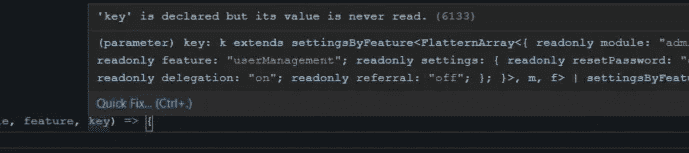
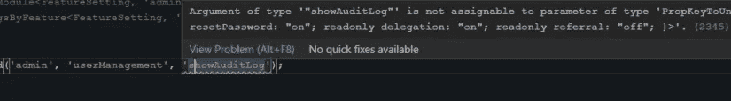

# 应用 TypeScript 高级类型的真实示例

> 原文：<https://levelup.gitconnected.com/achieve-type-safety-with-typescript-magic-fef5ff939c98>

## 探索 TypeScript 高级类型的强大功能


[拉明·卡](https://unsplash.com/@raaminka?utm_source=unsplash&utm_medium=referral&utm_content=creditCopyText)在 [Unsplash](https://unsplash.com/collections/pPAmn-uII_E/magician?utm_source=unsplash&utm_medium=referral&utm_content=creditCopyText) 上的照片

TypeScript 高级类型功能强大。这些包括条件类型、泛型、联合类型、分布条件类型和类型推断。它是一个复杂的工具箱，具有许多功能，并且在不断发展。

当我学习 TypeScript 时，我发现许多例子要么是琐碎的，要么是做作的。从这些例子中，很难联想到高级类型的实际应用。本文将讨论一个使用高级类型的实际例子。

## 问题是

我们正在重构现有的节点应用程序。在应用程序中，各种功能都有一个配置常量。示例配置如下所示。

此常量的目的是提供功能切换。“设置”中的每个设置项代表一个可以打开/关闭的功能。

下面的函数用于应用程序中的每个组件。它用于确定可配置功能是否启用。

```
function isFuncEnabled(module:string, feature:string, functionkey: string) {}
```

显然，它不是类型安全的。不正确的参数可能会被传递到函数中，从而导致运行时错误。即使参数编码正确，也很难维护。比方说，当现有设置被重命名时，开发人员可能不记得相应地更新参数。

我们的目标是为函数参数创建一个强类型。

## 快速解

使函数参数成为强类型的最快方法是使用联合类型。如下所示，我们创建了 3 个新的联合类型来表示模块、特性和功能键。

这个解决方案优于现有的代码。所有 3 个参数都被限制为它们自己的一组值。但还不理想。我们还有两个问题:

*   3 个联合类型中的值与`FeatureConfig`常量重复。如果我们添加或删除一个设置项，那么新创建的联合类型将会过时。
*   参数之间没有约束。我们可能在他们之间有一个不匹配。

更好的方法是重构代码，使用高级类型约束参数。

## 改进的解决方案

首先，我们将[常量断言表达式](https://mariusschulz.com/blog/const-assertions-in-literal-expressions-in-typescript#:~:text=A%20const%20assertion%20is%20a%20special%20type%20assertion%20that%20uses,literal%20expression%20will%20be%20widened.&text=Array%20literals%20will%20become%20readonly%20tuples.)应用于源常量。它使常量属性成为字符串文字类型。因此，我们可以在此基础上使用其他类型转换。

```
export const FeatureConfig = { ... } **as const**;
```

我们还在下面创建了两个类型助手。它们用于将类型属性值/键转换为联合类型。

有了这两个类型帮助器，我们可以将原始 FeatureConfig 类型转换为 flatten 类型。我们想要达到的目标如下。

```
{
    readonly module: "order";
    readonly feature: "orderApproval";
    readonly settings: "emailNotification" | "showAuditLog";
 };
```

## 分配条件类型

我们使用分布式条件类型创建了 FlatternArray 类型。分布式意味着编译器将对联合的所有成员逐一应用运算。在这种类型中，它应用于 t 的每个键。

当我们应用 FlatternArray 时，TypeScript 编译器实际做的是:

```
type FeatureSetting = FlatternArray<{
    readonly module: "admin";
    readonly feature: "userManagement";
    readonly settings: {
        readonly resetPassword: "on";
        readonly delegation: "on";
        readonly referral: "off";
    };
}> | FlatternArray<{
    readonly module: "order";
    readonly feature: "orderApproval";
    readonly settings: {
        readonly emailNotification: "on";
        readonly showAuditLog: "on";
    };
}>>
```

## 参数类型

现在，我们可以为每个参数实现一个类型。分别是“*模块*”、“*特性 by 模块*”和“*设置 by 特性*”。对于后两种情况，先前键入的参数作为泛型传入。我们使用条件类型缩小了这两种类型的范围。

## 把它们放在一起

最后，我们可以将上述参数类型应用于函数类型“getFeatureSettingType”。通过用新的函数类型注释我们的函数，TypeScript 编译器能够将参数*模块、特征、*和*键*推断为类型 *m、f、k* 。

如果将鼠标悬停在参数上，可以看到如下类型。



强类型关键参数

让我们看看新重构的代码有什么好处。

*   **简洁的类型约束**。当我们现在传入一个不匹配的参数时，编译器会显示一个友好的错误信息。



*   **真理的单一来源**。如果源常量有变化，变化将自动更新到参数类型！

这里是[完整的样本代码](https://gist.github.com/sunnyy02/d3cb1c814fcd4f3a28546a883d90aec1)供你参考。

## 摘要

在本文中，我们将介绍一个使用高级类型的真实重构示例。结果是一个简洁且约束良好的类型。对源常量的任何更改都会触发下游类型的自动更新。我们实现了 TypeScript 的主要目标:类型安全。

如果你喜欢这篇文章，你可能也会喜欢我的其他打字稿。

感谢阅读！