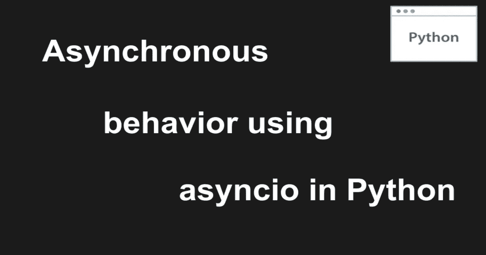

# 在 Python 中使用 asyncio 实现异步行为

> 原文：<https://levelup.gitconnected.com/achieving-asynchronous-behavior-using-asyncio-in-python-e09153defbd9>



自从我上次发表关于使用 celery 在 Python 中处理长时间运行的异步任务的文章以来，发生了很多变化。上次我们用它来运行一些异步任务，从一些服务[中获取数据，大约需要 1-5 分钟](https://ranvir.xyz/blog/using-celery-to-run-long-running-task-asynchronously)。

尽管我仍将使用 celery 来处理这些类型的长时间运行的任务，但是有一部分任务更适合在执行线程内部处理。今天我们将讨论处理这种操作的方法。

对于认识我的人来说，一年前我换了一个新的角色，这让我可以编写 Node.js，从那以后我一直在从事这项工作。在我使用它工作和构建 API 的过程中，我开始喜欢 Node 处理[异步行为和长期运行任务](https://ranvir.xyz/blog/basic-introduction-to-node.js-async-await)的方式。

这个想法很简单，如果任务正在等待 IO，我们可以同时运行其他任务。只有需要它的部分，才会等待它。

我想在 Python 中使用同样的概念。

幸运的是，在 Python 版本`3.4`中，他们为了同样的目的引入了`asyncio`。在这篇文章中，我们将谈一点，并试图理解它的重要性。

在这篇文章的结尾，你将能够理解异步函数的重要性，并且能够开始在你的代码库中使用它们。

# 先决条件

我在本教程中使用了`Python 3.8`,你可能也想使用它来运行和测试例子。你也可以在网上试试。

# Python 中的基本异步函数

这就是我们如何用 Python 写一个基本的异步函数。

```
import asyncioasync def func1(a):
    print(f"started func 1: {a + 1}")
    await asyncio.sleep(1)
    return a + 1asyncio.run(func1(1))
```

**响应**

```
started func 1: 2
2
```

你必须从导入`asyncio`模块开始。异步函数的定义就像普通函数一样，你只需要添加关键字`async`。如果你想等待某个[协程](https://docs.python.org/3/library/asyncio-task.html#coroutines)的执行，你必须使用关键字`await`。最后，您可以使用`asyncio.run`方法运行该函数。

> *无论何时在异步函数中使用 await 关键字，线程都不会向前移动，直到我们从被调用的函数得到响应。*

这个简单的实现不会帮助您理解使用异步函数的优势。在下一节中，我们将讨论执行所用的时间，在那里您将真正开始看到差异。

# 完全执行所用的时间

为了理解使用`async`函数的好处，我们将比较在`async`和`sync`行为中运行相同代码所花费的时间。

让我们首先编写异步代码。

```
import asyncio
import time
start = time.time()async def async_sleep():
    await asyncio.sleep(1)async def func1(a):
    print(f"started func 1: {a + 1}")
    await async_sleep()
    return a + 1async def func2(a):
    print(f"started func 2: {a + 2}")
    await async_sleep()
    return a + 2async def func3(a):
    print(f"started func 3: {a + 3}")
    await async_sleep()
    return a + 3async def func4(a):
    print(f"started func 4: {a + 4}")
    await async_sleep()
    return a + 4async def main():
    tasks = (func1(1), func2(1), func3(1), func4(1))
    await asyncio.gather(*tasks)
    print(f"Completed after: {time.time() - start}")asyncio.run(main())
```

我定义了 4 个不同的函数做几乎相同的事情。让我们假设有一个名为`async_sleep`的长期运行的函数正在进行一些 IO 操作。例如:从数据库中获取数据。

> `*asyncio.gather()*` *用于并发运行传递给它的任务。*

运行这段代码后的响应如下。

```
started func 1: 2
started func 2: 3
started func 3: 4
started func 4: 5
Completed after: 1.1852593421936035
```

对于每次执行，该函数大约在 1-2 秒内完成执行。(运行 5 次以进行检查)。

现在让我们试着运行相同代码的`sync`版本。

```
import time
start = time.time()def sync_sleep():
    time.sleep(1)def func1(a):
    print(f"started func 1: {a + 1}")
    sync_sleep()
    return a + 1def func2(a):
    print(f"started func 2: {a + 2}")
    sync_sleep()
    return a + 2def func3(a):
    print(f"started func 3: {a + 3}")
    sync_sleep()
    return a + 3def func4(a):
    print(f"started func 4: {a + 4}")
    sync_sleep()
    return a + 4def main():
    func1(1)
    func2(1)
    func3(1)
    func4(1)
    print(f"Completed after: {time.time() - start}")main()
```

执行此操作后，我们得到的回应是:

```
started func 1: 2
started func 2: 3
started func 3: 4
started func 4: 5
Completed after: 4.168870687484741
```

这为我们执行 4 个功能节省了`~3`秒。现在，如果我们想运行 10000 个这样的函数，我们可以节省`~2000`秒/即`35-40`分钟。

太棒了，对吧。

即使我们在每次迭代中只运行 2-3 个这样的函数，这些小的节省对于为您的客户提供更好的用户体验也是非常重要的。

既然我们已经理解了使用`async`函数的优点，我们必须知道更多关于它的事情。

# 异步函数的执行顺序

我们应该明白，在异步模式下运行函数时，我们并不真正知道函数执行的顺序。让我们用一个例子来理解这个概念。

一旦执行完成，函数就会返回。我们可以通过使用`random.randint(0, 10) * 0.1`在 0 和 1 之间随机休眠一段时间来模拟不同的执行时间。

这是完整的代码。

```
import asyncio
import time
import random
start = time.time()def random_sleep_time():
    return random.randint(0, 10) * 0.1async def async_sleep():
    await asyncio.sleep(random_sleep_time())async def func1(a):
    await async_sleep()
    print(f"completed func {a}: {a + 1}")
    return a + 1async def main():
    tasks = [func1(a) for a in range(0, 5)]
    await asyncio.gather(*tasks)
    print(f"Completed after: {time.time() - start}")asyncio.run(main())
```

对以下代码的响应是，

```
completed func 0: 1
completed func 3: 4
completed func 1: 2
completed func 2: 3
completed func 4: 5
Completed after: 0.9764895439147949
```

# 实际用法

Python 3.8 发布后，将`asyncio.run()`方法移到了稳定的 API，您可以开始使用它，没有任何问题。

从`synchronous`方法转移到异步方法的唯一问题是改变思考问题的方式。你必须改变你对每一个小细节的思考方式。相信我，一旦你开始考虑异步函数，你会爱上它的。

# 它是如何在引擎盖下工作的？

让我们检查异步函数的类型。

```
type(main())# <class 'coroutine'>
```

因此，异步函数的类型是`coroutine`。

这篇 [GeeksForGeeks 文章](https://www.geeksforgeeks.org/coroutine-in-python/)很好地解释了协程。

总结一下他们在文章中写的内容，**子程序**是一组有一个入口点并连续执行的指令。

另一方面，**协程**可以暂停或放弃对其他协程的控制，允许多个任务同时运行。

Python 使用这个概念来支持异步行为。

# 处理异步函数中的超时

必须有一个等待任务完成的超时。我们不应该永远等待它完成。`asyncio`还提供了向异步函数添加超时的能力，这样您可以在它完成之前跳过执行。

这种情况的一个实际应用是，当您在应用程序中调用第三方 API 时，第三方本身就关闭了。那样的话，你不会想等很久的。

你可以用`timeout`方法来解决你的问题。

参见代码示例:

```
async def async_sleep():
    await asyncio.sleep(2)
    print('Execution completed')async def main():
    try:
        await asyncio.wait_for(async_sleep(), timeout=1.0)
    except asyncio.TimeoutError:
        print('Timeout error')asyncio.run(main())
```

如果在给定的`timeout`被传递之前协程没有返回，异步函数将引发`TimeoutError`。执行上述代码后的响应是

```
Timeout error
```

`asyncio`模块里还有其他牛逼的方法。你可以在 [python 官网](https://docs.python.org/3/library/asyncio-task.html)查看。

# 结论

如果你想为你的用户提供更好更快的体验，你可以开始在你的应用中使用`asyncio`模块。这肯定会帮助您找到可以减少 API 或您正在做的任何事情的执行时间的情况。

只要强迫自己这样写几个月，就能在未来获得巨大回报。

*原载于 2020 年 8 月 30 日*[*https://ran vir . XYZ*](https://ranvir.xyz/blog/asynchronous-behaviour-using-asyncio-in-python/)*。*

# 分级编码

感谢您成为我们社区的一员！ [**订阅我们的 YouTube 频道**](https://www.youtube.com/channel/UC3v9kBR_ab4UHXXdknz8Fbg?sub_confirmation=1) 或者加入 [**Skilled.dev 编码面试课程**](https://skilled.dev/) 。

[](https://skilled.dev) [## 编写面试问题

### 掌握编码面试的过程

技术开发](https://skilled.dev)