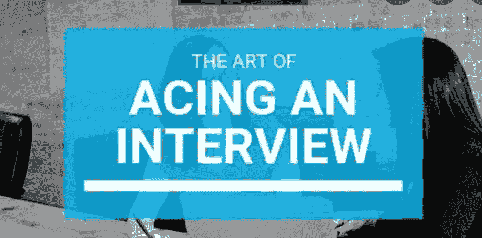
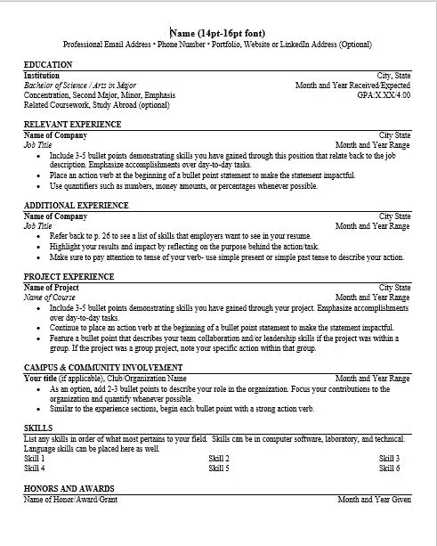
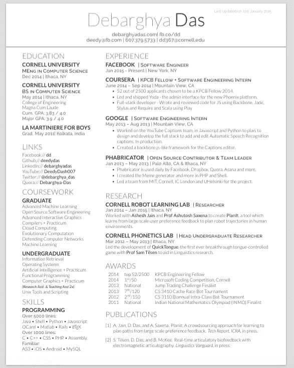

# 面试中脱颖而出

> 原文：<https://levelup.gitconnected.com/acing-the-interviews-8d2c77263397>

在这篇文章中，我将讨论我的经历和我从过去的面试经历中学到的东西。

我还将讨论整个招聘过程，申请校外活动的方法，面试的重要话题，我如何解决这些问题，以及一些学习资源。

## 我的介绍

我是一名四年级本科生，在 IET DAVV 印多尔大学攻读计算机工程学士学位。我从第一年年末开始编码和学习其他技术，学习仍在进行中。我收到了 Atlassian、VMware 和 Groww 等公司的邀请。

我将分别讨论招聘流程的不同步骤，其中包括:
***a)申请流程
b)简历入围
c)编码评估
d)面试流程***
- *编码
-理论科目
-系统设计/项目讨论
-简历相关
-谜题
-HR*

最后，面试的一些小技巧。

## 应用进程

申请过程是申请公司的第一步。你可以通过不同的方式申请，也可以通过不同的方式被公司聘用。

作为一名本科生，你可以申请来到你的校园的校内机会。但是对于校外申请，下面列出了一些方法:

***a)编码挑战***
这家公司以编码挑战的分数给出面试电话，简历入围一般不在。Ex- Juspay 招聘挑战，沃尔玛编码挑战，劳氏编码挑战。

b)黑客马拉松
公司也通过黑客马拉松招聘员工。首先是创意选择，然后是原型阶段，然后是创意提交。如果候选人的想法被选中，他们会接到面试电话。前 myntra 黑客 ramp，沃尔玛黑客马拉松，美国运通黑客马拉松。

不同的公司每年都有不同的招聘计划。这些项目的招聘流程取决于公司。前微软 engage，优步 hacktag，flipGrid。

d)通过职业门户网站申请
科技公司会在他们的职业网站上更新招聘信息。建议使用推荐申请这些工作 id。否则，收到测试链接的机会相对较低。

通过招聘人员
我们可以在 LinkedIn 上联系招聘人员，然后把你的简历发给他们。如果他们会喜欢，他们会给你一个面试电话。
注意:这种方法通常对申请大科技公司的新生不起作用。因为大的科技公司只有在有空缺的时候才会雇佣新人。但对于初创企业来说，通过招聘人员申请将会奏效。

## 简历入围

水平格式简历

网格格式简历

简历入围通常不会发生在基于黑客马拉松和基于编码挑战的招聘中。但是对于其余的情况，已经完成了。要获得推荐，你还需要一份好的简历。一份好的简历需要具备以下几点:

有两种主要的格式来制作你的简历，即横排和横排格式。简历只能是黑色或蓝色的。
*简历中不得有任何照片。
*字体大小、字体样式和间距应处处均匀。

**b)项目和成果**
*成果应写在突出主要文字的要点中。
*关于项目的描述应清晰、易懂，并以要点的形式适当提及所使用的技术。
*托管项目的链接应该与项目一起出现。
*应提及所有编码网站和 github 的链接，链接可点击。

**c)实习**
*实习中完成的任务要用适当的高亮来适当解释。

## 编码评估

在线编码评估发生在你申请和你的简历入围之后。评估的测试链接被发送到邮件 id。
编码评估一般发生在 Hackerrank、Hackerearth、Mettl、Codility、Coderbyte、Codesignal 等平台上。
这些评估持续时间为 1 小时 30 分钟至 3 小时。这些可以由以下部分组成:-
a)编码问题
b)智能
c)伪代码
d)特定语言 mcq(c++、C、Java、python)
e) DBMS 和 Mysql
f)操作系统
g) OOP

有时但很少是像这样的部分:a)计算机网络 b)测试和 SDLC 生命周期 c)英语理解 d)Linux e)计算机体系结构

## 面试过程

面试过程是任何招聘过程的最后一个阶段。重要的是要明白，面试不仅取决于知识和技能，还取决于你如何向面试官传达你的思维过程。以及你的自信程度。如果面试官不相信你试图解释的东西或你的思维过程，那么他/她不会选择你。

面试中可以问不同的话题，包括:

**a)编码**

在编码阶段，主要关注的是测试解决问题的技能。这一轮一般问中等水平的 Leetcode 问题。可以通过在 Leetcode 或 GFG 上练习问题来为这一轮做准备。

编码回合的提示:
a)讨论边缘案例
b)讨论约束
c)与面试官分享你的思维过程
d)改进代码写作风格

**b)理论科目**

这一轮的问题可能包括面向对象编程(OOPs)、数据库管理系统(DBMS)、操作系统(OS)和计算机网络(CN)等主题。

问题也可能来自测试、SDLC 方法和敏捷等主题(但非常非常少)。

在这里，我提供一些资源来准备我使用的这些主题。

> *b . 1)*OOP
> **教程**
> [https://www.youtube.com/playlist?list = pl V8 viytidsnzs 5 YC 9 gt 70 ddab _ EYE2E _ 4](https://www.youtube.com/playlist?list=PLV8vIYTIdSnZS5yc9gt70dDaB_EYE2E_4)
> **为论**
> [https://beginnersbook.com/2017/08/cpp-oops-concepts/](https://beginnersbook.com/2017/08/cpp-oops-concepts/)(Java oops 也可用)
> **备注**
> [https://www . LinkedIn . com/posts/arpit-Singh-83a 369159 _ 面向对象编程-ugcPost-68394501756148577](https://www.linkedin.com/posts/arpit-singh-83a369159_object-oriented-programming-ugcPost-6839450175614857216-AxZ7)
> 
> *b.2)数据库管理系统*
> [https://youtube.com/playlist?list = plxczcowd 7 aifan 6 i8 cuvibucdjgiokt 2y](https://youtube.com/playlist?list=PLxCzCOWd7aiFAN6I8CuViBuCdJgiOkT2Y)
> *b . 3)OS*
> [https://youtube.com/playlist?list = plxczcowd 7 aigz 9 don hrre 9 i3 mwn 6 xdp 8 p](https://youtube.com/playlist?list=PLxCzCOWd7aiGz9donHRrE9I3Mwn6XdP8p)
> *b . 4)CN*
> [https://youtube.com/playlist?list = plxczcowd 7 aigfbd 2-2 jocpvolurdlvv _](https://youtube.com/playlist?list=PLxCzCOWd7aiGFBD2-2joCpWOLUrDLvVV_)

重要问题:[https://docs.google.com/document/u/1/d/1sQlRDw6-hwyxefl 7 B4 kbs og-tz 7 rxmbwnnfvjera 4/mobile basic](https://docs.google.com/document/u/1/d/1sQlRDw6--HwyxeFL7b4kBsOG-Tz7rXMbpWNnfvJErA4/mobilebasic)
注:也可以从 INTERVIEW BIT 和 GEEKS FOR GEEKS 学习面试问题，进行最后时刻的修改。这将有助于你快速构思你的答案。

c)系统设计/项目讨论

系统设计有两种类型，即高层设计(HLD)和低层设计(LLD)。这一轮你可以朝着你想要的方向去面试。所以，在讨论中只提及那些你有信心的话题。

系统设计可以通过 Gaurav Sen 系统设计系列和 https://youtube.com/playlist? educative . io
Link-[学习 list = plmcxhnjxntnvo 6 alsjvkgxv-vh6 epyvox](https://youtube.com/playlist?list=PLMCXHnjXnTnvo6alSjVkgxV-VH6EPyvoX)

**d)简历相关**

除了你的技能和项目，你的爱好和成就也可以在简历中讨论。

**e)拼图**

谜题可以用来测试你的逻辑能力。你可以在 GFG 练习拼图。
链接-[https://www.geeksforgeeks.org/puzzles/](https://www.geeksforgeeks.org/puzzles/)

**f) HR**

一般这一轮问的都是情境型的问题。这一轮主要重点是考验一个人的软技能。
还询问了与时间管理、团队工作相关的问题。

## 让自己了解校外驱动器最新信息的资源

*   a)阿尔什·戈亚尔
    b)在线学习
*   a)阿尔什·戈亚尔
    b)拉胡尔·夏尔马
    c)贾迪普·普拉萨德
    d)迪潘舒·贾恩

## 面试的一些小技巧

无论何时接到面试电话，一定要阅读该公司的其他面试经验，做好公司层面的准备。采访经验来源:GFG 档案馆，玻璃门。2)提前 5-10 分钟参加面试电话会议 3)面带微笑，充满自信 4)如果你不知道某件事，那就委婉地告诉面试官，并试着说出与该话题相关的内容。如果有人问了什么，不要急于得到答案。慢慢来，构思你的想法，然后开始解释。把面试当成展示你知识的平台，而不是考试。如果你在解释某件事，那么就把面试官当成一个不知道这件事的学生。这将有助于你更好地解释。当面试过程是多轮的时候，把你的手机放在身边，并不断查看邮件。因此，如果下一轮得到安排，你不会错过它。

> 谢谢大家！！如果这对你有所帮助，请一定要鼓掌，任何评论都将受到感谢。祝未来的努力一切顺利。

作者:里蒂·内玛

领英:[https://www.linkedin.com/in/riti-nema-707b1719b](https://www.linkedin.com/in/riti-nema-707b1719b)