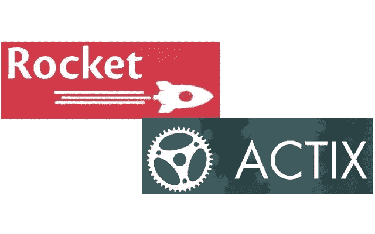
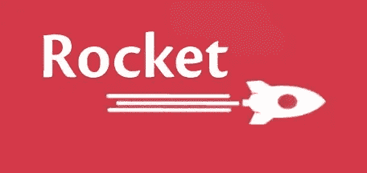
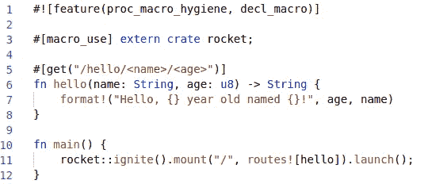
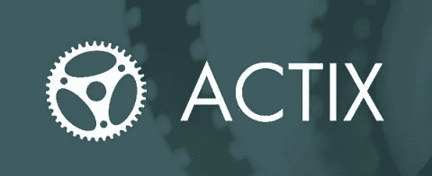
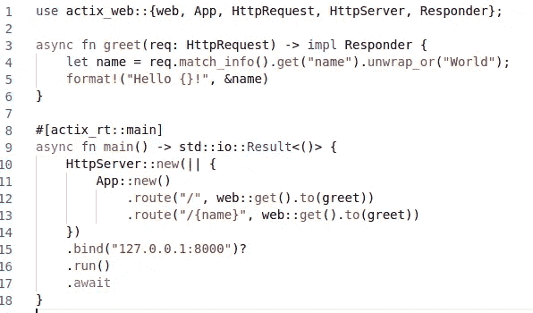

# Actix 还是 Rocket？比较两个强大的 Rust Web 框架

> 原文：<https://levelup.gitconnected.com/actix-or-rocket-comparing-two-powerful-rust-web-frameworks-114a3540f0b3>



# 首先，什么是 web 框架？

在深入比较 Rust 的两个令人惊叹的框架之前，让我们先理清一下关于 web 框架的总体思路。

在创建像 web 服务、web 资源和 web APIs 这样的 web 应用程序之前，我们需要一个框架来支持这些应用程序的开发。框架是工具、助手和库的组合，提供了一种有效构建、测试和运行应用程序的方法。通过使用框架，我们可以为 web 应用的创建和部署制定一套标准的规则。和自动化与 web 开发中执行的常见活动相关的开销。

## 现在，让我们跳到 Rust web 框架上。

Rust 支持几种 web 开发框架，如下所示:

1.  火箭
2.  Actix
3.  弯曲
4.  紫杉
5.  镍
6.  哥谭市
7.  熨斗

所有这些都有自己的优缺点，然而，Rocket 和 Actix 由于其完整性而成为最受欢迎的两个。我们分别讨论一下 Rocket 和 Actix 的利弊:

# 火箭



Rocket 是 Rust 可用的最成熟的框架之一。通过使用 Rocket，您可以编写快速且安全的 web 应用程序，而不会影响速度、可用性和灵活性。

使用它的[文档](https://rocket.rs/v0.4/guide/)可以了解更多关于 Rocket 的信息。

## **优点:**

*   易于使用——Rust 的代码生成工具被广泛用于提供一个干净的 API
*   查询字符串—使用 Rocket 处理查询字符串和参数轻而易举
*   流—大小不是问题，因为 Rocket 流式传输所有传入和传出的数据
*   模板——Rocket 有一个内置的模板支持
*   可扩展——你可以很容易地创建自己的原语，因此任何 Rocket 应用程序都可以使用它们
*   类型安全—它对路由 URL 进行类型检查，即确保类型错误保持在最低限度
*   没有样板文件——不需要样板代码，使用 Rust 的代码生成工具可以轻松提供一个干净的 API
*   测试库——使用内置的测试库，它可以轻松地在您的应用程序上运行单元测试
*   配置环境—您可以按照自己的方式为开发、试运行和生产配置您的应用程序
*   Cookies —轻松查看、添加和删除 Cookies，加密或不加密
*   API 调用——现成的 JSON 支持。通过派生`Deserialize`或`Serialize`，您可以分别接收或返回 JSON。
*   表单处理——简单的表单处理，通过它过滤掉不好的表单请求，这样你的代码就不会崩溃。通过为你的结构导出`FromForm`，你可以让 Rocket 知道使用哪个参数。然后，它将解析和验证表单请求，创建结构，然后调用您的函数

## CONS:

*   夜间——它唯一的缺点是只对 Rust 的夜间版本有效。

## 代码示例:

下面是一个简单的 Hello，World！让您开始使用 Rocket 的代码:



如果我们转到[http://localhost:8000/hello/Sidra/26](http://localhost:8000/hello/Sidra/26)，您将收到以下输出:

```
Hello, 26 year old named Sidra!
```

# Actix



Actix 是一个服务器呈现的框架，这意味着当用户请求页面时，构建和服务应用程序的过程都将来自服务器。该架构基于 [Rust 非常强大的演员系统](https://docs.rs/axiom/0.2.1/axiom/#:~:text=Getting%20Started,actors%20for%20all%20processing%20activities.&text=An%20actor%20can%20be%20interacted,process%20a%20message%20only%20once.)。它非常适合编写逻辑难度更高的服务。

为了帮助您开始，它有一个 boiler plate 代码，可以帮助您快速入门，或者对于构建一个简单的应用程序来说有些令人难以招架。这是一个非常棒的框架，有非常好的[文档](https://actix.rs/docs/)，即使是最新手的开发者也可以使用。

## 优点:

*   类型安全——就像 Rocket 一样，Actix 提供类型安全并确保类型错误最小化
*   惊人的快——由于它强大的演员系统，它以惊人的速度工作
*   功能丰富 WebSockets、HTTP/2、管道、日志等功能。都是现成的。
*   可扩展——您可以创建自己的库，任何 Actix 应用程序都可以使用

## CONS:

迄今为止，它没有任何缺点。

## 代码示例:

下面是一个简单的 Hello，World！让您开始使用 Actix 的代码:



转到 [http://localhost:8000/](http://localhost:8000/) ，您将看到以下输出:

```
Hello World!
```

转到[http://localhost:8000/](http://localhost:8000/)name，您将看到:

```
Hello name!
```

# 结论:

通过这篇文章，您可能还没有得出这两个 Rust web 框架哪一个更好的结论，但是，您现在已经知道这两个框架的目标是什么，以及它们如何试图实现它。使用 Rocket 还是 Actix 完全取决于你自己的偏好以及你打算构建什么样的应用程序。