# Akka 演员模型系统。网

> 原文：<https://levelup.gitconnected.com/actor-model-system-with-akka-net-e86fac9743be>

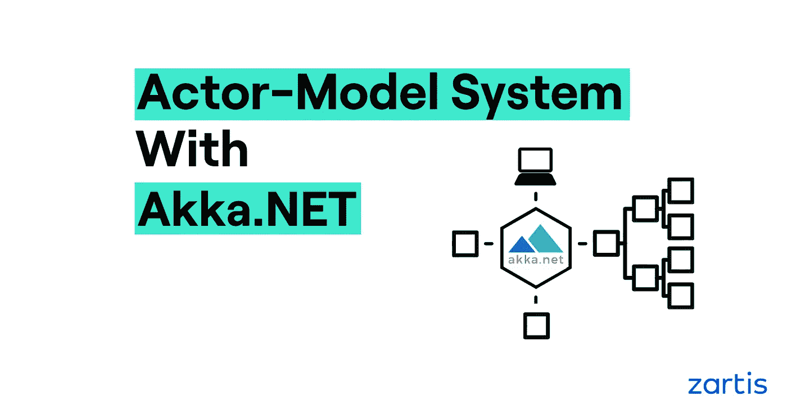

## 如何使用 Akka 实现演员模型系统和处理并发性？网

在这篇文章中，我们将看看演员模型系统。

我们将从解释什么是演员和它能做什么开始。然后，讨论将进入演员模型系统的历史，它们与竞争对手的解决方案有何不同，以及一些可能非常适合这种模型的潜在场景。

我们还将回顾一个特定的演员系统，Akka.NET，并检查演员之间的层次和沟通——也许是演员系统的两个最重要的方面。

# 演员模式是什么？

所谓的 actor 模型是一个并发计算的数学模型，它在 1973 年作为一个理论概念首次进入技术领域。它通过制定系统组件(称为参与者)在并发计算环境中应该如何交互的一般准则来运行。actor 模型的两个最著名的实现是 Akka 和 Erlang。

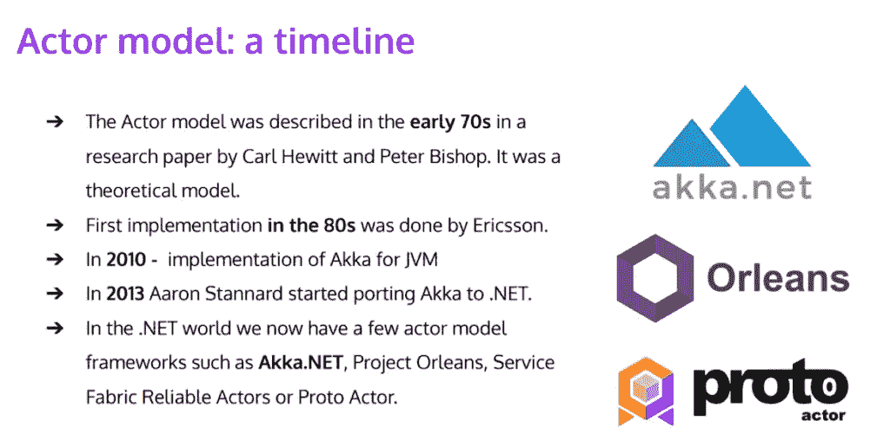

在编写并发和分布式系统时，actor 模型允许更高层次的抽象。它使开发人员不必处理显式锁定和线程管理，从而更容易编写并发和并行系统。

# 为什么是阿卡。网？

此时，您可能想知道我们是否首先需要另一个并发模型。没有。NET 已经有了自己的并发线程模型？

不完全是。你看，在。网络世界很有挑战性。它需要多线程代码，这很难编写、测试和调试。

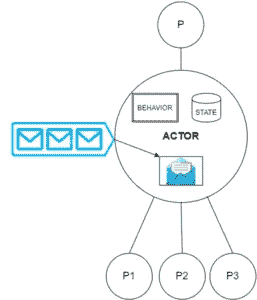

actor 模型的优点之一是它的通用原语是 actor。为了实现并发性，您至少需要几个相互通信的参与者。

你可以把一个演员想象成记忆中的一个对象——但是要记住，它不同于你可能想到的通常的对象。像每个对象一样，参与者也有状态和行为。然而，让它与众不同的是它的邮箱，这是与演员交流的唯一方式。例如，除了向邮箱发送消息并触发消息返回给您之外，没有其他方法可以读取参与者状态。

这里需要注意的是，每个参与者一次只能处理一条消息。如果你看一下左边的图片，你会看到当邮箱中有几个消息时，参与者会一个接一个地处理它们。

乍一看，这种设置可能会让你觉得很奇怪。一次只处理一条消息难道不违背并发系统的概念吗？

不完全是。

Actor 系统通过在尽可能多和尽可能小的 actor 之间分配工作来实现有效的并发。在上图中，您可以看到该演员有一个父演员和子演员 P1、P2 和 P3。系统中的每个参与者都可以创建多个子参与者，以便更有效地分配工作。

# 演员能为你的系统做什么？

除了创建子执行元，执行元还处理来自邮箱的消息。对于收到的每条消息，参与者必须决定是否:

*   更新内部状态
*   执行特定的操作，比如通过 API 进行外部通信、写入数据库或发送 HTTP 请求
*   向不同的演员发送新消息
*   回复发件人 0 次或更多次

# 什么是演员制度？

简单来说，演员系统就是演员生活的地方。就 Akka.NET 而言，框架提供了行为者系统。

您可以使用执行元系统来管理以下事项:

*   演员生命周期
*   信息发送
*   收件箱

从开发的角度来看，拥有一个透明且易于跟踪的 actor 系统是件好事，因为这有助于在以后尝试诊断问题时节省时间。

让我们考虑一个实际的例子。在下面的截图中，您可以看到使用 Akka.NET 创建的酒店房间预订的预订执行元。actor 是 C# class，它继承自框架提供的一个类:

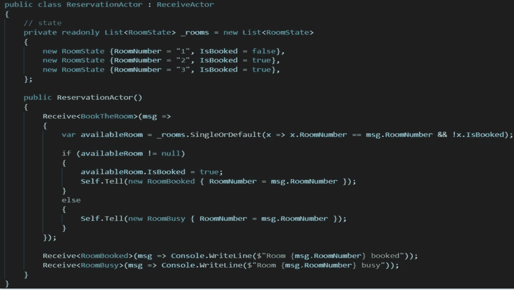

本例中的参与者是接收参与者，这意味着您必须定义它将处理什么类型的消息。

如您所见，参与者将收到三种类型的消息:

*   *预定房间*
*   *客房预订*
*   *RoomBusy*

要定义这些，需要在 actor 类的构造函数中调用 Receive it is *typed method)* 。模板参数决定了参与者将处理的消息类型。作为参数，Receive 接受一个函数，该函数反过来定义当有特定类型的传入消息时会发生什么。

请注意，当一个参与者收到一个没有定义函数的消息时，该消息将被忽略。例如，如果参与者收到 A 类消息，它将忽略它。

上面的例子也有助于展示参与者如何处理并发问题。

想象一下，两个人试图同时预订同一个房间。在我们的例子中，我们可以通过同时为房间 1 发送两条 *BookTheRoom* 消息来实现这一点。消息将在邮箱中排队，预订角色将逐个处理它们。例如，这样就不需要担心使用互斥锁来锁定参与者的共享状态。

# 如何在 Akka 打造演员体系？网

为了创建一个 actor 系统，我们在 *ActorSystem* 类上调用静态方法。框架提供了 *ActorSystem* 类。为了调用这个方法，您需要传递系统的名称(参见下面的第一行代码)。一旦创建了系统，就可以开始创建参与者了。

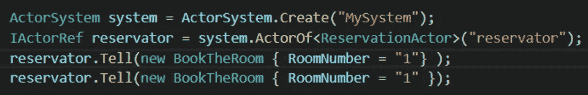

值得一提的是，这个 actor 方法返回的，是一个代理。这是为了确保没有人能够访问 actor 状态。

如上所述，我们可以使用方法向参与者发送消息。消息发送后，将执行中的功能。

接下来，让我们假设示例中的可用房间已经被成功预订。我们现在想发送同样的消息给，比如说，一个付费演员。通过在 reservation actor 中创建子 actor 和队列，我们可以使用*上下文属性*向子 actor 发送消息。要创建子参与者，您总是需要使用框架提供的上下文属性。见下文:

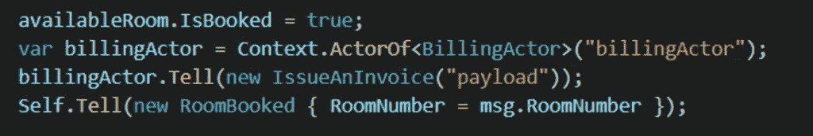

# 演员之间的等级和交流

如前所述，系统中的参与者会形成一个层级。位于层次结构顶端的主要参与者由框架提供。在这种情况下，框架是 Akka.NET。该执行元将成为您可能创建的所有其他执行元的父级。因此，即使您创建了一级参与者，父级仍然是框架提供的主要参与者。

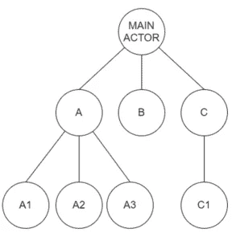

# 演员之间的等级制度

与演员交流有两种方法。

层次结构中的每个参与者都有一个唯一的标识地址。如果某个参与者知道其他参与者各自的地址，它就可以与其他参与者直接通信。

在上图中，如果参与者 A1 知道其地址，则参与者 C1 可以与它通信，即使后者不是参与者 c 的子代

阿卡。NET 提供了位置透明性，这意味着只要知道参与者的地址，他住在哪里并不重要。这很有用，因为它允许您毫无问题地将参与者分布到不同的机器上。

第二种通信方式是使用 actor A 的上下文属性来获得对发送方或父方的访问权。

# 演员之间的交流

演员通过信息交流。那些消息是不可变的 POCO 类。如果您使用我们前面提到的代理，您有两种形式的通信可用。第一种是“使用 Ask 方法的请求-响应”，第二种是“使用 Tell 方法的一次性处理”

一般来说，你应该总是使用 Tell 方法。如果您使用 Ask，您必须等待响应，因为这违背了 Akka 的本质(以及拥有异步 actor 系统的概念)。

# 演员系统内部的监督

有时候，演员会失败。接下来会发生什么，你该怎么办？

每个演员都是所有孩子的监督者。因此，子进程引发的任何错误都将传递给父进程。

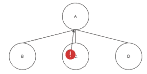

这里有一个例子。左图中，演员 A 是演员 B、C、d 的父演员，子演员提出的每一个问题都会传递给父演员。

在本例中，由参与者 C 引发的错误传递给参与者 A，然后参与者 A 决定如何处理该错误。

阿卡。NET 提供了四种不同的错误处理策略:

1.  继续操作子角色，保持其累积的内部状态。
2.  重新启动子 actor，清除其累积的内部状态。
3.  永久停止童星。
4.  将错误升级到层次结构中的下一个父级，导致失败。

应尽可能避免升级到下一个父参与者。相反，尽可能在接近问题根源的地方解决问题。为了避免在使用 Akka.NET 时升级，您需要在 actors 中覆盖监督策略方法。简单地说，Akka 提供了基类，因此，要改变策略，您必须覆盖该方法。

# Akka 的演员模型扩展。网

## NuGet 包:

阿卡。NET 是作为一组 NuGet 包分发的。

**阿卡。Remote** 是一个 NuGet 包，它允许您将系统中的参与者分布到不同的机器上。这个包的好处在于，从开发者的角度来看，它是 100%透明的。每个参与者都有一个唯一的地址和自己的传输方式，比如 TCP 主机和端口。远程参与者的地址看起来类似于 HTTP 地址。

**阿卡。集群**是一个远程 Akka 扩展，支持弹性伸缩。

**阿卡。Routing** 是另一个有用的包。它允许您创建可以将发送给他们的消息路由给其他参与者的参与者。看看下面的插图。在其中，演员基本上是一个路由器，可以被视为单个演员。然而，这里有多个参与者，路由器在其中分发消息。

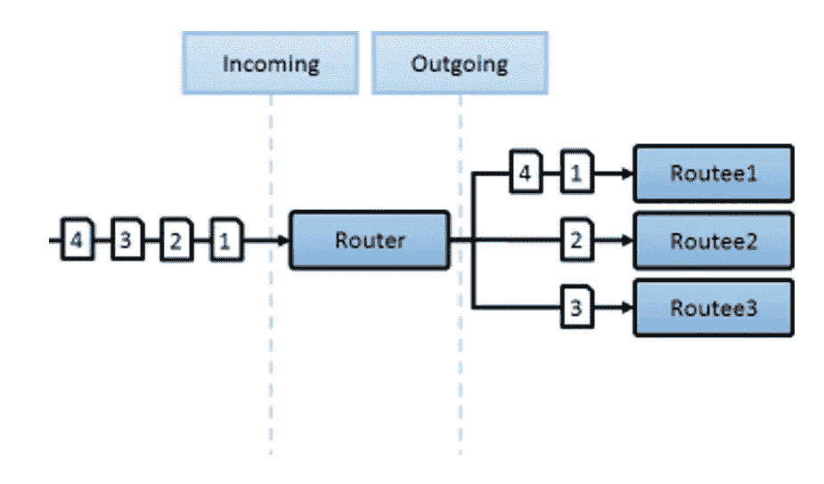

有各种方法来分发消息。例如，您可以实现循环调度，让消息按照没有优先级的循环顺序进行处理。这些消息将相应地分发给三个参与者。

# 一个演员模型系统的例子

假设您的任务是构建一个具有不同类型传感器(如气体、运动或光传感器)的智能家居系统，如下图所示。

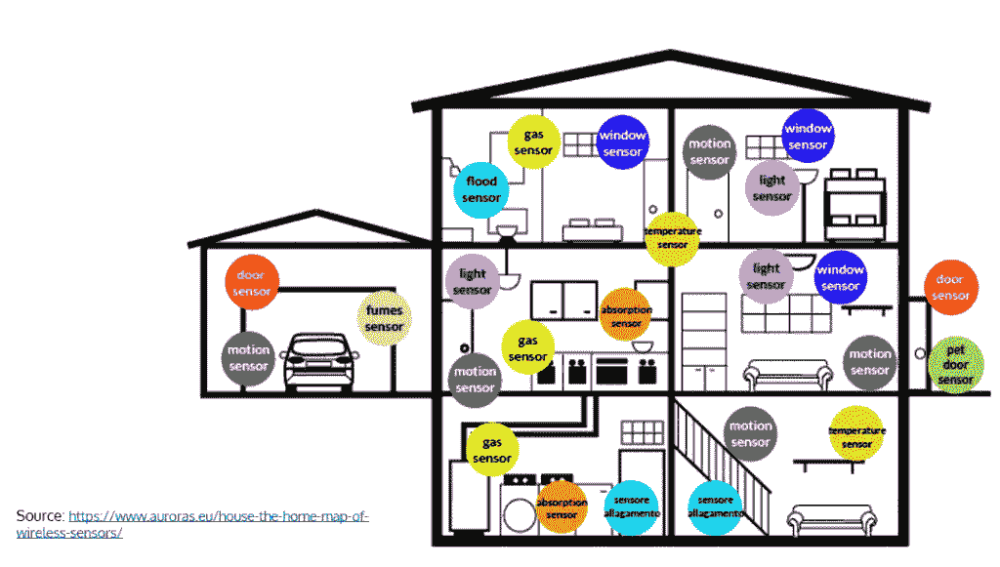

我们称父演员为“豪斯”演员。

构建系统的一种方法是为每个传感器分配一个参与者。每当您命令某个参与者从其对应的物理传感器中读取值时，它就会这样做。参与者可以被视为仅处理一条消息的虚拟对象。你可以称之为 *ReadSensorValue* ，它会将结果发送给家长，也就是众议院演员。

房屋参与者应该能够注册房屋中的新传感器，并处理从传感器收集的结果。它还应该有一个调度器，定期向传感器参与者发送消息 *ReadSensorValue* 。调度程序应该以不同的时间间隔向每种类型的传感器发送消息，因为有些传感器的检查频率可能低于其他传感器。

每个 house actor 还需要一个名为 *CheckSensorValue* 的子 actor。house actor 将从传感器收集的信息转发给 *CheckSensorValue* 以检查这些值是否高于或低于所需的限值。

这是这个模型的层次结构在有多个房子的情况下的样子(但是请记住，为了本文的目的，它已经被简化了):

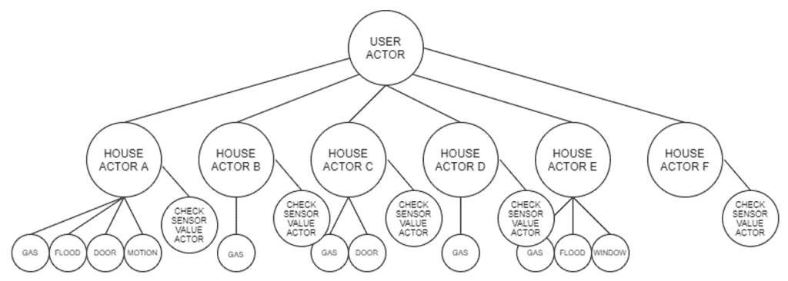

# 演员模型系统的优点和缺点

actor 模型的一个主要优点是，它允许您创建分布式并发系统，而不必求助于典型的。NET 库和机制，如线程、任务、互斥等。

这个模型的锁定功能也非常有用，正如我们在上面的 reservation actor 代码中看到的那样。这使我们能够处理两个人同时试图改变一个参与者的状态的情况，我们不需要使用锁定机制就可以做到这一点。

就测试而言，它可能比传统系统更复杂。尽管 Akka 提供了一个测试框架，但是测试 actor 系统可能仍然比较困难，因为您通常不会为 actor 编写单元测试(练习通常非常简单，并且只定义如何对消息做出反应)。因此，为了测试参与者，您需要创建一个系统并开始发送消息。

创建高质量、健壮的演员模型系统所需的学习曲线也可能是一个缺点。尤其是当你第一次开始时，可能很难想象所有潜在的业务需求，并想出一种方法来将它们转化为 actor 系统。设置本身相当简单，但是创建完美的内部逻辑可能需要一些时间。

然而，一旦掌握了设置和系统设计的诀窍，参与者模型对于非开发人员来说就很容易解释了，从消息流到系统的行为。这有助于提高组织内不同部门之间的集成和透明度。

为了获得最佳结果，我们的建议是构建 actor 系统，其中每个层次或服务都是一个有界上下文，有界上下文使用队列机制相互通信。这将允许您创建专用于业务特定部分的系统，其中不同的有界上下文处理特定的流程。

—

*本文是最初由*[*Mateusz Strycharski*](https://pl.linkedin.com/in/mateusz-strycharski-0542ba46)*[*zart is*](https://www.zartis.com/)*高级工程师主持的一个网络研讨会的摘要。可以在这里* *观看完整录制* [*。*](https://youtu.be/EpQnIEV9K-c)*

*如果你有任何问题或需要更多相关信息，请随时联系。*