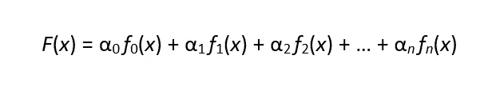
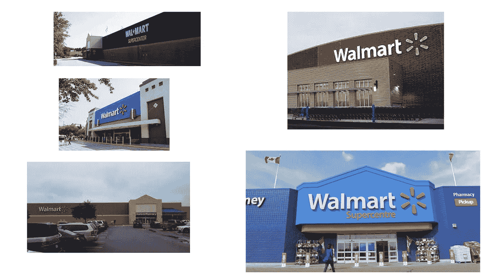
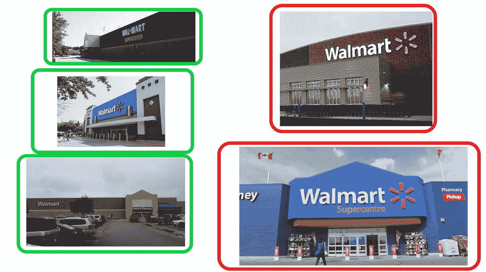
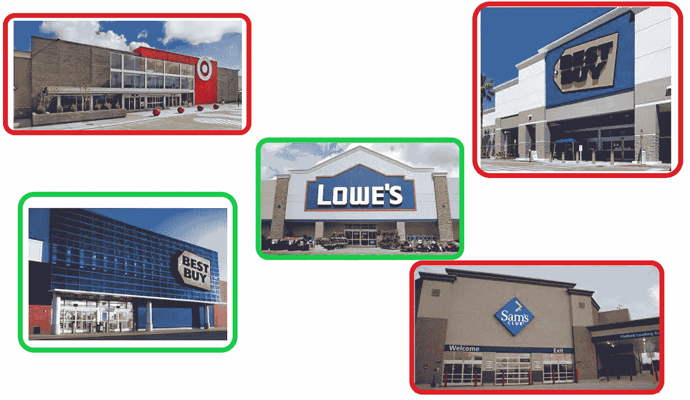
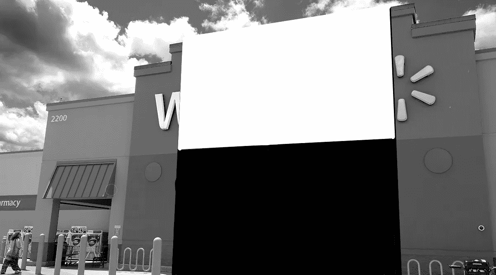
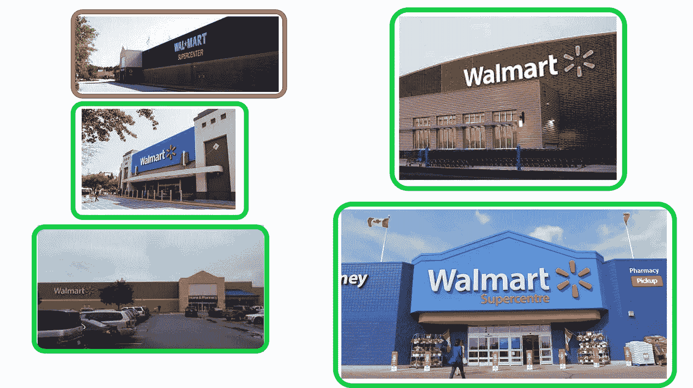

# 图像分类中的 Adaboost

> 原文：<https://levelup.gitconnected.com/adaboost-in-image-classification-8dcc1799e53d>

## 计算机视觉导论，第五部分

图片来源:[SocialPilot.co](https://www.socialpilot.co/blog/worth-boosting-facebook-posts-when-and-how-to)

[上次](/training-day-training-image-classifiers-97825ac4bfde)，我们谈到了训练图像分类器背后的直觉。我们讨论了它与婴儿在发展说话能力时如何学习识别物体并将名称/标签与其联系起来的相似性。然后，我们应用这种直觉来更好地理解 Viola-Jones 算法是如何被训练的。然而，有一件事我们还没有谈到，那就是在这个特殊阶段涉及的数学。让我们简单看一下！如果你害怕，不要太担心。我们只是简单地利用我们已经讨论过的内容，看看算法如何只用数字创建一个训练好的模型！

让我们来看看方程！

这实际上是我们的分类器！是时候分解一下了，这样每个术语对我们来说都有实际意义。 *F* ( *x* )代表分类器本身。又被称为“强量词”，因为它是众多“弱量词”的*和*。每项 *αₙ fₙ* ( *x* )都是一个*弱分类器*。它们被认为是“弱”的，因为它们本身不足以对一幅图像进行分类，但合在一起它们就很强。

*x* 代表输入。在我们的对象检测的情况下，算法试图分类的是当前的图像。

*fₙ* 代表一个特定的类哈尔特征。现在，假设₂代表了一个边缘特征。它不代表图像中的所有边缘特征。根据图像的分辨率，可能有成千上万个不同大小的边缘特征！对它们一视同仁会导致大量的时间浪费和不准确的模型。因此， *f* ₂必定代表图像内的特定边缘特征。

Alpha，写为 *αₙ，*代表关联特征的*权重*。正如我们在上一篇文章中所讨论的，一个特性的“权重”只是表示它有多重要的另一种方式。如果 *α* ₅₉的权重为零( *α* ₅₉ = 0)，那么就意味着 *f* ₅₉在对目标图像进行分类时没有重要性。面部检测算法中的背景就是一个例子。在背景中检测到的大多数(如果不是全部)特征的权重为零，因为背景会随着图片的不同而变化。这是我们在讨论 Adaboost 时将详细阐述的一个关键方面。

下标 *n* 只是表示我们所指的具体特性及其相关权重。它只是为了组织的目的而存在。因为我决定以 *α* ₀ *f* ₀( *x* 作为第一项开始，所以所有的特性都是零索引的(第一项标为“0”，第二项标为“1”，依此类推)。对于不习惯零索引的人来说，只需在你脑海中的数字加 1，你就会知道 *f* ₅₉是算法找到并存储的第 60 个特征。

既然明白了方程，那就来说说 Adaboost 它是什么，它有什么作用，为什么它如此重要！

# adaboost 算法

自适应增强(或 Adaboost)是在 Viola-Jones 算法的创建中使用的另一种优化。记得当我们学习积分图像时，我们谈到了大 O。我们了解到，大 O 是一个计算问题，它表明随着任务复杂性的增加，执行任务所需的时间和资源呈指数增长。因为在一张 24x24 像素的图像中有超过 180，000 个特征，所以我们的等式应该是这样的:

*f*(*x*)=*α*₀*f*₀(*x*)+*α*₁*f*₁(*x*)+*α*₂*f*₂(*x*)+…+*α*₁₇₉,₉₉₉

就像我们上次提到的，如果执行单个特征所需的计算需要 1 毫秒(同样，这非常慢)，那么计算 24x24 像素图像中所有特征的时间将飙升至 6 分钟以上。为了解决这个问题，创建了积分图像，以便可以在很短的时间内评估潜在的 Haar-like 特征。

Adaboost 在我们的等式中扮演了类似的角色。它通过找到目标对象最重要的特征，并从本质上去除其余的特征，进一步降低了图像分类的复杂性。

现在，它是如何“摆脱”不重要的特性的呢？好吧，记住前面提到的任何αₙ = 0 的特性都被认为是不重要的。然后再考虑这个基本的乘法法则: *n* x 0 = 0。因此，我们方程中的任何一项( *αₙ fₙ* ( *x* ))其中 *αₙ =* 0 计算为 0(例如 0 *fₙ* ( *x* ) = 0)并被丢弃！

因此 Adaboost 的目标是更新特定特征的权重，以最大化正确分类目标对象的可能性，同时消除对检测过程没有帮助的 Haar-like 特征。给予分类器更高数量的真阳性(目标图像被分类为“目标”)和真阴性(非目标被分类为“非目标”)的特征接收更大的权重，因为它们更可能是目标对象所独有的。另一方面，导致大量假阳性(分类为“目标”的非目标)和假阴性(分类为“非目标”的目标)的特征接收较小的权重，有可能被分配零权重。

这是一大堆单词和数字，所以让我们看看它的运行情况，并与我们在上一篇文章中开发的直觉联系起来。

# 沃尔玛在哪里？

让我们假设我们正在训练一个可以检测沃尔玛商店的图像分类器。我们在互联网上搜寻不同沃尔玛以及非沃尔玛商店的各种图片，用来训练和测试我们的模型。

图片来源:[TTNews.com](https://www.ttnews.com/articles/walmart-fights-54-million-lawsuit-verdict-awarding-drivers-sleeper-berth-pay)

以上只是训练数据集中沃尔玛的一张图片。下面也只是训练集中非沃尔玛店面的一个样本。

图片来源:【CookingLight.com 

为了简单起见，我们只参考这两张图片(毕竟我只是一个人)。在现实中，该算法将搜索训练图像，寻找沃尔玛特有的共性，并根据验证集(有时称为“测试集”)测试其观察结果。

我们的第一步是将所有图像(在训练集和验证集中)设置为灰度。

下一步是将所有的图像设置为相同的分辨率，并缩小它们。我们现在将跳过这一步，但请记住这是实践中至关重要的一步。

下面是我们的验证集，为了便于解释，分为“沃尔玛”和“非沃尔玛”组。同样，我们应用于训练集的所有转换也将应用于此，但我们将跳过这一步。

沃尔玛验证图片

不是沃尔玛验证图片

## 培养

现在我们的图像格式正确，我们开始训练我们的分类器。如果你还记得上节课，这非常类似于一个婴儿学习区分他们父母和其他人和物体。该算法正在缩小图像中特征的数量，直到找到对目标对象最独特的特征。再来看看我们的训练形象。

假设黄线代表 11 个独立的边缘特征。该模型查看了几张沃尔玛的图片，并确定这些边缘很重要，但最重要的是垂直边缘。这些碰巧形成了“感觉”是沃尔玛独有的锐角。因此，它将垂直边的权重设置为比水平边大得多。然后，它为图像中的所有其他特征设置较小的权重，并根据验证集对此进行测试。

两个假阴性！

正如我们所看到的，该模型能够看到左边三幅图像中的垂直边缘(左上角的图像有点不确定，但它仍然预测正确)。右上角的图像被错误分类，因为它没有沿着屋顶的垂直边缘。类似地，右下角的图像有更多的四矩形特征(请记住，这些检测对角线特征，通常在小范围内)，因此它也被错误分类。

让我们看看它在非沃尔玛的图片上表现如何。

所以 Lowe 的照片被正确分类了，因为和右下角的 Walmart 被错误分类的原因一样:很多对角的四矩形特征。左下角的 Best Buy 分类正确，因为垂直边要素的尺寸太大。为什么其他的是假阳性？好吧，看看下面的目标。

这个轮廓太笼统了，显然不是 T2 独有的，也不是沃尔玛独有的。算法考虑到了这一点，并且*调整*(这就是 Adaboost 的“自适应”部分发挥作用的地方)。它降低垂直边缘的权重，提高水平边缘的权重。它重新运行验证集，并能够正确地对一些图像进行重新分类，但之前为真阳性的图像现在为假阳性/阴性。该算法一遍又一遍地重复这个过程。它设法提高了一点准确度，但是确定这仅仅是不够的。好的一面是，在所有的迭代过程中，它发现调整天空中发现的特征的权重对图像的分类没有任何帮助。所以它将所有这些的权重设置为零！我们的模型变得更简单了！

我们的模型到目前为止学到了什么？

*   水平和垂直边缘很重要，但不是决定性特征
*   四矩形特性比它最初估计的更重要，但不是最重要的。
*   该边界以上的要素对模型的预测能力没有影响。

接下来，在寻找可能有助于分类的其他特征时，算法注意到门上方的突出部分比凹进去的门本身更亮。这产生了一个大的边缘特征，如下图所示。

同样，该算法调整该特定边缘特征的权重，并对照验证集测试新方程。

好吧！这一次，它成功地对右下角的沃尔玛进行了正确分类。尽管如此，我们仍然会得到假阴性，参数的改变导致之前的真阳性变成了假阴性。(再一次，左下角的那个是不确定的，但是你仍然可以辨认出一个比门更轻的突出物)

非沃尔玛超市呢？

所以这个边缘特征实际上增加了获得假阳性的可能性。结果，算法再次适应这个新发现的知识。增加这个特征的权重*确实*在帮助分类*一些*沃尔玛方面有一点点不同，所以它不是无关紧要的。然而，创造一个更高的误报率意味着它不应该被认为是一个决定性的特征。该算法再次通过反复迭代来改进模型，以找到该特征的适当权重，并同时找到对模型的准确性几乎没有影响的更多特征(树、人、汽车、手推车、安全岛护柱、停车标志等)。)并赋予它们零的权重！在这一点上，它从模型中去掉了许多特性，这反过来又大大减少了我们等式中的项数。

这次模型又获得了哪些额外的知识？

*   虽然这种边缘特征在帮助识别*和某些*沃尔玛时有些重要，但当赋予它更大的权重时，整体准确性会下降。
*   此外，可以删除较小的功能(如上所列),而不会影响性能。

该算法继续迭代，同时调整权重。最后，它注意到这六条线和四个矩形的特征:

随着这些特征权重的增加，模型的准确性也增加了。这个事实是真实的，甚至当减少其他曾经被认为是重要的 Haar 类特征的权重时也是如此。最后，它将模型中除了这六个以外的所有事物的权重降低到零。结果呢？

我们有一个单一的假阴性以上。这仅仅是因为它是一个更老的沃尔玛，在公司提出极简主义标志之前建造的。非沃尔玛超市呢？

这次没有假阳性！因此，六个 Haar-like 特征对我们的模型的性能影响最大。这里有什么寓意？好吧，让我们看看我们的模型是如何变化的。

我们从这样一个等式开始:

*f*(*x*)=*α*₀*f*₀(*x*)+*α*₁*f*₁(*x*)+*α*₂*f*₂(*x*)+…+*α*₁₇₉,₉₉₉【t3t

在训练期间，Adaboost 降低了模型的复杂性，直到它创建了一个高度准确的模型。生成的等式类似于下面的等式:

*f*(*x*)=*α*₀*f*₀(*x*)+*α*₁*f*₁(*x*)+*α*₂*f*₂(*x*)+*α*₅*f*

(请记住，上面的术语是零索引的，因此计数从 0 开始)

现在，这六个特征不太可能恰好符合我们等式的前六项，但是你明白了。我们从拥有超过 180，000 个功能的模型发展到只有 6 个！

# 外卖

虽然这个练习被简化了，但它确实展示了 Adaboost 的强大。这是对硬件限制以及由大 o 造成的限制的又一个优雅的解决方案。