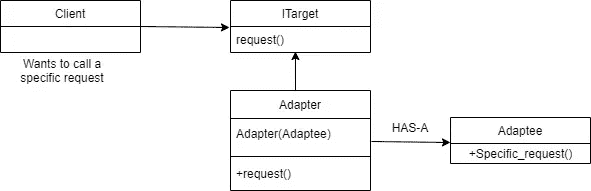
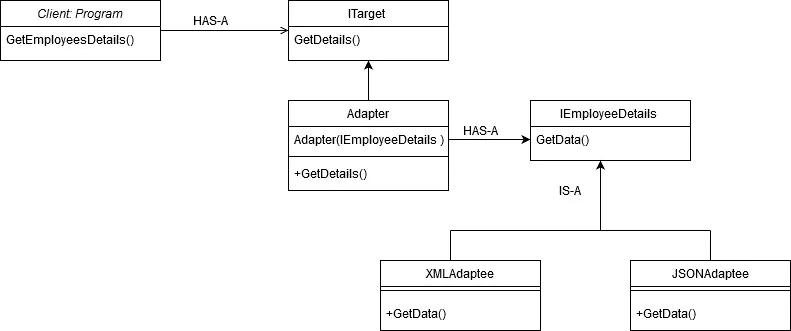
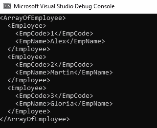
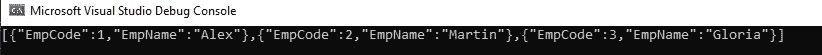

# 适配器设计模式

> 原文：<https://levelup.gitconnected.com/adapter-design-pattern-2ca673e72839>

## “改编”这个词意思是适合新的用途。

照片由[在](https://unsplash.com/@maartenwijnants?utm_source=medium&utm_medium=referral) [Unsplash](https://unsplash.com?utm_source=medium&utm_medium=referral) 上的马腾 Wijnants 拍摄

让我们举一个家里的例子，我们都见过墙上安装的电源插座。关于这些插座有一个奇怪的事实，每个国家都有自己风格的电源插座。这就是为什么智能手机制造商针对不同的国家制造不同风格的充电适配器。

另一个很好的例子是苹果的超空间引擎。它将如此多的设备连接到一个 USB 端口。在这里，超光速引擎充当了一个适配器。

图片来源:超光速引擎雷电 3 中心

适配器也称为包装器。因为它包装了可以被不同对象使用的对象。

先看 UML。

1.  `**client**` 基本上就是想用模式的阶层。调用类。
2.  `**client**` 想要有`**Specific_request()**`只能由`**class Adaptee**`来服务，我们可以直接有-有关系就完事了。但问题在于，当有另一个特定的请求由另一个`**class Adaptee2**`提供服务时，在这种情况下，我们必须建立另一个 HAS-A 关系，这可能会随着每个新的需求而重复出现。所以你看到了问题，每次新的请求来了，我们都必须把它映射到客户端类，现在你会争论这种方法有什么问题，如果你对每个请求都这样做，你的代码就不能按照" [**开闭原则**](https://medium.com/gitconnected/solid-design-principles-simplified-with-uml-8432a3406248) "我们对修改关闭*"来扩展。*

*那么，我们如何在陷入太多混乱之前度过这一关呢？！*

*为了处理这种混乱，我们可以抽象出一个新请求的概念，并让抽象处理客户端发出的请求的委托。在上面的 UML 中，它是由`**interface ITarget**`处理的。*

*让我们开始编码吧。*

*E **例如，**假设我们的应用程序从一个 XML 文件中读取数据，它满足了今天的需求，但是如果明天我们希望我们的应用程序支持 JSON，那该怎么办呢？这时我们就可以使用适配器设计模式了。*

*我们来设计一下这个问题的架构。在下图中，我们有两个类`**XMLAdaptee**`和`**JSONAdaptee**`，这些类将继承具有抽象方法`**GetData()**`的`**interface IEmployeeDetails**`，因此我们的类可以使用自己的实现来实现自己的逻辑。*

*如果需要 XML 格式的结果，`**class program**`可以将`**XMLAdaptee’s**`实例注入到`**Adapter object**`中，或者如果需要 JSON 格式的结果，它可以传递`**JSONAdaptee’s**`实例。*

*现在，如果明天 YAML 有另一个需求，那么我们可以简单地创建类`**YAMLAdaptee**`并在`**GetData() method**`中编写它自己的逻辑。*

*这是我们的 UML 看起来的样子:*

**

*让我们创建一个将被我们的客户端调用的`**interface ITarget**`。*

*接下来，`**class Adapter**`，*

*它将实现`**ITarget**`:这个类也有`**interface IEmployeeDetails**`:这个接口将由我们两个 XML & JSON 适配器实现，以保持两个类中相似的架构，所以我们的客户端代码不会改变。*

*让我们创建一个`**interface IEmployeeDetails**`:*

*安`**class employee**`和`**entity:**`*

*加载 xml 数据的一个`**class XMLAdaptee**`。目前，我们可以从代码本身生成数据。*

*接下来，`**class JSONAdaptee**`:*

*最后但同样重要的是，我们的来电者`**class program**`:*

*XML 数据的输出:`**program.cs**`中的第 15 行*

**

*对于 JSON 数据的输出，只需取消代码中上述行的注释即可。`**program.cs**`中的第 18 行*

**

*完美！我真诚地希望您喜欢这篇文章，并希望您受到启发，将所学知识应用到自己的应用程序中。谢谢你。*

*编码快乐！！*

*在 Linkedin 上找到我*

* [## Rikam Palkar -软件工程师-小天鹅-威德福| LinkedIn

### 通过编写可伸缩的代码让世界变得更美好。我从来没有在大学里发现我对编码的热情，也没有在…

www.linkedin.com](https://www.linkedin.com/in/rikampalkar/)*