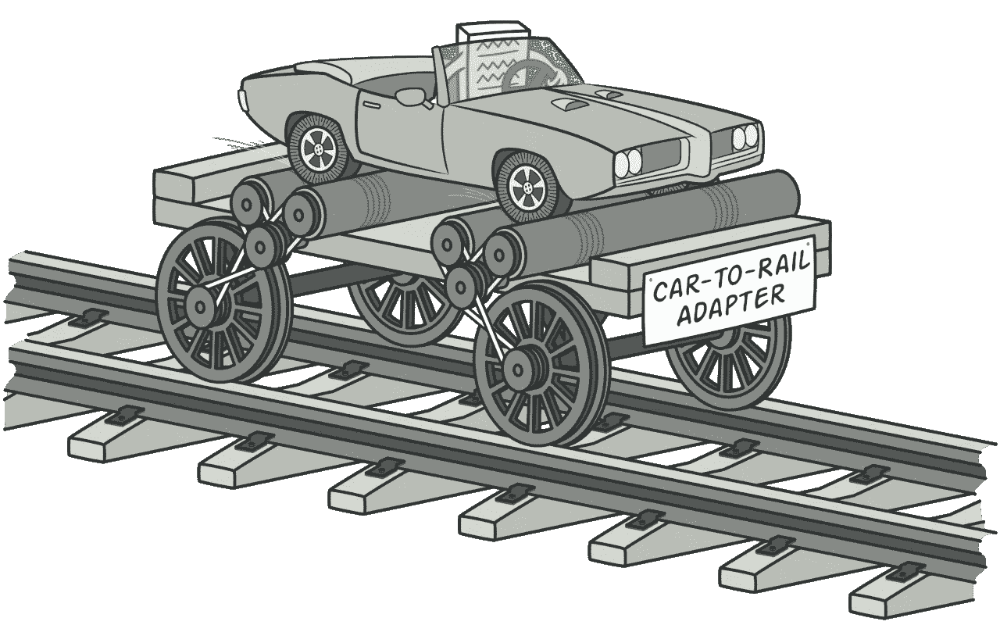
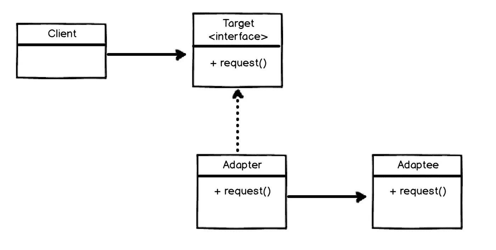

# Typescript 中的适配器设计模式实现

> 原文：<https://levelup.gitconnected.com/adapter-design-pattern-implementation-in-typescript-a33f481b9aff>

## 适配器设计将一个接口转换成另一个接口

在这篇文章中，我们将学习适配器设计模式以及这种设计模式的用法。

适配器设计模式

适配器设计模式是**结构设计模式**。

**结构设计模式**关注的是如何组合类和对象，以形成更大的结构。

## 适配器设计模式定义

基于 GoF，适配器模式用于将一个类的接口转换成另一个接口。这意味着我们可以让由于接口不兼容而无法协同工作的类协同工作。
**简而言之**当我们只有很少的类(或者 Javascript 中的函数)并且这些类是不兼容的但是应该被用来满足相同的目标时，我们可以使用这种模式。换句话说，你可以**包装**一个不兼容的类，并创建一个适配器来按照你想要的方式使用它。

假设你有一张**卡**，你想用你的笔记本电脑**读取**那张卡，问题是你的卡**与 **USB 端口**不兼容**，所以你需要一个**读卡器**来做这件事。**读卡器**就是这里的**适配器**！它让你读你的卡。

适配器设计模式的另一个众所周知的例子是将一个人的话翻译给另一个人的翻译器。

这种设计模式也被称为**包装器设计模式。**

## 这种设计模式的真实例子有哪些？

*   当新组件需要集成并与应用程序中的现有组件一起工作时。
*   用改进的接口重写了部分程序，但是旧代码仍然期望原始接口。
*   当你有第三方 API 时，它有可能会改变。

在评论部分**随意添加更多使用**适配器设计模式的例子。****

## 设计模式 UML

适配器设计模式

**客户端**是包含我们的应用程序逻辑的类

**适配器**是与目标接口不兼容的类。

**适配器**是让客户端使用 Adaptee 类的类。

# 空谈不值钱！

假设我们在应用程序中使用 **Redis** 来存储一些对象，但是现在我们想在某些部分使用 **MongoDB** *。*

一种方法是添加 MongoDB，并在所有我们希望使用 MongoDB 的地方重写代码。

另一种方法是使用一个*适配器设计模式*来确保我们可以轻松地使用 MongoDB。

我们在使用 Redis，我们有一个名为 **IStore** 的界面

我们的存储界面

我们的 Redis 客户端实现是这样的(最简单的方式。请记住，`ioredis`本身实现了 set 和 get 以及所有其他方法，我们可以直接使用 Redis 客户端，但只是想访问这两个方法):

Redis 客户端实现

这里是**客户端**，它是这里的用户。我们想知道其他人查看了此人的个人资料多少次，并且我们还想在有人访问此个人资料时增加这个数字:

现在我们正在使用 Redis 客户端，但我们想使用 MongoDB。我们知道 MongoDB 与当前的结构不兼容。因此，解决方案是使用适配器:

我们有一个 MongoDB 客户端，我们可以在数据库上执行查询，我们有这些方法`insertOne`和`findOne`。我们将实现`IStore`接口，并使用 MongoDB 方法来存储和检索数据。

MongoDB 适配器

此外，我们返回“OK ”,因为这是操作成功时 Redis 响应的样子。

最后一部分是在客户机类中使用这个适配器类:

使用 MongoDB 的客户端

如果您想一起检查这些部分并测试这个示例，这是 MongoDB 连接器文件:

我已经知道这可能不是一个完美的例子，但是我想你可以通过这个例子理解这个设计模式的目的。

 [## 适配器

### 适配器是一种结构化设计模式，它允许接口不兼容的对象进行协作。想象一下…

重构大师](https://refactoring.guru/design-patterns/adapter)  [## 适配器

### 适配器模式将一个接口(对象的属性和方法)转换成另一个接口。适配器允许…

dofactory.com](https://dofactory.com/javascript/design-patterns/adapter)  [## 结构设计模式-Java point

### 结构设计模式关注的是如何组合类和对象，以形成更大的结构。的…

www.javatpoint.com](https://www.javatpoint.com/structural-design-patterns)