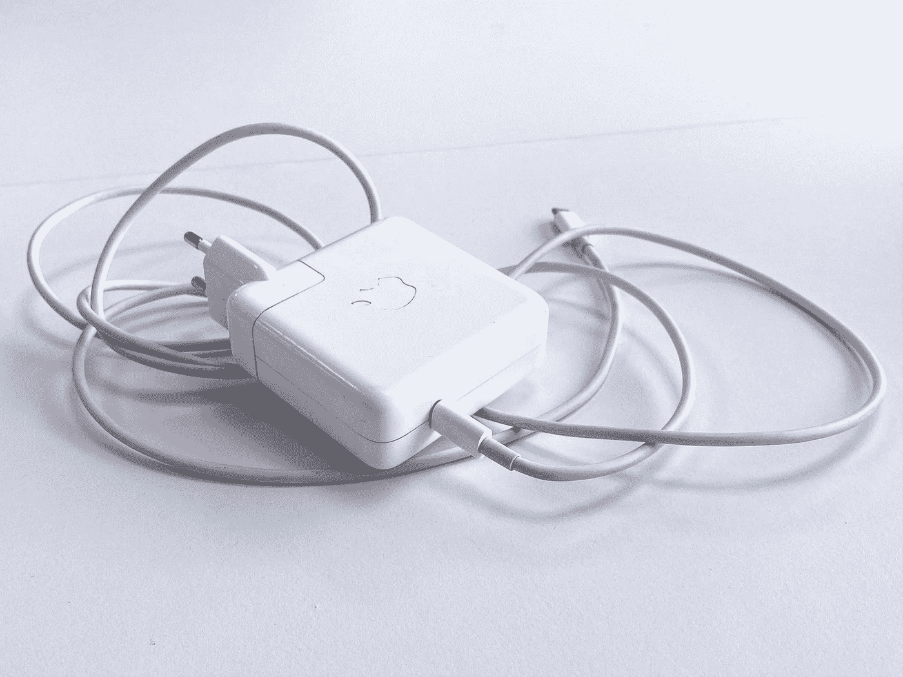
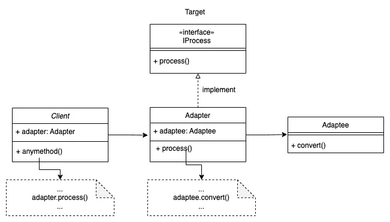

# Golang 中的适配器设计模式(模板+示例)

> 原文：<https://levelup.gitconnected.com/adapter-design-pattern-in-golang-template-example-5fcd2165c44>



[自制媒体](https://unsplash.com/@homemademedia?utm_source=medium&utm_medium=referral)在 [Unsplash](https://unsplash.com?utm_source=medium&utm_medium=referral) 上拍摄的照片

适配器设计模式用于通过将对新类型的调用包装在支持新类型接口的类中，在两个不兼容的类型之间提供链接。

这种设计模式在现实世界中有很多应用。例如，Type-C 转 USB 适配器用于将 Type-C 接口连接到 USB 接口。英国电源插座适配器用于将英国插头连接到英国插座。

当您想要使用现有的类或对象时，它非常有用。但是该类或对象不支持新类或对象所需的接口。换句话说，这是一种使用现有的类和对象来支持新功能的方法。

在这篇文章中，我们将看到如何在 Go 中使用适配器模式模板。最后，希望大家能理解适配器模式，知道怎么用。

# 适配器模式模板



适配器模式 UML

适配器模式包括**目标、适配器、适配器和客户端**。

**目标**是客户端想要调用的接口。这里我们有一个带有`process`方法的`IProcessor`接口。

```
type IProcess interface {
    process()
}
```

**适配者**是需要适配的类。出于演示的目的，这里有一个`convert`方法。

```
type Adaptee struct {
    adapterType int
}

func (adaptee Adaptee) convert() {
    fmt.Println("Adaptee convert method")
}
```

**适配器**类实现了上面的目标接口。它还有一个对 Adaptee 实例的引用作为属性。

```
//Adapter struct
type Adapter struct {
    adaptee Adaptee
}//Adapter class method process
func (adapter Adapter) process() {
    fmt.Println("Adapter process")
    adapter.adaptee.convert()
}
```

客户端通过间接调用被适配者的方法来编排适配器。

```
var processor IProcess = Adapter{}
processor.process()
```

Go 中适配器模式的完整代码模板如下所示:

# 例子

让我们用下面的代码来看一个适配器模式的例子:

解释:

*   `Lighting`是**目标**接口
*   `LightBulb`类是**适应者**
*   `LightSwitchAdapter`是实现`Lighting`接口的**适配器**
*   `main()`是**客户端**

有人可能认为为`LightBulb`实现灯光接口更容易。但是，在大多数情况下，不允许修改`LightBulb`类，因为它通常是一个现有的类。这就是为什么我们使用适配器模式来使用现有的类和对象来支持新功能。

我希望你喜欢阅读这篇文章。如果你愿意支持我成为一名作家，可以考虑注册[成为](https://jerryan.medium.com/membership)的媒体成员。你还可以无限制地访问媒体上的每个故事。