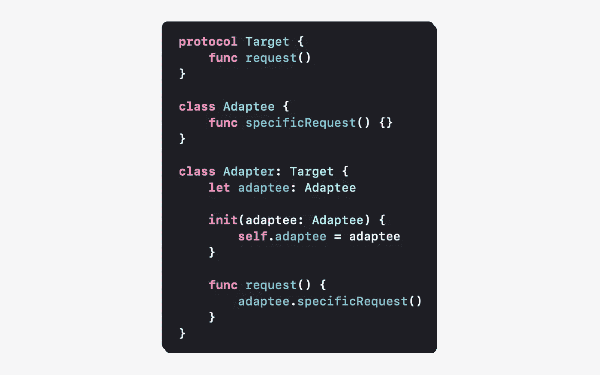
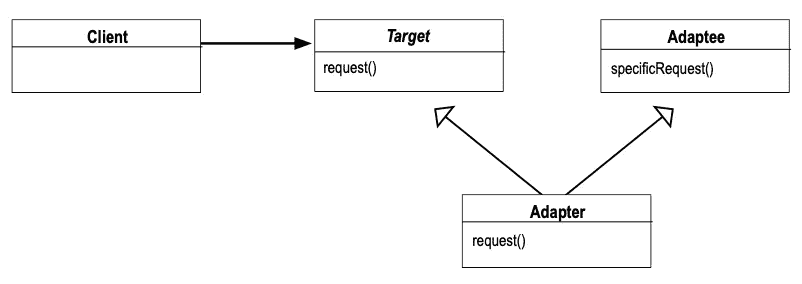
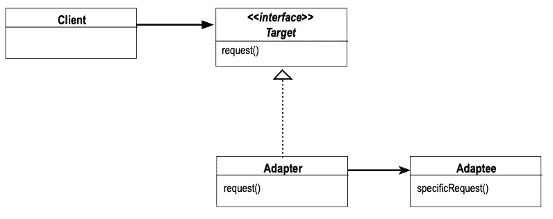
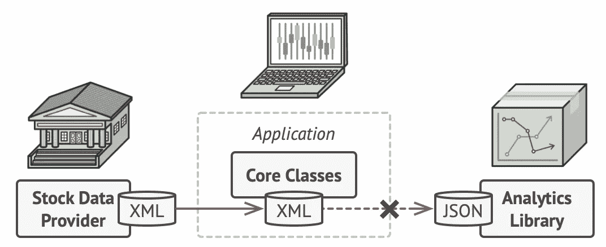
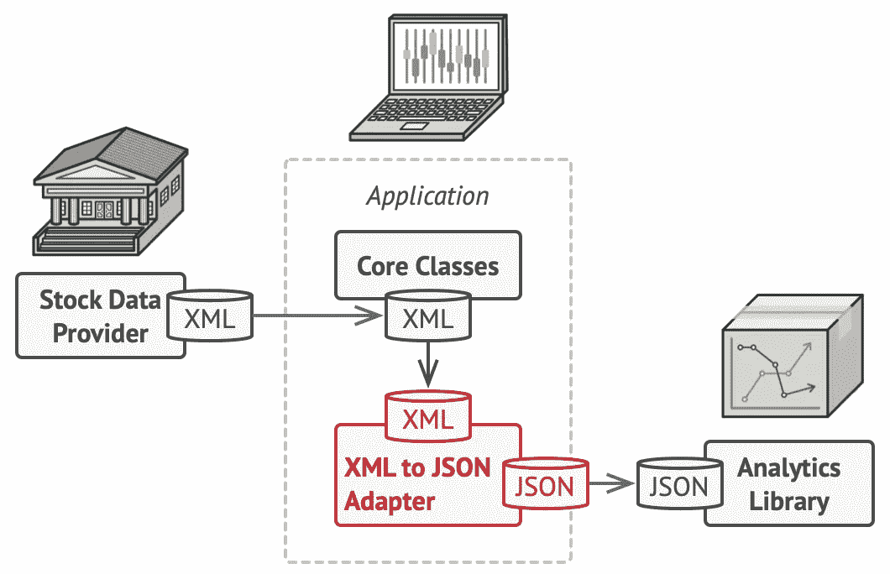

# Swift 中的“适配器”模式

> 原文：<https://levelup.gitconnected.com/adapter-pattern-in-swift-b6403cfa0a78>



# 定义

“适配器”模式是一种结构化设计模式，对于将类和对象组成一个更大的系统非常有用。

**“适配器”模式允许两个具有相关功能的对象一起工作，即使它们有不兼容的接口。**

# 我们什么时候应该使用这种模式？

## 让接口不兼容的对象一起工作

当我们需要两个对象一起工作时，应该使用这种模式，即使这些对象有不同的接口。当一个对象与预期的方法不同时，它不知道从另一个对象接口使用什么方法。“适配器”模式通过将符合所需接口的对象暴露给需要修改的现有代码来解决这个问题。将转换的复杂性转移到一个接口上简化了其功能的使用。这个被称为适配器的对象隐藏了转换的复杂性。

## 集成具有相似功能的组件

当两个接口不同但功能相似的组件必须一起工作时，应该使用这种模式。如果组件的功能不同，它将添加、删除或改变它们的行为，这不是“适配器”模式的目标。它的作用是将一个接口转换成另一个接口，因此它使接口具有互操作性。我们不希望强制集成一个组件，该组件不提供它所适应的接口所期望的功能。

⚠️如果它不是一对一的转换，那么它与“适配器”模式无关，而是与[“门面”模式](/facade-pattern-in-swift-11b5b7af7d4b?sk=f0dd8eee20ed5aab4b482d0408f75e78)有关。

## 从实现的接口中分离一个对象

当我们有两个应该相互通信的不相关的接口时，以及当目标/需要的接口随时间变化时，应该使用这种模式。为了将实现细节从客户端代码中分离出来，减少依赖性，并保护我们的代码不受 API 变化的影响，我们使用了一个中间人。它是一个将来自现有接口的请求转换成所需接口的对象。它封装了代码更改，因此不必修改客户端。在不修改代码实现的情况下，我们扩展了行为。它使我们的客户端对扩展开放，但对修改关闭(*开放/关闭原则*)。

# 我们应该如何使用这种模式？

当两个具有不同接口的对象需要通信时，我们有两种选择。我们可以修改现有的代码来使用新的界面。然而，如果接口在将来再次改变，这不是一个有效的解决方案，因为这对我们的代码库来说是痛苦的。这意味着一系列复杂的易出错的变化。使用新接口的代码甚至可能无法访问(第三方库)，这使得这种方法不可能实现。当我们不能修改应用程序中的源代码时，最后一个常见问题将我们带到了第二种方法。它包括创建将旧接口转换为新接口的适配器。

## 继承之上的组合

有两种适配器:类适配器和对象适配器。

*   类适配器使用继承:



来自设计模式的图像——可重用面向对象软件的元素

由于 Swift 不支持多重继承，这种适配器无法实现。

*   对象适配器使用组合:



来自设计模式的图像——可重用面向对象软件的元素

由于 Swift 支持符合多种协议，我们可以实现这个适配器。在这个 UML 图中，客户端有一个对符合目标接口的对象的引用。但是，客户端无法与 Adaptee 对象通信，因为它与客户端期望的接口不同。客户端使用 request 方法，adaptee 对象使用 specificRequest 方法。接口不匹配，适配器模式有助于使它们兼容。

为此，我们在这两个接口之间创建了一个适配器，也称为包装器。适配器符合目标接口，并且具有对 Adaptee 对象的引用。客户机可以继续使用它的请求方法，适配器对象将所有请求委托给适配器。specificRequest 方法在客户端不知道的情况下使用。

## 具体例子

假设我们有一个股市监测应用程序。我们的应用程序以 XML 格式显示从股票数据提供商下载的股票数据的图表。我们希望通过使用一个显示经过整理和分析的数据图表的库来改进我们的应用程序。但是，这个库希望股票数据采用 JSON 格式。



图片来自[https://refactoring.guru/design-patterns/adapter](https://refactoring.guru/design-patterns/adapter)

我们希望集成一个新的组件(分析库),它具有与应用程序(显示图表)相似的功能，但具有不同的接口(JSON 输入),因此适配器模式是正确的使用模式。我们的对象适配器将符合显示图表的应用程序的核心类接口。它将对分析库有所参考。然后，我们的对象将数据从 XML 转换成 JSON 格式，并使用它的方法。分析库的使用对应用程序来说将变得透明。



图片来自[https://refactoring.guru/design-patterns/adapter](https://refactoring.guru/design-patterns/adapter)

# 履行

让我们从返回 XML 数据的股票数据提供程序的实现开始。

```
**class** StockDataProvider {
    **func** downloadStockData() -> XML {
        **return** "XML data"
    }
}
```

然后，我们实现作为应用程序一部分的图表核心类。为了显示图表，它符合图表协议。它没有对分析库的引用，因为它还不能使用。

```
**protocol** Chart {
    **func** displayCharts(data: XML)
}**class** ChartCoreClass: Chart {
    **func** displayCharts(data: XML) {
        print("display charts with \(data)")
    }
}
```

然后让我们介绍接受 JSON 输入的分析库。

```
**class** AnalyticsLibrary {
    **func** displayAnalyzedCharts(data: JSON){
        print("display charts with \(data) analyzed")
    }
}
```

最后，我们可以创建符合图表接口的对象适配器。我们还添加了对分析库的引用，因为该对象将转换数据以使用库 API。在这个例子中，我们假设库是可实例化的，所以我们通过构造函数使用依赖注入。

```
**class** XMLtoJSONAdapater: Chart {
    **let** analytics: AnalyticsLibrary **init**(analytics: AnalyticsLibrary) {
        **self**.analytics = analytics
    } **func** displayCharts(data: XML) {
        // Data conversion
        **let** XMLtoJSONData = "converted \(data) to JSON data" analytics.displayAnalyzedCharts(data: XMLtoJSONData)
    }
}
```

# 在操场上运行代码

这里有一个[在线 Swift 游乐场](http://online.swiftplayground.run)，因此不必创建 Xcode 游乐场来测试“适配器”模式的实现。然后，复制下面的代码，该代码对应于我们的股票市场监控应用程序的“适配器”模式的完整实现。

```
**typealias** XML = String
**typealias** JSON = String
**typealias** AnalyzedData = String**class** StockDataProvider {
    **func** downloadStockData() -> XML {
        **return** "XML data"
    }
}**protocol** Chart {
    **func** displayCharts(data: XML)
}**class** ChartCoreClass: Chart {
    **func** displayCharts(data: XML) {
        print("display charts with \(data)")
    }
}**class** AnalyticsLibrary {
    **func** displayAnalyzedCharts(data: JSON){
        print("display charts with \(data) analyzed")
    }
}**class** XMLtoJSONAdapater: Chart {
    **let** analytics: AnalyticsLibrary **init**(analytics: AnalyticsLibrary) {
        **self**.analytics = analytics
    } **func** displayCharts(data: XML) {
        // Data conversion
        **let** XMLtoJSONData = "converted \(data) to JSON data" analytics.displayAnalyzedCharts(data: XMLtoJSONData)
    }
}// Client (Application)
**let** provider = StockDataProvider()
**let** XMLData = provider.downloadStockData()print("--- Client without adapter ---")
**let** client = ChartCoreClass()
client.displayCharts(data: XMLData)print("--- Client with adapter ---")
**let** analyticsLib = AnalyticsLibrary()
**let** adaptedClient = XMLtoJSONAdapater(analytics: analyticsLib)
adaptedClient.displayCharts(data: XMLData)
```

最后，粘贴并运行代码。