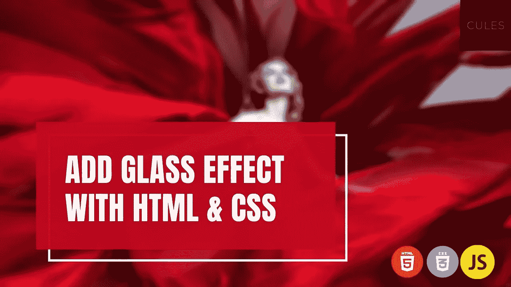
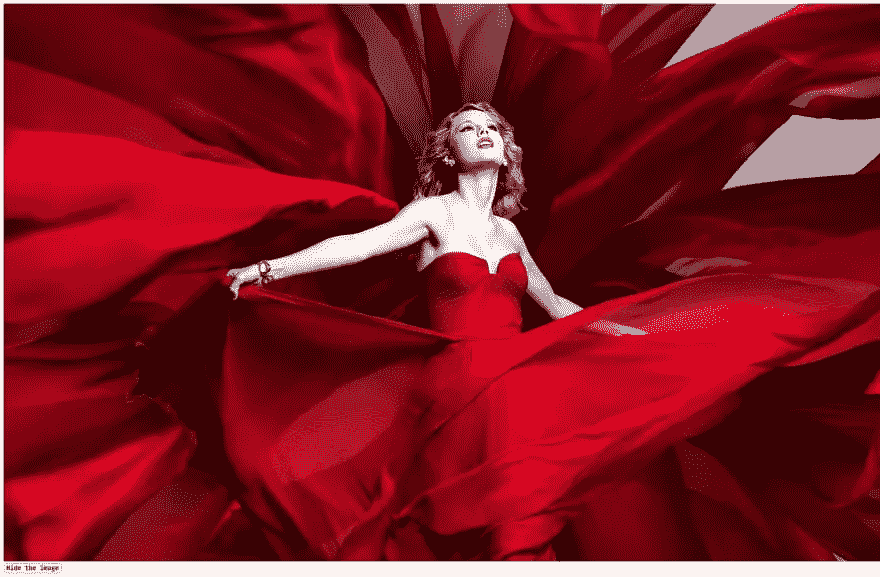
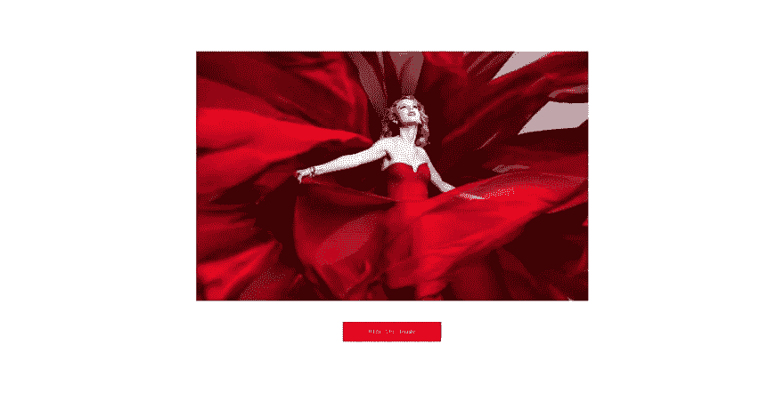
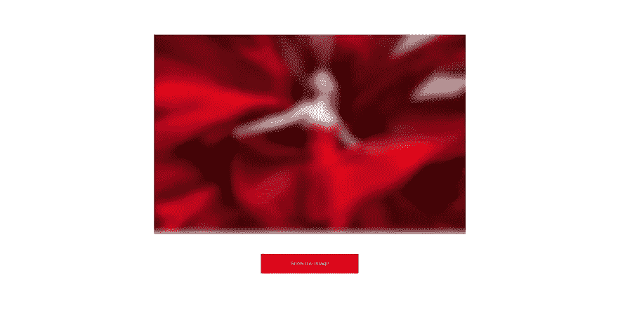

# 用 HTML 和 CSS 添加玻璃效果

> 原文：<https://levelup.gitconnected.com/add-a-glass-effect-with-html-and-css-34a430d7d9b>



在这个博客中，你将学习如何用 Html & CSS 添加一个玻璃效果。您将通过构建这个简单的项目来了解这一点。

预览:

要求:

*   基本的 HTML 和 CSS 知识
*   基本 Javascript(可选。仅用于切换效果)

我已经在我的频道上制作了一个视频。请查看这个以获得更多解释。

如果你喜欢这个视频，请分享，并订阅我的频道。

# 我们开始吧

Html 代码:

```
<!DOCTYPE html>
<html lang="eng">
    <head>
        <meta charset="utf-8" />
        <meta name="viewport" content="width=device-width" />
        <title>Glass effect</title>
        <link rel="stylesheet" href="style.css" />
    </head>
    <body>
        <div class="container">
            <div class="image_container">
                
                <div class="glass hidden"></div>
            </div>
            <div class="button_container">
                <button class="toggle_button">
                    <span class="hide_or_show">Hide</span> the image
                </button>
            </div>
        </div> <script src="index.js"></script>
    </body>
</html>
```

解释:

*   包含页面所有元素的容器。
*   图像的图像容器。
*   添加一个带有`glass`类的空`div`来添加玻璃效果。
*   带有按钮的按钮容器。
*   按钮文本`Hide`用一个 span 标签包装起来。当我们点击按钮时，文本将会改变。

结果:



Css 代码:

```
* {
    padding: 0;
    margin: 0;
    box-sizing: border-box;
}.container {
    min-height: 100vh;
    display: grid;
    justify-items: center;
    grid-row-gap: 3rem;
}.image_container {
    width: 50%;
    align-self: end;
    position: relative;
}.image {
    width: 100%;
}.toggle_button {
    padding: 1rem;
    background: red;
    border: none;
    color: white;
    width: 15rem;
    cursor: pointer;
}.toggle_button:focus {
    outline: none;
}.toggle_button:active {
    transform: translate(0, 2px);
}.glass {
    position: absolute;
    top: 0;
    left: 0;
    height: 100%;
    width: 100%;
}.hidden {
    display: none;
}
```

结果:



解释:

*   集装箱占据了整个宽度。
*   图像容器仅占其容器宽度的 50%。图像本身占据了其容器 100%的宽度。
*   图像容器是相对位置，玻璃元素使用绝对位置与图像容器对齐。

如果你对 Css 位置有困惑，那么你可以看看这个视频。

*   玻璃元素用 hidden 类隐藏。
*   使用 css 网格将图像和按钮水平和垂直居中。
*   但是图像和按钮紧挨着。
*   按钮的一些基本样式。

让我们最后添加模糊，这是非常容易的。

```
.glass {
    position: absolute;
    top: 0;
    left: 0;
    height: 100%;
    width: 100%;
    backdrop-filter: blur(10px);
}
```

结果:



解释:

*   我们已经使用`backdrop-filter`属性使其工作。
*   我们需要对值使用模糊函数。
*   在模糊函数中传递你想要的任何有效的测量值。

要了解更多关于`backdrop-filter`的信息，请访问[文档](https://developer.mozilla.org/en-US/docs/Web/CSS/backdrop-filter)

## 注意:

属性在 firefox 中不起作用。如果有人知道如何解决这个问题，请告诉我。

让我们添加切换效果。这里我们将使用一点 javascript。

```
const toggleButton = document.querySelector('.toggle_button')
const glass = document.querySelector('.glass')
const hideOrShow = document.querySelector('.hide_or_show')const hidden = 'hidden'toggleButton.addEventListener('click', () => {
    glass.classList.toggle(hidden) if (glass.classList.contains(hidden)) {
        hideOrShow.innerHTML = 'Hide'
    } else {
        hideOrShow.innerHTML = 'Show'
    }
})
```

结果:

解释:

*   首先，我们选择了 3 个元素。

1.  开关按钮
2.  气体元素
3.  隐藏或显示按钮内的文本元素

*   我们已经向切换按钮添加了一个事件监听器来监听 click 事件。当按钮被调用时，回调函数将被调用。
*   然后我们简单地在玻璃元素中切换`hidden`类。这将切换玻璃效果。
*   最后，我们检查`hidden`类是否存在。我们只是在此基础上更改了按钮的文本内容。

我们结束了。这就是我们如何用普通的 HTML 和 css 添加一个玻璃效果。很简单，对吧？