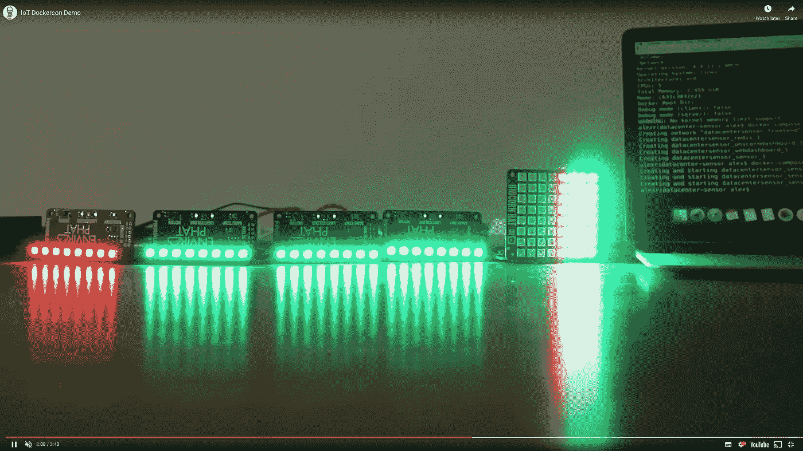
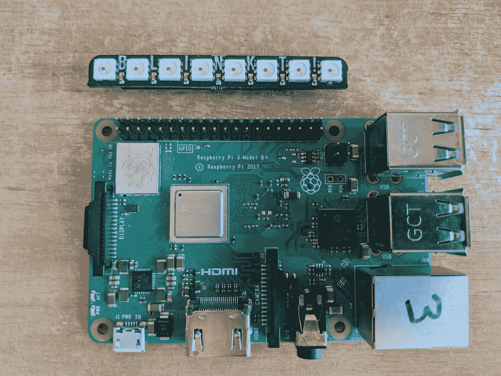
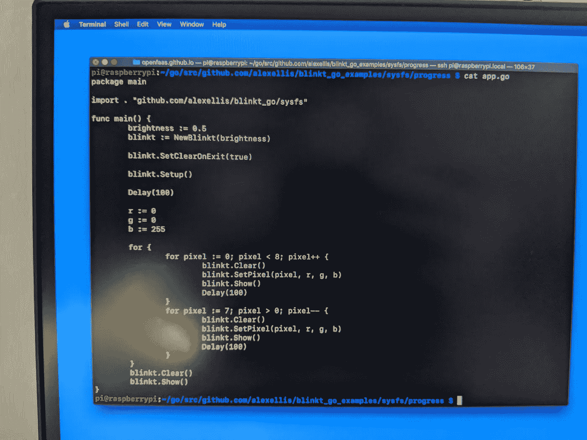
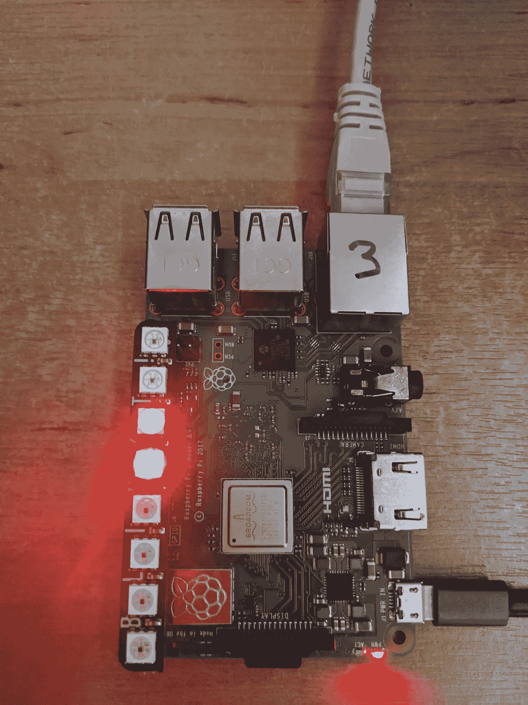
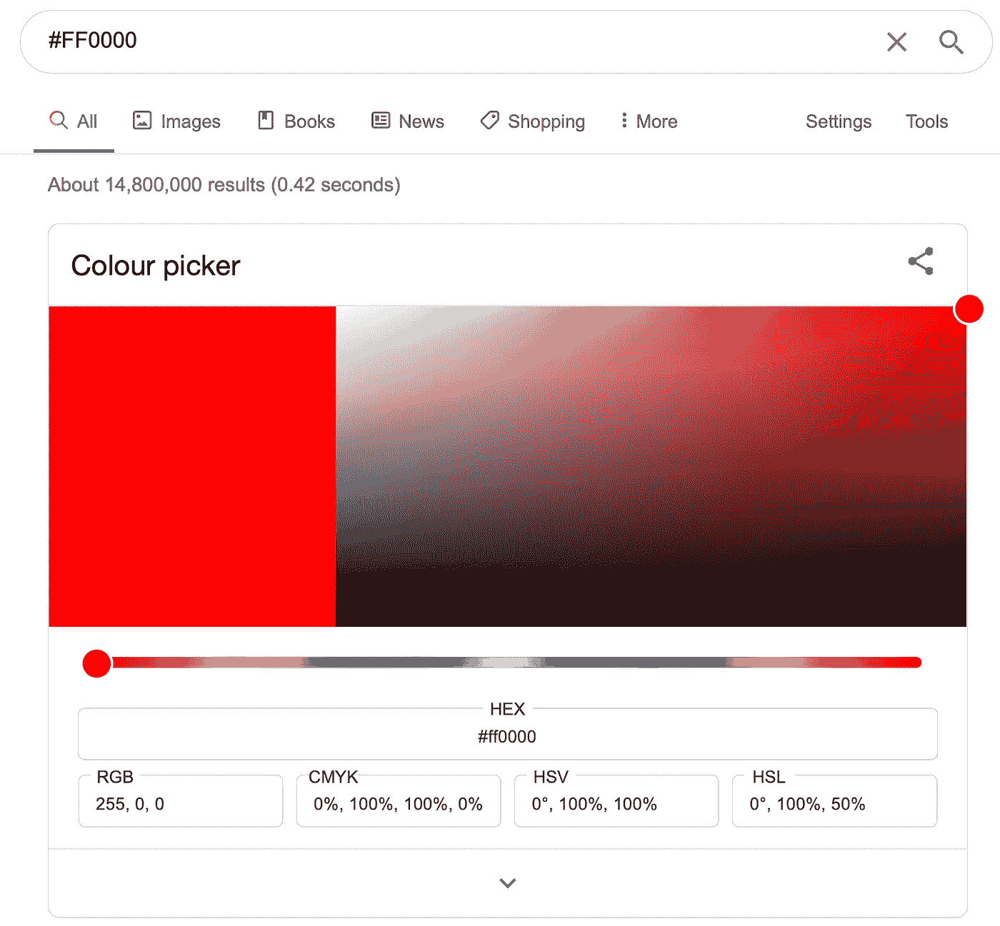
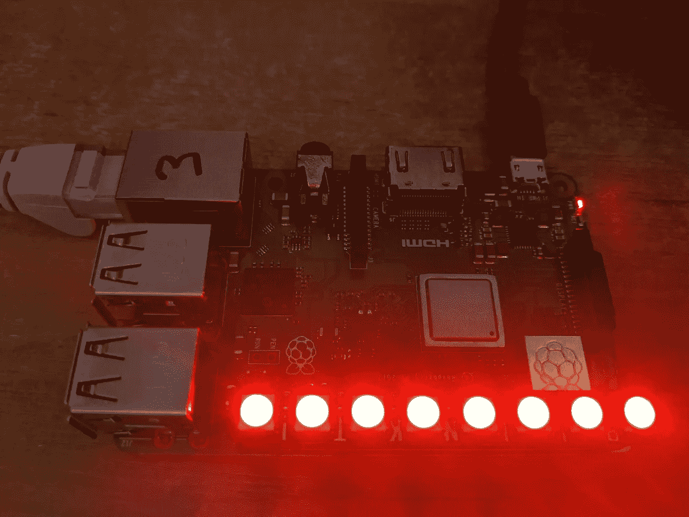

# 给你的树莓派添加状态指示灯

> 原文：<https://levelup.gitconnected.com/add-a-status-led-to-your-raspberry-pi-d3718846d66b>

在本教程中，我将向您展示如何添加一个 LED 到您的 Raspberry Pi，以便您可以显示外部系统或 API 的状态。我们将使用的板仅花费几美元，并具有 8 个可编程 RGB LEDs，使其成为一个多功能和经济的选择。



上图:【Dockercon 2016 我的物联网演示显示温度传感器状态——绿色表示在范围内，红色表示发出警报。

我们将从安装 Golang (Go)开始，然后从 Git 下载一个可以控制 Blinkt 的库。然后，在最终设置一种颜色来表示外部 API 的状态之前，我们将尝试一两个样本。

为什么去而不去 Python？这两种语言都有可用的库，在你完成教程后，如果你想尝试 Python，请参见 Pimoroni 的 [Blinkt repo。](https://github.com/pimoroni/blinkt)

# 第 1 部分—设置和安装

## 先决条件:

*   [Blinkt！来自 Pimoroni](https://www.google.com/search?q=blinkt!&oq=blinkt!&aqs=chrome..69i57j35i39l2j0l3j69i61l2.883j0j7&sourceid=chrome&ie=UTF-8)——一种廉价且多功能的 RGB LED 附件
*   raspberry Pi 2/3/4——我们将使用 Go，它的编译在这些主板上比在 RPi Zero 上快得多
*   Rasbpian Lite 或 Raspbian Desktop 闪存到您的 SD 卡，使用 [etcher.io](https://etcher.io) 写入映像。
*   SSH 访问已启用(说明如下)

## 关闭电源并安装 Blinkt！

注意树莓派和附加板的弯曲边缘。确保它们都面向同一个方向。



RPi3 上的安装

一旦连接上，就该给 RPi 通电了。我更喜欢在以太网上工作，但如果你配置了 WiFi，那也很好。

## 通过 SSH 连接到树莓 Pi

SSH 在默认情况下是不打开的，所以在 SD 卡的/boot/分区中创建一个名为`ssh` 的文件，或者使用`raspi-config`来启用它。在苹果电脑上，我简单地使用了`sudo touch /Volumes/boot/ssh`。

我们将通过 ssh 运行所有这些命令，所以运行`ssh pi@raspberrypi.local`或者用您设置的主机名替换“raspberrypi”。如果您无法使用设备名称进行连接，请安装 [nmap](https://nmap.org/) 并运行`nmap -sP 192.168.0.0/24`(或您网络的等效子网)。

## 安装 Go 1.13 或更新版本

创建安装程序脚本:

```
cat >install-go.sh<<EOF
#!/bin/bash

echo "Downloading Go"

curl  -o /tmp/go.tgz -sSLf [https://dl.google.com/go/go1.13.10.linux-armv6l.tar.gz](https://dl.google.com/go/go1.13.10.linux-armv6l.tar.gz)

sudo mkdir -p /usr/local/go/echo "Extracting Go"
sudo tar -xvf /tmp/go.tgz -C /usr/local/go/ --strip-components=1

echo "export GOPATH=\$HOME/go/" >> ~/.bash_rc
echo "export PATH=\$PATH:/usr/local/go/bin/" >> ~/.bash_rc

EOF
```

然后运行它:

```
chmod +x install-go.sh
./install-go.sh
source ~/.bash_rc
```

检查 Go 版本:

```
go versiongo version go1.13.10 linux/arm
```

## 获取 Go 代码

确保您有从 GitHub 获取代码的`git`包:

```
sudo apt update && sudo apt -qy install git
```

获取 Blinkt 的 SDK！

```
export GOPATH=$HOME/go/
mkdir -p $GOPATH/src/github.com/alexellis/
cd $GOPATH/src/github.com/alexellis/

git clone [https://github.com/alexellis/blinkt_go](https://github.com/alexellis/blinkt_go)
```

获取库的示例

```
export GOPATH=$HOME/go/
mkdir -p $GOPATH/src/github.com/alexellis/
cd $GOPATH/src/github.com/alexellis/

git clone [https://github.com/alexellis/blinkt_go_examples](https://github.com/alexellis/blinkt_go_examples)
```

试试第一个叫做“进步”的例子:

```
cd $GOPATH/src/github.com/alexellis/blinkt_go_examples/sysfs/progress# Build a binary
go build# Run the code
sudo ./progress
```

这个例子和节目[霹雳游侠](https://en.wikipedia.org/wiki/Knight_Rider)中的动画工具包最相似。

完成后，按 Control + C。

改变“进度”示例的颜色

进度示例应该显示一个蓝色 LED 从左到右追逐，让我们把它变成红色。

```
package main

import . "github.com/alexellis/blinkt_go/sysfs"

func main() {
	brightness := 0.5
	blinkt := NewBlinkt(brightness)

	blinkt.SetClearOnExit(true)

	blinkt.Setup()

	Delay(100)
 **r := 0
	g := 0
	b := 255**

	for {
		for pixel := 0; pixel < 8; pixel++ {
			blinkt.Clear()
			blinkt.SetPixel(pixel, r, g, b)
			blinkt.Show()
			Delay(100)
		}
		for pixel := 7; pixel > 0; pixel-- {
			blinkt.Clear()
			blinkt.SetPixel(pixel, r, g, b)
			blinkt.Show()
			Delay(100)
		}
	}
	blinkt.Clear()
	blinkt.Show()
}
```

使用内置编辑器`nano`更新 RGB 设置值，或者通过`sudo apt install -qy vim`安装`vim`。

```
**r := 255
g := 0
b := 0**
```



通过 SSH 远程工作

现在构建并再次运行该示例:

```
go build && ./progress
```

恭喜你！现在你已经让状态灯显示出你想要的颜色*。*



它还活着！现在也是红色而不是蓝色。

现在试着改变亮度。你能把它调到多低直到它爆炸？编辑 0.5 并尝试更低的数值。

> 小心你的眼睛，不要盯着光看！

```
brightness := 0.5
```

构建并再次运行它:

```
go build && ./progress
```

# 第 2 部分—将灯变成状态灯

现在让我们尝试更新这个例子，使它显示一个对应于 API 的特定灯光。最简单的方法是定时向 API 发出 HTTP 请求(这种技术称为轮询)。

幸运的是，您还不需要编写自己的代码，您可以使用“Cheerlights”的例子。如果你没有听说过 Cheerlights，这个想法是你运行一个由世界上任何人决定其颜色的 IoT 灯。具体的颜色和色调由 API 决定。

您可以在浏览器中或通过 curl 查看来自 cheerlights API 的响应:

```
curl -sSL [http://api.thingspeak.com/channels/1417/field/2/last.json](http://api.thingspeak.com/channels/1417/field/2/last.json){"created_at":"2020-04-21T10:07:49Z","entry_id":693813,"field2":"#FFFF00"}
```

运行示例:

```
cd $GOPATH/src/github.com/alexellis/blinkt_go_examples/sysfs/cheerlights# Build and run the example:
go build && sudo ./cheerlights
```

你可以改变颜色的方法之一是发微博给`@cheerlights` :\


然后 API 返回了`#FFFF00`，它被代码转换成 RGB 颜色显示在 Blinkt 上！



这就是:



起作用了！

下面是 app.go 文件的代码:

```
package main

import . "github.com/alexellis/blinkt_go/sysfs"

func main() {

	brightness := 0.5
	blinkt := NewBlinkt(brightness)

	checkPeriodSeconds := 60

	blinkt.SetClearOnExit(true)

	blinkt.Setup()

	Delay(100)

	for {
		r, g, b := getCheerlightColours()

		blinkt.Clear()
		blinkt.SetAll(r, g, b)
		blinkt.Show()
		Delay(checkPeriodSeconds * 1000)
	}
}
```

你会注意到在每次检查 API 之前它会休眠 60 秒，这样我们就不会滥用 Cheerlights API 服务器。这种方法被称为“轮询”。

cheerlights.go 文件包含获取 JSON 响应并将十六进制值转换为 RGB 值的代码。

```
package main

import (
	"encoding/hex"
	"encoding/json"
	"io/ioutil"
	"log"
	"net/http"
	"strings"
	"time"
)

type cheerlight struct {
	Colour string `json:"field2"`
}

func getRGBFromColour(hexString string) (int, int, int) {
	//strip off the hash and decode the remaining hex value
	hexCol, _ := hex.DecodeString(strings.TrimPrefix(hexString, "#"))
	//return the ints representing rgb
	return int(hexCol[0]), int(hexCol[1]), int(hexCol[2])
}

func getCheerlightColours() (int, int, int) {
	var netClient = &http.Client{
		Timeout: time.Second * 3,
	}
	resp, getErr := netClient.Get("http://api.thingspeak.com/channels/1417/field/2/last.json")
	if getErr != nil {
		log.Panic(getErr)
	}
	body, readErr := ioutil.ReadAll(resp.Body)
	if readErr != nil {
		log.Panic(getErr)
	}
        defer body.Close()
	result := cheerlight{}
	parseErr := json.Unmarshal(body, &result)
	if parseErr != nil {
		log.Panic("Can't parse response")
		return 0, 0, 0
	}

	return getRGBFromColour(result.Colour)

}
```

# 轮到你了

现在轮到你继续学习围棋，打造自己的状态灯了。这里是我的一些想法，但是你会建立什么？

*   Jenkins CI 作业状态 LED —显示您的项目构建是通过还是失败
*   远程传感器——使用 [PIR 传感器](https://shop.pimoroni.com/products/sparkfun-openpir)显示远程温度传感器的值或其他 MQTT 数据，如运动传感器
*   每次你的 GitHub 项目使用 webhooks 和 [inlets](https://docs.inlets.dev/) 创建一个 HTTP 隧道收到一个星号时，闪烁一下
*   使用“太空中的宇航员”API 为每个人显示一个 LED:[Golang 基础——从 API 中获取 JSON】](https://blog.alexellis.io/golang-json-api-client/)
*   整合您的在线银行，如 Monzo，并使用 led 显示您的余额或自上次存款以来的时间: [Monzo 样本](https://github.com/alexellis/monzo-get-token)

如果你喜欢这些内容，请注册我的高级电子邮件，订阅关于我的工作和[开源项目](https://github.com/)的每周摘要——更多信息请访问[https://www.alexellis.io/](https://www.alexellis.io/)