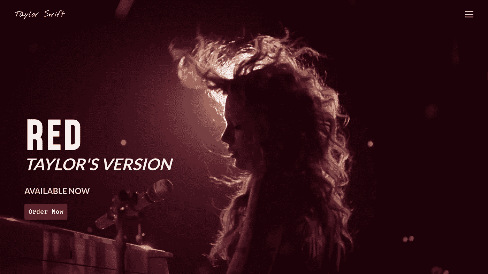
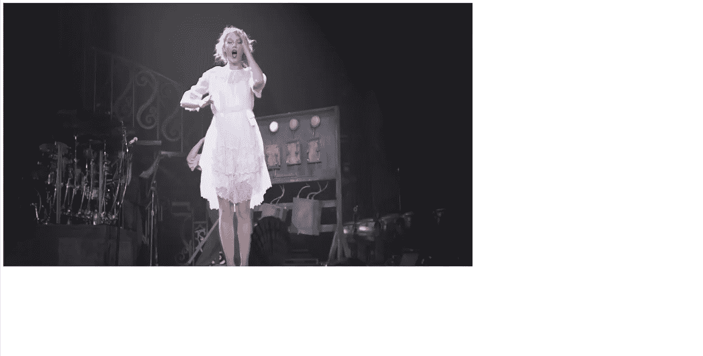
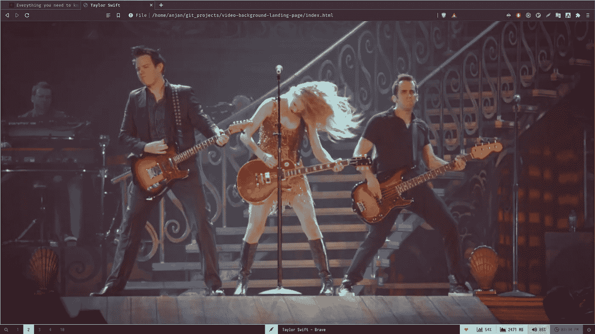
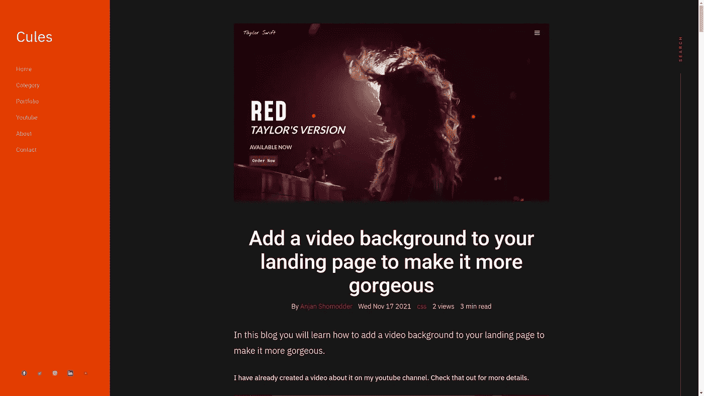
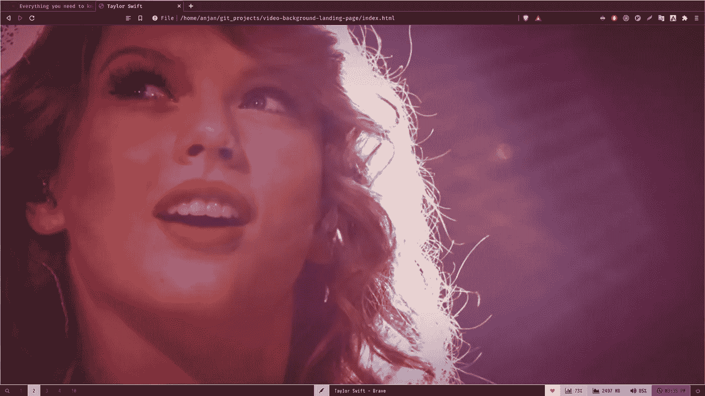

# 给你的登陆页面添加一个视频背景，让它更加华丽

> 原文：<https://levelup.gitconnected.com/add-a-video-background-to-your-landing-page-to-make-it-more-gorgeous-78b26a20a1bb>



在这篇博客中，你将学习如何给你的登陆页面添加一个视频背景，使其更加华丽。

预览:

要求:

*   基本的 HTML 和 CSS 知识
*   基本 Javascript(可选。仅导航切换效果需要)

我已经在我的 youtube 频道上制作了一个视频。更多细节请查看。

如果你喜欢这个视频，请分享，并订阅我的频道。

源代码:[https://github . com/that anjan/video-background-landing-page-yt](https://github.com/thatanjan/video-background-landing-page-yt)

# 起始代码

```
<!DOCTYPE html>
<html>
    <head>
        <meta charset="UTF-8" />
        <meta name="viewport" content="width=device-width" />
        <title>Taylor Swift</title>
        <link rel="stylesheet" href="style.css" />
        <link rel="stylesheet" href="nav.css" />
        <link rel="stylesheet" href="content.css" />
        <link rel="stylesheet" href="responsive.css" />
    </head>
    <body>
        This is body

        <script src="index.js"></script>
    </body>
</html>
```

让我们添加视频和 html 覆盖。

```
<section class="video_container">
    <video src="./media/background.mp4" autoplay loop muted></video>
    <div class="overlay"></div>
</section>
```

结果:



解释:

包含视频和覆盖图的视频容器。
视频会自动循环启动。它也将被静音。
Css 复位

```
* {
    padding: 0;
    margin: 0;
    box-sizing: border-box;
}

body {
    max-width: 100vw;
    overflow-x: hidden;
}
```

解释:

整个网页不应大于屏幕宽度。
网页不会有任何水平滚动。
让我们来设计一下视频:

```
.video_container {
    min-height: 100vh;
    max-height: 100vh;
    overflow: hidden;
    position: relative;
}

.video_container video {
    position: absolute;
    left: 0;
    top: 0;
    width: 100%;
    height: 100%;
    object-fit: cover;
    object-position: center;
}
```

结果:



解释:

视频容器占据了屏幕的整个宽度，没有任何溢出。它也被定位为相对的。
实际视频被绝对定位并与容器对齐。它还占据了整个高度和宽度。
如果你对 CSS 的位置有困惑，你可以看这个视频。

*   为了使视频合适，我们需要使用`object-fit`到`cover`。
*   如果用户调整屏幕宽度，由于`object-position: center;`，用户将总是看到视频的中心。

顺便说一下，这篇博客最初发表在 [Cules Coding](https://www.culescoding.space/blog/add-a-video-background-to-your-landing-page-to-make-it-more-gorgeous) 网站上。如果你能去参观一下，我会很高兴的。



# 让我们的风格覆盖。

```
:root {
    --primary-red: #70000e;
}

.overlay {
    position: absolute;
    left: 0;
    top: 0;
    width: 100%;
    height: 100%;
    background: var(--primary-red);
    mix-blend-mode: soft-light;
}
```

结果:



解释:

*   使用位置`absolute`将覆盖元素与容器对齐。
*   背景颜色存储在变量中。如果你不知道 CSS 变量，那么你可以看看这个[博客](https://www.culescoding.space/blog/everything-you-need-to-know-about-css-variables)
*   叠加已经使用混合模式与背景混合。我们需要用`mix-blend-mode`的财产来这样做。我会用`soft-light`它作为值。你可以从[这里](https://developer.mozilla.org/en-US/docs/Web/CSS/mix-blend-mode)了解`mix-blend-mode`

这就是你如何添加一个视频背景到一个登陆页面，使其更加华丽。如果你想了解该项目的其余部分是如何制作的，请观看视频。

源代码:[https://github . com/that anjan/video-background-landing-page-yt](https://github.com/thatanjan/video-background-landing-page-yt)

# 无耻的插头

我用普通的 HTML、CSS 和 JavaScript 制作了一些基于项目的视频。

您将了解到:

*   Javascript 交叉点观察器添加酷效果
*   DOM 操作
*   将元素与 CSS 位置对齐。
*   如何做响应式网站？

这些都是提升你前端技能的好项目。

如果你感兴趣，你可以看看视频。

请喜欢并订阅 [Cules 编码](https://www.youtube.com/channel/UCBaGowNYTUsm3IDaHbLRMYw?sub_confirmation=1)。它激励我创造更多这样的内容。

这个博客到此为止。我试图简单地解释事情。如果你卡住了，你可以问我问题。

顺便说一下，我正在一家公司寻找一个新的机会，在那里我可以用我的技能提供巨大的价值。如果你是一名招聘人员，正在寻找一个精通全栈网络开发并对改变世界充满热情的人，请随时联系我。此外，我愿意谈论任何自由职业者的项目。

从[这里看我的作品](https://www.thatanjan.me/projects)

# 联系人

*   电子邮件:[thatanjan@gmail.com](mailto:thatanjan@gmail.com)
*   LinkedIn: [@thatanjan](https://linkedin.com/in/thatanjan/)
*   投资组合:[安健](https://thatanjan.me/)
*   Github: [@thatanjan](https://github.com/thatAnjan/)
*   Instagram(个人): [@thatanjan](https://instagram.com/thatAnjan/)
*   Instagram (youtube 频道): [@thatanjan](https://instagram.com/cules_coding/)
*   推特: [@thatanjan](https://twitter.com/thatAnjan)