# 通过添加自定 Xcode 模板来节省时间

> 原文：<https://levelup.gitconnected.com/add-custom-xcode-templates-bec9c3099766>

## 通过自动创建文件来加快开发时间。VIP 建筑

当你从事一个新项目/添加新功能或者甚至重构代码时，你做的第一件事是什么？是的，它在创建新文件。

我们都知道下面这个屏幕的用处，以及它是我们编码时间不可或缺的一部分，但是请花一分钟想想您为 MVVM、VIPER、VIP 等架构创建文件所做的点击次数。

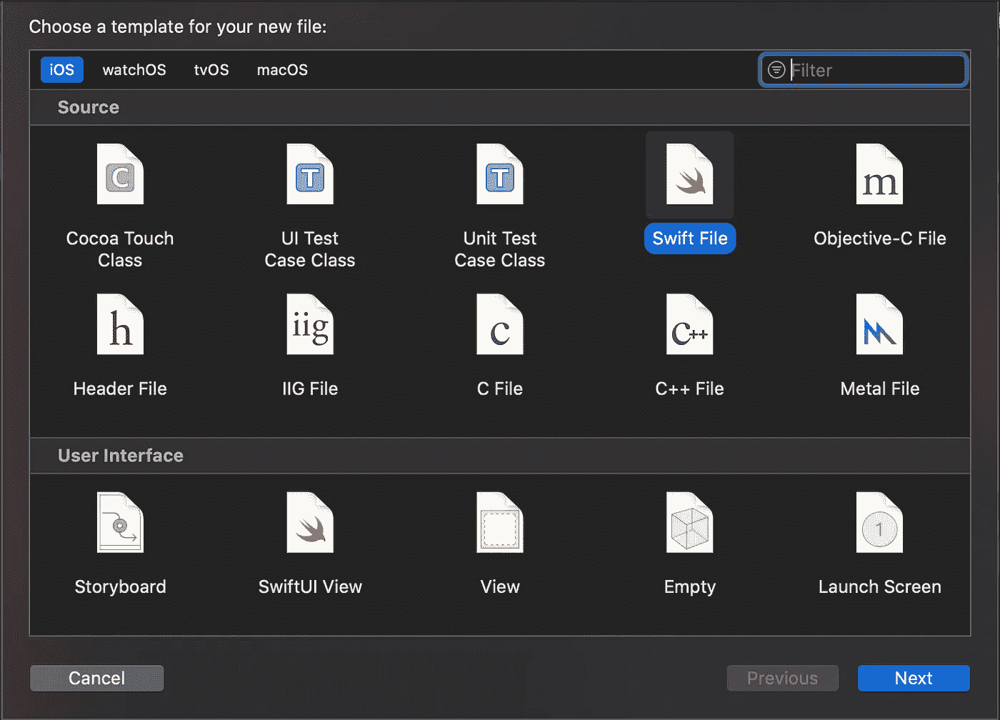

图 1.1

> 想象一下，有一个定制的模板，只需点击一下就可以创建所有你想要的文件。此外，也可以有一些样板代码，适合你的/公司的编码风格。

在本教程中，我将带您为一个简单的 VIP 项目架构准备一个定制模板，该架构允许用户根据自己的需求做出选择。

## **第一步:了解 Xcode 模板的基础知识**

你可以在这里找到所有 Xcode 默认模板的专用文件夹:**/Applications/Xcode . app/Contents/Developer/Library/Xcode/Templates/File Templates**

在这里，您可以看到创建新文件时作为组名看到的所有文件夹[参见图 1.1]。

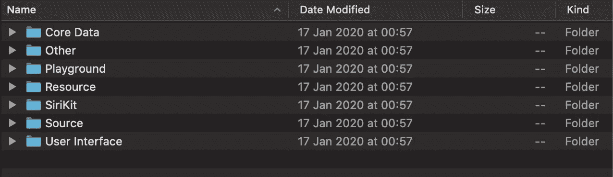

如果你进入源代码，我们可以打开名为 **Swift File.xctemplate** 的子文件夹，看到一组文件:

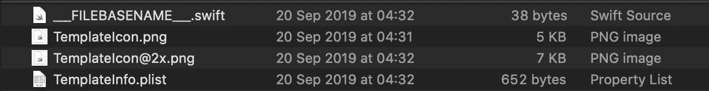

有一个扩展名为**的文件。斯威夫特**，然后我们有两个图像，最后一个**。plist** 文件。让我们详细看看:

**1。__FILEBASENAME__。swift:** 这个文件是用户点击创建按钮时创建的。因此，当用户创建新文件时，Xcode 会创建 __FILEBASENAME__ 的副本。swift 和 FILEBASENAME 宏的所有实例都由用户在对话框中提供的名称替换。如果你打开文件，你会看到一些样板代码。本例: ***导入*** *基础*

**2。templateInfo.plist:** 这个文件包含关于模板的信息。它包含关于模板的附加元数据，例如描述、摘要、种类、选项等。

**3。templateIcon.png
T22 这个图标将被用在模板选择器中。**

**4。templateIcon@2x.png** 与 TemplateIcon.png 相同，但用于 Retina Mac 电脑。

## 步骤 3:构建新的自定义模板

最简单的方法是创建一个新的群组文件夹，并复制**/Applications/Xcode . app/Contents/Developer/Library/Xcode/Templates/File Templates**目录中的一个新的子文件夹，但是这样做有一个问题。如果 Xcode 被更新，那么 File templates 文件夹就会被删除，我们所有的模板都会丢失。最好的方法是在这里创建一个特定的文件夹:

**~/Library/Developer/Xcode/Templates/**

首先创建文件夹文件模板和子文件夹 Xcode 模板。在 Xcode 模板下面，创建一个**VIP architecture . xc template**文件夹。

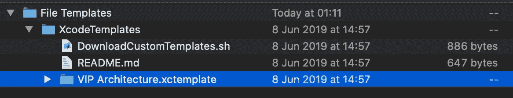

此外，您可以使用脚本 DownloadCustomTemplates.sh 来创建它。这里可以找到

我在**VIP architecture . xc template**文件夹中添加了一组图标:

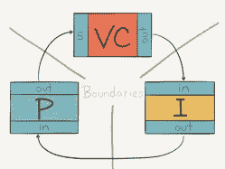

TemplateIcon@2x.png—96x 96 图标

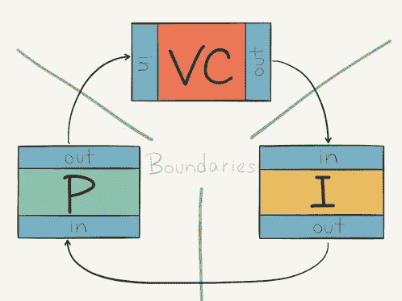

TemplateIcon.png—48x 48 图标

包含以下内容的 **templateInfo.plist** 文件:

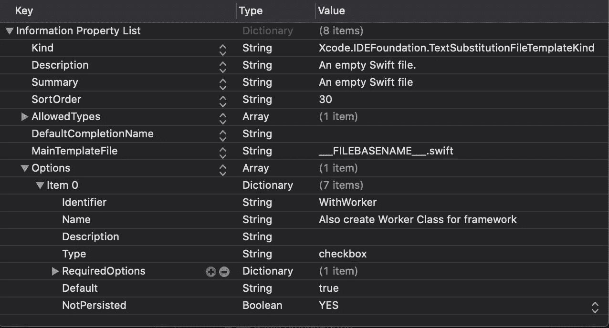

以及两个子文件夹**默认为**和**带有工作器**。

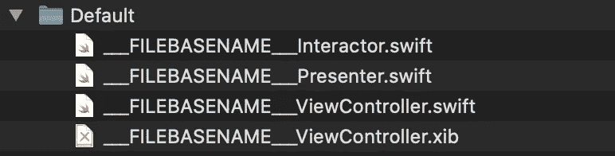

没有工人

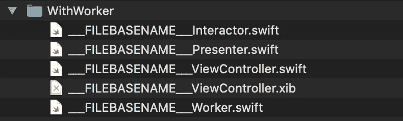

与工人

**templateInfo.plist** 中的选项字段定义 Xcode 将选择哪个文件夹来生成文件。因此，当您选择创建新文件并选择自定义模板时，您将看到以下屏幕:

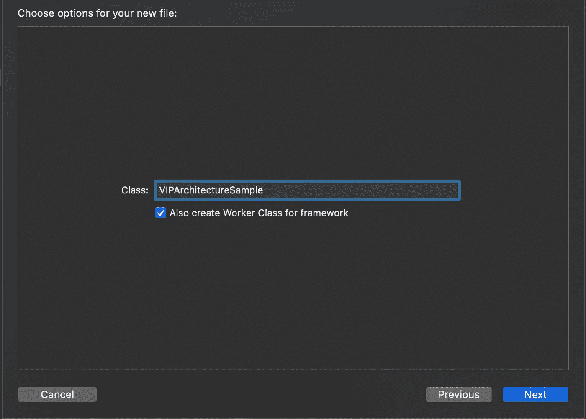

现在，如果您知道 VIP 架构，那么您需要为每个模块创建一个工作者、演示者、控制者和交互者。对于某些模块，我们不需要 worker，创建一个 worker 可能只是一种开销。这个自定义模板为您提供了一个选项，如果您不需要，可以跳过创建工作线程。因此，只需点击一下，它就会为您创建以下文件:

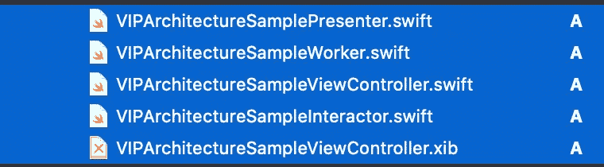

这些文件包含一些样板代码，如果您每次都需要编写重复的内容，这些代码可以加快开发速度。

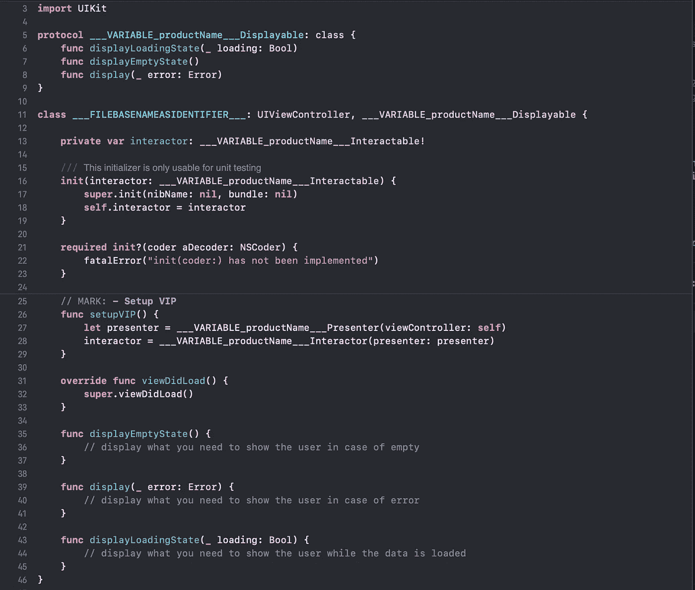

上面的文件显示了我在使用 VIP 架构时为每个模块编写的通用样板代码。

只需很少的努力，您就可以创建自己的自定义模板或自定义文件内容。

# 参考

[https://medium . com/over app-IOs/create-xcode-templates-c 968 D4 b 43 f 7 b](https://medium.com/overapp-ios/create-xcode-templates-c968d4b43f7b)