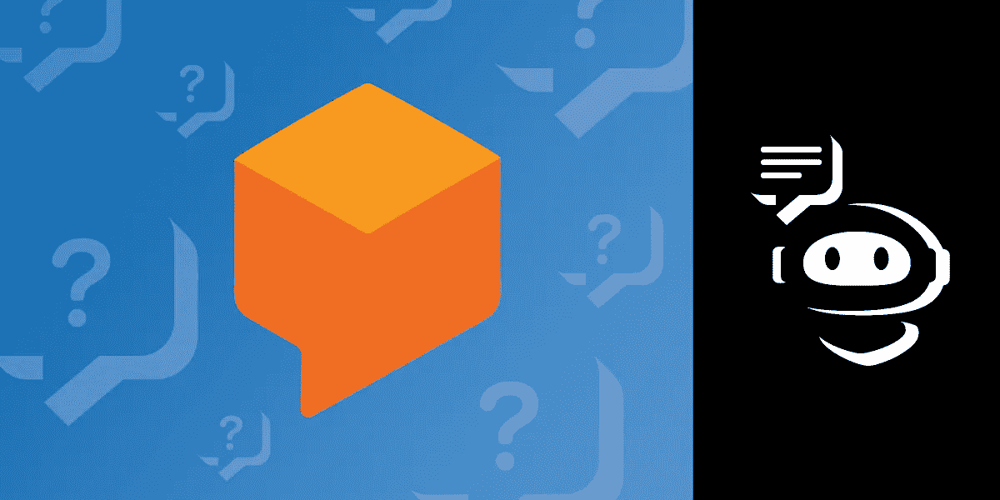
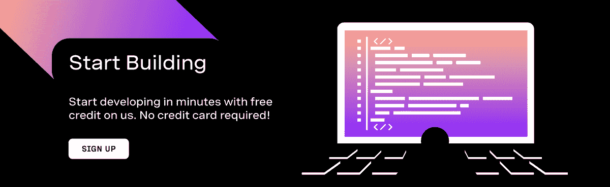
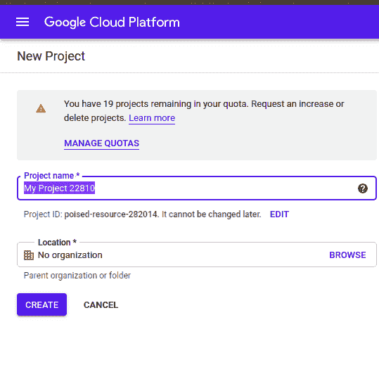
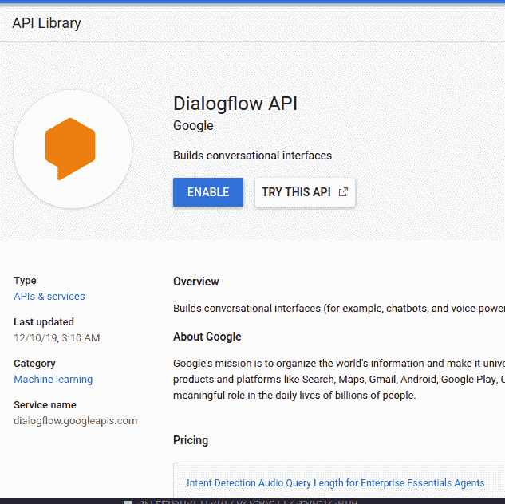
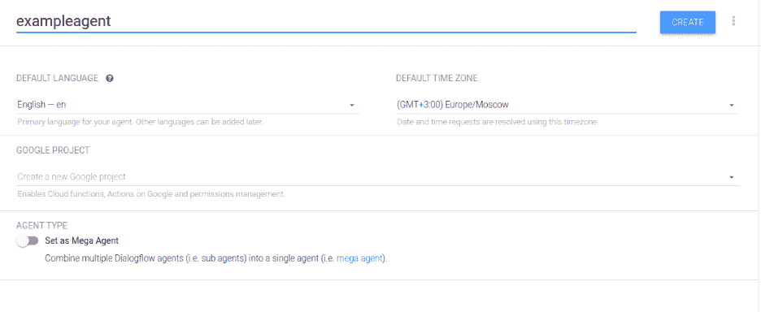
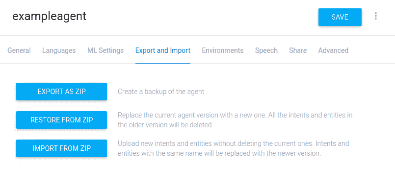

# 将 Dialogflow 和 Vonage SMS API 添加到 Flask 应用程序中

> 原文：<https://levelup.gitconnected.com/add-dialogflow-and-the-vonage-sms-api-to-your-flask-app-70c3e535693c>



Dialogflow 是 Google 提供的自然语言理解(NLU)平台。它用于设计对话式用户界面，并将其集成到移动和 web 应用程序、设备、机器人和交互式语音系统中。在本教程中，我们将演示如何与 Dialogflow 和 Vonage SMS APIs 集成，以构建一个通过 SMS 与最终用户交互的问答机器人。我们不会涵盖应用程序的每一部分，所以如果你是从零开始，请查看[完整项目回购](https://github.com/nexmo-community/Vonage-QnA-app)(或者阅读我们的[以前的](https://www.nexmo.com/blog/2020/01/03/use-python-and-flask-to-manage-queues-via-sms-dr) [教程](https://www.nexmo.com/blog/2020/02/24/nightscout-notification-nexmo-dr)中关于 Flask 从头开始开发的教程！)

# Vonage API 帐户

要完成本教程，您将需要一个 [Vonage API 帐户](http://developer.nexmo.com/ed?c=blog_text&ct=2020-07-30-add-dialogflow-and-the-vonage-messages-api-to-your-flask-app-dr)。如果你还没有，你可以今天[注册](http://developer.nexmo.com/ed?c=blog_text&ct=2020-07-30-add-dialogflow-and-the-vonage-messages-api-to-your-flask-app-dr)并开始用免费的信用点数建造。一旦你有了一个帐户，你可以在 [Vonage API 仪表板](http://developer.nexmo.com/ed?c=blog_text&ct=2020-07-30-add-dialogflow-and-the-vonage-messages-api-to-your-flask-app-dr)的顶部找到你的 API 密匙和 API 秘密。

本教程还使用了一个虚拟电话号码。要购买号码，请前往*号码* > *购买号码*并搜索符合您需求的号码。



# 创建应用程序

我们将首先使用 Nexmo CLI 模式创建一个应用程序。按如下方式在您的计算机上安装 Nexmo CLI:

在本地为您的应用程序创建一个目录:

在目录中，运行以下命令:

在交互式 CLI 模式下:

```
Application Name: your-app-name 
Select capabilities: press the space bar to select voice, messages and rtc 
Use default HTTP methods?: yes 
Voice answer url: press enter to leave it as default (https://example.com) 
Voice Fallback Answer URL: Optional Voice Event URL: press enter to leave it as default (https://example.com) 
Messages Inbound URL: use ngrok to create a URL and add '/update/' on the end 
Messages Status URL: press enter to leave it as default (https://example.com) 
RTC Event URL: press enter 
Public key path: press enter 
Private Key path: your private key (downloadable from the nexmo dashboard)
```

现在应该已经创建了应用程序。访问[仪表板](https://dashboard.nexmo.com/)并导航至*应用*。你闪亮的新应用程序应该会列在那里。

# 设置对话流代理

要设置 Dialogflow 代理，请访问 https://console.cloud.google.com 的[并创建一个新项目:](https://console.cloud.google.com)



记下`PROJECT ID`。从 API 列表中启用 Dialogflow API:



访问`https://dialogflow.cloud.google.com`创建新代理:



为了让你的应用程序更容易启动和运行，我在这个项目的 [GitHub repo](https://github.com/nexmo-community/Vonage-QnA-app) 中包含了一个 zip 文件。导航到`dialogflow`目录，在`resources`下下载`quizzie.zip`文件。此 zip 文件是从 Dialogflow 设置页面导出的，它包含在 Dialogflow 仪表板上设置代理所需的所有意图、上下文和响应。

在 Dialogflow 仪表板上，单击*设置*并导航至*导出/导入*。导入我们刚刚下载的 zip 文件:



我们的 Dialogflow 测验代理已经设置好了，可以开始了！

对于接下来的步骤，我们需要创建逻辑来处理最终用户和我们的 Dialogflow 代理之间的来回消息传递。

# 应用代码

我们想写一个界面发送短信给最终用户。首先，确保安装了 Nexmo Python 库:

发送手机短信的功能如下:

接下来，添加通知客户的代码:

一旦终端用户收到消息，我们希望他们回复。我们需要创建一个传入的 webhook 端点来接收回复。请记住，我们在前面创建应用程序时设置了入站短信 URL。现在是时候给我们的 webhook 添加逻辑了:

我们需要将从最终用户那里收到的响应链接起来，作为我们的 Dialogflow 代理的输入。为此，我们需要使用 Dialogflow REST 代理。

具体来说，我们需要检测用户意图，并将其作为输入传递给代理:

# 结论

基本设置现在已经完成。我们已经展示了应用程序发送和接收 SMS 消息所需的逻辑，以及如何连接到 Dialogflow 代理。要查看该应用程序的完整代码，请查看项目回购:[https://github.com/nexmo-community/Vonage-QnA-app](https://github.com/nexmo-community/Vonage-QnA-app)。如果还有任何问题，请随时给我发电子邮件。

*最初发布于*[*https://www . NEX mo . com/blog/2020/07/30/add-dialog flow-and-the-vonage-messages-API-to-your-flask-app-dr*](https://www.nexmo.com/blog/2020/07/30/add-dialogflow-and-the-vonage-messages-api-to-your-flask-app-dr)