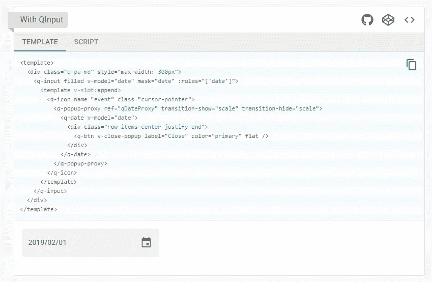

# 向您的 Vue 应用添加动态表单

> 原文：<https://levelup.gitconnected.com/add-dynamic-forms-to-your-vue-app-609de4005a2b>

定义一次表单域，作为模式，并在任何地方呈现它们！


马库斯·斯皮斯克在 [Unsplash](https://unsplash.com?utm_source=medium&utm_medium=referral) 上的照片

呈现应用程序中的所有表单需要多少代码？您是否发现自己在多个表单中添加了相同的字段？根据表单改变 UI 框架对你来说有多难？

这些只是我决定花些时间为我的项目设计动态表单的一些原因。

有许多软件包可以提供动态表单；然而，我无法找到一个满足我的需要。

# 问题

我现在已经使用 [Vue.js](https://vuejs.org) 和[类星体框架](https://quasar.dev)大约 6 个月了。我喜欢 Quasar Framework，因为它提供了我需要的所有 UI 组件，它给了我一次编写代码并将其构建为 web、桌面和/或移动应用程序的选项。我非常喜欢这个平台。😍

我目前正在做一个相当大的项目，在这个项目中，我管理许多类型的集合(例如，用户、项目、任务等)。).我有几个表格来列出、创建、更新和删除不同的收藏项目。过了一段时间，我开始发现许多重复的代码。我发现重复的一个领域是我的表单及其组件。如果我想让一个表单添加一个用户，我会构建它并包含所有必要的 UI 组件。

```
<q-form>
  <q-input color='primary' label='First Name' v-model='fname' ... />
  <q-input color='primary' label='Last Name' v-model='lname' ... /></q-form>
```

这里的小例子是构建一个表单来收集这个集合的名字和姓氏(假设它是一个“医生”的集合)。

现在我需要一个表格来添加护士。我需要另一张表格来添加管理人员。等等。我最终得到了多个表单，所有表单都定义了名和姓字段。

过去，我会创建组件模板。我称它们为“模板”，因为当我导入它们时，我通过 props 提供它们的配置。这里有一个简单的例子来说明我的意思:

```
<!-- components/MyInput.vue -->
<template>
  <q-input :class="class" :color="color" :label="label" :value="model" />
</template><script>
export default {
  props: ['class', 'color', 'label', 'value']
}
</script>
```

我上面的表单看起来应该是这样的:

```
<q-form>
  <my-input color='primary' label='First Name' value='fname' ... />
  <my-input color='primary' label='Last Name' value='lname' ... /></q-form>
```

这种方法真的没什么好处。事实上，我最终要支持比以前更多的代码行。

> 模板有一个用例。例如，当你在一个大型团队中，你想确保每个人都使用相同的组件。在这种情况下，您不会为这些组件公开太多选项，因为您有意希望它们的外观和行为总是相同的。

这是一个过于简单的例子，但足以说明我的观点。如果我想填充 class 之外的属性(仅 Quasar 的 *QInput* 组件就提供了几十个属性)，该怎么办？我必须将该属性添加到我的模板和道具中。

> 另外，这也是为什么组织使用像*故事书*这样的工具。他们需要一种方法来记录他们的组件和他们暴露的所有道具。

在变好之前会变得更糟。我的输入组件模板很简单。为了演示另一个极端，这里有一个使用类星体框架组件的例子， *QDate* 。你*可以*单独使用这个组件，但是通常你会想把它和一个 *QInput* 组件的弹出窗口一起使用。下面是 Quasar 文档，展示了如何定义这样一个组件。



除去外部的`template`和`div`元素，创建这个日期字段需要 7 个嵌套组件。要使它成为一个“模板化”的组件，需要为这个嵌套中的每个组件提供道具。我没有数过，但是这可以很容易地产生超过 100 个道具来支持所有可能的配置组合！

我不想再管理组件模板了。我希望有一个模式定义，可以完全呈现我的组件，支持任何 UI 组件及其所有属性。

# 研究

在我的研究中，我遇到了 [Vue 如何渲染](https://vuejs.org/v2/guide/render-function.html)UI，以及作为一名开发人员，你如何在你的代码中使用相同的渲染功能。事实上，`template`里面的一切都是这样在幕后渲染的。开始时，呈现语法可能有点难以理解。这里有一个小例子:

```
<script>
export default {
  render(h) {
    h('q-input', {
      class: ['text-body1'],
      props: {
        color: 'primary',
        label: 'First Name',
        value: 'fname',
      }
    })
  }
}
</script> 
```

> 注意:我特意省略了这个 Vue 组件的`template`部分，因为它不能出现在文件中，所以渲染函数不能优先。我是吃了苦头才知道的！😵

这是“原始的”Vue 渲染代码，使用 Quasar Framework 的 *QInput* 组件来呈现我的名字字段。

我之前的嵌套例子呢？这也包含在渲染函数中！它不在上面的例子中，但是稍后你会看到每个渲染的组件都有一个可选的`children`参数。你能有多少孩子深度是没有限制的。从 Vue 文档中，这里是渲染组件的实际语法。

```
// @returns {VNode} 
createElement(   
  // {String | Object | Function}   
  // An HTML tag name, component options, or async   
  // function resolving to one of these. Required.   
  'div', // {Object}   
  // A data object corresponding to the attributes   
  // you would use in a template. Optional.   
  {     
    // (see details in the next section below)   
  },  // {String | Array}   
  // Children VNodes, built using `createElement()`,   
  // or using strings to get 'text VNodes'. Optional.   
  [     
    'Some text comes first.',     
    createElement('h1', 'A headline'),
    createElement(MyComponent, {
      props: {
        someProp: 'foobar'
      }
    })
  ]
)
```

# 原型

原型令人沮丧，但建造起来很有趣。让我们来看一个场景。

当用户点击添加按钮时，我们知道他们的意图(“添加”)和上下文(例如，“医生”)。我们加载我们的*表单*组件。表单组件收集该上下文的模式。然后，*表单*组件使用一个*字段*组件，该组件根据提供的模式呈现字段 UI。轻松点。😆

倒过来看，这是我的原型。我们将从示例字段模式定义开始。

*fieldSchema.js*

这个特定的模式只定义了四个字段:姓名、生日、性别和手机号码。name 组件是最简单的，因为它不包含子组件。生日组件是最复杂的，因为它处理八个嵌套组件。

尽管这个文件可能会变得非常大，但我们只为整个应用程序定义了一次表单字段(如果我们选择在其他地方重用它，还包括所有其他项目)。

该模式包括 UI 组件定义的所有方面(组件名称、样式、属性、类、属性等)。).现在我正在使用类星体框架组件。如果我开始另一个需要另一个框架的项目，我只需修改这个文件，它就实现了(至少对于所有的表单域)。

接下来让我们看看表单模式定义。

表单模式的目的是将我们需要的表单域映射到当前上下文。在这种情况下，上下文是集合和事件的组合。换句话说，如果我创建一个表单来添加用户，那么根据这个文件，我将有一个包含字段的表单:姓名、生日和性别。

由于 spread 操作符，实现继承也非常简单。如果我的上下文是添加一个人，那么呈现的字段将是姓名、出生日期、性别和手机号码。这可以形成非常有效的模式定义。

接下来是原型的工作马，字段呈现组件。

我们的每个字段模式定义都作为`field` prop 传递到这个组件中。从这个模式中，组件被完整地呈现出来。

没有任何硬编码来呈现任何组件，不管它有多复杂。

这个实现还支持每个组件和嵌套组件的所有可能的配置。

让这件事过去一分钟。没有硬编码。所有属性，道具，职业等。，支持。

最后，让我们看看表单组件。

表单组件是我们出色解决方案的指挥者。这是我们的应用程序中唯一需要的表单组件。它确定上下文(借助 Vue 路由器和一些简单的 mixins 来减少代码)，收集字段模式，呈现这些字段，并向用户返回一个完全呈现的表单。

# 结论

我想这对你们中的许多人来说是很难消化的。我建议你玩玩这个概念，充分掌握这种东西提供的灵活性。我希望它能大大减少我的开发时间，同时降低故障排除的复杂性。

根据这个解决方案，向表单添加新字段需要做什么？假设我们想要跟踪我们的个人上下文的电子邮件地址。

1.  因为我们没有在字段模式中定义电子邮件地址，所以让我们从向模式对象的根添加一个新键开始。

```
{
  ... email: {
    component: 'q-input',
    label: 'Email Address',
    model: 'email',
    fieldOptions: {
      class: [],
      on: { input: true },
      attrs: {
        placeholder: 'Enter your email address',
      },
      props: {
        filled: true,
        rules: [
          val => !!val || 'Field is required',
          val => <enter email validation regex> || 'Must be valid 
              email address',
        ],
      },
      style: {
        width: '200px',
      },
    },
  }
  ...
}
```

2.然后我们需要将该字段添加到我们的 add `person`上下文中。

```
export const person = {
   ...users,
   add: {
      ...users.add,
      mobile: {},
+     email: {},
   },
   update: {
      ...users.update,
      mobile: {},
+     email: {},
    },
}
```

就是这样！下次我们的 add person 表单显示我们的电子邮件地址字段时，将会呈现它，包括它的模型、组件、样式、验证等。

这个实现有几个方面我没有介绍。如果有人对我深入研究这个实现感兴趣，请不要犹豫。

特洛伊·莫兰的更多文章

[](https://graypes.medium.com) [## 特洛伊·莫兰-中等

### 你在用 Vue，Vuex，云 Firestore 吗？即使你不使用 Firestore，你仍然应该阅读这篇文章，因为…

graypes.medium.com](https://graypes.medium.com)