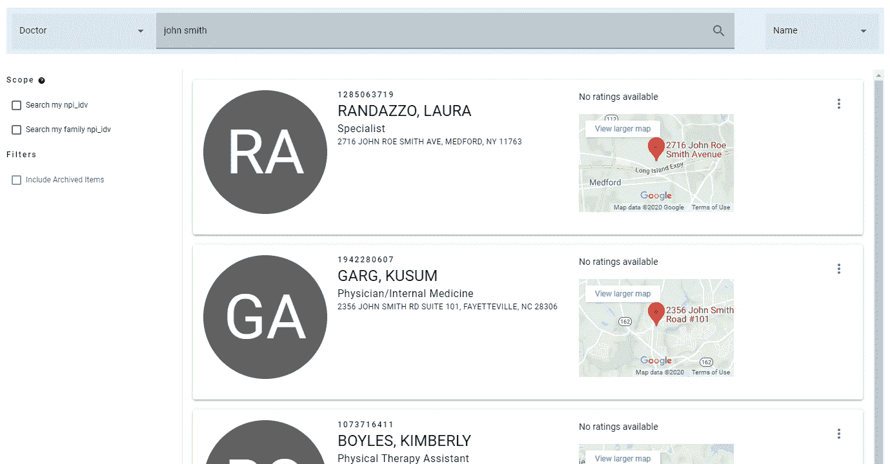
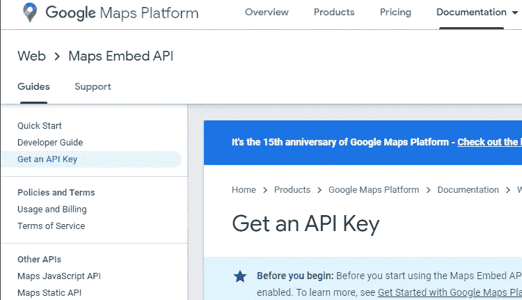
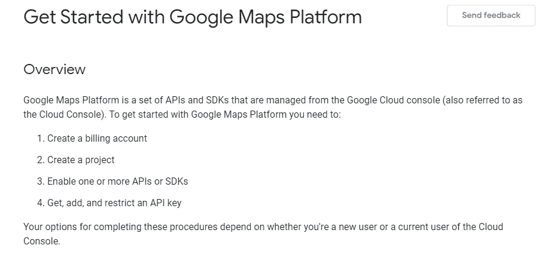
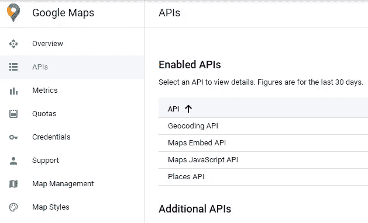
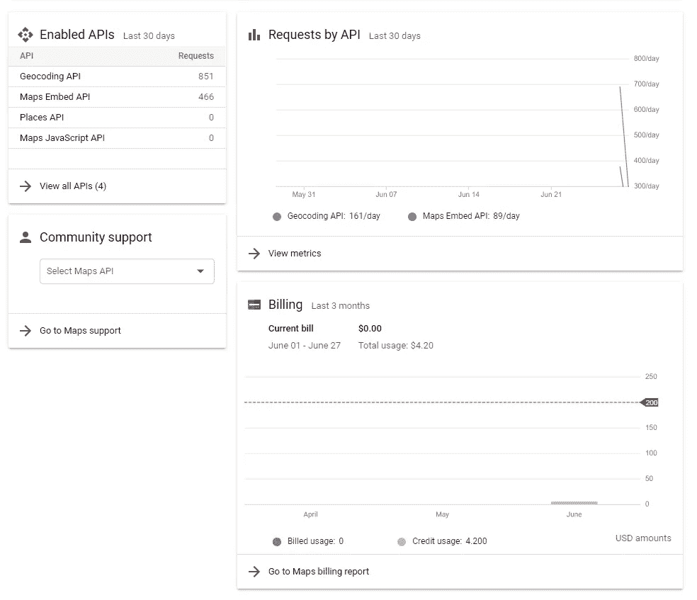
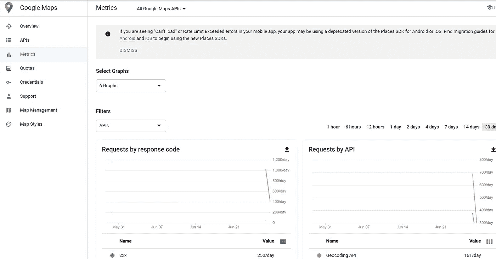

# 将嵌入式谷歌地图添加到您的应用程序中

> 原文：<https://levelup.gitconnected.com/add-embedded-google-maps-to-your-application-432605cdbeac>

## 跟随我的旅程(和解决方案)将 Google Maps 添加到您的应用程序中，让您免受痛苦和折磨。


照片由[亨利·佩克斯](https://unsplash.com/@hjkp?utm_source=medium&utm_medium=referral)在 [Unsplash](https://unsplash.com?utm_source=medium&utm_medium=referral) 上拍摄

我已经为一个大项目工作了几个月了。我有一份任务清单，并试图一点一点地完成它们。

本周，我开始着手“添加谷歌地图”的任务。我一直认为这是一个相对简单的任务。毕竟，谷歌地图已经存在很久了，而且谷歌对开发者也很友好。我很快意识到我的期望是错误的！😜

当然，我做的第一件事是谷歌“将谷歌地图添加到我的应用程序中”。我通读了许多文章。我通读了[谷歌地图平台](https://cloud.google.com/maps-platform)网站上的大量文档。

不用说，我被找到的大量信息淹没了。我不知道谷歌地图 API 实际上是一个由众多 API 组成的“平台”。

*   [地图静态 API](https://developers.google.com/maps/documentation/maps-static/intro)
*   [地图嵌入 API](https://developers.google.com/maps/documentation/embed/start)
*   [映射 JavaScript API](https://developers.google.com/maps/documentation/javascript/tutorial)
*   [方向 API](https://developers.google.com/maps/documentation/directions/start)
*   [道路 API](https://developers.google.com/maps/documentation/roads/intro)
*   [场所 API](https://developers.google.com/places/web-service/intro)
*   [地理编码 API](https://developers.google.com/maps/documentation/geocoding/start)

…仅举几个例子…😵

在我的例子中，我有一个包含地址的数据集。我只是希望输出包括一个指向该地址的小谷歌地图。听起来很简单，对吧？

最后，事实上非常简单。困难在于过滤信息，并找出什么过程对我的场景是有效的、适用的和当前的。所以，这是我学到的东西，我希望它能帮助其他人更快地达到他们想要的结果，比我付出的痛苦更少！👍

# 设计



医生列表项目

根据我的设计，我确定我需要地图作为我的列表项组件中的一个单独的“组件”。我可以找到一个现有的组件，创建我自己的组件，或者至少，我可以使用一个`iframe`。

# 选项

在我的研究中，我发现许多文章提供了看似无限的解决方案。作为开发人员，我们知道有许多方法可以解决问题；但是，我们也希望找到符合我们特定需求的最佳解决方案。

我正在使用[类星体框架](https://quasar.dev)构建这个应用程序。类星体框架包括许多[组件](https://quasar.dev/vue-components)，但没有任何谷歌地图。他们也有[应用扩展库](https://quasar.dev/app-extensions/discover)，但也没有运气。我在 Quasar 论坛上找到了关于这个话题的讨论，但最终我没有找到好的答案，只是一些和我一样的问题(和挫折)。

Quasar 框架建立在 [Vue.js](https://vuejs.org/) 之上。下一个合乎逻辑的地方是 NPM，看看是否有人发布了 Vue 和谷歌地图的软件包。找到了 40 多个包，但没有一个是我真正需要的。我玩了几个包，但发现它们是针对不同的场景，或者它们认为我有可用的纬度和经度。我只有一个地址。一些软件包专门针对移动设备。许多软件包比较旧，不支持 Webpack。每扇门后似乎都有另一个问题。总有一天…

> 我想这最后一段可能会得到一些评论，让我知道我完全错了，有很好的软件包可用。这很可能是真的，但经过几个小时的反复试验，我决定继续前进。😫

几个小时后，我离开了组件和包搜索，开始寻找与 Google Maps Platform(GMP)API 的直接交互。长话短说，我知道的太晚了，这就是我着陆的地方。

# 解决方案

我最初逆向解决了这个问题。我知道我想要一张“嵌入式”地图。GMP 中包含的[许多] API 之一是 Maps Embed API。听起来很完美！

Google 文档中这个 API 的第一个例子是:

由此，我显然知道我需要一个 API 密匙。好消息是，这样做与[直截了当的指令](https://developers.google.com/maps/documentation/embed/get-api-key)有明显的联系:



获取 API 密钥

Map Embed API 还声明它**必须在一个 *iframe*** 中使用。这很棒，因为这是我在设计时的选择之一。所以我只需要派生一个地图 URL，并填充 *iframe* 的 *src* 属性。听起来很简单！😥

嵌入 URL 的结构如下:

```
https://www.google.com/maps/embed/v1/{MODE}?key={YOUR_API_KEY}&*parameters*
```

> 其中:
> 
> `{MODE}`是`place`、`search`、`view`、`directions`或`streetview`中的一种。
> 
> `{YOUR_API_KEY}`是你的免费 API 密匙。
> 
> `parameters`包括[可选参数](https://developers.google.com/maps/documentation/embed/guide#optional_parameters)，以及模式特定参数。

通过阅读不同的模式，我确定*位置*最适合我的场景。place 模式可以接受转义地址或 *place_id* 。基于我找到的例子，我决定使用 *place_id* 参数。

因为我的数据中只有一个地址字符串，所以我仍然需要弄清楚如何获得一个 *place_id。*

经过更多的(也就是几个小时的)研究，我发现了地理编码 API。原来这个 API 接受一个地址字符串，不仅返回 *place_id* ，还返回其他 GMP APIs 需要的所有“地理编码”细节。

例如，以下是地理编码 API 文档中的请求和响应:

请求:

```
[https://maps.googleapis.com/maps/api/geocode/json](https://maps.googleapis.com/maps/api/geocode/json?) \
?address=1600+Amphitheatre+Parkway,+Mountain+View,+CA \ &key=YOUR_API_KEY
```

回应:

```
{
   "results" : [
      {
         "address_components" : [
            {
               "long_name" : "1600",
               "short_name" : "1600",
               "types" : [ "street_number" ]
            },
            {
               "long_name" : "Amphitheatre Parkway",
               "short_name" : "Amphitheatre Pkwy",
               "types" : [ "route" ]
            },
            {
               "long_name" : "Mountain View",
               "short_name" : "Mountain View",
               "types" : [ "locality", "political" ]
            },
            {
               "long_name" : "Santa Clara County",
               "short_name" : "Santa Clara County",
               "types" : [ "administrative_area_level_2", "political" ]
            },
            {
               "long_name" : "California",
               "short_name" : "CA",
               "types" : [ "administrative_area_level_1", "political" ]
            },
            {
               "long_name" : "United States",
               "short_name" : "US",
               "types" : [ "country", "political" ]
            },
            {
               "long_name" : "94043",
               "short_name" : "94043",
               "types" : [ "postal_code" ]
            }
         ],
         "formatted_address" : "1600 Amphitheatre Pkwy, Mountain View, CA 94043, USA",
         "geometry" : {
            "location" : {
               "lat" : 37.4267861,
               "lng" : -122.0806032
            },
            "location_type" : "ROOFTOP",
            "viewport" : {
               "northeast" : {
                  "lat" : 37.4281350802915,
                  "lng" : -122.0792542197085
               },
               "southwest" : {
                  "lat" : 37.4254371197085,
                  "lng" : -122.0819521802915
               }
            }
         },
         "place_id" : "ChIJtYuu0V25j4ARwu5e4wwRYgE",
         "plus_code" : {
            "compound_code" : "CWC8+R3 Mountain View, California, United States",
            "global_code" : "849VCWC8+R3"
         },
         "types" : [ "street_address" ]
      }
   ],
   "status" : "OK"
}
```

在这个惊人的输出中间，你可以看到 *place_id* 。答对了。我觉得这是可以使用的正确 API，因为如果我决定将来使用它们，我可以将它用于 Map Embed API 和其他 GMP APIs。

正如我之前提到的，最终，解决方案非常简单:

1.  使用我的地址向地理编码 API 发出请求
2.  取回 *place_id*
3.  使用 *place_id* 请求映射嵌入 API
4.  获取嵌入的地图 URL
5.  将 URL 放入一个 *iframe* 的 *src* 属性
6.  兴奋地欢呼！👏

上面是我的` *google.js`* 文件，我调用它来获取地图 URL。

1.  从我的应用程序中，我调用了 getGoogleMapUrl 函数，并传入了我的地址值。您在这里传递的内容非常灵活，因为我的数据源有街道、城市、州和邮政编码。
2.  *getGoogleMapUrl* 函数调用 *getGoogleGeocode* 函数
3.  *getGoogleGeocode* 函数对地址进行转义(用“+”替换空格)并调用地理编码 API。
4.  整个地理编码输出返回给 *getGoogleMapUrl*
5.  提取 *place_id* 值并注入到嵌入 API URL 中。
6.  该 URL 返回到我的应用程序，并直接分配给一个 *iframe* *src* 属性。

# 结果呢

经过几个小时的挫折，我终于能够享受我的劳动成果。虽然我对这个任务没有我想象的那么简单感到失望，但最终结果正是我想要的，完全令人满意。以至于激发了我写第一篇文章的灵感！

上面“设计”一节中使用的图像来自工作应用程序的一个截图。我可以控制地图的大小，初始缩放，它是可点击的。

这正是我想要的！

# 经验教训

除了努力寻找正确的 API 之外，在这个过程中还有一些问题(情况不总是这样吗？).

## 启用 API

在 Google Cloud 控制台中，您必须启用您将使用的所有单独的 GMP API。



GMP 入门

Google 文档中的链接网最终让我找到了 GMP 的通用“入门”指南，它显示了基本的先决条件。你需要一个谷歌帐户和一个启用计费的谷歌云项目。然后启用每个 API 并创建一个 API 键。听起来很简单！😥



启用 Google 地图 API

如您所见，我启用了地理编码、地图嵌入、地图 JavaScript 和位置 API。我提出的解决方案只使用了地理编码和地图嵌入 API。其他的都是在我反复试验的过程中启用的，但是我选择离开它们，因为我将继续学习更多的 GMP API。

## 使用成本

我需要更深入地了解相关的成本。我所知道的是，每个 API 都有自己的定价模型。对于所有 GMP 请求，您每个月将获得 200 美元的积分。在下面的计费窗口小部件中，您可以看到指示信用限额的红线，下面的栏开始显示六月份的信用限额。这是我迄今为止开发和测试工作的结果。



你需要自己研究定价，因为我不能保证你的实现是“免费”的解决方案。

## 韵律学



谷歌云控制台确实提供了 API 使用的指标；然而，我发现这些指标并不是实时更新的。直到第二天，我才从最初的测试中看到任何指标。

更多文章由[特洛伊·莫兰](https://medium.com/u/831caef304ef?source=post_page-----432605cdbeac--------------------------------)

[](https://graypes.medium.com) [## 特洛伊·莫兰-中等

### 你在用 Vue，Vuex，云 Firestore 吗？即使你不使用 Firestore，你仍然应该阅读这篇文章，因为…

graypes.medium.com](https://graypes.medium.com)