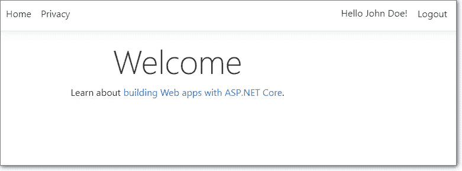

# 在 ASP.NET 核心 web 应用程序中添加额外声明

> 原文：<https://levelup.gitconnected.com/add-extra-user-claims-in-asp-net-core-web-applications-1f28c98c9ec6>


[ASP.NET 核心文档](https://docs.microsoft.com/en-us/aspnet/core/security/authorization/claims)详细解释了什么是索赔以及如何检查索赔。但是，没有关于如何创建新声明并将其附加到用户对象的信息。

在这里，我们将填补这一空白，并为您提供一步一步的指导，告诉您如何添加新的索赔，并在视图(页面)或 ASP.NET 核心应用程序的任何其他部分使用它。

# 问题

让我们描述一下我们要解决的任务。

1.  我们有一个 ASP.NET 核心(2.1+版)项目，它具有由 ASP.NET 身份库提供的默认认证/授权功能
2.  在我们的身份模型类(假设是`ApplicationUser`)中有一个用户名字段(例如`ContactName`)。
3.  我们希望将那个`ContactName`列的值添加到用户声明中，然后在用户登录时显示在我们的主页上(而不是默认显示的用户电子邮件)。

以下是我们为实现目标将要执行的步骤。

# 步骤 1:添加新索赔

## 1.1.创建一个定制的“声明原则”工厂

我们需要一个`IUserClaimsPrincipalFactory`的实现，它将为用户的声明添加必要的信息(在我们的例子中是`ContactName`)。最简单的方法是从默认实现`IUserClaimsPrincipalFactory`中派生出我们的新类，并覆盖一个方法`GenerateClaimsAsync`:

```
public class MyUserClaimsPrincipalFactory : UserClaimsPrincipalFactory<ApplicationUser> 
{     
    public MyUserClaimsPrincipalFactory(
        UserManager<ApplicationUser> userManager,
        IOptions<IdentityOptions> optionsAccessor)
            : base(userManager, optionsAccessor)     
    {
    }

    protected override async Task<ClaimsIdentity>GenerateClaimsAsync(ApplicationUser user)
    {
         var identity = await base.GenerateClaimsAsync(user);
         identity.AddClaim(new Claim("ContactName", user.ContactName ?? "[Click to edit profile]"));         
         return identity;     
    } 
}
```

## 1.2 在 DI 容器中注册新的类

然后我们需要在依赖注入容器中注册我们的新类。最好的方法是使用`AddClaimsPrincipalFactory`扩展方法:

```
public void ConfigureServices(IServiceCollection services)  
{     
        .     .     .     .      . 
    services.AddDefaultIdentity<ApplicationUser>()
        .AddDefaultUI(UIFramework.Bootstrap4)
        .AddEntityFrameworkStores<ApplicationDbContext>()
        .AddClaimsPrincipalFactory<MyUserClaimsPrincipalFactory>();  //<---- add this line 
}
```

就是这样。ID 为`ContactName`的新声明将被添加到代表当前用户的对象中。

现在，我们需要在 Razor 视图(第页)或应用程序中的任何其他地方获取新索赔的值。

# 步骤 2:获得新的索赔

为了获得任何声明的值，我们只需要引用代表当前登录用户的`ClaimsPrincipal`对象。这个对象可以通过任何 Razor 视图(页面)的`User`属性来访问，或者通过控制器类中的`HttpContext.User`来访问，或者一般来说，在任何可以访问`HttpContext`对象的地方。

`ClaimsPrincipal`包含与当前用户相关的所有声明的列表，您可以调用它的`FindFirst`方法来获取必要的声明，然后读取该声明的`Value`属性。

所以，我们只需要打开`Pages/Shared/`(或`Views/Shared/`)文件夹中的`_LoginPartical.cshtml`文件，替换下面一行:

```
<a asp-area="" asp-controller="Manage" asp-action="Index" title="Manage">Hello @User.Identity.Name!</a>
```

有了这个:

```
<a asp-area="" asp-controller="Manage" asp-action="Index" title="Manage">Hello @(User.FindFirst("ContactName").Value)!</a>
```

# 搞定了。

现在，在你的网页顶部，你将看到这样的东西，而不是类似于`Hello john.doe@yourcompany.com`的东西:



一个默认 ASP.NET 核心应用程序主页的示例，其用户名来自自定义声明

*最初发表于* [*。NET stories 博客*](https://korzh.com/blogs/dotnet-stories/add-extra-user-claims-aspnet-core-webapp)*2019 . 5 . 14。*

[](https://gitconnected.com/learn) [## 了解如何编码-查找编码教程| gitconnected

### 从开发者提交和排名的教程中学习任何编程语言、框架或库。教程是…

gitconnected.com](https://gitconnected.com/learn)