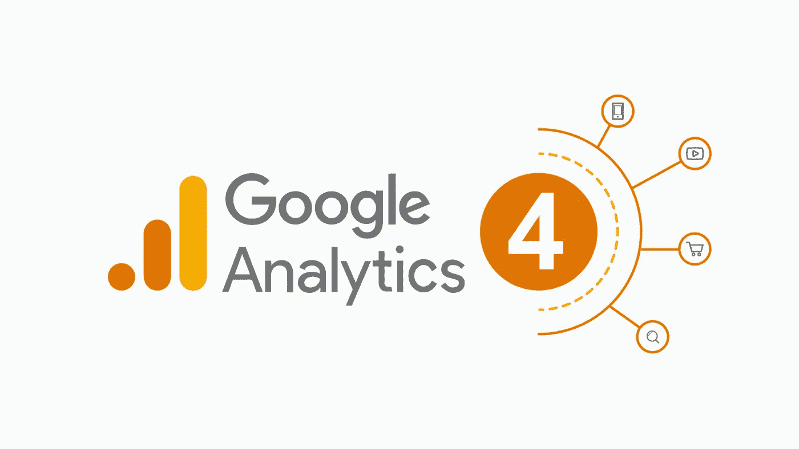
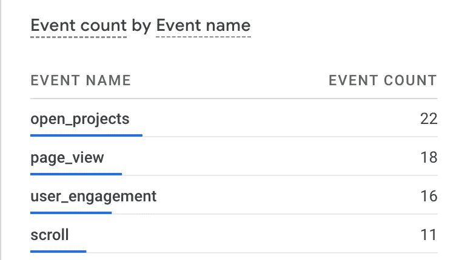

# 添加 Google Analytics 以在 5 分钟内做出反应/下一步

> 原文：<https://levelup.gitconnected.com/add-google-analytics-to-react-next-in-5-minutes-1ddb890dd226>



# 介绍

网站和应用程序有大量的追踪器，但是它们服务于许多目的，有些是好的目的。

假设您想要跟踪有多少用户访问了您的网站，有多少用户实际使用了某个功能，或者有多少用户在执行某些操作时掉线。

谷歌分析是最出色的跟踪工具之一。因此，我写这篇文章是为了向你展示如何将谷歌分析整合到你的 React 应用中。

# 建立

首先，你需要创建一个谷歌账户，你可能已经有了。

然后你需要为你的应用程序注入一些谷歌标签管理器的脚本:

```
 <Script
        async
        strategy="afterInteractive"
        src="https://www.googletagmanager.com/gtag/js?id=YOUR ID"
      ></Script>
      <Script strategy="afterInteractive" id="gtm">
        {`
           window.dataLayer = window.dataLayer || [];
           function gtag(){dataLayer.push(arguments);}
           gtag('js', new Date());
           gtag('config', YOUR ID,{ 'debug_mode':true });
        `}
      </Script>
```

第一个脚本标记是安装 GTM，第二个标记是配置 Google 标记，您需要提供您的 GTM id，您可以启用调试模式来检查操作。

# 发送事件

虽然默认情况下，谷歌提供了一些内置事件，如页面浏览事件或滚动到底部事件。我们可以在仪表板上创建自定义事件

但是在我看来，为了更好的行为定制，我们应该从我们的代码中触发定制事件。所以我为此创建了一个实用程序:

```
type WindowWithDataLayer = Window & {
  gtag: Function;
};

declare const window: WindowWithDataLayer;

type TrackerProps = {
  eventName: string;
};

export const tracker = ({ eventName }: TrackerProps) => {
  window.gtag('event', eventName);
};
```

使用`tracker`函数，我们将能够使用自定义的事件名称触发任何我们喜欢的事件(您甚至可以提供参数，只需自定义上面的我的函数)。这就是它的名称:

```
 onClick={() => {
            tracker({ eventName: 'open_projects' });
            set(open => !open);
          }}
```

我在 click 上触发了一个名为`open_projects`的事件。



我多次尝试触发该事件，以查看它是否工作，正如您所见，它工作得非常完美。

# 结论

这只是一个非常基本的教程，告诉你如何在你的应用程序中实现谷歌分析，你可以修改上面的例子来发送参数，或者去谷歌的仪表板创建高级事件。

# 遗言

虽然我的内容对每个人都是免费的，但是如果你觉得这篇文章有帮助，[你可以在这里给我买杯咖啡](https://www.buymeacoffee.com/kylele19)