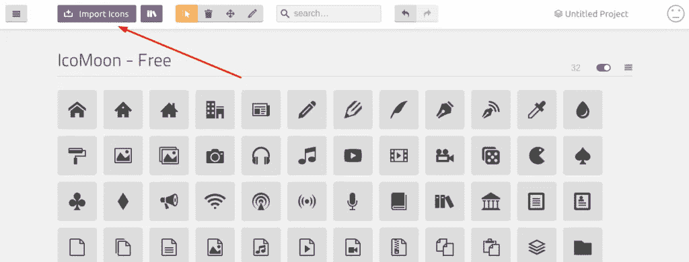

# 分三步为 React、Angular 或 Vue 应用添加图标

> 原文：<https://levelup.gitconnected.com/add-icons-to-react-angular-or-vue-apps-in-3-steps-65ce4567c402>

[添加图标反应，角度或 Vue 应用程序在 3 个步骤由 Aditya Tyagi](https://adityatyagi.com/index.php/2019/12/25/how-to-add-icons-to-react-angular-vue-apps/)

使用 SVG 图标作为字体的初学者指南

在很多用例中，我们需要根据用户行为来控制图标和图像的样式。当用户将鼠标悬停在图标/图像上或点击图标/图像时，这些用例就会浮现出来。

我们可以通过使用图标的 SVG 并操作 SVG 图像的`fill`属性来获得想要的结果。老实说，这工作量太大了。这也降低了代码的可读性。

# 我们能用它实现什么？

[德克斯特的实验室](https://en.wikipedia.org/wiki/Dexter%27s_Laboratory)

完美的用户体验是留住用户的最重要和决定性因素之一。一个产品的成功不仅仅取决于新用户/访问者的数量，还取决于重复用户/回头客的数量。

因此，练习这种将图标作为字体导入的方法将有助于提高用户体验。与不同格式的不同图像相比，开发人员也很容易将图标/图像用作字体。

一旦你把图标当作字体，你就把它们当作一个整体。您现在已经具备了字体的所有 CSS 属性，现在可以对它们进行应用了。其中一些是:

1.  改变字体大小(改变图标/图像的大小)
2.  改变颜色
3.  更改背景颜色

# 怎么会？

[扁平图标](https://www.flaticon.com/)

我将使用以下回购:[可扩展的角度文件夹结构](https://github.com/adityatyagi/scalable-angular-folder-structure)进行演示。克隆它并跟着做。

我将在 angular 应用程序中添加来自最著名来源之一的图标— [Flaticon](https://www.flaticon.com/) 作为字体。

# 步骤 1:下载图标

从[平面图标](https://www.flaticon.com/)下载所需图标。我将下载`.svg`格式的社交媒体图标。

*   脸谱网
*   照片墙
*   商务化人际关系网
*   推特
*   油管（国外视频网站）

SVG 格式的社交媒体图标

# 步骤 2:将图标转换为字体

为此，我们将使用 [Icomoon](https://icomoon.io/) 的服务。这个工具不仅有助于将图标(`svg`)转换成字体，也有助于将相关的图标放在一个组中(或者按照他们的说法设置)。这是一个非常好的特性。我们也可以创建一个帐户，管理我们所有的项目图标。老实说，在一个免费的工具中，所有这一切都令人印象深刻！

首先访问 [Icomoon](https://icomoon.io/) 应用程序。

*从我的* [*常用*](https://icomoon.io/) *app* 开始

使用 ***导入图标*** 按钮导入 SVG 图标，它将创建一个 ***无标题集合*中所有图标的列表。**

在 Icomoon 中导入图标

然后，通过单击选择所有图标。

*选中的图标将有黄色边框*

点击右下角的 ***生成字体*** 按钮。这将为您的 SVG 图标生成字体，并提供下载字体的选项。下载选项会出现在右下角。

*生成字体并下载*

# 步骤 3:在应用程序中导入生成的字体

下载完字体后，你会得到一个压缩文件。提取它，你会看到一堆文件和文件夹如下:

*Icomoon 字体文件*

移动到我们应用程序中的 ***资产*** 文件夹，创建一个 ***图标*** 文件夹。将所有文件从 Icomoon 的 ***字体*** 文件夹中取出。

将字体文件添加到应用程序的资源文件夹

接下来，我们创建一个 ***scss*** 文件夹，再里面是 ***assets*** 文件夹。我们将在 ***scss*** 文件夹中添加另一个嵌套文件夹— **模块**。在那里我们将创建一个文件`_icon.scss`

使用字体创建样式表

接下来，从 Icomoon 生成的`style.css`中复制所有内容并粘贴到`_icon.scss`文件中。

> **注意**:确保导入字体时路径正确。我还在`_icons.scss`文件中添加了注释，这样你就不会错过了。

现在，你已经把所有的图标都作为**类**了。

*   脸书— **图标-facebook-logo**
*   Instagram — **图标—insta gram—logo**
*   LinkedIn — **图标—LinkedIn—logo**
*   推特— **图标—推特**
*   YouTube — **图标—YouTube**

接下来，我们将`*_icons.scss*`文件导入我们的主样式表— `style.scss`

# 第四步:发动引擎！

我试着在登陆页面上使用字体，并修改了一些 CSS 属性，比如图标的颜色、字体大小和背景。我也给 facebook 的图标添加了样式，当你悬停在它上面时。在这里查看。

*图标作为字体*

# 登录页面代码— HTML

# 登录页面代码— SCSS

# 第五步:享受！

小黄人——好的，再见！

谢谢你的时间。我希望我能带来价值。

我在一些社交媒体渠道上是可以联系到的，所以请考虑在以下网站上查看我:

*   特别是如果你对编程和软件开发感兴趣的话。
*   [**LinkedIn**](https://www.linkedin.com/in/aditya-tyagi-03b4189a/) 如果你想获得一些合作机会。