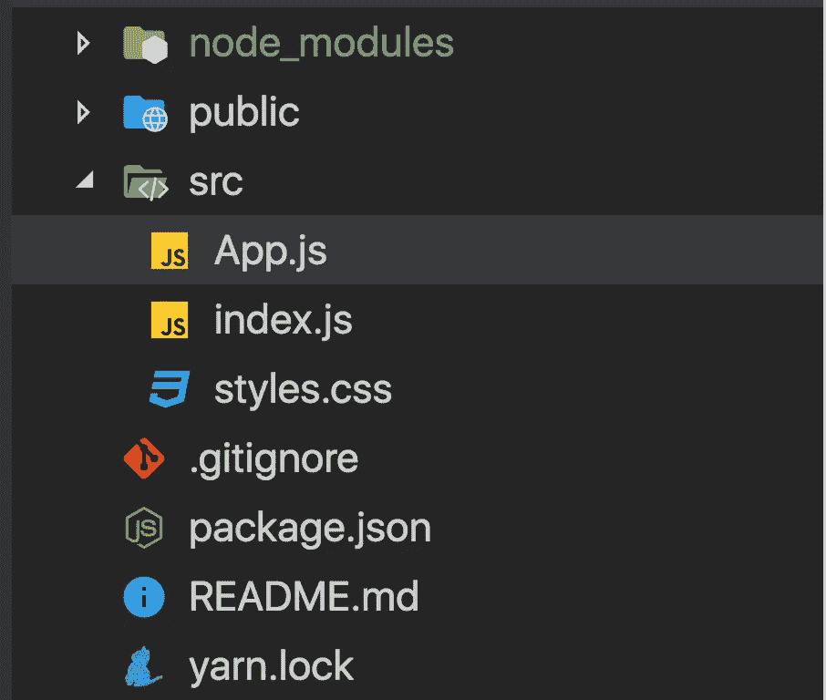
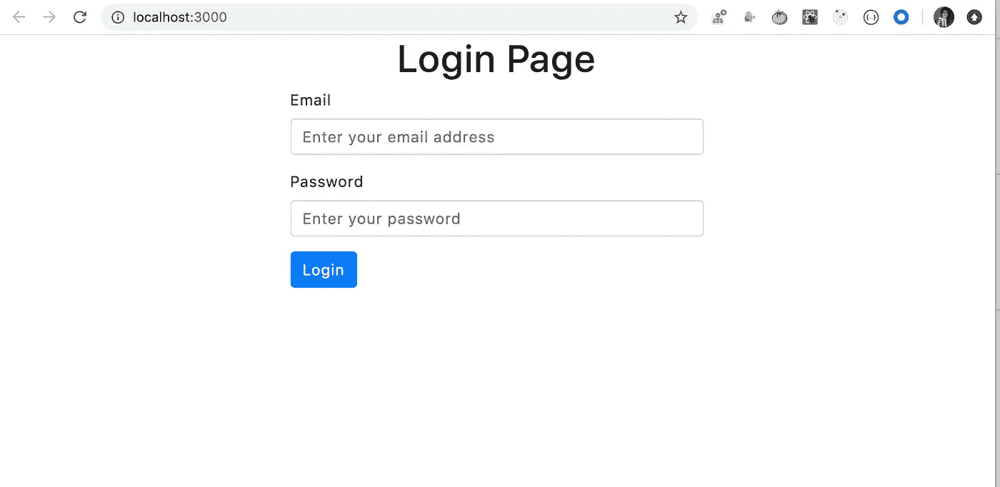
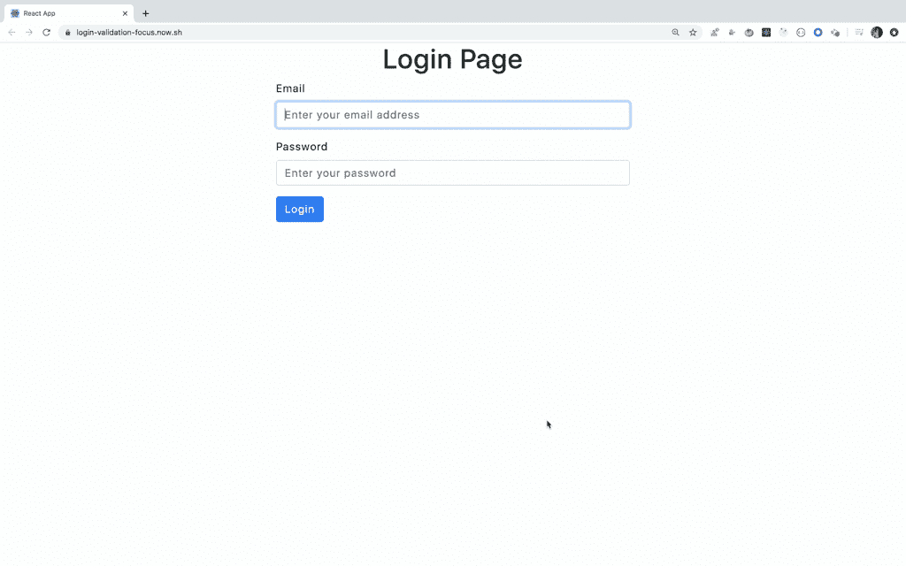

# 使用 React refs 通过自动聚焦输入进行单个字段验证

> 原文：<https://levelup.gitconnected.com/add-individual-field-validation-with-auto-focused-input-to-login-form-3267bd27d67c>

了解如何使用多个引用并管理输入焦点


照片由[蔡斯·克拉克](https://unsplash.com/@chaseelliottclark?utm_source=medium&utm_medium=referral)在 [Unsplash](https://unsplash.com?utm_source=medium&utm_medium=referral) 拍摄

在本文中，我们将探讨如何在页面加载时自动将焦点添加到输入字段，并显示单个输入字段验证错误，相应的输入字段会自动聚焦到验证错误上。这避免了用户聚焦输入元素来输入值的需要。

所以让我们开始吧。

我们将使用`create-react-app`来初始化项目。

通过运行以下命令创建一个新项目

```
create-react-app login-validation-focus
```

项目创建完成后，删除`src`文件夹中的所有文件，在`src`文件夹中创建`index.js`、`App.js`、`styles.css`文件。

因此，您的文件夹结构将如下所示



我们将使用`react-bootstrap`和`bootstrap`使应用程序响应迅速，因此安装时使用:

```
npm install react-bootstrap@1.0.0-beta.16 bootstrap@4.4.1
```

打开 index.js 并添加以下代码:

```
import React from 'react';
import ReactDOM from 'react-dom';
import App from './App';
import 'bootstrap/dist/css/bootstrap.min.css';
import './styles.css';const rootElement = document.getElementById('root');
ReactDOM.render(<App />, rootElement);
```

打开 styles.css 并添加以下代码:

打开 App.js 并添加以下代码:

好，现在让我们来理解这个代码。

1.我们在这里使用`useState`钩子来处理状态。如果你是 React 钩子的新手，看看这篇文章了解钩子的基础知识

2.此外，我们还添加了`email`和`password`输入字段以及它们的`onChange`处理程序

3.每个输入字段都有一个与状态属性完全匹配的名称，因此我们可以在表单提交处理程序中轻松设置状态。

4.我们使用单个事件处理器`handleInputChange`来处理电子邮件和密码输入字段的更改

5.我们已经使用`useRef`钩子创建了两个独立的引用`emailRef`和`passwordRef`，并使用`ref={emailRef}`和`ref={passwordRef}`将引用分配给各自的输入字段，因此我们可以管理输入字段的焦点

现在，如果您根据您的`create-react-app`版本使用`yarn start`或`npm start`运行应用程序，您将看到初始登录屏幕



添加两个新的状态值，用于处理成功和错误消息。

```
const [errorMsg, setErrorMsg] = useState('');const [successMsg, setSuccessMsg] = useState('');
```

现在让我们添加一些验证代码。

将`onSubmit={handleOnSubmit}`添加到`Form`标签中，并添加以下两个用于管理验证的方法。

现在，添加下面的代码，在`Form`标签上方显示错误和成功消息。

```
{successMsg && <p className="successMsg">{successMsg}</p>}{errorMsg && <p className="errorMsg">{errorMsg}</p>}
```

您的 App.js 现在将如下所示:

如果您现在检查应用程序，您可以看到，如果您直接点击`Login`按钮而不输入任何值，会显示错误消息，并且第一个空输入会自动聚焦。

让我们了解一下我们在验证方法中做了什么。

1.  在`validateInput`方法中，我们用与表单的每个输入字段相关的`name`、`value`和`message`属性声明了`fields`数组。
2.  然后我们调用数组`some`方法。一旦函数中提供的条件得到满足，array `some`方法允许我们停止对数组的循环，如果任何数组元素的条件得到满足，它将返回 true。
3.  在这里，如果有任何输入值为空，我们将退出循环。
4.  `some`在我们的例子中，一旦找到第一个值为空的输入元素，方法就会停止。
5.  如果条件匹配，我们设置与该输入字段相关的错误消息，并使用`emailRef.current.focus()`或`passwordRef.current.focus()`聚焦该输入字段

现在，让我们添加一些代码，以便在页面加载时自动聚焦电子邮件输入字段。

```
useEffect(() => {
 emailRef.current.focus();
}, []);
```

因为我们已经提供了空数组`[]`作为`useEffect`的第二个参数，所以当组件被挂载时`useEffect`中的代码将只被执行一次。

你最终的 App.js 现在会是这个样子。



完整源代码:
【https://github.com/myogeshchavan97/login-validation-focus 

现场演示:[https://login-validation-focus.now.sh/](https://login-validation-focus.now.sh/)

今天就到这里。希望你今天学到了新东西。

**别忘了订阅我的每周简讯，里面有惊人的技巧、诀窍和文章，直接在你的收件箱** [**这里。**](https://yogeshchavan.dev/)