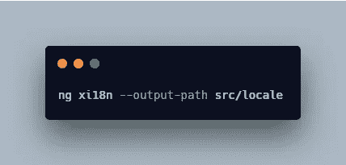
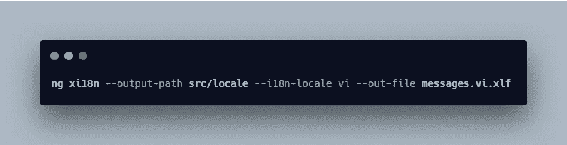
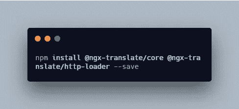
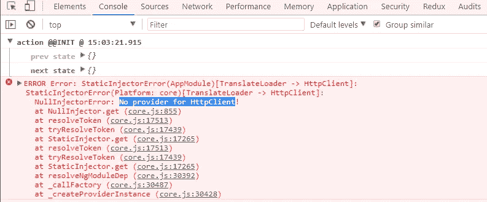
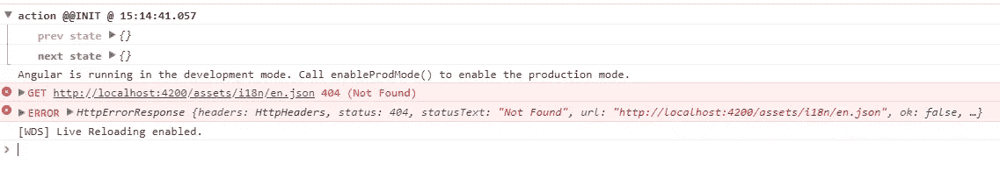

# 向 Angular 应用程序添加国际化(i18n)

> 原文：<https://levelup.gitconnected.com/add-internationalization-i18n-to-an-angular-app-b8fa8b51deea>

## 以 3 种不同方式将国际化和本地化添加到 Angular 应用程序的指南

照片由 [Demi DeHerrera](https://unsplash.com/@demidearest?utm_source=unsplash&utm_medium=referral&utm_content=creditCopyText) 在 [Unsplash](https://unsplash.com/search/photos/coffee?utm_source=unsplash&utm_medium=referral&utm_content=creditCopyText) 上拍摄

在本文中，我将提供 3 种方法来为 Angular 8 应用程序添加国际化。

1.  使用`ng xi18n`
2.  安装`ngx-translate`
3.  创建自己的解决方案(无库)

*更多类似内容，请查看*[*https://betterfullstack.com*](https://betterfullstack.com/stories/)

在入门之前，我们需要先了解什么是**国际化*****本地化** *什么是*。*

***国际化**是指设计和准备您的应用程序以供不同语言使用的过程。*

***本地化**是将你的国际化应用程序翻译成特定语言的过程。*

# *使用 xi18n*

*对于本地化，您可以使用 [Angular CLI](https://angular.io/cli) 来生成为翻译人员创建文件和以多种语言发布应用程序所需的大部分样板文件。将应用程序设置为使用 i18n 后，CLI 可以帮助您完成以下步骤:*

*   *将可本地化的文本提取到一个可以发送出去进行翻译的文件中。*
*   *使用翻译后的文本为给定的语言环境构建和提供应用程序。*
*   *创建应用程序的多语言版本。*

*为此，在元素中添加一个`i18n`管道。只需运行以下命令:*

**

*生成区域设置文件*

*默认情况下，Angular 使用区域设置`en-US`，这是美国使用的英语。*

*然后，我们可以通过运行以下命令来添加另一种语言:*

**

*添加 vi 语言*

*然后我们去`messages.vi.xlf`修改那里的文本。为第二语言添加一个[配置](https://angular.io/guide/i18n#merge-with-the-aot-compiler)至`angular.json`。*

*现在运行`ng serve configuration=vi`。你可以在这里查看样品[。](https://github.com/hoangtranson/sample-xi18n-angular)*

*你必须为每种语言构建每一次，并为你的语言指定一个不同的`base-href`。这让我有时很不舒服。此外，`.xlf`文件也很难读取。*

*我们再来看另一个添加 i18n 的选项。*

# *使用 ngx-翻译*

*`ngx-translate`是 Angular 的国际化(i18n)库。这个库很容易安装和使用。*

*我已经使用这个图书馆很长时间了。每当我开始一个新的大型项目时，我都会使用这个库，因为它有很多好处。*

1.  *它们提供了获取模板和组件文件翻译的方法。*
2.  *它们支持多个 JSON 属性级别。*
3.  *他们提供了许多方法来使用。*
4.  *它们允许你定制你自己的加载器。*
5.  *在缺少翻译的情况下，我们可以添加一个值。*
6.  *它们支持生产模式下的 AOT 编译。*

*安装:*

**

*`@ngx-translate/core`包含翻译的核心例程——`TranslateService`和一些管道。*

*`@ngx-translate/http-loader`从您的服务器加载翻译文件。*

*更新代码:*

*应用程序模块*

*项目中的 AOT(提前)编译需要`HttpLoaderFactory`。*

*在`app.component.ts`将默认语言设置为`en`*

*问题:*

**

*HttpClient 没有提供程序*

*我导入了`HttpClientModule`来解决这个问题。*

**

*[http://localhost:4200/assets/i18n/en . JSON](http://localhost:4200/assets/i18n/en.json)404(未找到)*

*我按照 URL 创建了`en.json`。你可以在这里阅读更多关于这个伟大图书馆的信息。*

# *创建自己的解决方案(无库)*

*对于简单的角度项目和任何只需要基本翻译的项目，我总是使用这种方法。此外，从头开始构建一些东西也是一个好主意，可以更多地了解我们正在解决的问题。*

*我们的想法是手动添加一个本地 JSON 文件，并通过 HTTP 加载该文件。然后，在模板中，我们将一个转换键传递给一个管道，该管道将把该键传递给一个对象，以获取该属性的值。*

*步骤如下:*

1.  *在`assets`文件夹中创建一个`locale`文件夹。*
2.  *创建`**TranslateService**`并使用`**HttpClient**`加载语言环境文件。添加一个公共变量`**translateObject**`在管道文件中调用它。*
3.  *创建一个`**TranslatePipe**`，它从模板中接收一个关键字，并从`**TranslateService**`将它映射到`**translateObject**`。*

*你可以在这里查看源代码[。](https://github.com/hoangtranson/simple-translation-angular)*

*这很简单，我通常将它用于登陆页面或简单的项目。但是它不能有像`ngx-trsnlate`这样的嵌套属性，也不能为翻译绑定动态值。*

*对于那些想尝试新库的人，可以去看看 [transcolo](https://github.com/ngneat/transloco/) 。那是由 [Netanel Basal](https://netbasal.com/@NetanelBasal) 建造的。*

# *摘要*

*国际化和本地化是应用程序的重要组成部分。我们可以使用 angular-cli 来支持它，或者安装一个库来节省您的时间。*

*对于基本的 web 应用程序，我们可以创建自己的翻译系统。这也是了解其工作原理的好方法。*

*我希望这篇文章对你有用！可以跟着我上[媒](https://medium.com/@transonhoang)。我也在推特上。欢迎在下面的评论中留下任何问题。我很乐意帮忙！*

# *资源/参考资料*

*[1]:i18n[https://angular.io/guide/i18n](https://angular.io/guide/i18n)*

*[2]:ngx-翻译库[https://github.com/ngx-translate/core](https://github.com/ngx-translate/core)*

* [## 学习角度-最佳角度教程(2019) | gitconnected

### 50 大角度教程-免费学习角度。课程由开发人员提交和投票，使您能够…

gitconnected.com](https://gitconnected.com/learn/angular)  [## 故事-更好的全栈

### 关于 JavaScript、Python 和 Wordpress 的有用文章，有助于开发人员减少开发时间并提高…

betterfullstack.com](https://betterfullstack.com/stories/)*