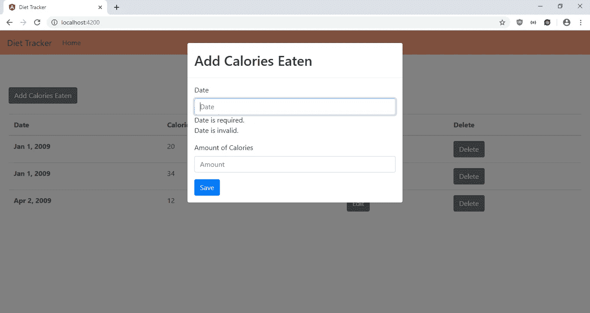
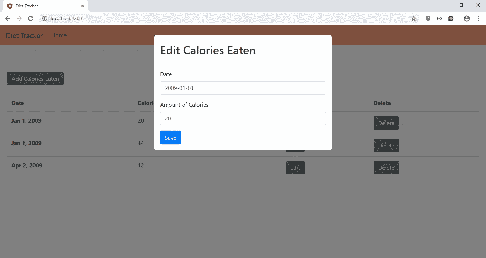
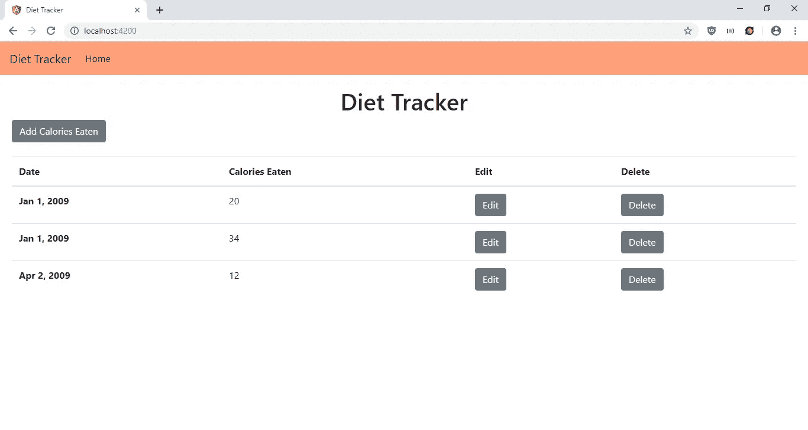

# 向 Angular 应用程序添加键盘快捷键

> 原文：<https://levelup.gitconnected.com/add-keyboard-shortcut-feature-to-your-angular-app-caed227d24cf>



键盘快捷键对用户来说是非常方便的功能。这使得他们无需点击鼠标就能完成工作，从而提高了工作效率。使用[Angular 2-热键库](https://www.npmjs.com/package/angular2-hotkeys)，可以轻松将键盘快捷键操作添加到 Angular 应用程序中。

在本文中，我们将编写一个饮食跟踪器应用程序，让用户输入他们在给定的一天里摄入的卡路里。他们可以使用键盘快捷键来打开模式以添加条目，也可以删除最新的条目。为了启动这个项目，我们通过运行`npm i -g @angular/cli`来安装 Angular CLI。接下来，我们通过键入以下命令运行 Angular CLI 来创建项目:

```
ng new diet-tracker
```

在设置向导中，我们选择包含路由并使用 SCSS 作为我们的 CSS 预处理器。

然后我们安装一些软件包。我们需要上面提到的 [angular2-hotkeys](https://www.npmjs.com/package/angular2-hotkeys) 包，用于样式化的 Ngx-Bootstrap，以及用于在共享存储中存储数据的 MobX。要安装它们，我们运行:

```
npm i ngx-bootatrap angular2-hotkeys mobx mobx-angular
```

接下来，我们创建我们的组件和服务。为此，我们运行:

```
ng g component dietForm
ng g component homePage
ng g service diet
ng g class calorie
ng g class dietStore
```

现在我们准备写一些代码。在`diet-form.component.html`中，我们将现有代码替换为:

```
<form (ngSubmit)="save(dietForm)" #dietForm="ngForm">
  <div class="form-group">
    <label>Date</label>
    <input
      type="text"
      class="form-control"
      placeholder="Date"
      #date="ngModel"
      name="date"
      [(ngModel)]="form.date"
      required
      pattern="([12]\d{3}-(0[1-9]|1[0-2])-(0[1-9]|[12]\d|3[01]))"
    />
    <div *ngIf="date?.invalid && (date.dirty || date.touched)">
      <div *ngIf="date.errors.required">
        Date is required.
      </div>
      <div *ngIf="date.invalid">
        Date is invalid.
      </div>
    </div>
  </div> <div class="form-group">
    <label>Amount of Calories</label>
    <input
      type="text"
      class="form-control"
      placeholder="Amount"
      #amount="ngModel"
      name="amount"
      [(ngModel)]="form.amount"
      required
      pattern="^(\d*\.)?\d+$"
    />
    <div *ngIf="amount?.invalid && (amount.dirty || amount.touched)">
      <div *ngIf="amount.errors.required">
        Amount is required.
      </div>
      <div *ngIf="amount.invalid">
        Amount is invalid.
      </div>
    </div>
  </div> <button class="btn btn-primary">Save</button>
</form>
```

我们添加了一个表单，让用户输入他们吃东西的日期和当天摄入的卡路里量。我们使用 Angular 的模板驱动表单验证来检查所有内容是否都已填写，验证日期是否为 YYYY-MM-DD 格式，并检查卡路里计数是否为非负数。我们还有一个保存按钮，当点击它时保存数据。该表单用于添加和编辑条目。

接下来在`diet-form.component.ts`中，我们将现有代码替换为:

```
import { Component, OnInit, Output, EventEmitter, Input, SimpleChanges } from '[@angular/core](http://twitter.com/angular/core)';
import { NgForm } from '[@angular/forms](http://twitter.com/angular/forms)';
import { DietService } from '../diet.service';
import { caloriesStore } from '../diet-store';
import { Calorie } from '../calorie';[@Component](http://twitter.com/Component)({
  selector: 'app-diet-form',
  templateUrl: './diet-form.component.html',
  styleUrls: ['./diet-form.component.scss']
})
export class DietFormComponent implements OnInit {
  form: any = <any>{};
  [@Output](http://twitter.com/Output)('saved') saved = new EventEmitter();
  [@Input](http://twitter.com/Input)() edit: boolean;
  [@Input](http://twitter.com/Input)() selectedCalorie: any;
  store = caloriesStore;constructor(private dietService: DietService) { } ngOnInit() {
  } ngOnChanges(changes: SimpleChanges) {
    this.form = Object.assign({}, this.selectedCalorie);
  } save(dietForm: NgForm) {
    if (dietForm.invalid) {
      return;
    }
    if (this.edit) {
      this.dietService.editCaloriesEaten(this.form)
        .subscribe(res => {
          this.getCaloriesEaten()
          this.saved.emit();
        })
    }
    else {
      this.dietService.addCaloriesEaten(this.form)
        .subscribe(res => {
          this.getCaloriesEaten()
          this.saved.emit();
        })
    }
  } getCaloriesEaten() {
    this.dietService.getCaloriesEaten()
      .subscribe((res: Calorie[]) => {
        res = res.sort((a, b) => +new Date(a.date) - +new Date(b.date));
        this.store.setCalories(res);
      })
  }}
```

这个文件包含了我们在之前的模板中调用的函数，比如`save`函数。我们还有从主页获取数据的输入，以及向主页发出`saved`事件的输出。因为我们使用表单进行编辑，所以我们还需要用`selectedCalorie`输入来传递选中的条目，这样它就可以被编辑了。为了用`selectedCalorie`值更新`form`对象，每当`selectedCalorie`输入改变时，我们复制该值。

在`save`函数中，我们验证表单，并根据表单是用于添加还是编辑条目来调用不同的函数进行保存。通过调用`getCaloriesEaten`函数，最新的条目将被填充到我们的 MobX 存储中，一旦完成，将发出`saved`事件。

接下来在`home-page.component.html`中，我们将代码替换为:

```
<ng-template #addTemplate>
  <div class="modal-header">
    <h2 class="modal-title pull-left">Add Calories Eaten</h2>
  </div>
  <div class="modal-body">
    <app-diet-form (saved)="closeModals()"></app-diet-form>
  </div>
</ng-template><ng-template #editTemplate>
  <div class="modal-header">
    <h2 class="modal-title pull-left">Edit Calories Eaten</h2>
  </div>
  <div class="modal-body">
    <app-diet-form
      [edit]="true"
      (saved)="closeModals()"
      [selectedCalorie]="selectedCalorie"
    ></app-diet-form>
  </div>
</ng-template><h1 class="text-center">Diet Tracker</h1><div class="btn-group" role="group">
  <button
    type="button"
    class="btn btn-secondary"
    (click)="openAddModal(addTemplate)"
  >
    Add Calories Eaten
  </button>
</div><div class="table-responsive">
  <br />
  <table class="table">
    <thead>
      <tr>
        <th scope="col">Date</th>
        <th scope="col">Calories Eaten</th>
        <th scope="col">Edit</th>
        <th scope="col">Delete</th>
      </tr>
    </thead>
    <tbody>
      <tr *ngFor="let c of store.calories">
        <th scope="row">{{ c.date | date }}</th>
        <td>{{ c.amount }}</td>
        <td>
          <button
            type="button"
            class="btn btn-secondary"
            (click)="openEditModal(editTemplate, c)"
          >
            Edit
          </button>
        </td>
        <td>
          <button
            type="button"
            class="btn btn-secondary"
            (click)="deleteCaloriesEaten(c.id)"
          >
            Delete
          </button>
        </td>
      </tr>
    </tbody>
  </table>
</div>
```

这将创建用于添加、编辑和删除条目的按钮，以及用于显示条目的表格。此外，我们有用于添加和编辑条目的模态，我们分别用添加和编辑按钮打开它们。

接下来在`home-page.component.ts`中，我们将现有代码替换为:

```
import { Component, OnInit, TemplateRef, ViewChild } from '[@angular/core](http://twitter.com/angular/core)';
import { BsModalService, BsModalRef } from 'ngx-bootstrap/modal';
import { caloriesStore } from '../diet-store';
import { DietService } from '../diet.service';
import { HotkeysService, Hotkey } from 'angular2-hotkeys';
import { Calorie } from '../calorie';[@Component](http://twitter.com/Component)({
  selector: 'app-home-page',
  templateUrl: './home-page.component.html',
  styleUrls: ['./home-page.component.scss']
})
export class HomePageComponent implements OnInit {
  addModalRef: BsModalRef;
  editModalRef: BsModalRef;
  selectedCalorie: any = <any>{};
  store = caloriesStore;
  [@ViewChild](http://twitter.com/ViewChild)('addTemplate', undefined) addTemplate: TemplateRef<any>; constructor(
    private modalService: BsModalService,
    private dietService: DietService,
    private _hotkeysService: HotkeysService
  ) { } ngOnInit() {
    this.getCaloriesEaten();
    this.addHotKeys();
  } addHotKeys() {
    this._hotkeysService.add(new Hotkey(['ctrl+shift+a', 'ctrl+shift+d'], (event: KeyboardEvent, combo: string): boolean => {
      if (combo === 'ctrl+shift+a') {
        this.openAddModal(this.addTemplate);
      } if (combo === 'ctrl+shift+d') {
        if (Array.isArray(this.store.calories) && this.store.calories[0]) {
          this.deleteCaloriesEaten(this.store.calories[0].id);
        }}
      return false;
    }));
  } getCaloriesEaten() {
    this.dietService.getCaloriesEaten()
      .subscribe((res: any[]) => {
        res = res.sort((a, b) => +new Date(a.date) - +new Date(b.date));
        this.store.setCalories(res);
      })
  } openAddModal(template: TemplateRef<any>) {
    this.addModalRef = this.modalService.show(template);
  } openEditModal(template: TemplateRef<any>, calorie) {
    this.editModalRef = this.modalService.show(template);
    this.selectedCalorie = calorie;
  } closeModals() {
    this.addModalRef && this.addModalRef.hide();
    this.editModalRef && this.editModalRef.hide();
  } deleteCaloriesEaten(id) {
    this.dietService.deleteCaloriesEaten(id)
      .subscribe((res: Calorie[]) => {
        this.getCaloriesEaten();
      })
  }
}
```

我们有`openAddModal`和`openEditModal`函数来打开添加和编辑模式。`closeModals`功能用于在`app-diet-form`组件中保存东西时关闭模态。`deleteCaloriesEaten`功能用于删除卡路里，`getCaloriesEaten`用于在页面加载和项目删除时获取条目。它还将项目放在我们的存储中，这样每个组件都可以访问它。

我们也有`addHotKeys`功能来添加热键到我们的应用程序，方便用户。`HotKeyService`来自 angular2 热键库。我们注入它，然后定义热键。我们定义了 Ctrl+Shift+A 来打开添加模式，定义了 Ctrl+Shift+D 组合来删除列表中的第一个条目。回调中的`return false`语句是为了防止事件冒泡。

在`app-routing.module.ts`中，我们输入:

```
import { NgModule } from '[@angular/core](http://twitter.com/angular/core)';
import { Routes, RouterModule } from '[@angular/router](http://twitter.com/angular/router)';
import { HomePageComponent } from './home-page/home-page.component';const routes: Routes = [
  { path: '', component: HomePageComponent }
];[@NgModule](http://twitter.com/NgModule)({
  imports: [RouterModule.forRoot(routes)],
  exports: [RouterModule]
})
export class AppRoutingModule { }
```

这是为了让用户在点击链接或输入 URL 时可以看到我们刚刚添加的页面。

接下来在`app.component.html`中，我们输入:

```
<nav class="navbar navbar-expand-lg navbar-light bg-light">
  <a class="navbar-brand" routerLink="/">Diet Tracker</a>
  <button
    class="navbar-toggler"
    type="button"
    data-toggle="collapse"
    data-target="#navbarSupportedContent"
    aria-controls="navbarSupportedContent"
    aria-expanded="false"
    aria-label="Toggle navigation"
  >
    <span class="navbar-toggler-icon"></span>
  </button> <div class="collapse navbar-collapse" id="navbarSupportedContent">
    <ul class="navbar-nav mr-auto">
      <li class="nav-item active">
        <a class="nav-link" routerLink="/">Home </a>
      </li>
    </ul>
  </div>
</nav><div class="page">
  <router-outlet></router-outlet>
</div>
```

这将链接添加到我们的页面，并公开`router-outlet`以便用户可以看到我们的页面。

然后在`app.component.scss`中，我们添加:

```
.page {
  padding: 20px;
}nav {
  background-color: lightsalmon !important;
}
```

这给我们的页面添加了填充，并改变了引导导航栏的颜色。

在`app.module.ts`中，我们将现有代码替换为:

```
import { BrowserModule } from '[@angular/platform-browser](http://twitter.com/angular/platform-browser)';
import { NgModule } from '[@angular/core](http://twitter.com/angular/core)';import { AppRoutingModule } from './app-routing.module';
import { AppComponent } from './app.component';
import { HomePageComponent } from './home-page/home-page.component';
import { DietFormComponent } from './diet-form/diet-form.component';
import { ModalModule } from 'ngx-bootstrap/modal';
import { FormsModule } from '[@angular/forms](http://twitter.com/angular/forms)';
import { HttpClientModule } from '[@angular/common](http://twitter.com/angular/common)/http';
import { MobxAngularModule } from 'mobx-angular';
import { HotkeyModule } from 'angular2-hotkeys';[@NgModule](http://twitter.com/NgModule)({
  declarations: [
    AppComponent,
    HomePageComponent,
    DietFormComponent
  ],
  imports: [
    BrowserModule,
    AppRoutingModule,
    ModalModule.forRoot(),
    MobxAngularModule,
    FormsModule,
    HttpClientModule,
    HotkeyModule.forRoot()
  ],
  providers: [],
  bootstrap: [AppComponent]
})
export class AppModule { }
```

这增加了我们在应用程序中使用的组件、服务和库。

在`calorie.ts`中，我们添加:

```
export class Calorie {
    public date: string;
    public amount: string;
}
```

这给我们的卡路里形式模型增加了种类。

然后在`dietStore.ts`中，我们添加:

```
import { observable, action } from 'mobx-angular';class CaloriesStore {
    [@observable](http://twitter.com/observable) calories = [];
    [@action](http://twitter.com/action) setCalories(calories) {
        this.calories = calories;
    }
}export const caloriesStore = new CaloriesStore();
```

这就创建了 MobX store 来获取我们的组件并共享数据。每当我们在组件中调用`this.store.setCalories`时，我们设置这个商店中的卡路里数据，因为我们在它之前添加了`@action`装饰器。当我们在组件代码中调用`this.store.calories`时，我们总是从这个商店获取最新的值，因为它有`@observable`装饰器。

然后在`diet.service.ts`中，我们将现有代码替换为:

```
import { Injectable } from '[@angular/core](http://twitter.com/angular/core)';
import { HttpClient } from '[@angular/common](http://twitter.com/angular/common)/http';
import { environment } from 'src/environments/environment';[@Injectable](http://twitter.com/Injectable)({
  providedIn: 'root'
})
export class DietService { constructor(private http: HttpClient) { } getCaloriesEaten() {
    return this.http.get(`${environment.apiUrl}/calories`);
  } addCaloriesEaten(data) {
    return this.http.post(`${environment.apiUrl}/calories`, data);
  } editCaloriesEaten(data) {
    return this.http.put(`${environment.apiUrl}/calories/${data.id}`, data);
  } deleteCaloriesEaten(id) {
    return this.http.delete(`${environment.apiUrl}/calories/${id}`);
  }
}
```

这是为了让我们可以向后端发出 HTTP 请求，以获取、保存和删除用户的条目。

接下来在`environment.prod.ts`和`environment.ts`中，我们将现有代码替换为:

```
export const environment = {
  production: true,
  apiUrl: '[http://localhost:3000'](http://localhost:3000')
};
```

这将添加我们的 API 的 URL。

最后，在`index.html`中，我们将代码替换为:

```
<!DOCTYPE html>
<html lang="en">
  <head>
    <meta charset="utf-8" />
    <title>Diet Tracker</title>
    <base href="/" /><meta name="viewport" content="width=device-width, initial-scale=1" />
    <link rel="icon" type="image/x-icon" href="favicon.ico" />
    <link
      href="[https://maxcdn.bootstrapcdn.com/bootstrap/4.0.0/css/bootstrap.min.css](https://maxcdn.bootstrapcdn.com/bootstrap/4.0.0/css/bootstrap.min.css)"
      rel="stylesheet"
    />
    <script
      src="[https://code.jquery.com/jquery-3.3.1.slim.min.js](https://code.jquery.com/jquery-3.3.1.slim.min.js)"
      integrity="sha384-q8i/X+965DzO0rT7abK41JStQIAqVgRVzpbzo5smXKp4YfRvH+8abtTE1Pi6jizo"
      crossorigin="anonymous"
    ></script>
    <script
      src="[https://cdnjs.cloudflare.com/ajax/libs/popper.js/1.14.7/umd/popper.min.js](https://cdnjs.cloudflare.com/ajax/libs/popper.js/1.14.7/umd/popper.min.js)"
      integrity="sha384-UO2eT0CpHqdSJQ6hJty5KVphtPhzWj9WO1clHTMGa3JDZwrnQq4sF86dIHNDz0W1"
      crossorigin="anonymous"
    ></script>
    <script
      src="[https://stackpath.bootstrapcdn.com/bootstrap/4.3.1/js/bootstrap.min.js](https://stackpath.bootstrapcdn.com/bootstrap/4.3.1/js/bootstrap.min.js)"
      integrity="sha384-JjSmVgyd0p3pXB1rRibZUAYoIIy6OrQ6VrjIEaFf/nJGzIxFDsf4x0xIM+B07jRM"
      crossorigin="anonymous"
    ></script>
  </head>
  <body>
    <app-root></app-root>
  </body>
</html>
```

将引导 CSS 和 JavaScript 依赖项添加到我们的应用程序中，并更改标题。

做完所有工作，我们就可以运行`ng serve`来运行 app 了。

为了启动后端，我们首先通过运行`npm i json-server`来安装`json-server`包。然后，转到我们的项目文件夹并运行:

```
json-server --watch db.json
```

在`db.json`中，将文本改为:

```
{
  "calories": [
  ]
}
```

所以我们有了在可用的`requests.js`中定义的`calories` 端点。

那么我们应该得到:

