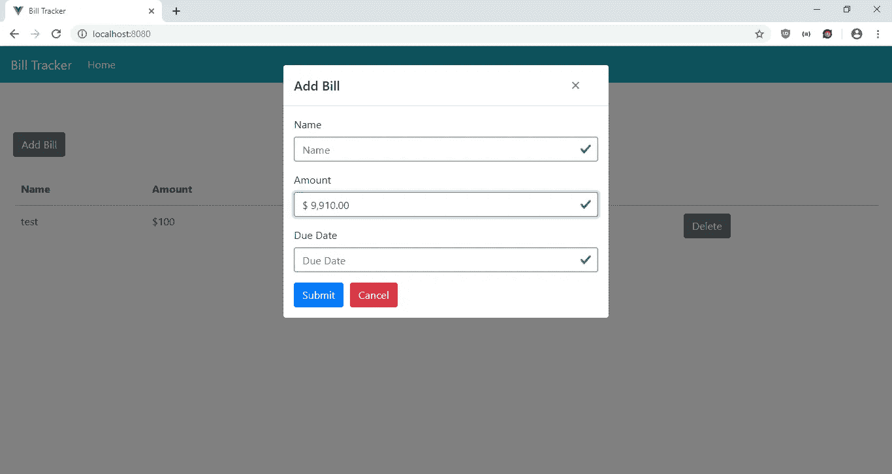
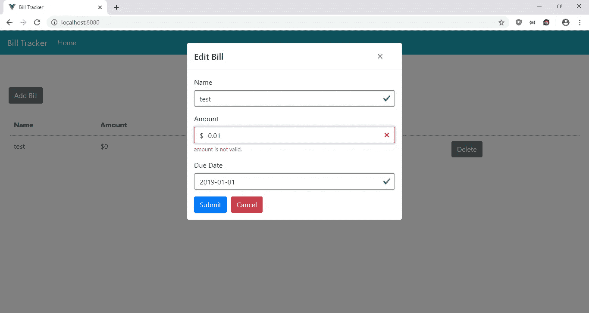
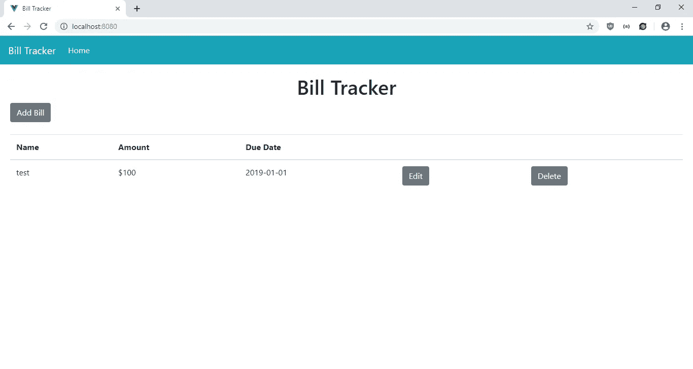

# 使用 V-Money 向您的 Vue.js 应用程序添加资金投入

> 原文：<https://levelup.gitconnected.com/add-money-inputs-to-your-vue-js-app-with-v-money-cdc88767eb69>


对于需要用户输入金额的应用程序来说，金钱输入非常方便。构建专门用于货币输入的输入组件是一项繁琐的工作。您必须添加标签来表明这是一个货币输入，并且您必须检查输入是否有效。一些输入还需要前缀、后缀和输入掩码，这使得构建输入更加困难。幸运的是，对于 Vue.js 来说，有 V-Money 库，可供开发者随时使用。

在本文中，我们将构建一个账单跟踪应用程序来跟踪用户的支出。它允许用户输入账单的名称、金额和到期日期，还可以编辑和删除它们。为了开始构建项目，我们通过运行以下命令来运行 Vue CLI:

```
npx @vue/cli create bill-tracker
```

当向导运行时，我们选择“手动选择功能”，并选择 Babel、CSS 预处理器、Vuex 和 Vue 路由器。

接下来，我们安装一些软件包。我们需要 Axios 向我们的后端发出 HTTP 请求，Bootstrap-Vue 用于样式化，Vee-Validate 用于表单验证，V-Money 用于货币输入。为了安装包，我们运行`npm i axios bootstrap-vue vee-validate v-money`。安装软件包后，我们可以开始构建我们的账单跟踪应用程序。

首先，我们创建表单让用户添加和编辑他们的账单。在`components`文件夹中，创建一个名为`BillForm.vue`的文件，并添加:

```
<template>
  <ValidationObserver ref="observer" v-slot="{ invalid }">
    <b-form [@submit](http://twitter.com/submit).prevent="onSubmit" novalidate>
      <b-form-group label="Name">
        <ValidationProvider name="name" rules="required" v-slot="{ errors }">
          <b-form-input
            type="text"
            :state="errors.length == 0"
            v-model="form.name"
            required
            placeholder="Name"
            name="name"
          ></b-form-input>
          <b-form-invalid-feedback :state="errors.length == 0">Name is requied.</b-form-invalid-feedback>
        </ValidationProvider>
      </b-form-group><b-form-group label="Amount">
        <ValidationProvider name="amount" rules="required|min_value:0" v-slot="{ errors }">
          <money
            v-model="form.amount"
            v-bind="money"
            class="form-control"
            :class="{'is-valid': errors.length == 0, 'is-invalid': errors.length > 0}"
          ></money>
          <b-form-invalid-feedback :state="errors.length == 0">{{errors.join('. ')}}</b-form-invalid-feedback>
        </ValidationProvider>
      </b-form-group><b-form-group label="Due Date">
        <ValidationProvider name="dueDate" rules="required|date" v-slot="{ errors }">
          <b-form-input
            type="text"
            :state="errors.length == 0"
            v-model="form.dueDate"
            required
            placeholder="Due Date"
            name="dueDate"
          ></b-form-input>
          <b-form-invalid-feedback :state="errors.length == 0">{{errors.join('. ')}}</b-form-invalid-feedback>
        </ValidationProvider>
      </b-form-group><b-button type="submit" variant="primary" style="margin-right: 10px">Submit</b-button>
      <b-button type="reset" variant="danger" [@click](http://twitter.com/click)="cancel()">Cancel</b-button>
    </b-form>
  </ValidationObserver>
</template><script>
import { requestsMixin } from "@/mixins/requestsMixin";export default {
  name: "BillForm",
  mixins: [requestsMixin],
  props: {
    bill: Object,
    edit: Boolean
  },
  methods: {
    async onSubmit() {
      const isValid = await this.$refs.observer.validate();
      if (!isValid) {
        return;
      }const offDate = new Date(this.form.date);
      const correctedDate = new Date(
        offDate.getTime() + Math.abs(offDate.getTimezoneOffset() * 60000)
      );const params = {
        ...this.form,
        date: correctedDate
      };if (this.edit) {
        await this.editBill(params);
      } else {
        await this.addBill(params);
      }
      const { data } = await this.getBills();
      this.$store.commit("setBills", data);
      this.$emit("saved");
    },
    cancel() {
      this.$emit("cancelled");
    }
  },
  data() {
    return {
      form: {},
      money: {
        decimal: ".",
        thousands: ",",
        prefix: "$ ",
        precision: 2,
        masked: false
      }
    };
  },
  watch: {
    bill: {
      handler(val) {
        this.form = JSON.parse(JSON.stringify(val || {}));
      },
      deep: true,
      immediate: true
    }
  }
};
</script>
```

该表单允许用户使用给定的关键字搜索菜肴，然后返回菜肴的配料列表，然后用户可以将它们添加到删除重复项的列表中。我们使用 Vee-Validate 来验证我们的输入。我们使用`ValidationObserver`组件来监视组件内部表单的有效性，使用`ValidationProvider`来检查组件内部输入值的有效性规则。在`ValidationProvider`中，我们为文本输入字段提供了 BootstrapVue 输入。在`b-form-input`组件中。我们还添加了 Vee-Validate 验证，以确保用户在提交之前已经填写了日期。我们在`rules`道具中制作了必需的`name`、`amount`和`dueDate`字段，这样用户就必须输入所有这些字段来保存账单。

对于金额字段输入，我们使用 V-Money 库中的`money`组件来添加账单金额的货币输入。`v-bind`指令用于设置货币输入的选项。`data`字段中的`money`对象有选项。我们指定小数点用句点标记，每 3 个数字用逗号分隔，用`thousands`选项，并在金额前加一个美元符号以使输入清晰。`precision` 2 表示我们允许用户输入最多 2 位数，而`masked` false 表示我们禁用了输入掩码。我们直接在`money`组件上应用 CSS 类来引导，这样我们就可以使样式与其他两个输入保持一致。静态和动态类都可以与`money`组件一起正常工作。

我们通过运行`this.$refs.observer.validate()`来验证`onSubmit`函数中的值。如果解析为`true`，那么我们运行代码，通过调用`if`块中的函数来保存数据，然后我们调用`getNotes`来获取注释。这些功能来自我们将要添加的`requestsMixin`。通过调用`this.$store.commit`将获得的数据存储在我们的 Vuex 存储中。

在这个组件中，我们还有一个`watch`块来观察`bill`值，该值是从我们必须构建的 Vuex 存储中获得的。随着`bill`值的更新，我们获得了最新的配料列表，这样当我们将这些值复制到`this.form`时，用户可以编辑最新的列表。

接下来，我们创建一个`mixins`文件夹，并将`requestsMixin.js`添加到`mixins`文件夹中。在文件中，我们添加了:

```
const APIURL = "[http://localhost:3000](http://localhost:3000)";
const axios = require("axios");export const requestsMixin = {
  methods: {
    getBills() {
      return axios.get(`${APIURL}/bills`);
    }, addBill(data) {
      return axios.post(`${APIURL}/bills`, data);
    }, editBill(data) {
      return axios.put(`${APIURL}/bills/${data.id}`, data);
    }, deleteBill(id) {
      return axios.delete(`${APIURL}/bills/${id}`);
    }
  }
};
```

这些是我们在组件中用来向后端发出 HTTP 请求以保存账单的函数。

接下来在`Home.vue`中，将现有代码替换为:

```
<template>
  <div class="page">
    <h1 class="text-center">Bill Tracker</h1>
    <b-button-toolbar>
      <b-button [@click](http://twitter.com/click)="openAddModal()">Add Bill</b-button>
    </b-button-toolbar>
    <br />
    <b-table-simple responsive>
      <b-thead>
        <b-tr>
          <b-th>Name</b-th>
          <b-th>Amount</b-th>
          <b-th>Due Date</b-th>
          <b-th></b-th>
          <b-th></b-th>
        </b-tr>
      </b-thead>
      <b-tbody>
        <b-tr v-for="b in bills" :key="b.id">
          <b-td>{{b.name}}</b-td>
          <b-td>${{b.amount}}</b-td>
          <b-td>{{b.dueDate}}</b-td>
          <b-td>
            <b-button [@click](http://twitter.com/click)="openEditModal(b)">Edit</b-button>
          </b-td>
          <b-td>
            <b-button [@click](http://twitter.com/click)="deleteOneBill(b.id)">Delete</b-button>
          </b-td>
        </b-tr>
      </b-tbody>
    </b-table-simple> <b-modal id="add-modal" title="Add Bill" hide-footer>
      <BillForm [@saved](http://twitter.com/saved)="closeModal()" [@cancelled](http://twitter.com/cancelled)="closeModal()" :edit="false"></BillForm>
    </b-modal> <b-modal id="edit-modal" title="Edit Bill" hide-footer>
      <BillForm [@saved](http://twitter.com/saved)="closeModal()" [@cancelled](http://twitter.com/cancelled)="closeModal()" :edit="true" :bill="selectedBill"></BillForm>
    </b-modal>
  </div>
</template><script>
import BillForm from "@/components/BillForm.vue";
import { requestsMixin } from "@/mixins/requestsMixin";export default {
  name: "home",
  components: {
    BillForm
  },
  mixins: [requestsMixin],
  computed: {
    bills() {
      return this.$store.state.bills;
    }
  },
  beforeMount() {
    this.getAllBills();
  },
  data() {
    return {
      selectedBill: {}
    };
  },
  methods: {
    openAddModal() {
      this.$bvModal.show("add-modal");
    },
    openEditModal(bill) {
      this.$bvModal.show("edit-modal");
      this.selectedBill = bill;
    },
    closeModal() {
      this.$bvModal.hide("add-modal");
      this.$bvModal.hide("edit-modal");
      this.selectedBill = {};
      this.getAllBills();
    },
    async deleteOneBill(id) {
      await this.deleteBill(id);
      this.getAllBills();
    },
    async getAllBills() {
      const { data } = await this.getBills();
      this.$store.commit("setBills", data);
    }
  }
};
</script>
```

这是我们在 BootstrapVue 表中显示账单的地方。这些列是名称、金额和截止日期，以及打开编辑模式的编辑按钮和单击时删除条目的删除按钮。我们还添加了一个“添加账单”按钮来打开模式，让用户添加账单。通过运行将数据存储在我们的 Vuex 存储中的`beforeMount`钩子中的`this.getAllBills`函数，可以从后端获得注释。

`openAddModal`、`openEditModal`、`closeModal`分别打开打开和关闭模态，关闭模态。当调用`openEditModal`时，我们设置`this.selectedNote`变量，这样我们可以将它传递给我们的`NoteForm`。

接下来在`App.vue`中，我们将现有代码替换为:

```
<template>
  <div id="app">
    <b-navbar toggleable="lg" type="dark" variant="info">
      <b-navbar-brand to="/">Bill Tracker</b-navbar-brand> <b-navbar-toggle target="nav-collapse"></b-navbar-toggle> <b-collapse id="nav-collapse" is-nav>
        <b-navbar-nav>
          <b-nav-item to="/" :active="path  == '/'">Home</b-nav-item>
        </b-navbar-nav>
      </b-collapse>
    </b-navbar>
    <router-view />
  </div>
</template><script>
export default {
  data() {
    return {
      path: this.$route && this.$route.path
    };
  },
  watch: {
    $route(route) {
      this.path = route.path;
    }
  }
};
</script><style lang="scss">
.page {
  padding: 20px;
}button,
.btn.btn-primary {
  margin-right: 10px !important;
}.button-toolbar {
  margin-bottom: 10px;
}
</style>
```

在页面顶部添加一个引导导航条，并添加一个`router-view`来显示我们定义的路线。这个`style`部分没有限定范围，所以样式将全局应用。在`.page`选择器中，我们给页面添加一些填充。我们在剩余的`style`代码中给按钮添加一些填充。

然后在`main.js`中，将现有代码替换为:

```
import Vue from "vue";
import App from "./App.vue";
import router from "./router";
import store from "./store";
import money from "v-money";
import VueFilterDateFormat from "vue-filter-date-format";
import BootstrapVue from "bootstrap-vue";
import { ValidationProvider, extend, ValidationObserver } from "vee-validate";
import { required, min_value } from "vee-validate/dist/rules";
import "bootstrap/dist/css/bootstrap.css";
import "bootstrap-vue/dist/bootstrap-vue.css";extend("required", required);
extend("min_value", min_value);
extend("date", {
  validate: value => {
    return /([12]\d{3}-(0[1-9]|1[0-2])-(0[1-9]|[12]\d|3[01]))/.test(value);
  },
  message: "Date must be in YYYY-MM-DD format."
});
Vue.use(BootstrapVue);
Vue.component("ValidationProvider", ValidationProvider);
Vue.component("ValidationObserver", ValidationObserver);
Vue.use(money, { precision: 4 });
Vue.use(VueFilterDateFormat);Vue.config.productionTip = false;new Vue({
  router,
  store,
  render: h => h(App)
}).$mount("#app");
```

我们在这里添加了我们需要的所有库，包括 BootstrapVue JavaScript、CSS 和 Vee-Validate 组件，以及用于验证到期日期是否为 YYYY-MM-DD 格式的`required` 验证规则和`date`规则。

在`router.js`中，我们将现有代码替换为:

```
import Vue from "vue";
import Router from "vue-router";
import Home from "./views/Home.vue";Vue.use(Router);export default new Router({
  mode: "history",
  base: process.env.BASE_URL,
  routes: [
    {
      path: "/",
      name: "home",
      component: Home
    }
  ]
});
```

将主页包含在我们的路线中，以便用户可以看到该页面。

在`store.js`中，我们将现有代码替换为:

```
import Vue from "vue";
import Vuex from "vuex";Vue.use(Vuex);export default new Vuex.Store({
  state: {
    bills: []
  },
  mutations: {
    setBills(state, payload) {
      state.bills = payload;
    }
  },
  actions: {}
});
```

将我们的`bills`状态添加到存储中，这样我们就可以在`BillForm` 和`HomePage`组件的`computed`块中观察到它。我们有`setBills` 函数来更新`notes` 状态，我们通过调用`this.$store.commit(“setBills”, data);`在组件中使用它，就像我们在`BillForm`和`HomePage`中所做的那样。

最后，在`index.html`中，我们将现有代码替换为:

```
<!DOCTYPE html>
<html lang="en">
  <head>
    <meta charset="utf-8" />
    <meta http-equiv="X-UA-Compatible" content="IE=edge" />
    <meta name="viewport" content="width=device-width,initial-scale=1.0" />
    <link rel="icon" href="<%= BASE_URL %>favicon.ico" />
    <title>Bill Tracker</title>
  </head>
  <body>
    <noscript>
      <strong
        >We're sorry but v-money-tutorial-app doesn't work properly without
        JavaScript enabled. Please enable it to continue.</strong
      >
    </noscript>
    <div id="app"></div>
    <!-- built files will be auto injected -->
  </body>
</html>
```

更改我们应用程序的标题。

在所有的努力之后，我们可以通过运行`npm run serve`来启动我们的 app。

为了启动后端，我们首先通过运行`npm i json-server`来安装`json-server`包。然后，转到我们的项目文件夹并运行:

```
json-server --watch db.json
```

在`db.json`中，将文本改为:

```
{
  "bills": []
}
```

所以我们有了定义在可用的`requests.js`中的`bills`端点。

经过所有的努力，我们得到了:

