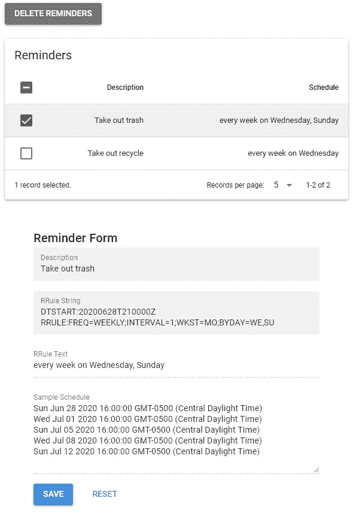
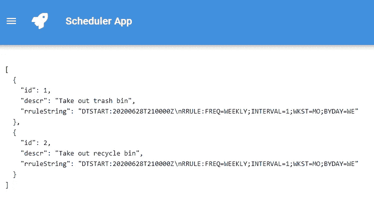
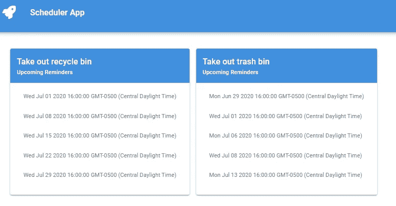
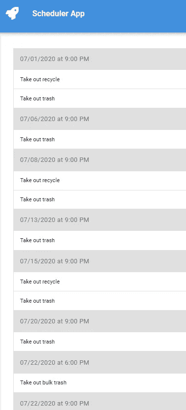
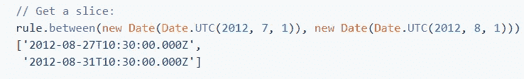
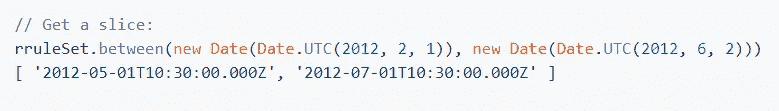

# 将日历日期的重复规则添加到应用程序中

> 原文：<https://levelup.gitconnected.com/add-recurring-rules-for-calendar-dates-to-your-application-401e39b56b2f>

## 按照我的步骤(和解决方案)将重复事件添加到您的应用程序中，让您免受痛苦和折磨。


照片由[晨酿](https://unsplash.com/@morningbrew?utm_source=medium&utm_medium=referral)在 [Unsplash](https://unsplash.com?utm_source=medium&utm_medium=referral) 拍摄

我的项目要求允许用户设置提醒。对于任何给定的主题，提醒可以是一次性的或重复发生的事件。一次性事件很简单，但一旦我开始思考重复性事件，我意识到它会变得非常复杂。😕

> “我需要设置一个提醒，从下周二开始，在奇数月的每隔一周的周一、周二和周五提醒 10 次……”

# 研究阶段

我不知道到底要找什么，就开始了我的研究探索。很明显，日历应用程序已经处理重复事件很多年了，所以我从那里开始。

这让我想到了 RFC 5545 互联网日历和日程安排核心对象规范。如果你有睡眠问题，我强烈建议你拿出这份说明书来读一读！😴

我来到了名为“循环规则”的部分。正是在这里，我发现了被称为 RRULE 的[奇怪]语法。

现在我知道我在寻找什么，所以我前往 NPM 搜索“rrule”。●不料我发现了 [*rrule.js*](https://www.npmjs.com/package/rrule) 包。

> rrule.js 支持 iCalendar RFC 中定义的重复规则，但有一些重要的区别。它是优秀的 python-dateutil 库中的`rrule`模块的部分端口。最重要的是，它支持从自然语言到自然语言的递归规则的解析和序列化。

# 原型阶段

对于我的原型，我使用 [Quasar 框架](https://quasar.dev)构建了一个新项目(它也提供了一个全功能的[日历应用扩展](https://github.com/quasarframework/quasar-ui-qcalendar))。Quasar 框架运行在 [Vue.js](https://vuejs.org) 之上。

> 注意:我在这里构建的一切都可以与任何 JavaScript 框架和日历组件一起工作。您只需要修改数据来满足您的组件需求。

对于我的测试数据，我决定创建提醒来倒垃圾。我知道我妻子会同意的！😄我的垃圾清理计划要求我按照以下计划倒垃圾:

*   每周周日和周三晚上 9 点倒垃圾桶
*   每周三晚上 9 点拿出回收站
*   每月第四个星期三晚上 9 点倒垃圾

下一步是将这些提醒翻译成规则语法。可以通过解析 RRule JSON 或 RRule 字符串格式来创建 RRule 对象。这个库的创建者创建了一个[演示页面](http://jakubroztocil.github.io/rrule/)，作为一个沙箱，可以玩不同的选项并查看它们的结果。

这些是我第一项任务的规则 JSON 和字符串表示。

*   频率为每周
*   从今晚@ 9 点开始
*   时区设置为我的本地时区，因为所有值都存储为 UTC
*   间隔是每周
*   发生在星期三和星期天

我的第二份家务时间表非常相似。唯一需要的更改是删除周日事件。

我的上一份工作有一些规则上的不同。

*   频率是每月一次
*   每第四个星期三用`bysetpos`值定义

我在演示页面上验证了这些规则(和许多替代规则),所以现在我可以放心地继续编码了。

# 编码阶段

至少我需要方便管理提醒，然后提供一种以人类可读的形式显示这些提醒的方式。

## 管理提醒

管理提醒只是提供 CRUD 操作的问题，但是增加了独特的处理规则。创建一个规则表单不是我要在这里讨论的内容，因为这个主题可能是一篇独立的文章。

所以，现在的问题是我如何为每个提醒存储规则？我需要将规则保存为可以在外部保存并在检索后解析的格式。我的两个选择是 RRULE JSON 和 String 格式。因为 RRULE JSON 格式需要 RRULE 表达式，所以我决定以 RRULE 字符串格式保存 RRULE。



提醒管理器页面

我创建了一个相对简单的页面，其中包含一个列出所有提醒的表格组件和一个用于添加和编辑提醒的表单组件。当一个或多个提醒被选中时，我还启用了一个删除按钮。

表单中有两个可编辑字段:描述和规则字符串。

当您输入有效的 RRULE 字符串时，RRule 文本和样本时间表字段将立即显示其来自 *rrule.js* 方法的值。这是对字符串的一个有用的验证。

> 注意:为了输入 RRule 字符串，我使用了 *rrule.js* 演示页面来定义我的规则，然后将结果字符串复制并粘贴到我的表单中。

在我的 Vue.js 组件中，我添加了一个`watch`,以便在 RRule 字符串值改变时触发。代码中与框架无关的部分如下:

RRule 字符串字段的值存储在`rruleString`变量中。然后我使用`rrulestr()`方法来解析 RRule 字符串。如果结果是一个值 RRule 对象，我可以使用`toText()`和`all()`方法提取并填充 RRule 文本和样本调度字段。这些方法都是由 *rrule.js* 包提供的，它们的文档提供了获取前五个事件的示例。

保存后，每个提醒都会存储为一个 JavaScript 对象:

## 显示提醒

现在，我的提醒已经被创建、更新和删除了，我开始处理代码的显示部分。😵

首先，我喜欢只显示我的原始数据，以确保我得到了我期望的数据。



原始数据

接下来，我想包含解析后的规则，并显示每项工作的下几个提醒。



显示家务和接下来的五个预定提醒

该显示确实显示了实际的时间表数据，但对于这种情况并不理想。显示屏应该先按日期分组，然后按时间分组，再按家务分组。



分组结果

看起来好多了。🔮🦄(←表示这是“魔法”)

请注意，我更改了“带走大量垃圾”的时间，只是为了确保时间分组正确。

好了，就这样吧！：

嗯…差不多了。如果我不包括这最后一部分，我会觉得我欺骗了你。

# 使用日期

我花了大约 24 小时来构建这个场景。本来应该花一半的时间，但是我遇到了日期和时间不一致的问题。😬

处理日期和时间总是有问题的，尤其是当您不能保证您的应用程序和消费者在同一个时区时。时区设置错误会导致混乱。库多次声明使用 UTC(也称为 GMT 或 Zulu ),因为它是世界各地当地时间的基础。

首先，我必须返回并在我的规则字符串中添加`TZID`和我的时区。如果我输入本地日期和时间，这是必需的，这通常是最终用户输入的结果。

在这个改变之后，我仍然无法让`between()`方法返回正确的结果。结果总是在我的日期范围之外。然后我注意到 *rrule.js* 文档显示了同样的问题！



[哎呀！](https://github.com/jakubroztocil/rrule)



哎呀，又来了！

在他们的文档中还有另一个例子，但是为什么要白费力气呢，我说的对吗？🐴 ❓

注意返回的日期是如何超出`between()`范围的？至少看到这个我感觉好多了，知道不仅仅是我！😆

我花了一点时间寻找替代库，但很快就放弃了这个想法。然后我开始玩 [moment.js](https://momentjs.com/) 库来帮助计算未来的日期。在我所有的项目中，我使用这个库来实现与日期和时间相关的功能。

几个小时后，我终于完全放弃了使用 JavaScript Date(例如`new Date()`)，而是 100%依赖 *moment.js* 方法。我无法解释为什么这有效，但它确实有效。我第一次从 *rrule.js* 中得到我期望的结果。为了让你理解我的意思，看看我写的处理我的提醒分组的函数。

> 注意:我还使用了 *lodash* 库来简化排序、迭代和分组。

传递给这个函数的变量`reminders`包含一个对象数组。每个对象都是一个杂务，如下所示(rrule 元素已经被解析为一个 RRule 对象):

```
{
  id: 1,
  descr: 'Take out the trash',
  rrule: {...}
}
```

现在我们需要从 RRule 对象中取出一些即将到来的日期，按日期分组，再按时间分组，然后列出在该日期和时间分组内发生的杂务。

`groupByDate`函数(如上)就是这么做的，结果看起来像这样:

# 结论

我希望这篇文章能帮助您快速跟踪向您的应用程序添加重复事件。我觉得每个人都可以和预定的事件联系起来，因为我们一直都在使用它们，甚至每天都在使用。现在你可以将它们添加到你自己的应用程序中，或者，这可能会激发你编写自己的“提醒”应用程序。👍

[](https://github.com/34fame/rrule-demo) [## 34 fame/r rule-演示

### 此时您不能执行该操作。您已使用另一个标签页或窗口登录。您已在另一个选项卡中注销，或者…

github.com](https://github.com/34fame/rrule-demo) 

更多文章由 [Troy Moreland](https://medium.com/u/831caef304ef?source=post_page-----401e39b56b2f--------------------------------)

[](https://graypes.medium.com) [## 特洛伊·莫兰-中等

### 你在用 Vue，Vuex，云 Firestore 吗？即使你不使用 Firestore，你仍然应该阅读这篇文章，因为…

graypes.medium.com](https://graypes.medium.com)