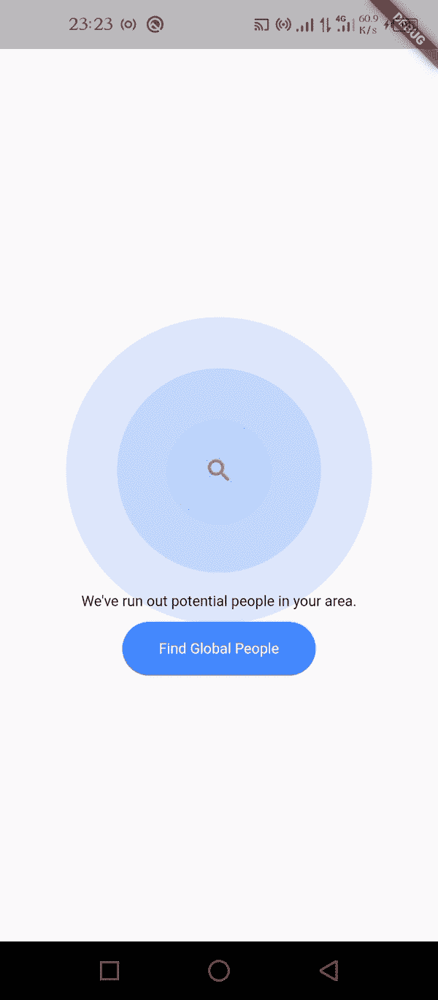

# 在颤动的部件周围添加波纹效果

> 原文：<https://levelup.gitconnected.com/add-ripple-effect-around-widgets-e98169e9e3c1>

在任何颤动的小部件周围显示涟漪效应的最简单方法是什么？

在本教程结束时，我们将有这样的东西…



在这篇文章中，我们将学习如何在一个 flutter 小部件中显示动画涟漪效果。

为了实现这一点，我将使用我创建的包 [flutter_ripple](https://pub.dev/packages/flutter_ripple)

[](https://pub.dev/packages/flutter_ripple) [## 颤振 _ 波纹|颤振包

### 一个简单的 flutter 包，可以在任何窗口小部件中显示 rippple 效果

公共开发](https://pub.dev/packages/flutter_ripple) 

在我们开始之前，让我们看看本教程的议程

1.  入门指南
2.  靠[扑 _ 涟](https://pub.dev/packages/flutter_ripple)
3.  显示[颤动波纹](https://pub.dev/packages/flutter_ripple)

# **入门**

确保你已经在你的机器上安装了 [flutter](http://flutter.dev) ，并且已经创建了一个新的项目或者现有的项目…

对于本教程，我将使用 flutter 2.10.0。不要担心，只要高于 2.0.0 版本，任何版本的 flutter 都可以工作

# **添加依赖关系**

在您的 flutter 项目中，在 dependencies 下的 pubspec.yaml 文件中添加 flutter _ ripple

```
dependencies:
   flutter_ripple: ^0.0.3
```

添加完依赖项后，不要忘记在项目终端中运行“flutter pub get”

**导入它**

现在，在您的 Dart 代码中，您可以使用:

```
import 'package:flutter_ripple/flutter_ripple.dart';
```

# **显示颤动波纹**

只要再写几个代码，我们就完成了…

使用您选择的任何小部件创建一个新的有状态小部件类(您可以使用现有的类，这取决于您想要在哪里显示波纹),然后添加 flutter ripple 作为父小部件，并设置默认颜色和点击操作。在任何部件周围添加颤动波纹部件将在其周围显示波纹效果。

您的代码应该如下所示

```
Scaffold(
  body : FlutterRipple(
          child: Text("Flutter Ripple"),
          rippleColor: Colors.blue,
          onTap: () {
            print("hello");
          },
       ),
  )
```

注意:颤振波纹有其他属性，你可以操纵

# 完整纹波示例

```
import 'package:flutter/material.dart';
import 'package:flutter_ripple/flutter_ripple.dart';

void main() {
  runApp(App());
}

class App extends StatelessWidget {
  const App({ Key? key }) : super(key: key);

  @override
  Widget build(BuildContext context) {
    return MaterialApp(

      home: RippleExample(),

    );
  }
}
class RippleExample extends StatefulWidget {
  const RippleExample({Key? key}) : super(key: key);

  @override
  _RippleExampleState createState() => _RippleExampleState();
}

class _RippleExampleState extends State<RippleExample> {
  @override
  Widget build(BuildContext context) {
    return Scaffold(
      appBar: AppBar(
        title: const Text('Flutter Ripple'),
      ),
      body: Center(
        child: Stack(
          children: [
            ///Show Ripple Widget
            FlutterRipple(
              child: Text("Flutter Ripple"),
              rippleColor: Colors.blue,
              onTap: () {
                print("hello");
              },
            ),
            Positioned(
              top: MediaQuery.of(context).size.height / 2 + 100,
              right: 50,
              left: 50,
              child: Container(
                child: Column(
                  children: [
                    Text(
                      "Searching for location.",
                      textAlign: TextAlign.center,
                    ),
                    Container(
                      margin: const EdgeInsets.only(top: 10),
                      padding: const EdgeInsets.symmetric(
                          horizontal: 30, vertical: 15),
                      decoration: BoxDecoration(
                          color: Colors.blue,
                          borderRadius: BorderRadius.circular(50)),
                      child: Text(
                        "Find All Location",
                        style: TextStyle(color: Colors.white),
                      ),
                    )
                  ],
                ),
              ),
            )
          ],
        ),
      ),
    );
  }
}
```

快点，我们完事了。这很简单。

实施愉快。