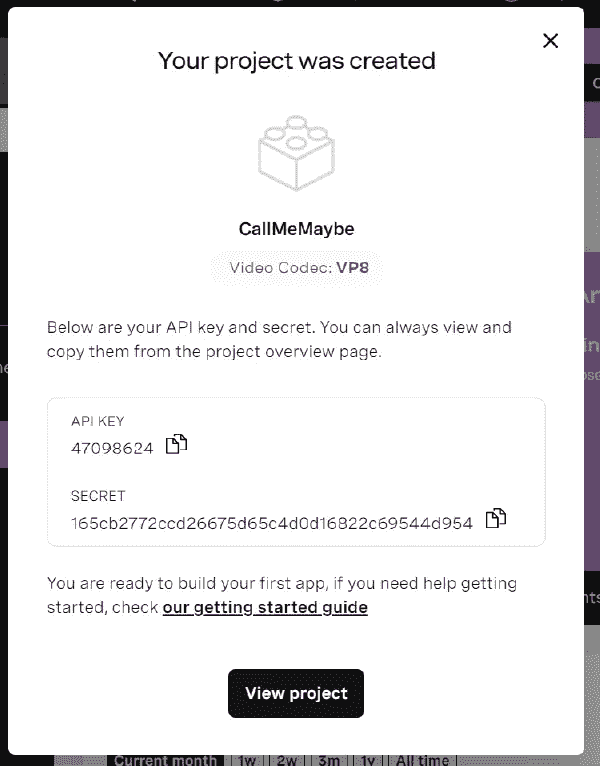

# 将 SIP 呼叫添加到 WebRTC 视频会话

> 原文：<https://levelup.gitconnected.com/add-sip-calls-to-webrtc-video-sessions-b2bedc78336a>

我们生活在一个视频会议的时代。从学校到工作到家庭活动，视频会议已经成为许多人的一种生活方式，但有时从电脑上加入是不可能的。在本教程中，我们将介绍如何允许参与者通过电话加入您的 Vonage 视频 API 会话。

> 想跳到最后吗？你可以在 [GitHub](https://github.com/opentok-community/sip-sample) 上找到本教程的所有源代码。

# 它是如何工作的？

从视频 API 会话中，我们将调用语音 API。这个调用将在我们的应用程序中触发 answer webhook，从而创建一个语音对话。该对话将作为另一个流加入视频会话。

当用户拨入会议号码时，系统会提示他们输入 PIN。如果用户提供正确的 PIN，他们将加入语音对话。此时，用户将能够听到视频会话中的所有参与者，并且他们将能够依次听到其他参与者的声音。

会话结束后，应挂断电话，以避免额外的语音或视频 API 费用。

# 先决条件

要完成本教程，您需要:

*   Vonage 视频 API 帐户。[点击这里](https://tokbox.com/account/user/signup)免费获得一个。
*   可选: [Ngrok](https://ngrok.com/) 用于本地测试

# Vonage API 帐户

要完成本教程，您将需要一个 [Vonage API 帐户](http://developer.nexmo.com/ed?c=blog_text&ct=2021-02-08-add-sip-calls-to-webrtc-video-sessions)。如果您还没有，您可以今天就[注册](http://developer.nexmo.com/ed?c=blog_text&ct=2021-02-08-add-sip-calls-to-webrtc-video-sessions)并开始使用免费信用点数进行构建。一旦你有了一个帐户，你可以在 [Vonage API 仪表板](http://developer.nexmo.com/ed?c=blog_text&ct=2021-02-08-add-sip-calls-to-webrtc-video-sessions)的顶部找到你的 API 密匙和 API 秘密。

本教程还使用了一个虚拟电话号码。要购买号码，请前往*号码* > *购买号码*并搜索符合您需求的号码。

# 构建前端

我们的前端将使用 EJS 模板的表达。对于本文，我们不会讨论如何创建视频 API 会话，但是您可以查看存储库中的代码，看看我们是如何做到这一点的。我们将只关注如何将 SIP 呼叫添加到现有会话中。

在视频会话的模板中，添加以下两个 JavaScript 函数:

这两个功能都在我们的 Express 后端调用路线。`dialOut`方法将启动语音会议，并将其作为流添加到视频会话中。`hangUp`功能将在会话结束时用于断开语音会议与会话的连接。在我们的 HTML 中，我们想要添加两个按钮来调用这些函数 8。

# 到后端的快速通道

随着我们的前端准备就绪，让我们设置我们的后端来处理通过 SIP 到 Vonage 语音 API 的连接。

## 助手功能

在处理拨出和挂断之前，我们需要一些辅助函数。

`generatePin`功能生成一个随机的 4 位数 PIN，我们将使用它为每个视频会话创建一个唯一的 PIN。在被允许加入会话之前，会话的呼叫者将被提示输入该 PIN。

`generateToken`函数用于通过 SIP 创建视频 API 令牌

`setSipOptions`函数创建了一个我们在拨打 SIP 连接时使用的对象。它包含加入语音会议所需的认证信息。

## 回答前端

有了这些功能，让我们添加路由来响应我们的前端。下面的`dial-out`路由将使用视频 API 连接到 SIP 会议。稍后，我们将设置语音 API 来了解如何响应这些调用。

`hang-up`路由将语音会议与视频 API 会话断开。在会议结束时挂断电话至关重要。否则，语音会议将保持打开并连接到视频会话。这将导致双方继续增加费用。

# 语音 API Webhooks

创建语音应用程序时，您需要提供答案 Url 和事件 Url。如果您在本地运行应用程序，您将希望使用 ngrok 来提供一个外部端点。为您的 ngrok Url 或 Heroku Url 提供路由`/voice-answer`作为答案 Url，为事件 Url 提供`/voice-events`。

由于我们的拨出，当被触发时,`/voice-answer`路由将创建一个对话。当其他参与者打进来时，他们将被提示提供该会话的 4 位 PIN。来自呼叫者的条目将被转发到`/voice-dtmf`路由，以潜在地加入会话。

# 配置设置

让我们从创建一个`.env`文件开始。您可以将回购中的`.env-sample`文件用作模板。它的内容应该是:

要设置`videoApiKey`和`videoApiSecret`，从视频 API 仪表板创建一个新项目。

创建完成后，复制 API 密钥和秘密，并分别作为`videoApiKey`和`videoApiSecret`粘贴到您的`.env`文件中。

现在创建一个语音应用程序，使用 API 密钥和秘密作为`voiceApiKey`和`voiceApiSecret`。您需要购买一个号码，并将其与您的语音应用程序相关联。使用该数字作为`conferenceNumber`变量。

最后，输入 ngrok 或 Heroku url 作为 serverUrl。

现在，您可以加入视频会话，其他人可以拨打您的号码并输入 PIN 码来加入会话。需要强调的是，您需要在视频会议结束时挂断电话，以防止在您结束时视频和语音帐户都被使用。

# 进一步阅读

想了解更多关于视频 API 的 SIP 互连特性吗？下面是一些你可能会觉得有用的链接。

*最初发布于*[*https://learn . vonage . com/blog/2021/02/08/add-sip-calls-to-webrtc-video-sessions/*](https://learn.vonage.com/blog/2021/02/08/add-sip-calls-to-webrtc-video-sessions/)