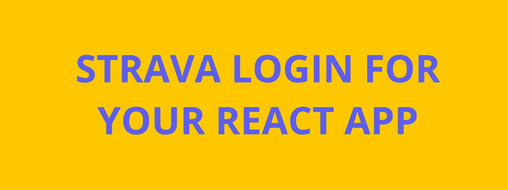
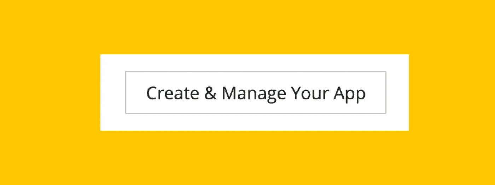
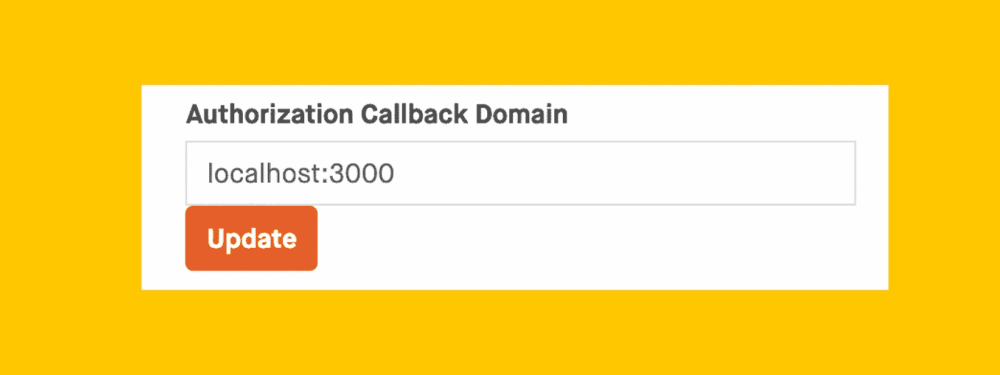
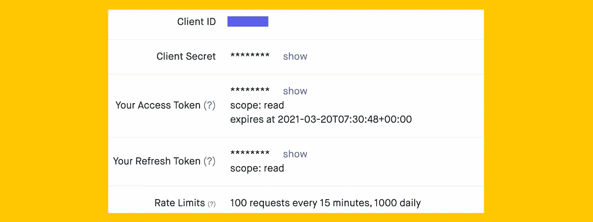
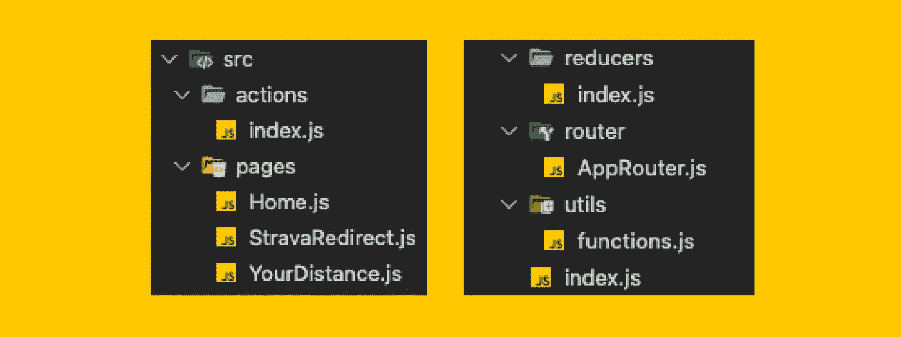

# 在 15 分钟内将 Strava OAuth2 登录添加到 React 应用程序

> 原文：<https://levelup.gitconnected.com/add-strava-oauth2-login-to-your-react-app-in-15-minutes-6c92e845919e>



*Strava 是跑步者和骑自行车者最受欢迎的社交媒体平台之一，但对于 JavaScript 开发人员来说，* [*他们广泛的公共 API*](https://developers.strava.com/docs/reference/) *的文档有点缺乏。这是我希望拥有的教程。*

**目标:**

使用 Strava 登录创建一个简单的 React web 应用程序，您可以将其用作自己项目的起点。

您将有一个可以验证用户身份的主页和一个“登录”页面，在这里您可以返回关于他们的 Strava 活动的信息。

**我们将使用:**

我们将使用 **React、React-Router、**和 **Redux** 来构建这个项目，以便进行简单的状态管理。我们还将使用 **Axios** 向 Strava 的 API 发出请求。

自己制作这个

本教程将重点解释项目的主要部分以及它们是如何工作的，但是包含完整代码的资源库可以在 Github [这里](https://github.com/dunleavyjack/Strava-OAuth2-Test)找到。我建议克隆这个 repo，并在一个`.env`文件中添加您自己的环境变量(我们将在后面介绍)。

# 入门指南

**制作 Strava 开发者应用**

首先，你需要向 Strava 的开发者计划注册你的网络应用。导航到他们的[开发者页面](https://developers.strava.com/)，用你的 Strava 账户登录(免费账户也可以)，然后选择**创建并管理你的应用**。就在正中央，像这样:



系统会提示您填写一个快速表单，要求您输入项目名称、描述和一个**授权回调域**。



我们将使用 **localhost:3000** ，这样我们就可以在我们的个人机器上运行它，但是如果您决定在其他地方托管您的项目，您可以稍后更改它。

注册应用程序后，您将获得如下信息:



对于这个项目，我们将只需要我们的**客户 ID (** 我出于隐私目的使用了我的 ID)和我们的**客户机密**。当我们稍后请求数据时，这两者都用于通过 Strava 识别我们的应用程序。我们稍后会将这些保存到一个`.env`文件中，但现在只需打开标签页。

# OAuth2 流程 30 秒

虽然一开始理解起来有点奇怪，但是为了认证用户并请求他们的信息，需要做四件事情。

1.  用户在我们应用程序的主页上点击“登录”按钮。
2.  用户连同我们的**客户端 ID** 和**客户端机密**一起被推送到 Strava 的认证页面，因此 Strava 知道是我们的应用发出请求。
3.  如果用户接受，他们就会被推到我们的**重定向页面**。虽然，*用户永远看不到这个页面*。相反，Strava 使用这个页面来传递有关用户的信息，作为嵌入在 URL 中的令牌。
4.  我们的应用程序需要获取这些令牌，并将用户推至我们应用程序上的真实页面。在此期间，我们还可以使用这些令牌来请求用户的数据。

这听起来可能很多，但这是基本流程:主页→ Strava 的认证页面→我们的重定向页面→登录页面。事实上，这一切发生得非常快！

# 使用 React 创建项目

在您的代码编辑器中打开一个新的`create-react-app`项目(我使用的是 VSCode ),我们将从安装一些依赖项开始。我们需要:

*   **Axios:** 向 Strava 提出我们的 API 请求。
*   **Redux** :管理整个应用程序的状态。此外，对于我们的 OAuth2 登录，我们将使用它作为`local.storage`的替代来存储认证令牌，而不必使用 cookies(稍后将详细介绍)。
*   **React Router:** 在我们 app 的不同页面之间切换。
*   减少额外的代码和请求。

所以，打开你的终端:

`npm i axios react-router-dom redux react-redux lodash`

(或者，如果您克隆了我的库，只需运行`npm install`)

**文件结构**

这是我们项目的大概情况。



**添加我们的环境变量**

我们需要做的第一件事是将一个`.env`文件添加到我们的根项目目录中，以存储我们的私有环境变量。在该文件中，添加我们向 Strava 注册应用程序时获得的**客户端 ID** 和**客户端机密**，如下所示:

```
REACT_APP_CLIENT_ID=*******REACT_APP_CLIENT_SECRET=*******************************
```

这样，如果你将代码推送到 github，它将保持私有。

**首页**

创建一个名为 **pages** 的目录，并添加一个 **home.js** 文件。创建一个返回以下内容的函数组件:

```
<div> <h1>Home</h1> <button onClick={handleLogin}>Connect with Strava</button></div>
```

接下来，在 return 语句上方，我们将定义我们的`handleLogin`函数，当用户点击 login 按钮时，它将把用户推到 Strava 的验证页面。但首先，让我们定义一些变量。

```
const { REACT_APP_CLIENT_ID } = process.env;const redirectUrl = "http://localhost:3000/redirect";const scope = "read"
```

首先，我们需要从我们的`.env`文件中获取我们的**客户端 ID** ，并创建一个单独的变量来存储我们的**重定向 URL** 。如果您以后更改域，这将使事情变得更容易。

最后，我们为我们项目的**范围**创建一个变量，它是[用户同意我们访问的信息](https://developers.strava.com/docs/authentication/#oauthoverview)。同样，如果您的项目增长，这将使事情变得更容易。

```
const handleLogin = () => { window.location = `http://www.strava.com/oauth/authorize?  client_id=46874&response_type=code&redirect_uri=${redirectUrl}/exchange_token&approval_prompt=force&scope=${scope}`;};
```

最后，我们将写出上面的函数，使用模板文字在 URL 中包含我们的三个变量。这将把用户推到 Strava 的认证页面，让他们知道请求来自我们的应用程序。

**Strava 重定向页面**

如果用户接受授权，Strava 会将用户发送到这里。如上所述，这也是 Strava 将提供访问令牌的地方，我们可以使用这些令牌对用户进行额外的请求。我们将抓取并清理网址。

```
 const stravaAuthToken = cleanUpAuthToken(location.search);
```

(我正在使用一个我写的函数`cleanUpAuthToken()`，你可以在`utils`文件夹中找到。)

现在我们已经有了我们的**认证令牌**，我们可以使用之前安装的 Axios 向 Strava API 发出第一个请求。这个初始请求返回一个**用户**对象，其中包含一些基本的配置文件信息，此外还有一个**访问令牌**和一个**用户 ID** ，我们需要发出额外的请求。我们将使用一个名为`setUser`的动作将这些信息直接存储到 Redux 存储中，如下所示:

```
const userData = await stravaRequest(stravaAuthToken);this.props.setUser(userData);
```

我们还将把我们的**访问令牌**和**用户 ID** 存储到单独的变量中，以使事情更加清晰。

```
const accessToken = userData.access_token;const userID = userData.athlete.id;
```

现在，我们可以向斯特拉发进一步的请求。让我们向 Axios 请求用户活动统计数据，并将其保存到 Redux 存储中。最后，我们应该将用户推至我们应用程序的登录页面，在本例中，该页面位于路由器中的`/yourdistance`。

```
const userActivities = await getUserData(userID, accessToken);this.props.setUserActivities(userActivites);history.push(“/yourdistance”);
```

所有这些都发生得非常快，但是在等待 Axios 请求的同时，我们需要呈现一些东西给用户看。添加:

```
render() { return <div>Loading...</div>;};w
```

由于这个项目只是一个框架，一些简单的加载文本就可以了。但是，您应该创建自己的加载组件来替换它。

**“已登录”页面**

现在我们已经将所有数据存储在 Redux store 中，我们可以通过我们的应用程序访问它！下面是一个简单的例子，除了显示用户跑步、骑行和游泳的总距离之外，还显示用户的姓名。

```
return( <div> <p>Hi, {athlete.firstname}!</p> <p>{user.data.all_run_totals.distance}</p> <p>{user.data.all_ride_totals.distance}</p> <p>{user.data.all_swim_totals.distance}</p> </div>);
```

就在那里！

Strava API 有很多不同的端点，所以你可以有很多方法来构建你自己的项目。**当然，可以随意借用这个项目的任何东西来帮忙！**从这里，你可以做很多事情:)