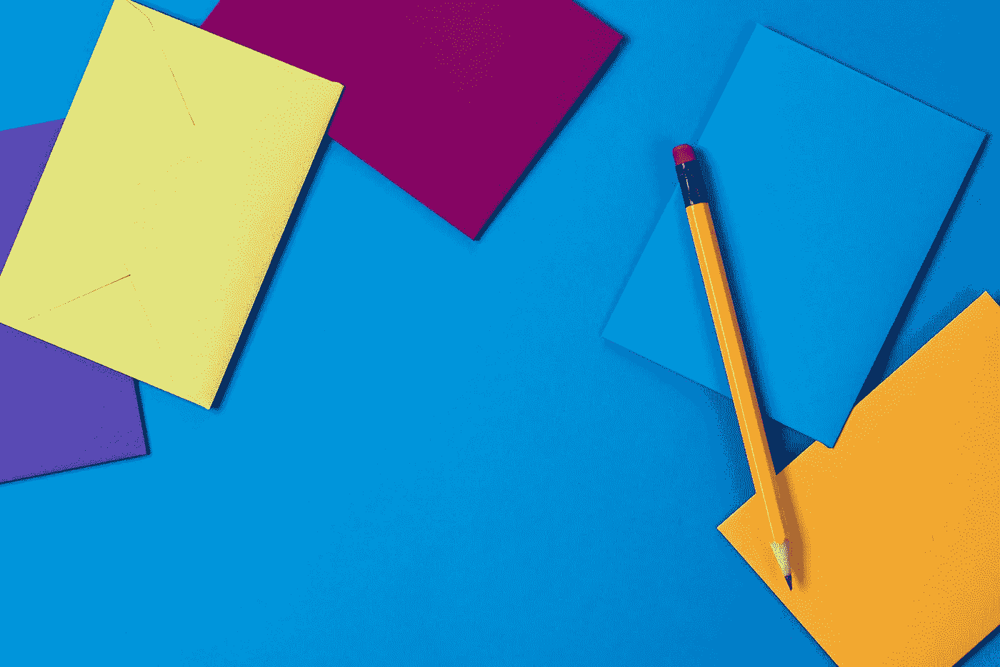
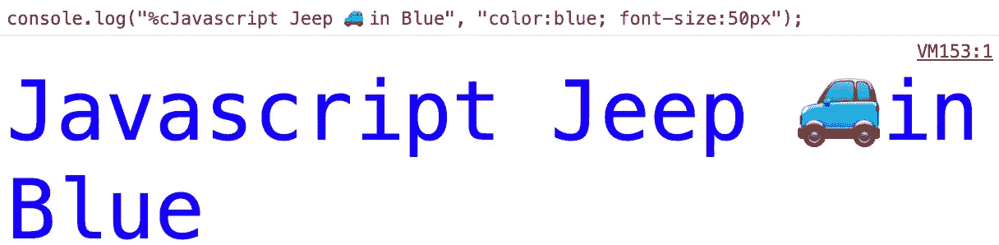
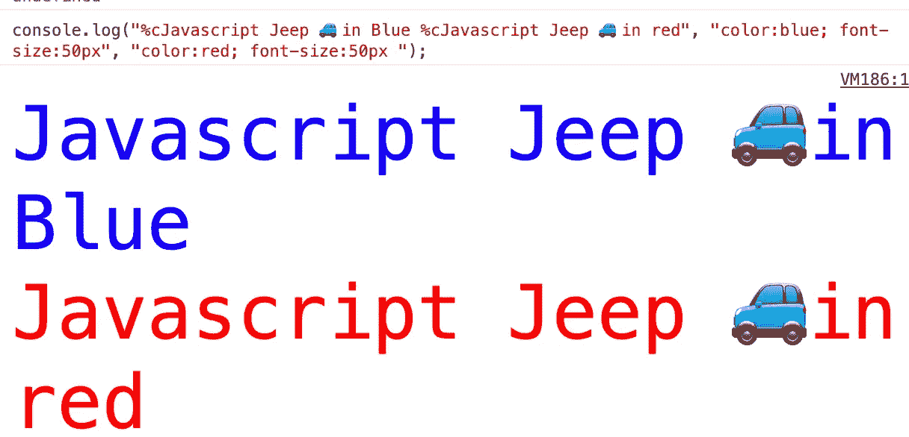
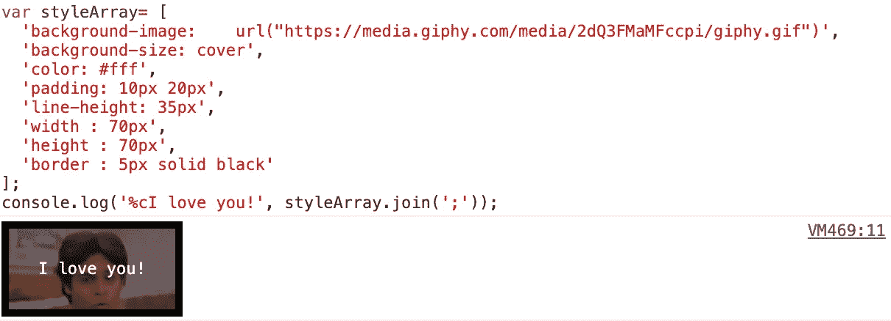
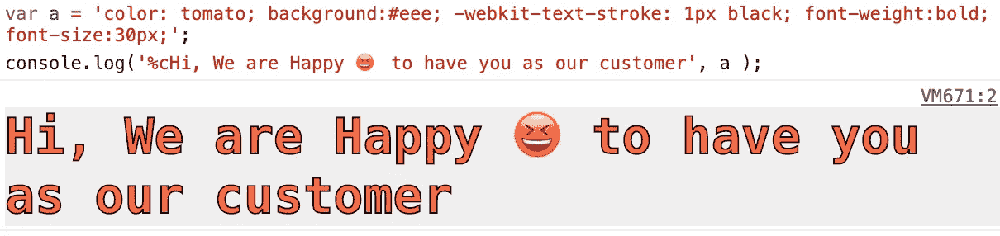
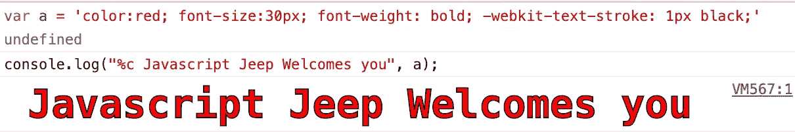

# 向控制台添加样式和格式。用 JavaScript 记录消息

> 原文：<https://levelup.gitconnected.com/add-styles-and-formatting-to-your-console-log-messages-in-javascript-5f14819b1c5d>

## 了解如何在 JavaScript 中添加 CSS 和格式化日志消息。



图片来自[乔安娜·科辛斯卡](https://unsplash.com/@joannakosinska?utm_source=unsplash&utm_medium=referral&utm_content=creditCopyText)

我们都知道`console.log`函数会向控制台记录一条简单的消息。但是`console.log`也可以格式化文本，让消息从其他消息中脱颖而出。这使我们能够在控制台中找到我们的重要消息。

# **格式说明符**

格式说明符定义了要在标准输出上打印的数据类型。我们可以使用格式说明符来告诉`log`函数应该如何打印数据。

`%s` →将值格式化为字符串。

```
var a = 10;console.log("%s treated as string", a);
```

我们拥有的格式说明符列表:

```
%s → Formats the value as a string%i or %d → Formats the value as an integer%f → Formats the value as a floating point value%o → Formats the value as an expandable DOM element. As seen in the Elements panel%O → Formats the value as an expandable JavaScript object%c → Applies CSS style rules to the output string as specified by the second parameter
```

`%c` →将 CSS 样式规则应用于输出字符串的格式说明符。我们将 CSS 作为字符串作为第二个参数传递。

```
**console.log("%cJavascript Jeep 🚙in Blue", "color:blue; font-size:50px");**
```



# 有多种风格的

我们还可以对消息应用多种样式。在字符串的每个部分之前使用`%c`，并为每个`%c`传递一个单独的样式:

```
console.log("**%c**Javascript Jeep 🚙in Blue **%c**Javascript Jeep 🚙in red", "color:blue; font-size:50px", "color:red; font-size:50px" );
```



我们也可以将样式作为字符串传递:

```
var style = "color: red; background: #eee; font-size: 50 ";console.log("**%c** Javascript Jeep 🚙in Blue",  style);
```

为了方便起见，我们可以在一个数组中定义它们，并将它们连接成一个字符串:

```
var styles = [ "color: red", "background: #eee", "font-size: 50"];var styleStr = styles.join('; ');
```

这将产生与上面相同的结果。

# 向控制台添加图像

我们可以通过使用 CSS 中的`background-image`属性向控制台添加一个图像:

```
var styleArray= [
  'background-image:    url("[https://media.giphy.com/media/2dQ3FMaMFccpi/giphy.gif](https://media.giphy.com/media/2dQ3FMaMFccpi/giphy.gif)")',
  'background-size: cover',
  'color: #fff',
  'padding: 10px 20px',
  'line-height: 35px',
  'width : 70px',
  'height : 70px',
  'border : 5px solid black'
];**console.log('%cI love you!', styleArray.join(';'));**
```



# 给你的顾客惊喜

```
var style = 'color: tomato; background:#eee; -webkit-text-stroke: 1px black; font-size:30px;';**console.log('%cHi, We are Happy 😆 to have you as our customer', style );**
```



# 在控制台中创建 Facebook 停止🛑消息

如果你打开了 facebook.com 的控制台，你肯定会收到“停止”的信息。让我们打印一条欢迎消息，而不是“停止”:

```
const style = 'color:red; font-size:30px; font-weight: bold; -webkit-text-stroke: 1px black;'console.log("%c Javascript Jeep Welcomes you", style);
```



# 小贴士:

## 1.如果您想阻止用户访问 console.log

```
console.log = function() {
   console.error(" Logging by user is disabled ");
}
```

上面的代码将限制用户记录消息，因为该函数已被替换。

## 2.延迟后记录

在给定的时间间隔后记录消息。

[](https://medium.com/better-programming/different-ways-to-duplicate-objects-in-javascript-c199be34ecb7) [## 在 JavaScript 中复制对象的不同方法

### 原来复制物体有很多不同的方法

medium.com](https://medium.com/better-programming/different-ways-to-duplicate-objects-in-javascript-c199be34ecb7) [](https://medium.com/better-programming/creating-dice-in-flexbox-in-css-a02a5d85e516) [## 在 CSS 中的 Flexbox 中创建骰子

### 了解如何使用 flexbox 在 CSS 中创建骰子

medium.com](https://medium.com/better-programming/creating-dice-in-flexbox-in-css-a02a5d85e516) 

感谢阅读📖。我希望你喜欢这个。如果你发现任何错别字或错误发送给我一个私人说明📝谢谢🙏 😊。

关注我 [JavaScript Jeep🚙💨](https://medium.com/u/f9ffc26e7e69?source=post_page-----98efbae5e8aa----------------------)。

[**给我买杯咖啡**](https://www.buymeacoffee.com/Jagathish) **。**


[**给我买杯咖啡**](https://www.buymeacoffee.com/Jagathish) **。**