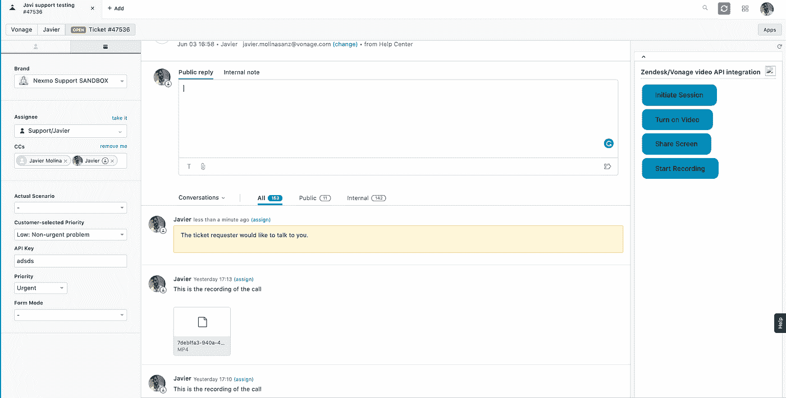

# 使用 Vonage 视频 API 为 Zendesk 添加视频功能

> 原文：<https://levelup.gitconnected.com/add-video-capabilities-to-zendesk-with-vonage-video-api-b32a922c3997>

在本教程中，我们将通过使用 Vonage Video API 为 Zendesk 添加视频、屏幕共享和录制功能，以便您可以提供更丰富的客户体验。

你可能会认为这不适合你，因为你不使用 Zendesk，但事实上，有许多其他售票系统可以应用这些外卖。如果这还不能说服你，让我们向你展示如何以编程方式处理录音并将它们上传到 Zendesk 票证，这样双方都可以下载它。

# 场景

*   客户希望与支持工程师讨论一个未解决的问题。她通过点击`Discuss Live with Javier`按钮请求与支持工程师进行视频通话，并等待他加入。

*   票证会更新为内部注释，因此支持工程师会得到通知，票证的请求者希望进行视频会话。

*   支持工程师加入会议，他们检查票证(在这个特定的案例中没有太多讨论。他们决定对通话进行录音，一旦录音停止，就会以票证评论的形式上传，以便双方都可以下载。

如果这引起了你的注意，请跟着做。

# 体系结构

为了更好地概述这一集成的架构，我们想与您分享下图:

一方面，终端客户通过 Zendesk 请求页面请求与支持工程师进行视频通话。服务器将处理该请求，并更新票证以引起代理的注意。另一方面，使用 Zendesk 的代理将加入同一个会话以进行实时讨论。

# 先决条件

在我们开始之前，您需要以下内容:

1.  [一个 Vonage 视频 API 账户](https://tokbox.com/account)，你可以免费创建
2.  [Node.js](https://nodejs.org/en/download/) 安装以及一些[基础 JavaScript 知识](https://developer.mozilla.org/en-US/docs/Learn/JavaScript/First_steps)
3.  具有管理员权限的 Zendesk 帐户
4.  [Zendesk App 工具(ZAT)](https://developer.zendesk.com/apps/docs/developer-guide/zat) 已安装
5.  亚马逊 S3 账户

# Zendesk 代理

从 Zendesk 应用开始，你可以遵循他们的[构建你的第一个支持应用](https://develop.zendesk.com/hc/en-us/articles/360001074788-Build-your-first-Support-app-Part-1-Laying-the-groundwork)教程。移动到您的项目目录并运行以下命令。

将提示您一些信息，如应用程序的名称；我们就叫它 *Zendesk 视频 App* 。它还会询问您的电子邮件和其他一些不会影响功能的参数。一旦命令被执行，您将看到应用程序被创建。我们还将为我们的服务器创建一个文件夹。最终的项目结构如下所示。

我们的应用程序将由一个嵌入到 Zendesk 界面中的框架组成，它将有一个视频聊天区域，其中有几个可用的操作。让我们通过添加一些简单的按钮元素来编辑`iframe.html`文件，这将允许代理与票证内的客户进行视频通话。您可以将以下代码复制粘贴到您的`iframe.html`中:

我们还将为按钮添加一些基本的 CSS。

现在，编辑实例化 ZAF 客户机的`main.js`文件。ZAF 客户端让你的应用程序与主机 Zendesk 产品进行通信。您可以在应用程序中使用客户端来侦听事件、获取或设置属性，或者调用操作。在这种情况下，我们感兴趣的是我们正在处理的票据的细节。特别是票证 ID 和请求者 ID。一旦承诺兑现，我们就可以向服务器发送一个请求来获取 API 密钥、会话 ID 和该票证的令牌。所有会话生成逻辑将来自我们的服务器。我们稍后会谈到这一点。

现在我们已经获得了这些值，我们可以让代理选择何时启动视频会话。我们将定义一个`initializeSession`函数，一旦代理点击`Initiate session`按钮，该函数将被触发。我们将 publisher 容器显示设置为 block，使其可见(因为它最初设置为 none)。我们将通过实例化一个会话对象来启动会话，然后初始化发布者。

我们还将为会话对象分派的[事件](https://tokbox.com/developer/sdks/js/reference/Session.html#events)创建一些监听器。我们将利用`archiveStarted`和`archiveSopped`事件来控制应用程序的状态，也就是说，知道我们是否正在发布视频，或者如果我们正在录制，它是否被关闭。

我们将根据状态在 HTML 按钮中显示不同的值。例如，一旦我们收到`archiveStarted`，我们将希望我们的按钮显示“停止存档”而不是“开始存档”，因为存档/记录已经开始。在我们代码的顶部，我们定义了一些状态变量(`archiving`、`video`和`screen`)，它们将根据这些事件发生变化。

我们还想在一个流创建后就订阅它，所以我们将监听`streamCreated`事件。

我们作为回调传递的`handleError`函数是一个函数，如果在监听会话中的事件时发生错误，它会抛出一个警告。

我们可以创建一个`handleRecording`函数来确定我们是否已经在记录。这将允许我们根据状态触发不同的功能。

`StartArchive`函数将向我们的服务器的`archive/start`路由发出 POST 请求。我们需要传递我们的`sessionId`,以便我们的服务器知道哪个会话触发了记录。您将在本教程的后面看到，我们指的是会话的记录和存储。不要混淆；这是相同的概念，但是我们在内部使用术语“归档:)

至于`StopArchive`功能，和`StartArchive`差不多。但是，在这种情况下，我们需要传递来自`archiveStarted`事件的`archiveID`。

现在我们需要添加对屏幕共享流的支持。我们将创建一个功能来检查我们是否已经共享了我们的屏幕，如果没有，它将创建一个新的发布者。这个函数将在一些事件中充当屏幕共享流的触发器，就像我们在存档中所做的一样。

我们将通过调用`OT.checkScreenSharingCapability`方法来检查浏览器是否支持屏幕共享。我们在[关于 checkScreenSharingCapability 回调](https://tokbox.com/developer/sdks/js/reference/OT.html#checkScreenSharingCapability)的文档中解释了更多关于屏幕共享支持的内容。对于一些旧版本的浏览器，您可能需要安装一个扩展，但是为了简单起见，我们将假设两个参与者都将使用最新的浏览器。

注意，我们在这种情况下监听的事件是由 publisher 对象而不是 session 对象调度的。更多信息请参考 [StreamEvent](https://tokbox.com/developer/sdks/js/reference/StreamEvent.html) 。

# 客户方

既然我们的代理端已经启动并运行，我们需要考虑为客户端添加视频功能。这篇帖子的主要目的是将最终客户(票证请求者)和支持代理(票证受让人)联系起来。

为此，我们将按照[定制您的帮助中心主题指南](https://support.zendesk.com/hc/en-us/articles/203664326-Customizing-your-Help-Center-theme-Guide-Professional-and-Enterprise-)，以便我们可以访问票证请求者的页面代码，并在帮助中心构建更丰富的客户体验。

在这种情况下，我们对定制`Requests page`感兴趣，即分配给特定用户的请求或票据列表。正如上面链接的文章中所解释的，帮助中心的 HTML 包含在可编辑的模板中。我们将编辑`requests_page.hbs`文件。代码将非常类似于`main.js`文件中的 JavaScript 代码。

首先，我们要导入 Opentok 库。这将下载 JS SDK 的最新版本。

我们添加了一些包含发布者和订阅者视频的基本标记，以及一些处理应用程序功能的按钮。你会注意到我们有`{{assignee.avatar_url}}`。这是一种叫做`Curlybars`的模板语言，它将允许我们在 Zendsk ticket 的上下文中与帮助中心数据进行交互。

在本例中，我们将在启动视频通话的按钮上显示票证受让人的图片。目的是为顾客提供近距离体验。此外，为了一开始就简单起见，我们将隐藏所有按钮，只留下启动呼叫的按钮。我们将通过将 HTML 元素的 display 属性设置为`none`来实现这一点。

我们将定义一些在代码中会用到的变量。正如我们在代理端所做的那样，我们将使用一些状态变量(`video`、`archiving`和`screenSharing`)。我们还将定义服务器的端点。

我们正在定义一个简单的错误处理函数，我们将使用它在发生错误时提醒用户。将它定义为一个单独的函数的唯一目的是稍微清理一下我们的代码。

我们从我们的服务器获取`apiKey`、`sessionId`和`token`。

然后，添加下面的`initializeSession`功能，一旦客户决定请求与支持代理进行视频通话，就会触发该功能。我们将显示最初隐藏的按钮，然后我们首先实例化一个会话对象并创建一个发布者。最后，我们尝试连接到会话。如前所述，如果连接成功，我们将尝试发布到会话。

我们将利用三元运算符来决定是否需要打开或关闭视频。同样的逻辑也适用于确定我们是要调用函数来开始记录还是停止记录。

`startArchive()`和`startArchive()`功能看起来与`main.js`中的完全一样，所以为了简单起见，我们将省略它们。您可能还希望只向支持代理而不是最终客户提供启动录制的选项，但这完全取决于您。为了让它更有趣，我们将允许双方启动和停止录音，因为他们都将能够在通话后检索录音。

# 计算机网络服务器

我们的服务器端将由几个路由组成，以处理来自代理或支持工程师的请求。

让我们导入我们的应用程序将要使用的模块，并定义一些环境变量。

`apiKey`和`apiSecret`是在您的[仪表板](https://tokbox.com/account/)中找到的视频 API 凭证，`remoteUri`以[https://xxxxxx.zendesk.com/](https://xxxxxx.zendesk.com/)的形式引用您组织的 Zendesk 端点。对于 Zendesk 认证，查看他们的“[我如何认证 API 请求](https://support.zendesk.com/hc/en-us/articles/115000510267-How-can-I-authenticate-API-requests-)”文章，因为他们支持不同的认证方法；我们使用用户名和令牌。

至于 AWS 的认证，有几个[支持的方法](https://docs.aws.amazon.com/sdk-for-javascript/v2/developer-guide/setting-credentials-node.html)，但是我们也决定使用环境变量。请注意，在这种情况下，SDK 会自动检测环境中设置为变量的 AWS 凭据，并将其用于 SDK 请求，从而消除了在应用程序中管理凭据的需要。这就是为什么我们没有从我们的`.env`文件中读取变量。

将此添加到您的`index.js`文件中。

处理会话和令牌创建的路由将检查是否已经创建了一个会话来讨论该票证，如果没有，它将创建一个会话。如果你不熟悉视频 API 的[令牌](https://tokbox.com/developer/guides/create-token/)的概念，它就像是房间(会话)的钥匙。

您可能希望有一个更安全的解决方案，但我们决定在这里做一些基本的验证，以保持简单。在本例中，我们接收到一个格式为`XXXXXX-YYYYY`的`name`参数。你还记得我们在两个部分(代理和客户)做的那些提取呼叫吗？是从那里传来的。

如果票据的请求者 ID 与收到的`:name`参数的第二部分匹配，我们将只生成一个会话和一个令牌。我们将使用 Zendesk 包来执行验证。例如，如果我们接收到`1222-1234`，我们将通过 Zendesk API 检查用户 1222 是否请求了票证 1234。如果没有，我们将返回一个 HTTP 404。

您还会看到，对于 referer 和请求的来源有一些验证。只有当请求来自客户时，才快速更新票证，并让支持工程师知道票证请求者想要进行视频会话。

在实际应用程序中，您可能需要将会话 id 存储在数据库中，并检查是否已经为该票证创建了会话。然而，在本教程中，我们决定简单地使用一个字典来存储与房间名称相关联的会话 id。请记住，一旦您重新启动服务器，这将被重置。

正如我们提到的，只有当没有与收到的房间名称相关联的会话时，我们才会创建会话。我们将基于回调的方法包装在一个承诺中，该承诺将返回一个会话对象。

我们还包装了一个承诺 Zendesk check，它允许我们查询收到的票 ID，这样我们就可以确定请求是否合法。

如果请求是有效的，并且来自客户端(而不是来自代理)，请更新票证，以便通知支持工程师有人在等待视频会话。

我们正在定义开始和停止存档的路线。请注意，停止存档的路由也采用会话 ID。这是，所以我们的服务器知道你试图停止记录的会话 ID。

如果你运行你的服务器，用 [ngrok](https://ngrok.com/) 暴露它，在两个前端(客户和代理端)都配置 ngrok URL 为`SERVER_BASE_URL`。你现在有一个视频会议，干得好！

好吧，这很酷，但让我们更进一步！如果我们还可以动态处理通话记录并将其上传到 Zendesk，以便支持工程师和客户都可以在最方便的时候检索它，这不是很好吗？就这么办吧！

# 处理录像

首先，我们必须让视频 API 知道我们希望视频记录上传到哪里。由于我们将使用 AWS S3 端点，您可以遵循我们的[使用带有 Vonage 视频 API 归档的 S3 存储](https://tokbox.com/developer/guides/archiving/using-s3.html)指南。配置完成后，如果您有一个视频会话，并且您启动和停止了录制，它将自动上传到您的 S3 存储桶。

所有归档文件都保存在 S3 存储桶的子目录中，该子目录的名称是 OpenTok API 密钥，每个归档文件都保存在该子目录中，名称是归档文件 ID。存档文件为`archive.mp4`。

例如，考虑具有以下 API 键和 ID 的档案:

*   API 密钥— 123456
*   存档 ID-ab 0 baa 3d-2539–43 a6-be42-b41ff 1488 af 3

此归档的文件上传到您的 S3 存储桶的以下目录:

123456/ab 0 baa 3d-2539–43 a6-be42-b41ff 1488 af3/archive . MP4

接下来，我们需要知道归档文件何时上传到我们的 S3 存储桶，以便我们可以检索它。我们将在服务器中配置一个路由来侦听与归档相关的事件。当档案的状态改变时，视频 API 平台将向您发送一个指向您之前配置的回调 URL 的 webhook。

进入你的仪表板，点击你正在使用的项目，将你的服务器 URL 配置为`https://YOUR_SERVER_URL/events`。如[存档指南](https://tokbox.com/developer/guides/archiving/)中所述，一旦存档文件可供从 S3 桶下载，视频 API 平台将向您发送可用状态。我们将在我们的服务器上监听该事件并下载它。所有的逻辑都将在服务器端处理(`server.js`文件)。

请记住在您的视频 API 帐户中配置您的服务器 URL。否则，你不会在你的服务器上收到这些网页挂钩。它应该如下所示:

我们将向`downloadVideo`函数传递两个变量；一个是我们希望下载存档时使用的名称，另一个是密钥，因此我们的 S3 存储桶知道我们试图检索什么记录。

通过调用请求上的`createReadStream`方法，请求将返回的数据直接传输到 Node.js 流对象。调用`createReadStream`返回由请求管理的原始 HTTP 流。然后，原始数据流可以通过管道传输到 Node.js 流对象中。一旦上传到我们的桶，我们现在应该能够动态下载记录。

你会注意到，一旦下载完文件，我们就调用一个`getToken`函数。那是因为上传一个文件到 Zendesk 的过程。此时，您可以对该文件做任何您想做的事情，因为它已经被下载了。然而，为了完成我们的帖子，让我们将录音上传到 Zendesk ticket，这样双方都可以在通话后观看录音。

我们首先需要获得一个令牌，然后我们需要更新传递这个令牌的票证。我们将在一个名为`uploadVideo`的独立函数中执行第二部分。

查看[演示](https://github.com/javiermolsanz/blogOpenhack/blob/master/index.md#demo)来更好地了解这一切是如何工作的。改编本教程以满足您的需求，让您的客户高度满意并成为支持体验的真正倡导者。

在[vonage-zendesk-integration](https://github.com/nexmo-community/vonage-zendesk-integration)GitHub repo 中找到该项目的代码。

你下一步会建什么？让我们知道！

*最初发布于*[*https://www . NEX mo . com/blog/2020/09/08/add-video-capabilities-to-zendesk-with-vonage-video-API*](https://www.nexmo.com/blog/2020/09/08/add-video-capabilities-to-zendesk-with-vonage-video-api)