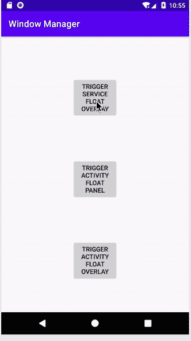
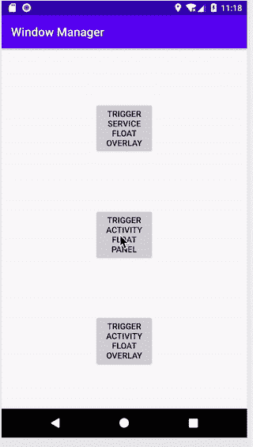
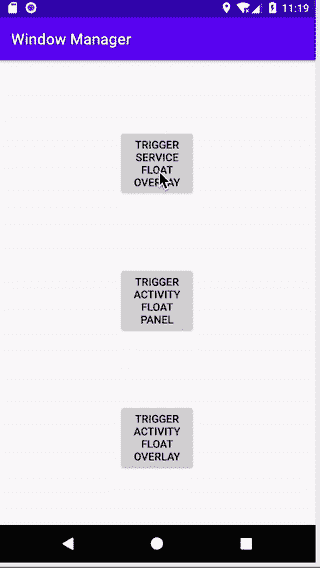
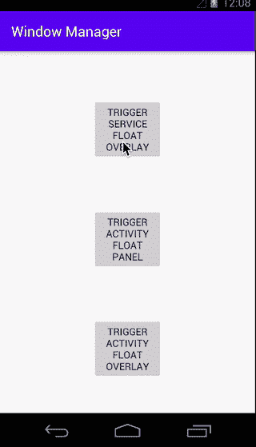

# 通过 WindowManager 添加查看外部活动

> 原文：<https://levelup.gitconnected.com/add-view-outside-activity-through-windowmanager-1a70590bad40>


图片由 [R 莫](https://unsplash.com/@mooo3721)在 [Unsplash](https://unsplash.com/photos/w-_iZqdviAo) 拍摄

对于传统的 Android 开发学习来说，WindowManager 并不是一门典型的课程。然而，它是一个有用的系统服务。

正如在这个[堆栈溢出](https://stackoverflow.com/questions/19846541/what-is-windowmanager-in-android)中很好地解释的，

> Android WindowManager 是一个系统服务，负责管理窗口的 z 排序列表，哪些窗口是可见的，以及它们在屏幕上的布局。除此之外，当打开或关闭应用程序或旋转屏幕时，它会自动执行窗口转换和动画。

这使人们能够在活动的顶部显示一个视图！

它的一些用法示例如下:

*   [Facebook Messenger 聊天头像](https://img.gadgethacks.com/img/67/17/63693961141749/0/enable-disable-chat-heads-facebook-messenger-android-for-quick-access-conversations.w1456.jpg)
*   [自定义浮动工具提示](https://raw.githubusercontent.com/sephiroth74/android-target-tooltip/master/screenshots/video2.gif)
*   [安卓吐司](https://i.stack.imgur.com/Y2JS4.png)

# 让我们在 WindowManger 上试验一些视图

WindowManager 的乐趣在于能够在活动之上显示一个视图。有了它，我们可以编写一些超越传统 Android 应用程序界面的代码。

下面是我制作的示例代码(下面可用),用来演示我们如何在活动之外拥有一个视图。



下面是编码它所需的内容。

## 访问窗口管理器

默认情况下，您可以在活动中获得`WindowManager`对象。然而，如果您在活动之外工作(在另一个类或服务中)，您可以使用上下文访问`WindowManager`。

```
private val windowManager by *lazy* **{** context.getSystemService(Context.*WINDOW_SERVICE*) 
        as WindowManager
**}**
```

## 放大您希望通过窗口管理器显示的视图

无论您是在活动中还是在服务中，您都可以创建一个充气机:

```
val floatView = (getSystemService(Context.*LAYOUT_INFLATER_SERVICE*) as LayoutInflater).inflate(R.layout.*view_service_float*, null)
```

## 设置视图所需的参数

为我们的视图创建窗口管理器所需的所有参数

参数

```
public LayoutParams(
    int w, int h, int _type, int _flags, int _format)
```

如何启动它们的示例如下

```
val paramFloat = WindowManager.LayoutParams(
    WindowManager.LayoutParams.*WRAP_CONTENT*,
    WindowManager.LayoutParams.*WRAP_CONTENT*,
    type,
    WindowManager.LayoutParams.*FLAG_NOT_FOCUSABLE*,
    PixelFormat.*TRANSLUCENT*)
paramFloat.gravity = Gravity.*TOP* or Gravity.*CENTER_HORIZONTAL*
```

在这里我将更多地关注`type`的不同。

有不同的类型，我将在下面探讨两种类型。

1.`TYPE_APPLICATION_PANEL`



这只能在 Activity 之上使用，并且存在于 Activity 之内。因此在这种情况下，它是通过活动发起的。

这对于定制工具提示或 Coachmark 非常有用。

通过服务触发此视图会使应用程序崩溃。

2.`TYPE_APPLICATION_OVERLAY`(适用于 Android O 及更高版本，而`TYPE_SYSTEM_ALERT`适用于早期 SDK)



这是一个布局，它不仅位于活动之上，还可以位于活动之外。

通常，这将通过服务启动，虽然通过活动启动是允许的，但在不同的 SDK 中有不同的行为。

所显示的视图可以在 Activity live 之后继续存在(即，即使 Activity 被终止，它仍然存在)

这对于 Facebook Messenger 聊天头，甚至 Android Toast 之类的东西都很有用。

## `TYPE_APPLICATION_OVERLAY`需要一些许可

因为`TYPE_APPLICATION_OVERLAY`将使视图能够超越活动而存在，Android 需要一些许可，应用程序才能通过 WindowManager 添加这样的视图。

它需要 AndroidManifest.xml 文件中的 SYSTEM_ALERT_WINDOW 权限。

```
<uses-permission android:name="android.permission.SYSTEM_ALERT_WINDOW"/>
```

除了 Android SDK 23 之外，还需要即时申请许可:

```
private fun requestPermission(requestCode: Int): Boolean {
    if (Build.VERSION.*SDK_INT* >= Build.VERSION_CODES.*M*) {
        if (!Settings.canDrawOverlays(this)) {
            val intent = Intent(
                Settings.*ACTION_MANAGE_OVERLAY_PERMISSION*,
                Uri.parse("package:$*packageName*")
            )
            startActivityForResult(intent, requestCode)
            return true
        }
    }
    return false
}
```

回来后，我们可以跑。*注意:延迟是基于实验的，仅在一小会儿后授予许可。因此，这里有 0.5 秒的延迟。*

```
@TargetApi(Build.VERSION_CODES.*M*)
override fun onActivityResult(requestCode: Int, resultCode: Int, data: Intent?) {
    super.onActivityResult(requestCode, resultCode, data)
    if (requestCode == *MANAGE_OVERLAY_PERMISSION_REQUEST_CODE*) {
        Handler().postDelayed(**{** if (Settings.canDrawOverlays(this)) {
                when (requestCode) {
                    launchViewThroughWindowManager()
                }
            }
        **}**, 500)
    }
}
```

## 将视图添加到 WindowManager

完成上述操作后，只需将视图添加到`WindowManager`中

```
windowManager.addView(floatView, paramFloat)
```

你可以从

[](https://github.com/elye/demo_android_windowmanager) [## elye/demo _ Android _ window manager

### 演示通过 WindowManager 添加视图，来自活动和服务—elye/demo _ Android _ window manager

github.com](https://github.com/elye/demo_android_windowmanager) 

# SDK 中的不同行为

根据我对通过 WindowManager 添加的视图的体验，我在不同的 SDK 中得到不同的行为。我不是 100%确定这是不是模拟器设置。但值得注意的是，我的以下发现作为参考，以确保跨设备的支持得到彻底测试。

我在 SDK 16(果冻豆)、24(牛轧糖)和 26(奥利奥)上进行了测试

## `TYPE_APPLICATION_OVERLAY/TYPE_SYSTEM_ALERT view life`

对于 SDK 14 和 24，当应用程序被终止(手动)时，视图也被终止。

对于 SDK 26，即使应用程序被终止(手动)，视图仍然存在，无论视图是通过服务还是活动启动的。

## `TYPE_APPLICATION_OVERLAY/TYPE_SYSTEM_ALERT launched through Activity behavior`

对于 SDK 14,`TYPE_SYSTEM_ALERT`视图位于活动视图边界内。如果活动在背景上，视图也是隐藏的。

对于 SDK 24 和 26，`TYPE_APPLICATION_OVERLAY`视图位于活动视图边界之外。如果活动在背景上，视图仍然显示。

也许这是由于`TYPE_SYSTEM_ALERT`和`TYPE_APPLICATION_OVERLAY`不同的行为。

## `TYPE_APPLICATION_OVERLAY/TYPE_SYSTEM_ALERT launched through Activity effect on TYPE_APPLICATION_OVERLAY/TYPE_SYSTEM_ALERT launch through Service`

正如我们所知，对于 SDK 14、24 和 26，通过**服务**启动的`TYPE_SYSTEM_ALERT/TYPE_APPLICATION_OVERLAY`视图位于活动视图边界之外。如果活动在背景上，视图仍然显示。

然而对于 SDK 14，如果我们通过**活动**再次启动另一个`TYPE_SYSTEM_ALERT/TYPE_APPLICATION_OVERLAY`视图；先前从**服务**中启动的`TYPE_SYSTEM_ALERT/TYPE_APPLICATION_OVERLAY`视图的行为更改如下。

*   对于 SDK 14，通过服务启动的`TYPE_SYSTEM_ALERT/TYPE_APPLICATION_OVERLAY`视图现在也将在活动视图边界内**活动。**

如下图所示。*我怀疑这是 SDK 14 中的一个错误，正如你在后台注意到的，整个屏幕启动器是空白的。*



对于 SDK 24 和 26，行为没有改变，因为无论从活动还是服务启动，`TYPE_APPLICATION_OVERLAY`视图都在活动视图之外。

理想情况下，良好做法是:

1.  通过活动/片段启动`TYPE_APPLICATION_PANEL`视图。(通过服务启动会导致应用崩溃)
2.  通过服务仅启动`TYPE_SYSTEM_ALERT/TYPE_APPLICATION_OVERLAY`视图(以确保新旧 SDK 的一致行为)
3.  通过服务启动`TYPE_SYSTEM_ALERT/TYPE_APPLICATION_OVERLAY`视图还有助于确保只启动一个视图。在活动中，人们可能会意外地启动多个这样视图，且需要代码来控制只启动一个视图。

## 参考

[](https://github.com/henrychuangtw/Android-ChatHead) [## henrychuangtw/Android-ChatHead

### Android 应用程序的聊天头，如 FB messenger。开始聊天:显示消息(见下图“消息”):` ` Java 意图…

github.com](https://github.com/henrychuangtw/Android-ChatHead) [](https://github.com/sephiroth74/android-target-tooltip) [## sephiroth 74/Android-目标-工具提示

### 创建类似工具提示的提示，可以指定物理目标，甚至是屏幕上的点。许多附加功能和…

github.com](https://github.com/sephiroth74/android-target-tooltip) 

感谢阅读。你可以在这里查看我的其他话题。

关注我的[](https://medium.com/@elye.project)**[*Twitter*](https://twitter.com/elye_project)*[*脸书*](https://www.facebook.com/elyeproj/) 或 [*Reddit*](https://www.reddit.com/user/elyeproj/) 获取移动开发等相关话题的小技巧和学习。~Elye~***