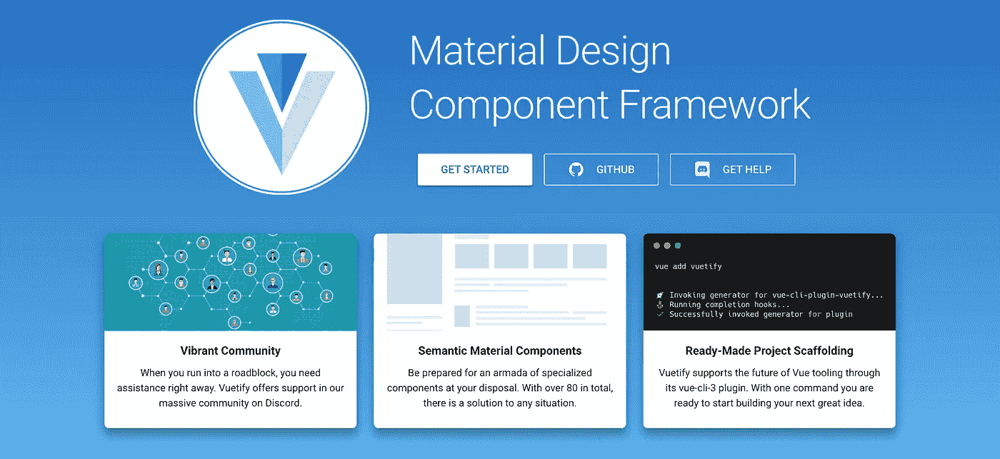
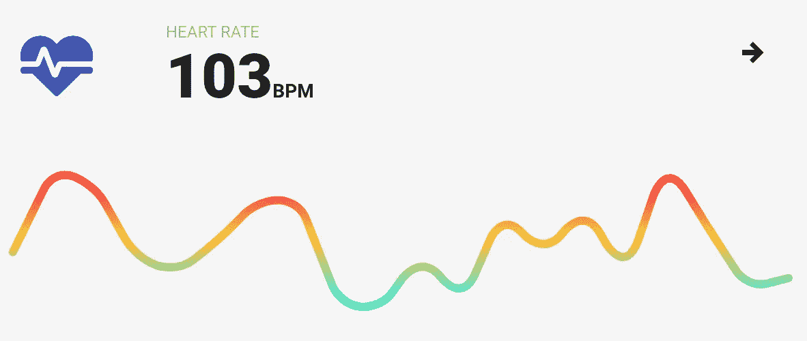

# 将 Vuetify 添加到您的 Vue.js 应用程序

> 原文：<https://levelup.gitconnected.com/add-vuetify-to-your-vue-js-app-4e4e3616cb9c>

[vue 化](https://vuetifyjs.com/en/)是 [Vue.js](https://vuejs.org/) 的语义开发框架。它采用[材料设计](https://material.io/design/)，旨在提供创建漂亮的内容丰富的应用程序所需的所有工具。



# **安装 Vuetify**

```
npm add vuetify
```

之后，我们需要告诉 Vue 使用 Vuetify(在 main.js 文件中)

```
import Vue from ‘vue’
import Vuetify from ‘vuetify’
import ‘vuetify/dist/vuetify.min.css’Vue.use(Vuetify)
```

一些组件正在使用图标，因此我们需要将它们导入到 index.html 文件中。

```
<head>
   <link href=’[https://fonts.googleapis.com/css?family=Roboto:300,400,500,700|Material+Icons'](https://fonts.googleapis.com/css?family=Roboto:300,400,500,700|Material+Icons') rel=”stylesheet”>
</head>
```

最后，我们需要添加一个 v-app 组件来包装整个应用程序，以便使 Vuetify 工作。

```
<v-app id=”app”>
   <router-view/>
</v-app>
```

# **添加虚拟化组件**

下面是您应该在浏览器中看到的结果:



让我们通过运行项目根目录中的`npm run dev`命令来预览应用程序。它应该会自动打开您的默认浏览器到`https://localhost:8080`。如果需要更改端口，可以修改`webpack.config.js`文件中的服务器配置

我们已经成功地将 Vuetify 集成到我们的应用程序中。这将大大加快我们的发展。


# 为什么 Vuetify

1.  **充满活力的社区**
    准备好享受最活跃的社区之一吧。被困在一个问题上？马上寻求帮助。找到一个 bug？想谈谈 Firebase 吗？。核心团队在问题发生时做出反应。
    [更有](https://discordapp.com/invite/s93b7Fv)
2.  **材料工具包**
    Vuetify 是从底层开始构建语义的。易于学习，易于记忆—这意味着无论您是开发自己的应用程序，还是加入新的开发人员，Vuetify 的即写即用组件和属性都使开发变得轻而易举。
    更[更](https://material.io/design/)
3.  持续更新 Vuetify 有一个一致的更新周期，让你可以更频繁地获得 bug 修复和增强。开发团队致力于为您提供最佳体验。
    [更](https://github.com/vuetifyjs/vuetify/releases)
4.  **惊人的支持**
    Vuetify 每周打补丁，以极快的速度回应社区问题和报告。知道您的应用程序将会得到支持，并通过修复和新功能得到频繁更新，您会充满信心。
    [更有](https://github.com/vuetifyjs/vuetify/pulse)

> *由* [出版*迪内什·库马尔*出版](https://www.dineshk.me/)

[](https://gitconnected.com/learn/vue-js) [## 学习 Vue.js -最佳 Vue.js 教程(2019) | gitconnected

### 27 大 Vue.js 教程-免费学习 Vue.js。课程由开发人员提交并投票，使您能够…

gitconnected.com](https://gitconnected.com/learn/vue-js)