# 向 AWS EC2 添加自定义域和 SSL

> 原文：<https://levelup.gitconnected.com/adding-a-custom-domain-and-ssl-to-aws-ec2-a2eca296facd>

## 给未来自己的笔记

## 有了在 AWS EC2 中运行的 Docker 容器中的服务器，让我们添加 HTTPS


盖伊·比安科四世在 [Unsplash](https://unsplash.com/?utm_source=unsplash&utm_medium=referral&utm_content=creditCopyText) 拍摄的照片

在我们的[上一篇文章](/spinning-up-a-node-js-server-in-a-container-on-aws-with-ec2-2cf7f41f4aec)中，我们停靠了 Node.js 服务器，将该容器映像推送到 AWS ECR，然后启动一个 EC2 实例，该容器在其中运行。配置好网络和安全组后，我们可以向 EC2 实例(在端口`80`)发送 HTTP 请求，并从服务器接收响应。

对于我们的下一个技巧，让我们设置一个自定义域名，并通过 HTTPS 访问我们的服务器。以下是我们将要采取的步骤:

1.  在 Route 53 中为我们的域创建一个托管区域。
2.  为我们的自定义域 AWS 证书管理器创建一个 SSL 证书。
3.  创建一个目标组，我们的应用程序负载平衡器会将请求转发到该目标组。
4.  为我们的 EC2 创建一个应用程序负载平衡器。
5.  更新我们的安全组以允许端口 443 上的流量。
6.  创建 Route 53 记录，将子域请求路由到我们的负载平衡器。

这可能感觉很多，但是很简单。我们会一步一步来。

# 1.创建托管区域

对于本演练，我们将假设您已经购买了一个域名，并且您希望将一个子域指向您在 EC2 上运行的服务器。要将子域路由到正确的资源并为此子域申请 SSL 证书，您需要在 AWS Route 53 中创建一个托管区域。

在“托管区域”页面上，单击“创建托管区域”

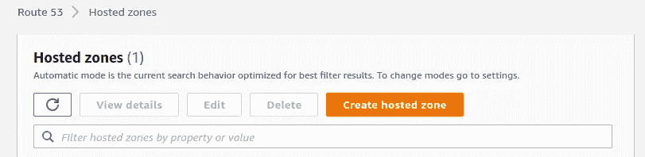

输入域名(由您控制)，选择“公共托管区域”类型，然后单击“创建”您将在列表中看到新创建的托管区域。点击它。您将看到 NS 记录中列出了几个名称服务器。

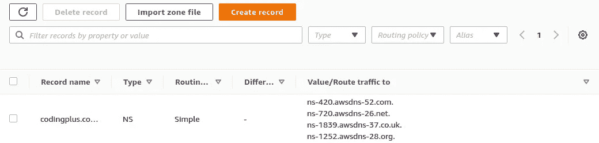

您将需要登录到您购买和管理此域的服务。在该服务中，您需要设置名称服务器来使用 AWS 提供的这些值。这将使 Route 53 控制处理随后的域(和子域)路由。

# 2.创建 SSL 证书

在 Route 53 中设置了您的域后，为您的子域申请 SSL 证书变得又快又简单。转到 AWS 证书管理器。**确保您位于部署 EC2 实例的同一个区域。**

单击“申请证书”申请公共证书。

输入您想用来访问服务器的域名。对于我们的演示，我们将使用`node-server-demo.codingplus.coffee`。选择“DNS 验证”作为验证方法。

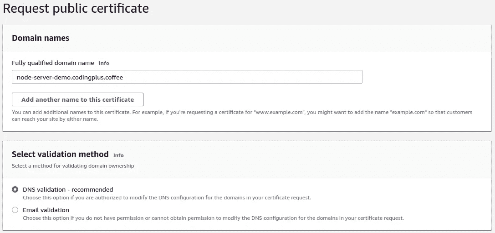

您的证书现在将被列出，但其状态将是“等待验证”点击查看更多详情。

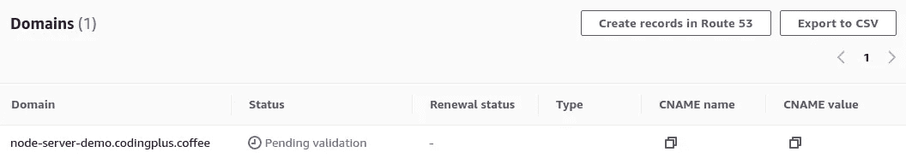

若要颁发证书，您需要验证您控制该域。使用“DNS 验证”，这是通过创建一个具有特定密钥和值的可公开访问的 CNAME 记录来实现的，只有域名所有者才能做到这一点。幸运的是，因为您现在正在 Route 53 中管理您的域，所以您可以告诉证书管理器为您创建必要的验证记录。点击“在 53 号公路上创建记录”

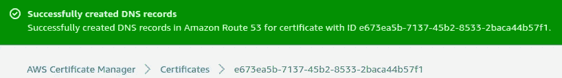

如果你回头看看你的托管区域的 DNS 记录，你会看到列表中有一个新的 CNAME 记录。

几分钟后，证书管理器将显示您的证书已成功验证并颁发。我们有我们的证书。是时候用了。

# 3.创建目标群体

为了让 HTTPS 访问我们 EC2 实例上的服务器，我们需要设置更多的 AWS 资源。最终，我们将需要一个应用负载平衡器(ALB)。ALB 需要监听端口`443`上的请求，然后将这些请求转发给目标组。目标组将接受这些请求，并将它们适当地分发给注册的目标。在我们的设置中，我们只有一个目标——我们的 EC2 实例。

我们将从创建目标组开始。转到 AWS EC2 服务。确保您在启动 EC2 实例的地区工作。导航至“目标群体”页面。点击“创建目标组”

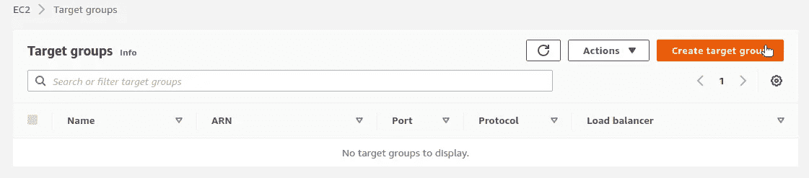

我们的目标类型将是“实例”

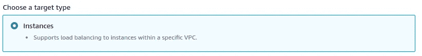

为您的目标群体选择一个名称。我们会选择`node-server-ec2-instances`。对于协议，在端口`80`选择“HTTP”。对于协议版本，选择“HTTP1”

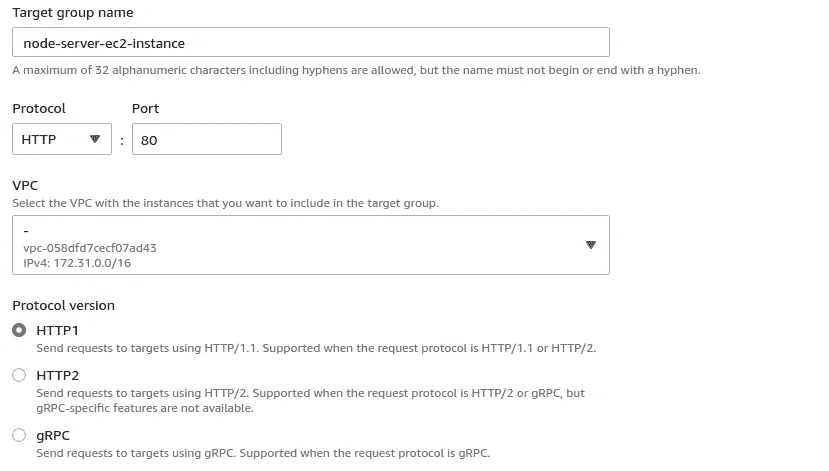

对于健康检查协议，选择“HTTP”，保持健康检查路径为`/`，并选择覆盖健康检查端口，使用端口`80`。这是在我们的 EC2 实例上打开的端口，对`/`的请求将是对位于`/`路径的 Node.js 服务器的请求，这是一个可访问的端点。

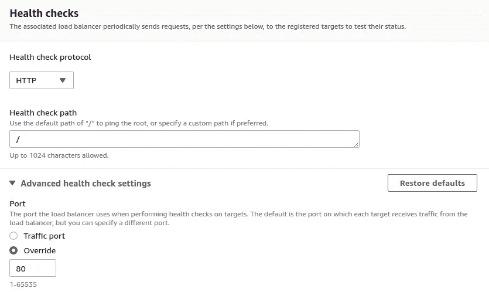

最后，您需要为该组注册目标。选择您的 EC2 实例，确保使用端口`80`，然后点击“在下面包含为待定”

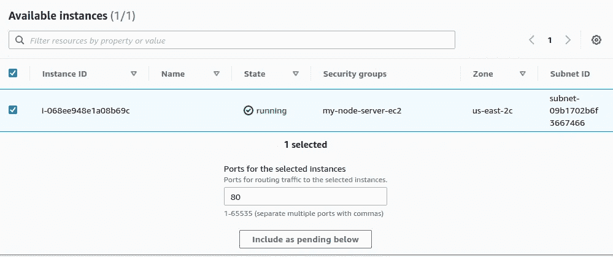

最后，单击“创建目标组”以完成目标组的创建。

此时，如果您四处查看，您会看到您的目标组被列为“未使用”，因为它没有被配置为接收来自负载平衡器的流量。是时候创造一个了。

# 4.创建应用程序负载平衡器。

在 EC2 服务侧边栏中，点击“负载平衡器”在该页面上，单击“创建负载平衡器”从不同的负载平衡器类型中，选择“应用程序负载平衡器”并单击“创建”

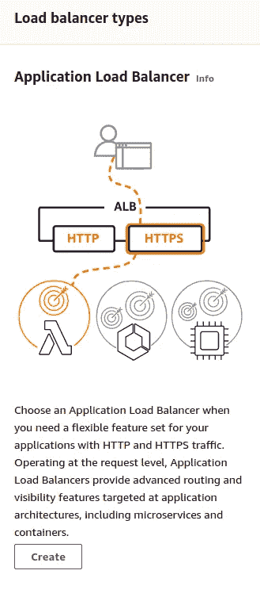

## 基本配置

为负载平衡器选择一个名称。我们选`node-server-alb`。对于“方案”，选择“面向互联网”对于“IP 地址类型”，请选取“IPv4”

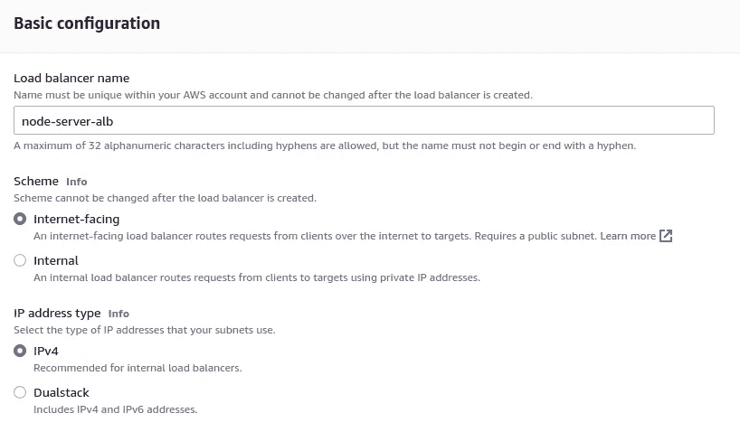

## 网络映射

在“Mappings”下，您需要选择至少两个可用性区域，负载平衡器会将流量路由到这些区域。您选择的可用性区域之一必须是 EC2 实例所在的可用性区域。要找出是哪个区域，可以查看 EC2 实例的网络设置。在一个生产环境中，您可能有多个 EC2 实例(都服务于同一个应用程序)，分布在多个可用性区域中。负载平衡器的工作是在这些区域的健康目标之间分配流量。

## 安全组

在我们的[上一篇文章](/spinning-up-a-node-js-server-in-a-container-on-aws-with-ec2-2cf7f41f4aec)中，我们为 EC2 实例创建了一个安全组。该安全组开放了端口`22`和`80`上的入站流量。为负载平衡器选择相同的安全组。(在后面的步骤中，我们还需要在端口`443`上开放入站流量。)

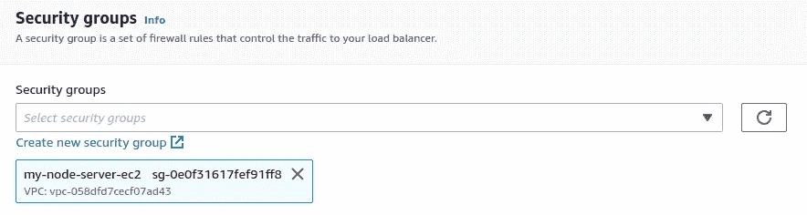

## 监听器和路由

我们的 ALB 将侦听端口`443`上的 HTTPS 请求，然后将这些请求转发给目标组。在下拉列表中找到您刚刚创建的目标组。

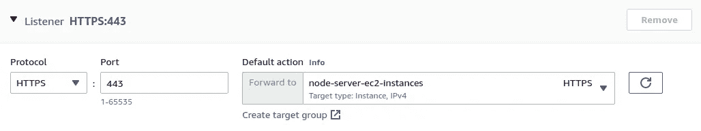

## 安全监听器设置

对于此设置，使用默认安全策略。然后，选择“来自 ACM”的 SSL 证书，在下拉列表中找到新创建的证书。

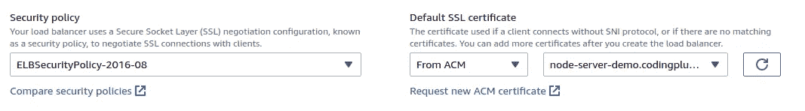

最后，单击“创建负载平衡器”完成。AWS 将开始供应您的负载平衡器。

## 添加用于将端口`80`流量重定向到端口`443`的监听器

我们还希望我们的负载平衡器监听端口`80`上的任何流量，然后使用 HTTPS 将该流量重定向到端口`443`。当您的负载平衡器正在被供应时，转到它的“监听器”设置并点击“添加监听器”

使用这些设置添加监听程序:

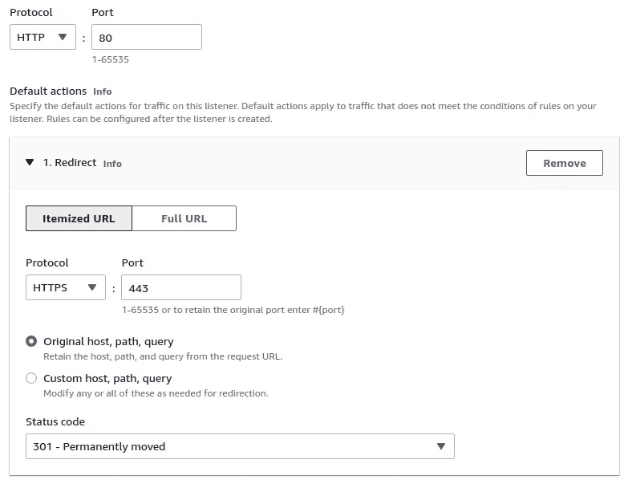

您将在列表中看到新创建的侦听器。然而，你也会注意到在你的 HTTPS `443`监听器旁边有一个小小的提醒三角。

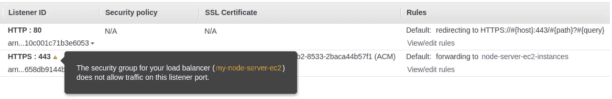

哦，没错。我们设置了安全组，允许端口`22`上的 SSH 流量和端口`80`上的 HTTP 流量。既然我们的负载平衡器期望处理端口`443`上的流量，我们需要更新我们的安全组以允许该流量。

# 5.更新安全组以允许端口`443`上的流量

点击 EC2 服务侧栏中的“安全组”。找到您的 ALB 使用的安全组并选择它。然后，点击“编辑入站规则”

总之，我们应该为端口`22`上的 SSH 流量制定一个规则，为端口`80`上的 HTTP 流量制定两个规则(一个用于“anywhere-IPv4”，一个用于“anywhere-IPv6”)，为端口`443`上的 HTTP 流量制定两个规则(一个用于“anywhere-IPv4”，一个用于“anywhere-IPv6”)。我们需要添加的是这最后两个。

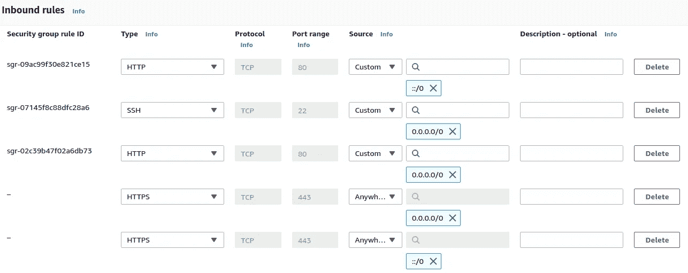

点击“保存规则”

现在，您的 ALB 可以在端口 443 上接收流量，并通过 EC2 实例将该流量发送到目标组。

# 6.更新托管区域以将自定义域流量路由到 ALB

最后一步，我们需要在 Route 53 的托管区域中添加一些记录。我们需要让域管理知道对我们的子域(我们请求 SSL 证书的那个子域)的请求应该被路由到我们的负载平衡器。

导航至 53 号公路服务。找到你的托管区域，然后点击“创建记录”继续并点击“切换到向导”对于路由策略，选择“简单路由”

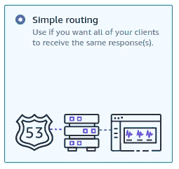

接下来，我们将看到要定义的记录列表。是空的。点击“定义简单记录”

为“记录名称”输入您的子域我们将创建一个`A`记录，它是“应用程序和传统负载平衡器的别名”我们选择 ALB 所在的地区，然后从下拉列表中选择 ALB。

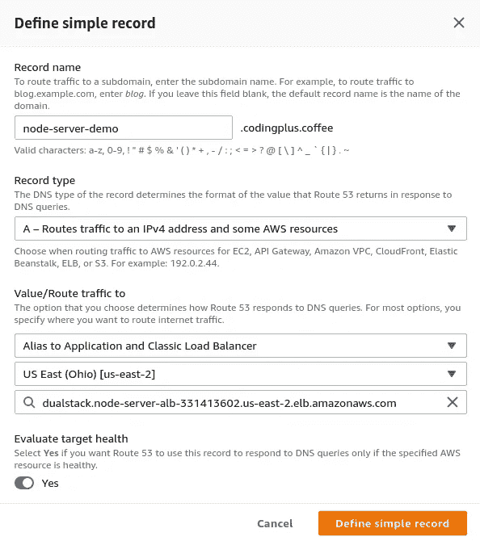

我们点击“定义简单记录”来完成。我们要创建的记录列表现在只有一个`A`记录。

再次点击列表顶部的“定义简单记录”,执行与上述相同的步骤，但这次是针对`AAAA`记录类型。一旦完成，你的列表应该是这样的:

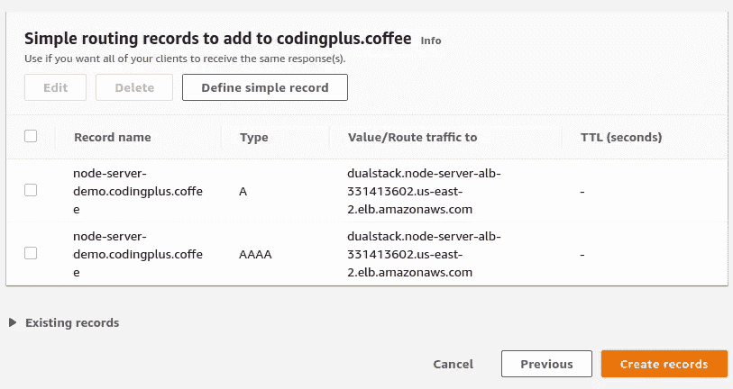

点击“创建记录”完成。

# 测试 HTTPS 请求

一切就绪。最后…我们可以通过向我们的自定义域发送一个带有 HTTPS 的 curl 请求来测试它:

```
$ curl -i https://node-server-demo.codingplus.coffee
HTTP/2 200 
date: Mon, 22 Nov 2021 05:48:30 GMT
content-type: text/html; charset=utf-8
content-length: 12
x-powered-by: Express
etag: W/"c-5E8zZAGdGKFRyrcHK1pAu1s+J08"Hello world.
```

有用！在浏览器中快速检查显示一个安全的连接，我们甚至可以看到我们由亚马逊颁发的 SSL 证书。

# 结论

为了得到 HTTPS，这可能感觉需要很多步骤。正如我上面提到的，步骤不算少，但是它们*很*简单明了。为了在 Docker 容器中启动我们的服务器，我们可以使用另一个服务，比如 AWS ECS 或 AWS CloudFormation，它们可能会为您处理一些手动步骤。然而，通过手动浏览这里的步骤，我们可以看到需要设置和连接在一起的所有单个部件和配置。这是一个很好的学习过程。

我们做到了！在一起浏览了[的上一篇文章](/spinning-up-a-node-js-server-in-a-container-on-aws-with-ec2-2cf7f41f4aec)和这篇文章后，我们完成了以下工作:

*   容器化了 Node.js Express 服务器
*   将容器图像推送到 ECR
*   启动并配置一个 EC2 实例来运行该容器
*   配置网络以允许对我们的 EC2 实例(以及随后对我们的服务器)的 HTTP 请求
*   使用 Route 53 和证书管理器设置自定义域并提供 SSL 证书
*   创建了目标组和应用程序负载平衡器
*   配置我们的负载平衡器将 HTTPS 流量转发到我们的 EC2 实例

这是一组相当大的成就。干得好！