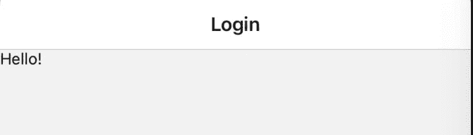
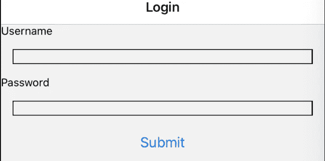
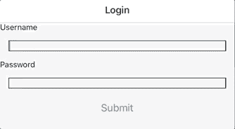
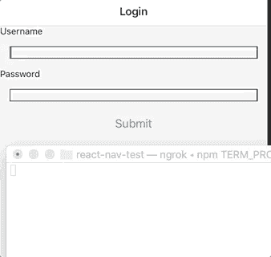

# 向 React-Native 添加表单

> 原文：<https://levelup.gitconnected.com/adding-a-form-to-react-native-2f41b1dc0857>

## 如何使用 Formik 将表单添加到 React-Native 项目中

虽然 react native 是一个快速构建移动应用程序的出色工具，但它也有一些缺点。与 React 不同，React-Native 不能访问 HTML 来获取其元素。例如，与 HTML 相反，react native 中没有 form 元素。虽然仍然可以在 react native 中创建和管理表单，但开发人员可以使用几个库来创建和控制他们应用程序中的表单。在这篇博文中，我将解释如何通过构建一个登录表单来使用 npm 包“Formik”。

## 什么是福米克

Formik 是一个 npm 库，它帮助处理大量的表单逻辑。官方[文件](https://jaredpalmer.com/formik/help)声明:

Formik 会处理重复和烦人的事情——跟踪值/错误/访问过的字段、编排验证和处理提交——所以您不必这样做。这意味着您花更少的时间连接状态和更改处理程序，而花更多的时间关注您的业务逻辑。

它打包了处理事件、捕获表单值和处理表单提交所需的所有逻辑。它在 [React](https://jaredpalmer.com/formik/docs/overview) 和 [React-Native](https://jaredpalmer.com/formik/docs/guides/react-native) 应用中都有效。

## 装置

要在我们的终端中添加 Formik 包，首先运行:

```
$ npm install formik
```

对于这个示例，我创建了一个 FormScreen 组件，并添加了一个静态呈现来启动:



现在我们可以访问 Formik 了，我们需要做的就是将它导入到我们的表单屏幕中:

```
import React from 'react'
import { View, Text, StyleSheet } from 'react-native'
import { Formik } from 'formik'const FormScreen = () => {
  return (
    <View>
      <Text>Hello!</Text>
    </View>
  )
}const styles = StyleSheet.create({
})export default FormScreen
```

有了这个，我们可以开始建立我们的形式。

## 创建表单

现在我们已经添加并导入了 Formik，我们可以将“Formik”包装器添加到我们的 FormScreen 中。因为我们正在构建一个登录表单，所以我们也可以更新我们的组件来添加用户名和密码的输入:

```
import React from 'react'
import { View, Text, StyleSheet } from 'react-native'
import { Formik } from 'formik'const FormScreen = () => {
  return (
    <Formik>
      <View>
        <Text>Username</Text>
        <TextInput style={styles.input}/>
        <Text>Password</Text>
        <TextInput style={styles.input}/>
        <Button title="Submit"/>
      </View>
    </Formik>
  )
} const styles = StyleSheet.create({
  input: {
    margin: 15,
    borderColor: 'black';
    borderWidth: 1
  }
})
```

现在，当我们加载组件时，我们应该看到:



这样，我们就为表单设置了用户名和密码字段，并添加了一个提交按钮。接下来，我们需要向表单中添加一些属性，以便我们可以跟踪和提交它。

## 添加 Formik 逻辑

对于任何表单，我们仍然需要在提交之前控制我们的输入。为了做到这一点，而不是创建一个钩子或状态值，我们将在开始的“Formik”标记中添加一个“initailValues”属性。

```
const FormScreen = () => {
  return (
    <Formik
      initialValues={{username:'', password:''}}
    >
      <View>
        <Text>Username</Text>
        <TextInput style={styles.input}/>
        <Text>Password</Text>
        <TextInput style={styles.input}/>
        <Button title="Submit"/>
      </View>
    </Formik>
  )
}
```

为了实际控制我们的 from，我们需要稍微重组一下 component，以便使用 Formik 语法:

```
const FormScreen = () => {
  return (
    <Formik
      initialValues={{username:'', password:''}}
    >
      {({})}=>(
        <View>
          <Text>Username</Text>
          <TextInput style={styles.input}/>
          <Text>Password</Text>
          <TextInput style={styles.input}/>
          <Button title="Submit"/>
        </View>
      )}
    </Formik>
  )
}
```

包装在“视图标签”中的所有东西都在“Formik 标签”中，这是 JSX 回调函数的结果。“Formik”为我们提供了几个新东西，然后我们可以将它们传递给回调函数，比如我们的事件处理程序和一个 values 变量(它从 initialValues prop 继承其值)。现在我们可以在适当的地方传递这些属性。

```
const FormScreen = () => {
  return (
    <Formik
      initialValues={{username:'', password:''}}
    >
      {({handleChange, handleSubmit, values})=>(
        <View>
          <Text>Username</Text>
          <TextInput
            style={styles.input}
            value={values.username}
            onChangeText={handleChange('username')}
          />
          <Text>Password</Text>
           <TextInput
            style={styles.input}
            value={values.password}
            onChangeText={handleChange('password')}
            secureTextEntry={true}
          />
          <Button title="Submit"/>
        </View>
      )}
    </Formik>
  )
}
```

现在，当我们键入输入内容时，我们会看到:



在下一节中，我们将使用我们的 handleSubmit。

## 提交表单

为了实际提交我们的表单，我们必须添加两个事件。首先在我们的开始“Formik tag”中有一个带有回调的“onSubmit event”，然后在我们的按钮上有一个“onPress event”。出于本教程的目的，我们的“onSubmit”事件将简单地“console.log”一个字符串，我们的 values 对象和“onPress”将指向我们的 handleSubmit 事件处理程序。

```
const FormScreen = () => {
  return (
    <Formik
      initialValues={{username:'', password:''}}
      onSubmit={(values) => console.log('submitted', values} >
      {({handleChange, handleSubmit, values})}=>(
        <View>
          <Text>Username</Text>
          <TextInput
            style={styles.input}
            value={values.username}
            onChangeText={handleChange('username')}
          />
          <Text>Password</Text>
          <TextInput
            style={styles.input}
            value={values.password}
            onChangeText={handleChange('password')}
            secureTextEntry={true}
          />
          <Button onPress={handleSubmit} title="Submit"/>
        </View>
      )}
    </Formik>
  )
}
```

现在，当我们提交表单时，我们将看到:



这样我们就成功地完成了一份表格！

## 结论

这样，我们就可以添加更多的样式，使我们的表单更加突出，并且我们可以向我们的提交事件添加一个获取请求，这样我们就可以从后端访问信息或向后端发送信息。祝您在自己的项目中添加表单时好运！