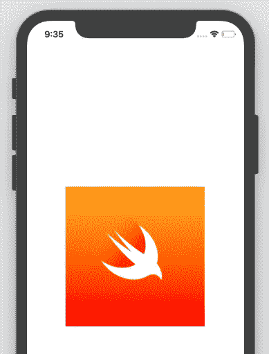

# 将启动屏幕添加到 iOS 应用程序

> 原文：<https://levelup.gitconnected.com/adding-a-launch-screen-to-an-ios-app-ac197075b25b>

我们真的需要一个启动屏幕吗？嗯，我想说启动屏幕是一种甚至在用户开始使用应用程序之前营造积极氛围的方式。因此，拥有简单干净的启动屏幕对于一个成功的应用程序来说非常重要。

照片由 [Unsplash](https://unsplash.com?utm_source=medium&utm_medium=referral) 上的 [CoinView App](https://unsplash.com/@coinviewapp?utm_source=medium&utm_medium=referral) 拍摄

*要开始学习本教程，你需要有一个 iOS 应用程序。如果你没有，请参考我的* [*中的故事*](https://medium.com/macoclock/creating-a-simple-browser-for-ios-using-wkwebview-with-swift-95688acd04b9) *或* [*DEV 社区视频*](https://dev.to/mmafrar/creating-a-simple-browser-for-ios-2b3) *上的* ***使用 WKWebView 和 Swift*** *为 iOS 创建一个简单的浏览器。否则你可以简单的从*[*https://github.com/mmafrar/swift-ios-wkwebview-demo*](https://github.com/mmafrar/swift-ios-wkwebview-demo)*克隆 GitHub 上的基础 app。希望你现在有一个应用程序来开始这个教程。*

每次你开发一个手机应用程序，你都会碰到这个叫做**启动屏幕**的东西。设置启动屏幕的方式因平台而异，也可能因您使用的编程语言而异。以我为 iOS 和 Android 开发应用的一点点经验，我个人觉得苹果让事情变得简单多了。虽然有一些特定的库可以为你做这些，但是今天我们将讨论如何在本地完成这些。我们将创建一个中间带有徽标的空白白色屏幕。

Assets.xcassets 文件夹的内容

在你的 Mac 上，打开 Xcode 并**打开你正在做的项目**。在**左侧窗格**中，您将看到项目中的文件。点击 **Assets.xcassets** ，你可能会看到一个名为 AppIcon 的图像集，以及你已经添加的任何内容。将启动图像拖放到 Assets.xcassets 文件夹中。现在你应该有一个像上面图片中显示的屏幕。

LaunchScreen .故事板视图

接下来点击**launch screen . story board**你会看到一个空视图。点击上图右上角显示的按钮。您将看到可以添加到该视图的组件列表。从菜单提示中搜索 **ImageView** 并将其拖动到视图的中心。

显示“属性检查器”栏

然后点击 ImageView 并转到**显示属性检查器**。在 Image View - > Image 下，选择您在本教程前面添加的启动图像。然后，确保将视图- >内容模式的值设置为纵横比填充，这将使图像在屏幕上看起来更好。

显示“大小检查器”栏

尽管图像可能在当前视图中居中显示，但它不会在小屏幕或大屏幕上居中显示。为了解决这个问题，切换到**显示尺寸检查器**菜单，取消选择自动调整部分顶部和左侧的红线，并选择中间的线，如图所示。

模拟器中的启动屏幕

上面是在我的模拟器上渲染时拍摄的启动屏幕截图。你可能有兴趣查看我在 Medium 上发表的故事[如何为使用 Swift 或 React Native](https://blog.devgenius.io/how-to-add-an-icon-for-an-ios-app-built-using-swift-or-react-native-202337bc4df7) 构建的 iOS 应用添加图标。下面是我最近发布的一个 DEV 社区视频。

 [## 为 iOS 创建简单的浏览器

### 链接到故事…

开发到](https://dev.to/mmafrar/creating-a-simple-browser-for-ios-2b3)