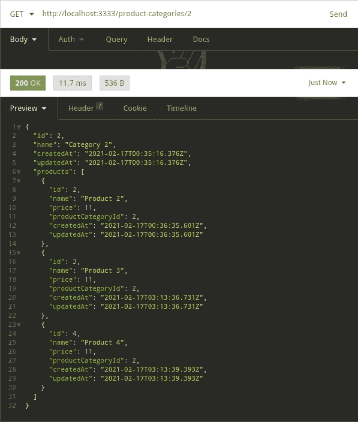
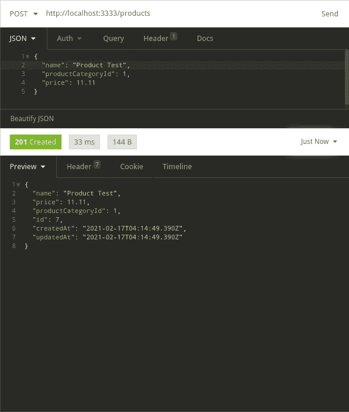

# 在 TypeScript API 上使用 TypeORM 和 MySQL

> 原文：<https://levelup.gitconnected.com/adding-and-using-a-database-on-a-typescript-api-with-typeorm-41c49336eff5>


简·安东宁·科拉尔在 [Unsplash](https://unsplash.com?utm_source=medium&utm_medium=referral) 上拍摄的照片

在本教程中，我们将把 TypeORM 添加到我们的 API 中，并使用它来创建一个保存产品信息的数据库。作为基础，我们将使用本教程中[的 API。如果你愿意，你可以从这里](/creating-a-node-js-api-with-express-and-typescript-549fba5f5a33)获得[源文件并立即开始。](https://github.com/phcarvalho/medium-posts/tree/main/01-base_api_with_ts)

# **数据库设置**

我们要做的第一件事是建立一个数据库。如果你已经有一个数据库(即使它不是 MySQL 数据库)，你不能跳过这一部分。

我将使用 Docker 来加速这个过程。如果你还不知道 docker，我建议你看一看。你可以按照这个页面安装:[https://docs.docker.com/get-docker/](https://docs.docker.com/get-docker/)

Docker 使用包含工作操作系统的容器，该操作系统包含您需要的工具和程序。你可以使用一个“即插即用”的 docker 容器来代替自己安装和设置。对于本教程，我将使用 MySQL 容器。安装 docker 后，只需在终端中运行以下命令:

```
docker run --name database -e MYSQL_ROOT_PASSWORD=password -p 3306:3306 -d mysql:8
```

这将创建一个 MySQL 分离的( *-d* )容器，名为“*数据库”*，用户密码为*‘密码’*(*-e MySQL _ ROOT _ PASSWORD*)，容器的端口 *3306* 映射到主机的 *3306* 端口。如果你从未使用过 docker，这将是一个很大的信息量。这里需要记住的主要内容是您使用的名称和密码。

您可以在终端使用' *docker ps* '检查集装箱是否正在运行。如果什么都没有显示(也许你重启了你的电脑)，使用' *docker ps -a* '来显示所有的容器(包括那些没有启动的)。要启动和停止容器，只需使用' *docker 启动数据库*和' *docker 停止数据库*'。总结一下:

```
# List all running containers
docker ps# List all containers
docker ps -a# Start a container
docker start <name># Stop a container
docker stop <name>
```

我们要做的最后一件事是在 MySQL 数据库中创建模式。为此，我将使用 MySQL Workbench，并使用以下设置连接到容器上运行的实例:

```
Hostname: 127.0.0.1
Port: 3306
Username: root
Password: <password>
Default Schema: <blank>
```

连接后，在 Query 选项卡上键入以下内容，然后单击闪电图标(或按 CTRL + Enter)。

```
CREATE SCHEMA `database_name` ;
```

# **配置类型表**

让我们从安装依赖项开始:

```
# Install TypeORM and a required lib
yarn add typeorm reflect-metadata# Install the database driver
yarn add mysql2# Install node types if you haven't already
yarn add @types/node -D
```

我们需要安装 TypeORM 并反射元数据(必需)。我们还必须安装数据库驱动程序。如果你正在使用另一个数据库(比如 PostgreSQL)，你将不得不安装一个不同的驱动程序。我们还安装了节点类型以确保万无一失(我们应该已经安装了)。

我们还需要在' *tsconfig.json* '文件的“ *compilerOptions* ”中添加“*emitteormetadata*”和“*experimental decorator*”:

tsconfig.json

现在，我们将创建一些文件夹和最后一个配置文件。在 de***src****文件夹内，添加一个 ***app*** 和一个 ***数据库*** 文件夹。在 ***app*** 文件夹内添加一个 ***实体*** 文件夹，并在 ***数据库*** 文件夹内添加一个 ***迁移*** 文件夹。最后，在项目根上添加一个' *ormconfig.json'* (这里有' *tsconfig.json'* 文件)。结构应该是这样的:*

```
*> Project Folder
  > node_modules
  > src
    > app
      > entities
    > database
      > migrations
    - app.ts
    - routes.ts
    - server.ts
  - ormconfig.json
  - package.json
  - tsconfig.json*
```

*现在打开' *ormconfig.json'* 文件并输入以下内容。不要忘记更改'*密码*和'*数据库*'(这是我们创建的模式):*

*ormconfig.json*

*现在，我们只需在启动 API 时实例化我们的连接。让我们在' *server.ts'* 文件中进行更改:*

*server.ts*

# ***创建实体***

*既然我们的服务器和数据库已经启动并运行，我们只需要创建我们的实体。对于本教程，我将创建一个产品和一个产品类别表，如果它们之间存在一对多的关系。在 ***实体*** 文件夹中创建' *Product.ts* '和' *ProductCategory.ts* '文件:*

*ProductCategory.ts*

*产品. ts*

*我们总是用*实体*装饰器创建我们的实体，并从 *BaseEntity* 扩展它(这是可选的，但有了它会更容易)。我们将为 id 为*的*使用 *PrimaryGeneratedColumn* 装饰器，并且每次创建列时，我们都将使用 *Column* 装饰器并设置它的类型。我们还将为 createdAt 和 updatedAt 列使用 *CreateDateColumn* 和 *UpdateDateColumn* 装饰器。*

*最难的部分(实际上并不难)是设置关系。我们将在产品实体上使用 *ManyToOne* 装饰器(许多产品对应一个产品类别)，在产品类别实体上使用 *OneToMany* 装饰器(一个产品类别对应许多产品)。我们还使用 *JoinColumn* 装饰器(这是可选的，如果您不指定，TypeORM 将为您处理它)指定我们将用于这个关系的列(在产品实体内部)。*

# *使用实体*

*最后，我们将使用我们的实体来创建、读取、更新和删除(CRUD)。为此，我们需要创建控制器和 API 路径。每个控制器最多可以有五种功能。这不完全是一条法律，但这是让每个控制器只承担一项责任的好方法。例如:如果您需要另一个函数(除了 *store* 之外)以不同的方式创建记录，也许您应该考虑为它创建另一个控制器。这五个功能是:*

*   **存储*:用于创建一条记录；*
*   **索引*:用于返回一个表中的所有记录；*
*   **显示*:用于返回指定的记录；*
*   **更新*:用于更新指定的记录；*
*   **删除*:用于删除指定的记录。*

*对于每个实体，我们将创建一个具有五个 API 路由的控制器。让我们从控制器开始。在 ***app*** 文件夹中创建一个 ***controllers*** 文件夹，并添加“*productcategorycontroller . ts”*和“*product controller . ts”*文件:*

*产品控制器. ts*

*ProductCategoryController.ts*

*我们需要做的最后一件事是编辑' *routes.ts'* 文件:*

*routes.ts*

*我们已经创建了路由，现在让我们启动服务器并测试 API。只需在您的终端上运行以下命令。*

```
*yarn start:dev*
```

# *测试 API*

*为了测试我们的 API，我将使用[失眠症](https://insomnia.rest/)，但是如果你愿意，你也可以使用 Postman。不要忘记用一个现有的 id 号来改变' *{id}* '。*

*所以我们有十条路线要测试。首先是产品类别路线:*

*   *GET |[http://localhost:3333/product-categories](http://localhost:3333/product-categories)|无正文*
*   *POST |[http://localhost:3333/product-categories](http://localhost:3333/product-categories)| { name:string }*
*   *GET |[http://localhost:3333/product-categories](http://localhost:3333/product-categories)/{ id } |无正文*
*   *PUT |[http://localhost:3333/product-categories](http://localhost:3333/product-categories)/{ id } | { name:string }*
*   *DELETE |[http://localhost:3333/product-categories](http://localhost:3333/product-categories)/{ id } |无正文*

*以及产品路线:*

*   *GET |[http://localhost:3333/products](http://localhost:3333/product-categories)|无正文*
*   *POST |[http://localhost:3333/products](http://localhost:3333/product-categories)| { name:string，price: number，productCategoryId: number }*
*   *GET |[http://localhost:3333/product](http://localhost:3333/product-categories)s/{ id } |无正文*
*   *PUT |[http://localhost:3333/products](http://localhost:3333/product-categories)/{ id } | { name:string，price: number，productCategoryId: number }*
*   *DELETE |[http://localhost:3333/products](http://localhost:3333/product-categories)/{ id } |无正文*

****

*API 调用的一些例子*

*就这样，我们用 TypeORM 让我们的 API 读写我们的数据库。如果你有任何问题或者只是想比较所有的项目文件，你可以在这里查看。*