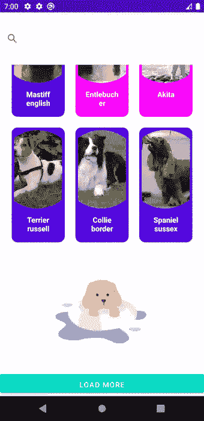
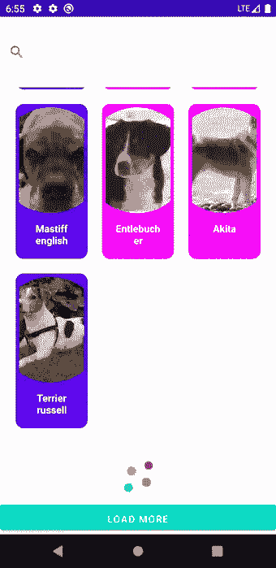
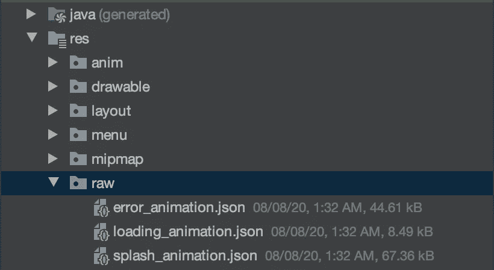
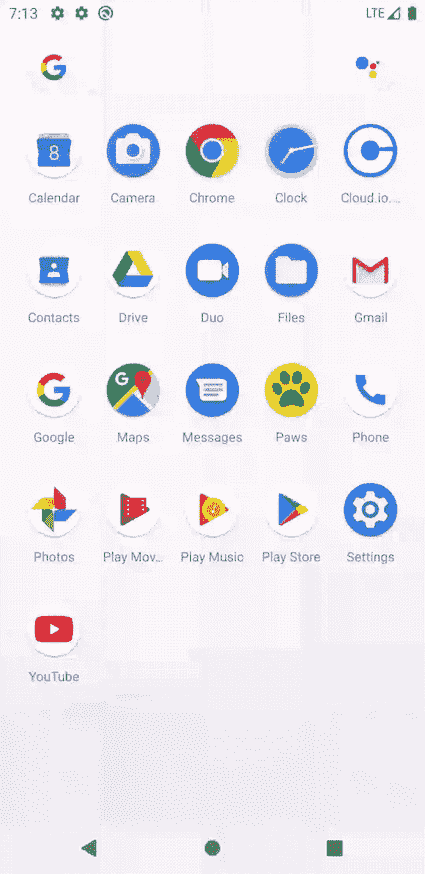

# 使用 Lottie 库向您的 Android 应用程序添加动画

> 原文：<https://levelup.gitconnected.com/adding-animations-to-your-android-application-using-lottie-library-fa2d7197e23b>

与静态文本或图片相比，将动画添加到您的 android 应用程序中会使其更加有趣。最简单的方法是使用 airbnb 的第三方图书馆[洛蒂](https://github.com/airbnb/lottie-android)。

> 最好的部分是你可以使用动画，而不必写一行代码。

为了简洁起见，我们将使用在[lottiefiles.com](https://lottiefiles.com/popular)上可用的现成动画。或者，您也可以使用 Adobe after effects 构建自己的自定义动画，并在您的应用程序中使用它们。(在[这里](https://github.com/Shivamdhuria/flows_guide/tree/master)看它的作用)

# 让我们开始吧🏁

让我们从从 [LottieFiles](https://lottiefiles.com/popular) 下载你的项目需要的所有动画文件开始。对于本指南，我将使用总共三个动画文件

# 闪屏

当用户打开应用程序时，这将显示短暂的 2 秒钟。

# 网络错误

当用户点击“加载更多”并出现网络错误时，显示在回收列表下方。

# 正在加载…

当用户点击“加载更多”按钮时，显示在回收器列表下方。

在[网站](https://lottiefiles.com/)上找到你想要使用的动画文件，下载**洛蒂 Json** 格式的动画文件。复制并粘贴到 *res > raw* 文件夹中。

# **给 Splash 活动添加动画**

要向 splash 活动添加动画，请转到 **activity_splast.xml** 文件并添加

使用`app:lottie_rawRes`属性设置文件的位置。我还用`app:lottie_scale`把它缩小到 0.2，用`app:lottie_speed`把动画速度提高到 3。

# 为加载和网络错误添加动画

我将 *LottieAnimationView* 添加到*recycle view 的正下方。*

现在在 MainActivity 中，我观察 api 请求并根据返回的结果更新动画。

`showAnimation(animationResource: Int)`函数使**LottieAnimationView***可见*，将资源值设置为传递的 animationResource，播放动画并滚动到底部。当 Api 请求返回成功时，我还隐藏了 **LottieAnimationView** 。

# 就是这样！✅

你应该会得到这样的结果。

 [## shivamdhuria/flow _ guide

### 这是一个 android 应用程序，我将尝试实现最新和最棒的媒体链接…

github.com](https://github.com/Shivamdhuria/flows_guide/tree/add_animation_final)