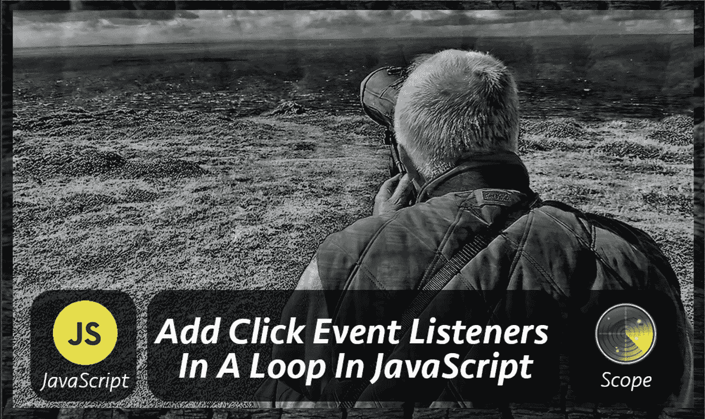

# 不熟悉 JavaScript？你将面临这个问题，如果不是已经

> 原文：<https://levelup.gitconnected.com/adding-click-event-listeners-in-a-loop-in-javascript-cd034031c452>

## 在循环中添加点击事件侦听器可能是一个谜



当您将多个 click 事件附加到**元素**时，如**循环**中的按钮，click 事件将始终为我们提供**最后一个** **索引**值，而不管按下的是什么按钮。

这是开发人员开始学习 JavaScript 时面临的常见问题之一。

在本文结束时，您将知道是什么导致了这个问题，以及解决它的一些方法。

*   [为什么我需要知道**吊装**？](https://softauthor.com/javascript-add-click-event-listener-in-a-loop#what-is-hoisting)
*   [为什么 **i** 变量总是得到循环中的最后一个索引？](https://softauthor.com/javascript-add-click-event-listener-in-a-loop#i-variable-always-get-the-last-index-in-a-loop)
*   [可变范围问题](https://softauthor.com/javascript-add-click-event-listener-in-a-loop#variable-scope-issue)
*   [解决方案#1:终结(生命)](https://softauthor.com/javascript-add-click-event-listener-in-a-loop#what-is-closure-iife)
*   [解决方案#2:闭包外部函数返回内部函数](https://softauthor.com/javascript-add-click-event-listener-in-a-loop#closure-outer-function-returns-inner-function)
*   [解决方案# 3:](https://softauthor.com/javascript-add-click-event-listener-in-a-loop#use-foreach-instead-of-for)使用 **forEach** 代替
*   **[解决方案#4:用 **let** 代替**var**](https://softauthor.com/javascript-add-click-event-listener-in-a-loop#use-let-instead-of-var)**
*   **[奖励:在循环外声明回调函数](https://softauthor.com/javascript-add-click-event-listener-in-a-loop#declare-callback-function-outside-of-the-loop)**

# **导致问题的代码片段**

**正如您所看到的，HTML 页面有一个带有名为`buttonsContainer`的`id`的`div`元素。**

```
<!DOCTYPE html>
<html>
<head>
  <meta charset="utf-8">
  <meta name="viewport" content="width=device-width">
  <title>JS Bin</title>
</head>
<body>
  <div id="buttonsContainer"></div>
</body>
</html>
```

**这是我在下面的 javascript 代码中使用`for`循环动态添加五个按钮的地方。**

```
const buttonsContainer = document.getElementById("buttonsContainer");
for (var i = 0; i < 5; i++) {
  const button = document.createElement("button");
  button.innerText = i;
  button.addEventListener("click", function() {
    console.log(i)
  })
  buttonsContainer.appendChild(button);
}
```

**我还将一个点击事件附加到一个按钮元素上，并在每次迭代中将其附加到`buttonContainer`元素上。**

**如果我在这个阶段运行这段代码，无论按下什么按钮，我都将得到值 5。**

**在了解这里发生了什么之前…我们需要知道…什么是提升。**

# **提升**

**默认情况下，用`var`关键字声明的变量是**函数范围的**，而不是块范围的。**

**因此，在函数中声明的任何变量，不管它有多深，都将被移到顶部，并且可以在函数中的任何地方访问。**

**另一方面，如果一个变量在函数之外声明，它将成为一个全局变量，我们可以在应用程序的任何地方访问它，因为它属于窗口对象(仅限浏览器)。**

**那种行为叫做**吊装**。**

# **变量`i`总是有最后一个索引**

**现在让我们看看上面的代码会发生什么。**

**用`var`关键字声明的`i`变量将被自动移动到页面顶部，因为它没有在函数中声明，所以由于提升，它变成了一个全局变量。**

**因此`i`变量显然没有被限定在`for`循环的范围内，而是被限定在全局范围内，并且在每次迭代中被绑定到回调函数之外的同一个变量。**

**当`for`循环到达最后一次迭代时，`i`变量将保存最后一个索引值。这就是为什么输出总是最后一个索引，在我的例子中是 5。**

# **`i`是一个全局变量**

**我将在 for 循环之外控制台日志 I 变量**

```
} // end of for loop
console.log(i);
```

**代码一执行完，您就会在浏览器控制台中看到 5，甚至不需要单击任何按钮。**

**这证明了变量 I 是全局范围的。**

**现在我们知道了罪魁祸首，它是用`var`关键字声明的`i`变量。**

**让我们来看看几个解决方案。**

# **解决方案 01:关闭**

**闭包是为了拯救，我们可以使用闭包来改变`i`变量的范围，使函数拥有私有变量成为可能。**

**使用闭包，我们可以唯一地保存每个回调函数的循环索引。**

```
for (var i = 0; i < 5; i++) {
  var button = document.createElement("button");
  button.innerText = i;
  (function(index){
    button.addEventListener("click", function() {
      console.log(index)
    })
  })(i)
  buttonsContainer.appendChild(button);
}
console.log(i);
```

**让我们看看实际情况。**

**首先，在`for`循环中使用`()`左括号和右括号定义一个闭包。**

**之后，声明一个接受索引参数的匿名函数。**

**然后，用最后一组()将全局变量`i`传递给闭包，这将在每次迭代中调用闭包一次。**

**这也被称为**立即调用函数表达式(life)**，这是声明**闭包**的一种方式。**

```
(function(){ })()
```

**因此，上面的代码在每次迭代中捕获一个`i`变量的值，并将其传递给创建局部范围的函数的一个参数。**

**现在，每个函数都有自己的索引变量版本，当在循环中创建函数时，这个版本不会改变。**

**这个闭包函数为每个事件处理程序唯一地保存了`i`(私有变量)的值，因此它们都可以访问自己的值。**

**当您在 for 循环结束后单击任何按钮时，将使用正确的索引值执行适当的回调函数。**

**我希望这有意义。**

# **解决方案 2:闭包外部函数返回内部函数**

**或者，您可以返回闭包回调函数内部的函数。**

```
button.addEventListener("click", function(index) {
      return function(){
        console.log(index)
      }
    }(i))
```

**在前面的示例中，整个按钮单击事件侦听器代码都用闭包包装起来。**

**在这个例子中，只有按钮点击回调函数用闭包包装。**

**外部函数将在每次迭代中执行，并且`i` 变量(全局)作为一个参数传递给外部函数的调用者，就像这样(I)。**

**内部函数将在每次迭代中返回，并附加到具有唯一索引值的 click 事件。**

**在闭包中，内部函数可以访问在它外部声明的变量，即使在外部函数返回之后。**

# **解决方案 3:用`forEach`代替`for`**

**如果您有一个项目数组，并且您可以简单地对其运行`forEach()`方法，这将是非常好的，但是当每次迭代都发生异步操作时，不推荐这样做。**

**默认情况下,`forEach`循环提供了一种干净自然的方式来在每次迭代中获得不同的回调闭包函数。**

```
const num = [0, 1, 2, 3, 4];
num.forEach(i => {
  var button = document.createElement("button");
  button.innerText = i;

  button.addEventListener("click", function() {
    console.log(i)
  })
  buttonsContainer.appendChild(button);
})
```

**它不需要添加任何额外的包装函数，比前面的例子更干净！**

# **解决方案 4:用`let`代替`var`**

**在 ES6 中，我们有`let`和`const`关键字，它们是**块范围的**,而不是`var`函数范围的。换句话说，`let`和`const`没有被吊起。**

**因此，使用`let`关键字在每次迭代中用一个索引值绑定一个新的回调函数，而不是一次又一次地使用同一个引用。**

**要解决这个问题，将原始代码中的`var`改为`let`就可以了。**

```
for (let i = 0; i < 5; i++) {
  const button = document.createElement("button");
  button.innerText = i;
  button.addEventListener("click", function() {
    console.log(i)
  })
  buttonsContainer.appendChild(button);
}
```

**这是修复循环中的 click 事件问题的最快方法。**

**但是，这种方法的一个问题是要小心浏览器的向后兼容性，因为它是 ES6 特性的一部分。**

# **在循环外声明回调函数**

**有时，我们希望用名称单独声明一个回调函数，而不是在 addEventListener 构造函数中使用内联匿名函数。**

**所以声明一个名为 buttonClicked() function 的回调函数，在 addEventListener 构造函数内部调用它，不带任何括号。**

**默认情况下，`event`对象被传递给 buttonClicked()函数。**

**然后，我可以使用一个`event`对象轻松地访问关于所选元素的任何信息。**

```
for (let i = 0; i < 5; i++) {
  const button = document.createElement("button");
  button.innerText = i;
  button.id = 'button-' + i;
  button.setAttribute('index', i);
  button.addEventListener("click", buttonClicked)
  buttonsContainer.appendChild(button);
}
function buttonClicked(e) {
  console.log(e.target.id)
  console.log(e.target.getAttribute('index'));
}
```

**如果我想把一个值作为参数直接传递给回调函数呢？**

```
for (let i = 0; i < 5; i++) {
  const button = document.createElement("button");
  button.innerText = i;
  button.id = 'button-' + i;
  button.setAttribute('index', i);
  button.addEventListener("click", buttonClicked(i))
  buttonsContainer.appendChild(button);
}
function buttonClicked(index) {  
  return function() {
    console.log(index)
  }
}
```

**这与解决方案 2 非常相似。**

**当我们向`buttonClicked`传递一个值时，它变成了一个闭包(IIFE ),这是一个外部函数，在每次迭代中运行。**

**内部函数将在每次迭代中返回，并与索引值一起附加到 click 事件。**

**而且……那会有魔力的！**

# **结论**

**在本文中，您已经学习了如何以几种方式解决在`for`循环中附加 click 事件时出现的问题。**

**JavaScript 中的作用域是一个大话题，我仍在学习 JavaScript 中的闭包和其他概念。**

**如果您有任何建议、反馈或本文中有任何不清楚的地方，请在下面留言联系我。**

**我期待着你的来信和快乐的编码！**