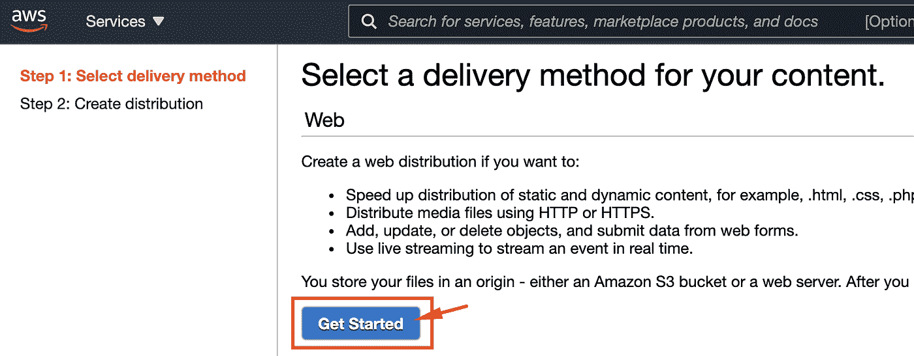
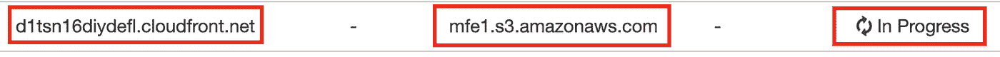

# 将 CloudFront 和一个域添加到支持 Web 的 AWS S3 Bucket 中

> 原文：<https://levelup.gitconnected.com/adding-cloudfront-and-a-domain-to-web-enabled-aws-s3-bucket-e9ace0cefc3f>


在本文中，我们将创建一个 CloudFront 发行版，并将其链接到一个注册域(microfrontends.info)。我们将与 AWS CloudFront、Route 53、S3 和证书管理器合作。本文建立在前一篇[文章](https://www.linkedin.com/pulse/creating-web-site-aws-s3-step-rany-elhousieny-phd%E1%B4%AC%E1%B4%AE%E1%B4%B0)([https://www . LinkedIn . com/pulse/creating-web-site-AWS-S3-step-rany-elhousieny-PhD % E1 % B4 % AC % E1 % B4 % AE % E1 % B4 % B0](https://www.linkedin.com/pulse/creating-web-site-aws-s3-step-rany-elhousieny-phd%E1%B4%AC%E1%B4%AE%E1%B4%B0))的基础上。

[](https://www.linkedin.com/pulse/creating-web-site-aws-s3-step-rany-elhousieny-phd%E1%B4%AC%E1%B4%AE%E1%B4%B0) [## 在 S3 AWS 上创建网站:一步一步来

### 我一直在我的文章中使用 AWS S3 部署，特别是微前端，我想给出简单的步骤…

www.linkedin.com](https://www.linkedin.com/pulse/creating-web-site-aws-s3-step-rany-elhousieny-phd%E1%B4%AC%E1%B4%AE%E1%B4%B0) 

在我们部署到支持 web 的 AWS S3 存储桶之后，我们可以通过以下 URL 浏览到该存储桶【http://mfe1.s3-website-us-east-1.amazonaws.com/


你注意到在网址旁边写着“不安全”。这是因为我们使用 HTTP 而不是 HTTPS。为了能够获得证书，我们首先需要创建一个 CloudFront 发行版。CloudFront 也称为 CDN 或边缘服务器，负责在全球范围内缓存您的内容，并提供更少的流量传输。让我们将 AWS CloudFront 添加到我们的 S3 桶中

# 创建 CloudFront 发行版

1.  转到 AWS 控制台，搜索 CloudFront，然后单击它，如下所示:


2.点击“创建分销”


3.单击 Web 下的“开始”，如下所示:



4.现在，让我们将它指向我们的 S3 桶，如下所示:


5.向下滚动直到找到“创建发行版”并点击它


6.您将被转到分发列表，新的分发将在进行中



7.等待几分钟，直到它显示部署如下:


选择发行版并复制域名(在我的例子中是 d1tsn16diydefl.cloudfront.net)，如下所示:


# 现在你应该可以浏览到[http://d1tsn16diydefl.cloudfront.net/](http://d1tsn16diydefl.cloudfront.net/)


如果您收到类似以下内容的拒绝访问:


尝试以下两个步骤:

1.  向 CloudFront 添加一个自定义错误，如下所示:


2.再次查看您的 S3 时段策略，确保它类似于以下内容(用您的时段名称替换 xxxxx)

```
{
  "Id": "Policy1615751075403",
  "Version": "2012-10-17",
  "Statement": [
    {
      "Sid": "Stmt1615751021409",
      "Action": [
        "s3:GetObject"
      ],
      "Effect": "Allow",
      "Resource": "arn:aws:s3:::xxxxx/*",
      "Principal": "*"
    }
  ]}
```


# 添加域

在这一步中，我们将购买一个域(microfrontends.info)并将它链接到我们刚刚创建的 CloudFront([http://d1tsn16diydefl.cloudfront.net/](http://d1tsn16diydefl.cloudfront.net/))


# 使用 Rout53 购买域名

我将购买一个域名(microfrontends.info ),用于发布微前端([https://microfrontends.info/](https://microfrontends.info/))的学习资料。你可以购买任何你喜欢的域名。它的价格通常低至 12 美元。你也可以从 freenom.com 获得一年的免费域名，但配置会有所不同。

1-打开 AWS 控制台，导航到路线 53 并选择注册域


2-填写您想要购买的域名，然后点击“检查”,如下所示


# 添加记录以将新的域链接到 CloudFront

转到托管区域并选择您购买的域


点击“创建记录”


在上一个图像中，

1.  我添加了一个前缀 mf1，使别名= mfe1.microfrontends.info
2.  选择路线类型= A
3.  启用别名
4.  路由流量选择“别名到 ClouFront 分发”
5.  添加我们在前一篇文章 d1tsn16diydefl.cloudfront.net 中创建的发行版，如下所示


点击“创建记录”


现在，你应该可以浏览到 http://mfe1.microfrontends.info/的


# 参考

[](https://www.linkedin.com/pulse/adding-cloudfront-web-enabled-aws-s3-bucket-rany-elhousieny-phd%E1%B4%AC%E1%B4%AE%E1%B4%B0/) [## 将 CloudFront 添加到支持 Web 的 AWS S3 Bucket

### 本文建立在前一篇文章(https://www.linkedin。

www.linkedin.com](https://www.linkedin.com/pulse/adding-cloudfront-web-enabled-aws-s3-bucket-rany-elhousieny-phd%E1%B4%AC%E1%B4%AE%E1%B4%B0/) 

[https://www . LinkedIn . com/pulse/adding-domain-certificate-website-AWS-S3-we B- enabled-rany](https://www.linkedin.com/pulse/adding-domain-certificate-website-aws-s3-web-enabled-rany)

[https://rany.elhousieny.com](https://rany.elhousieny.com)

 [## 微前端

### Martin Fowler 将微前端架构定义为“一种可独立交付的架构风格…

microfrontends.info](https://microfrontends.info) 