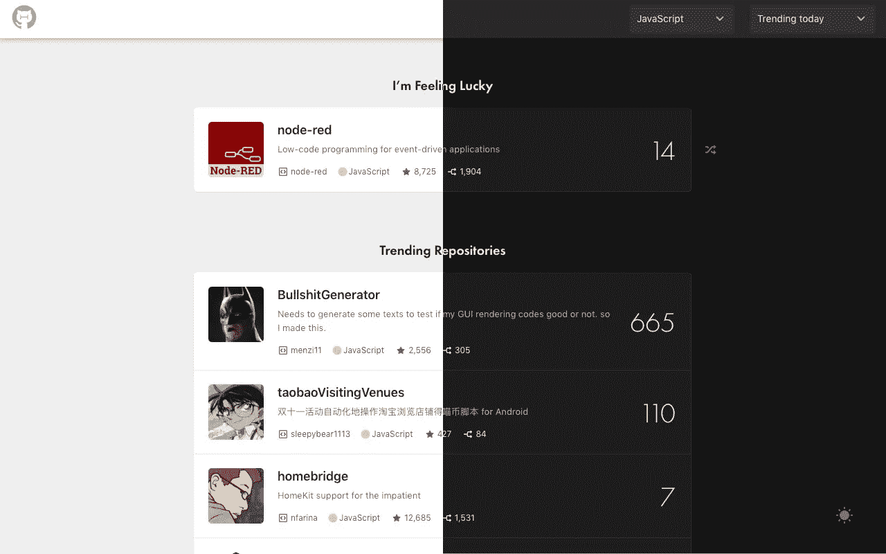
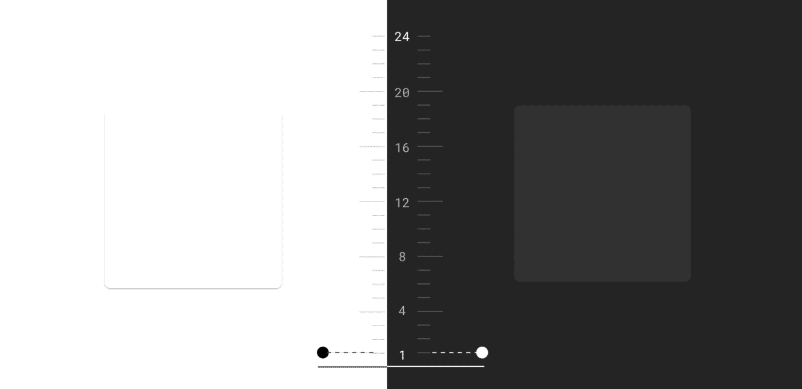
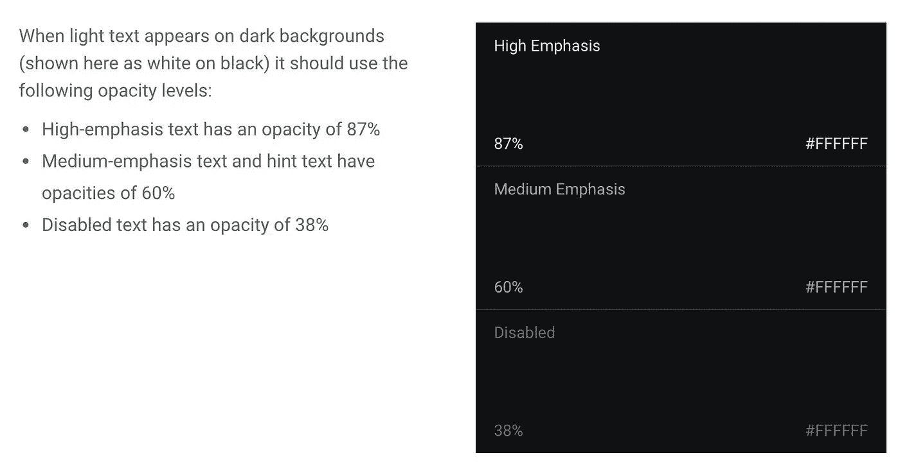
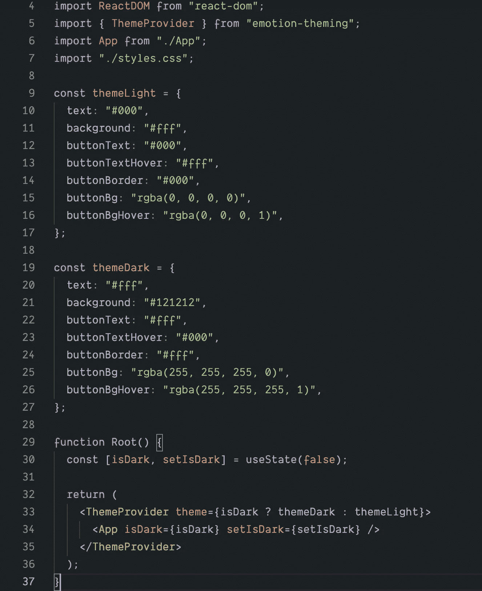
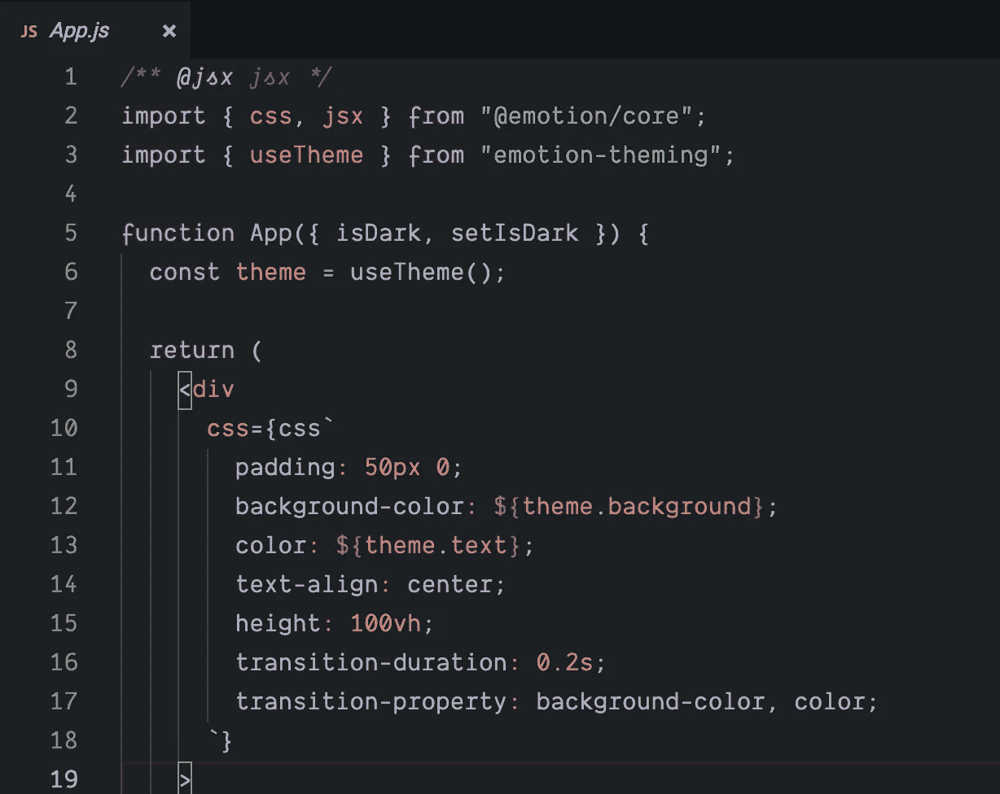

# 使用 Emotion CSS-in-JS 为 React 应用程序添加黑暗模式

> 原文：<https://levelup.gitconnected.com/adding-dark-mode-to-your-react-app-with-emotion-css-in-js-fc5c0f926838>



黑客标签扩展黑暗模式

黑暗主题是过去几年中最受欢迎的特色之一。最受欢迎的理由是“它看起来更舒服”，其次是“它优雅而美丽。”苹果在他们的[黑暗模式开发者文档](https://developer.apple.com/documentation/appkit/supporting_dark_mode_in_your_interface)中明确写道:*“对于大多数用户来说，选择启用明亮还是黑暗的外观是一种审美，可能与环境照明条件无关。”*

苹果和谷歌都将黑暗主题作为用户界面的重要组成部分，更多的网站也做了同样的事情来启用黑暗模式。在本文中，我将带您了解在 React 应用程序中实现黑暗模式的一些基础知识。

# 设计黑暗模式

如果你是一名开发人员，独自从事你的项目，或者你的团队中没有设计师，这一部分将对你有用。否则，您可以跳过这一部分，跳到下一部分。

由于这个博客不是一个设计博客，我将只列出一些我认为有用的基本原则或资源。

材质设计网站[黑暗模式页面](https://material.io/design/color/dark-theme.html#ui-application)是我目前为止找到的最好的资源。以下是一些亮点:

*   不要使用纯黑`#000000`作为背景色，它看起来不好看，而且比浅色模式更容易引起眼疲劳，用深灰色代替(他们使用`#121212`)。
*   在材料设计中，他们使用[标高](https://material.io/design/environment/elevation.html)来区分沿 z 轴的两个表面之间的距离(例如卡片、导航)。在光照模式下，意味着更高仰角的阴影更暗更宽；在黑暗模式下，意味着更白的背景。



浅色主题使用阴影来表达高程，而深色主题调整表面颜色。

*   黑暗模式并不意味着简单地颠倒所有的颜色，阴影颜色仍然应该是黑暗的。
*   对于任何立面或任何颜色-文字组合，对比度至少应为 **4.5:1** 。这意味着要在最高高度获得 4.5:1，文本和背景之间应该使用至少 **15.8:1** 的对比度。(您可以使用[颜色对比工具](https://uxpro.cc/toolbox/accessibility/color-accessibility/)来测试对比度。
*   使用去饱和颜色以保持至少 4.5:1 的对比度。在黑暗模式下处理颜色是困难的，参考[这篇文章](https://material.io/design/color/dark-theme.html#ui-application)了解更多。
*   在深色背景上使用浅色文本，并参考下面的表格。



深色模式下的文本颜色

# 1.使用情感来切换背景和文本

让我们从一个带有文本和按钮的简单画布开始，在暗模式和亮模式之间切换。

初始状态:白色背景，深色文本

此时，除了切换`isDark`值的内部状态和更改文本之外，它不做任何事情。

在**暗**模式下，我们会想要改变:

*   文本颜色为`#fff`
*   背景色为`#121212`
*   反转按钮文本、按钮背景颜色和悬停颜色

我们使用 [emotion](https://emotion.sh/) 进行样式设计，因为它很简单，但是如果你使用纯 CSS 或 CSSModule，这个概念将会起作用(你将需要在上下文中设置主题并在组件中切换类名)。

## 1.1)添加带有主题颜色值的 ThemeProvider



索引. js

在这里，我们定义一个名为`themeLight`或`themeDark`的对象中所有变化的颜色，并将其传递给`ThemeProvider`。我们已经将主代码重构到另一个名为`App.js`的文件中，我们将在下一节使用`App.js`中的`theme`值。

## 1.2)在 App.js 中使用主题值



App.js

`emotion`提供了一个有用的钩子`useTheme`来使用`ThemeProvider`的子组件中的主题。在你的样式代码中，你可以用从`theme`对象传递到`ThemeProvider`的变量来改变你的颜色。例如:

```
**const theme = useTheme();**<div
  css={css`
    background-color: ${theme.background};
    color: ${theme.text};
  `}
>
```

下面有另一种方法可以在没有`useTheme`钩子的情况下实现同样的目标，但是我觉得`useTheme`可以让代码简单一点。

```
<div
  css={**theme =>** css`
    background-color: ${theme.background};
    color: ${theme.text};
  `}
>
```

## 1.3)添加动画

现在，如果您点击按钮，`theme`值将会改变，样式也会相应改变。你会注意到变化太快，感觉不自然。如果我们添加一些基本的 CSS 过渡，当你按下按钮时，背景和文本颜色会有微妙的变化。

```
transition-duration: 0.2s;
transition-property: background-color, color;
```

当前代码如下所示:

添加带有情感的黑暗模式风格

# 2.根据用户的系统设置设置初始主题

通过点击按钮来切换很好，但是我们能做得更好吗？如果用户已经在系统中使用黑暗模式，我们是否可以默认启用黑暗模式，而不是要求用户切换？

实际上有一个 CSS 查询:`[prefers-color-scheme](https://drafts.csswg.org/mediaqueries-5/#prefers-color-scheme)`

```
/* Light mode */
@media (prefers-color-scheme: light) {
    html {
        background: white;
        color: black;
    }
}

/* Dark mode */
@media (prefers-color-scheme: dark) {
    html {
        background: black;
        color: white;
    }
}
```

`[prefers-color-scheme](https://drafts.csswg.org/mediaqueries-5/#prefers-color-scheme)`媒体功能用于检测用户是否请求页面使用浅色或深色主题。它适用于以下值:

*   `no-preference`:表示系统不知道用户的偏好。该关键字值在[布尔上下文](https://drafts.csswg.org/mediaqueries-5/#boolean-context)中被评估为`false`。
*   `light`:表示用户已经通知系统，他们更喜欢浅色主题的页面(浅色背景上的深色文本)。
*   `dark`:表示用户已经通知系统他们更喜欢深色主题的页面(深色背景上的浅色文本)。

## 了解浏览器是否支持黑暗模式

由于黑暗模式是通过媒体查询报告的，您可以通过检查媒体查询`prefers-color-scheme`是否完全匹配来轻松检查当前浏览器是否支持黑暗模式。

```
if (window.matchMedia('(prefers-color-scheme: dark)').matches) {
  console.log('🎉 device on Dark mode');
}
```

在撰写本文时，Chrome 和 Edge 从版本 76 开始支持`prefers-color-scheme`, Firefox 从版本 67 开始支持`prefers-color-scheme`, Safari 从版本 12.1 开始支持 macOS，从版本 13 开始支持 iOS。对于所有其他浏览器，您可以检查[我可以使用支持表](https://caniuse.com/#feat=prefers-color-scheme)。

在我们的`index.js`中，我们只需要将`useState`的初始状态从`false`改为`window.matchMedia('(prefers-color-scheme: dark)').matches`

```
const [isDark, setIsDark] = useDarkMode(
  window.matchMedia('(prefers-color-scheme: dark)').matches
);
```

默认情况下，应用程序加载黑暗模式

# 结论

除此之外，您还可以做更多的事情:在服务器或本地存储上保存用户偏好，为一些复杂的组件添加黑暗模式，如 [react-select](https://github.com/JedWatson/react-select) (如果您想获得一些参考，只需抓住这个[要点](https://github.com/huchenme/hacker-tab-extension/blob/da7a5af0f9/src/components/Select.js))。我最近也给[黑客标签 chrome 扩展](https://github.com/huchenme/hacker-tab-extension)添加了黑暗模式，你可以在这里查看整个提交[。](https://github.com/huchenme/hacker-tab-extension/commit/da7a5af0f962240a1066bbbab30339d64b795486)

## 也阅读

[](/how-to-use-react-js-to-create-chrome-extension-in-5-minutes-2ddb11899815) [## 如何使用 React.js 在 5 分钟内创建一个 Chrome 扩展

### 最近，我试图创建一个 Chrome 扩展，用 GitHub trending 项目和 it 来替换新的标签屏幕…

levelup.gitconnected.com](/how-to-use-react-js-to-create-chrome-extension-in-5-minutes-2ddb11899815)